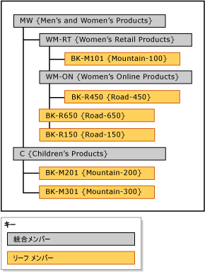

# 明示的階層 (Master Data Services)

[!INCLUDE[appliesto-ss-xxxx-xxxx-xxx-md-winonly](../includes/appliesto-ss-xxxx-xxxx-xxx-md-winonly.md)]

  [!INCLUDE[ssMDSshort](../includes/ssmdsshort-md.md)]の明示的階層は、1 つのエンティティからのメンバーを指定した任意の方法で整理します。 構造は不規則にすることができます。派生階層とは異なり、明示的階層はドメイン ベースの属性のリレーションシップに基づいていません。  
  
> [!NOTE]  
>  明示的階層は非推奨とされます。  
  
## 他のメンバーをグループ化する統合メンバー  
 明示的階層では、他のメンバーをグループ化する目的で作成する統合メンバーを使用します。 これらの統合メンバーは、一度に 1 つの明示的階層にのみ属することができます。 また、明示的階層は、関連付けられたエンティティのすべてのリーフ メンバーを含みます。  
  
 明示的階層は不規則で、階層は異なるレベルで同時に終了できます。 各統合メンバーの下位に統合メンバーとリーフ メンバーを無制限に含めることも、まったく含めないこともできます。 リーフ メンバーは、単一の統合メンバーの下位に含めることも、複数レベルの統合メンバーの下位に含めることもできます。  
  
> [!NOTE]  
>  明示的階層を作成するには、明示的階層でエンティティを有効にしておく必要があります。  
  
## 明示的階層の種類  
 明示的階層には、必須階層と任意階層の 2 種類があります。  
  
### 必須の明示的階層  
 必須の明示的階層は、階層ツリーにすべてのリーフ メンバーを含める必要がある階層です。 既定では、すべてのメンバーがツリーのルートに含まれます。 必要に応じて、メンバーを再配置できます。  
  
### 任意の明示的階層  
 必須でない明示的階層は、すべてのリーフ メンバーがシステムで作成された **[未使用]** ノードである階層です。 必要に応じて、このノードからメンバーを移動できます。 残りのメンバーは、 **[未使用]** ノードに残ることになります。  
  
 任意の明示的階層を使用する場合、階層で実行されるすべてのレポートや分析が、必須の明示的階層で実行されるレポートや分析と一致するわけではありません。  
  
## ルール  
 明示的階層 (必須階層と任意階層の両方) には、次のルールが適用されます。  
  
-   各リーフ メンバーは、1 回のみ階層に含めることができます。  
  
-   すべての統合メンバーを 1 つの階層内に含める必要があります。  
  
-   統合メンバーを複数の明示的階層に含めることはできません。  
  
-   階層ツリー内の統合メンバーの下位に、リーフ メンバーを含める必要はありません。  
  
-   明示的階層を削除する場合、階層内で使用されたすべての統合メンバーが削除されます。  
  
-   明示的階層に含まれていた統合メンバーを削除すると、その統合メンバーにグループ化されていたリーフ メンバーはルートに移動されます。  
  
## 明示的階層と派生階層  
 次の表は、明示的階層と派生階層の相違点の一部を示しています。  
  
|明示的階層|派生階層|  
|--------------------------|-------------------------|  
|構造はユーザーによって定義される|構造はドメイン ベースの属性間のリレーションシップから派生する|  
|単一のエンティティからのメンバーを含む|複数のエンティティからのメンバーを含む|  
|他のメンバーをグループ化する統合メンバーを使用する|1 つのエンティティのリーフ メンバーを使用して、別のエンティティのリーフ メンバーをグループ化する|  
|不規則になる場合がある|常に一定のレベル数を含む|  
  
## 明示的階層の例  
 次の例では、Product エンティティは、BK-M101 {Mountain-100}、BK-M201 {Mountain-200}、BK-M301 {Mountain-300}、BK-R150 {Road-150}、BK-R450 {Road-450}、および BK-R650 {Road-650} のリーフ メンバーを含みます。  
  
 これらのリーフ メンバーを特定の統合ポイントで集計するには、Product エンティティに統合メンバーを作成します。 リーフ メンバーを集計する階層ツリー内のレベルに、統合メンバーを挿入します。 統合メンバーを挿入するレベルについての制限はありませんが、各メンバー (リーフまたは統合) を使用できるのは 1 回のみです。  
  
   
  
 統合メンバーを使用して任意のレベルでメンバーをグループ化したり、リーフ メンバーと統合メンバーを特定の順序で並べ替えたりすることができます。  
  
## 関連タスク  
  
|タスクの説明|トピック|  
|----------------------|-----------|  
|新しく明示的階層を作成する。|[明示的階層を作成する (マスター データ サービス)](../master-data-services/create-an-explicit-hierarchy-master-data-services.md)|  
|既存の明示的階層の名前を変更する。|[明示的階層名を変更する (マスター データ サービス)](../master-data-services/change-an-explicit-hierarchy-name-master-data-services.md)|  
|既存の明示的階層を削除する。|[明示的階層を削除する (マスター データ サービス)](../master-data-services/delete-an-explicit-hierarchy-master-data-services.md)|  
|||  
  
## 関連コンテンツ  
  
-   [派生階層 (マスター データ サービス)](../master-data-services/derived-hierarchies-master-data-services.md)  
  
-   [コレクション (マスター データ サービス)](../master-data-services/collections-master-data-services.md)  
  
  
