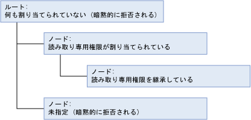
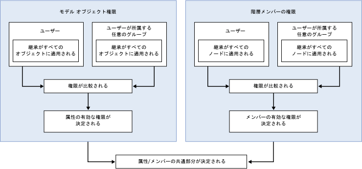

# 権限の決定方法 (Master Data Services)
  [!INCLUDE[ssMDSshort](../includes/ssmdsshort-md.md)]でセキュリティを構成する最も簡単な方法は、ユーザーが属しているグループにモデル オブジェクト権限を割り当てることです。  
  
 次の場合、セキュリティはより複雑になります。  
  
-   モデル オブジェクトと階層メンバーの両方の権限が割り当てられている。  
  
-   ユーザーがグループに属しており、そのユーザーとグループの両方に権限が割り当てられている。  
  
-   ユーザーがグループに属しており、複数のグループに権限が割り当てられている。  
  
## 単一のグループまたはユーザーに割り当てられた権限  
 単一のグループまたはユーザーに権限を割り当てた場合、次のワークフローに基づいて権限が決定されます。  
  
   
  
### ステップ 1: 有効な属性の権限が決定される。  
 有効な属性の権限は、次のように決定されます。  
  
-   モデル オブジェクトに割り当てられた権限によって、ユーザーがアクセスできる属性が決まる。  
  
-   すべてのモデル オブジェクトは、モデル構造内の上位レベルにある最も近いオブジェクトの権限を自動的に継承する。  
  
-   エンティティと同じレベルのオブジェクトは、暗黙的に拒否される。  
  
-   上位レベルのオブジェクトには、推定読み取りが付与される。 推定読み取りの詳細については、「[ナビゲーション アクセス (マスター データ サービス)](../master-data-services/navigational-access-master-data-services.md)」を参照してください。  
  
 次の例では、 **読み取り** 権限がエンティティに割り当てられています。この権限は、モデル構造内の下位レベルにある属性によって継承されています。 モデルでは、このエンティティとその属性に対する推定読み取りが提供されています。 モデル内のその他のエンティティは、明示的な権限が割り当てられておらず、権限の継承もしていないため、暗黙的に拒否されます。  
  
   
  
### ステップ 2: 階層メンバーの権限が割り当てられた場合、有効なメンバーの権限が決定される。  
 有効な階層メンバーの権限は、次のように決定されます。  
  
-   階層ノードに割り当てられた権限によって、ユーザーがアクセスできるメンバーが決まる。  
  
-   階層内のすべてのノードは、階層構造内の上位レベルにある最も近いオブジェクトの権限を自動的に継承する。  
  
-   同じレベルのノードは、暗黙的に拒否される。  
  
-   権限が割り当てられていない上位レベルのノードは、暗黙的に拒否される。  
  
 次の例では、階層のノードの 1 つに **読み取り** 権限が割り当てられています。この権限は、階層構造内の下位レベルにあるノードによって継承されています。 ルートは、権限が割り当てられていないため、暗黙的に拒否されます。 階層構造内のその他のノードは、明示的な権限が割り当てられておらず、権限の継承もしていないため、暗黙的に拒否されます。  
  
   
  
### ステップ 3: 属性とメンバーの権限の共通部分が決定される。  
 有効な属性の権限が有効なメンバーの権限とは異なる場合、個々の属性値ごとに権限を決定する必要があります。 詳細については、「[モデル権限とメンバー権限の重複 (マスター データ サービス)](../master-data-services/overlapping-model-and-member-permissions-master-data-services.md)」を参照してください。  
  
## 複数のグループに割り当てられた権限  
 ユーザーが 1 つ以上のグループに属しており、ユーザーとグループの両方に権限が割り当てられている場合、ワークフローはより複雑になります。  
  
   
  
 この場合に、モデル オブジェクトと階層メンバーの権限を比較するには、ユーザーとグループでの権限の重複を解決する必要があります。 詳細については、「[ユーザー権限とグループ権限の重複 (マスター データ サービス)](../master-data-services/overlapping-user-and-group-permissions-master-data-services.md)」を参照してください。  
  
## 参照  
 [ユーザー権限とグループ権限の重複 (マスター データ サービス)](../master-data-services/overlapping-user-and-group-permissions-master-data-services.md)   
 [モデル権限とメンバー権限の重複 (マスター データ サービス)](../master-data-services/overlapping-model-and-member-permissions-master-data-services.md)  
  
  