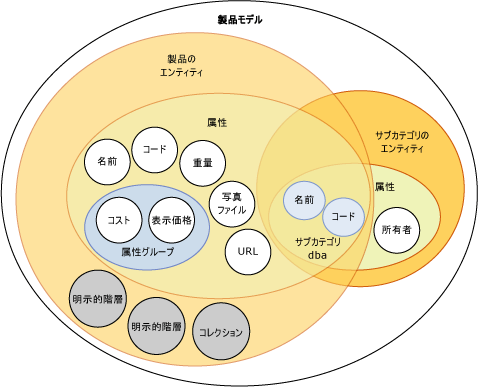
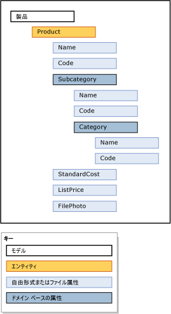

# モデル (Master Data Services)

[!INCLUDE[appliesto-ss-xxxx-xxxx-xxx-md-winonly](../includes/appliesto-ss-xxxx-xxxx-xxx-md-winonly.md)]

  モデルは、 [!INCLUDE[ssMDSshort](../includes/ssmdsshort-md.md)]の最上位レベルのデータ編成単位です。 モデルは、マスター データ管理ソリューションでのデータの構造を定義します。 モデルには次のオブジェクトが含まれています。  
  
-   [エンティティ]  
  
-   属性と属性グループ  
  
-   明示的階層と派生階層  
  
-   コレクション  
  
 モデルは、マスター データの構造を整理します。 [!INCLUDE[ssMDSshort](../includes/ssmdsshort-md.md)] の実装は 1 つまたは多くのモデルを保持し、各モデルが類似のデータをグループ化します マスター データは通常、4 つのカテゴリ (人、場所、物、概念) のうちの 1 つに分類されます。 たとえば、製品関連のデータを含む Product モデルや、顧客関連のデータを含む Customer モデルを作成できます。  
  
 ユーザーとグループには、モデル内のオブジェクトを表示および更新する権限を割り当てることができます。 モデルに権限を与えない場合、モデルは表示されません。  
  
 任意の時点で、モデル内のマスター データのコピーを作成できます。 このコピーをバージョンと呼びます。  
  
 テスト環境でモデルが既に定義済みの場合は、対応するデータの有無に関係なく、テスト環境から運用環境にモデルを配置できます。 これにより、運用環境でモデルを再作成する必要がなくなります。  
  
## モデルと他のオブジェクトの関連付け  
 モデルは複数のエンティティを含みます。 エンティティは属性、明示的階層、およびコレクションを含みます。 属性は属性グループに含まれる場合があります。 エンティティを別のエンティティの属性として使用するときは、ドメイン ベースの属性が存在します。  
  
 次の図は、1 つのモデル内のオブジェクト間のリレーションシップを示しています。  
  
   
  
> [!NOTE]  
>  派生階層はモデル オブジェクトでもありますが、図には示されていません。 派生階層は、エンティティ間に存在するドメイン ベースの属性リレーションシップから派生します。 詳細については、「[派生階層 (マスター データ サービス)](../master-data-services/derived-hierarchies-master-data-services.md)」を参照してください。  
  
 マスター データは、モデル オブジェクトに含まれるデータです。 [!INCLUDE[ssMDSshort](../includes/ssmdsshort-md.md)]では、マスター データはエンティティのメンバーとして格納されます。  
  
 モデル オブジェクトは、 **のユーザー インターフェイスの** [システム管理] [!INCLUDE[ssMDSmdm](../includes/ssmdsmdm-md.md)] 機能領域で管理されます。  
  
## モデルの例  
 次の例では、Product モデルのオブジェクトは製品 (product) に関連するデータを論理的にグループ化します。  
  
   
  
 その他の一般的なモデルは次のとおりです。  
  
-   Accounts: 貸借対照表勘定科目、損益計算書勘定科目、統計、勘定科目の種類などのエンティティが含まれます。  
  
-   Customer: 性別、学歴、職業、配偶者の有無などのエンティティが含まれます。  
  
-   Geography: 郵便番号、都道府県、郡市町村、地域、区域、国、大陸などのエンティティが含まれます。  
  
## 関連タスク  
  
|タスクの説明|トピック|  
|----------------------|-----------|  
|モデルを作成してマスター データを整理する。|[モデルを作成する (マスター データ サービス)](../master-data-services/create-a-model-master-data-services.md)|  
|既存のモデルの名前を変更する。|[モデルを編集する (マスター データ サービス)](../master-data-services/edit-model-master-data-services.md)|  
|既存のモデルを削除する。|[モデルを削除する (マスター データ サービス)](../master-data-services/delete-a-model-master-data-services.md)|  
  
## 関連コンテンツ  
  
-   [マスター データ サービスの概要 (MDS)](../master-data-services/master-data-services-overview-mds.md)  
  
-   [エンティティ (マスター データ サービス)](../master-data-services/entities-master-data-services.md)  
  
-   [属性 (マスター データ サービス)](../master-data-services/attributes-master-data-services.md)  
  
-   [モデルの配置 (マスター データ サービス)](../master-data-services/deploying-models-master-data-services.md)  
  
-   [モデル オブジェクト権限 (マスター データ サービス)](../master-data-services/model-object-permissions-master-data-services.md)  
  
  
