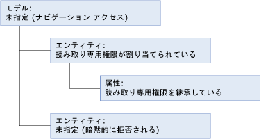

# ナビゲーション アクセス (マスター データ サービス)

[!INCLUDE [SQL Server - Windows only ASDBMI  ](../includes/applies-to-version/sql-windows-only-asdbmi.md)]

  ナビゲーション アクセスは、 **[モデル]** タブで割り当てられるモデル オブジェクト セキュリティに適用されます。  
  
 ナビゲーション アクセスは、セキュリティを割り当てたレベルよりも高いレベルへのアクセスです。  
  
 この例では、権限がエンティティに割り当てられているため、ナビゲーション アクセスがモデル レベルで付与されます。  
  
   
  
 **エンティティ**  
  
 エンティティ、リーフ メンバー、またはその統合メンバーに権限を割り当てた場合、ナビゲーション アクセスにより、すべてのメンバーの名前およびコードの読み取りまたは更新を実行できます。 また、モデル名を読み取ることもできます。  
  
 **属性**  
  
 属性に権限を割り当てた場合、ナビゲーション アクセスにより、エンティティのすべてのメンバーの名前およびコードの読み取りまたは更新を実行できます。 また、モデル名を読み取ることもできます。  
  
 **コレクション**  
  
 コレクションに権限を割り当てた場合、名前、コード、説明、および所有者 ID の読み取りまたは更新を実行できます。 また、モデル名を読み取ることもできます。  
  
## 関連項目  
 [権限の決定方法 (マスター データ サービス)](../master-data-services/how-permissions-are-determined-master-data-services.md)  
  
  
