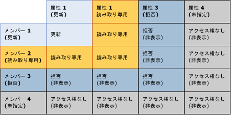
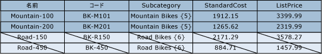
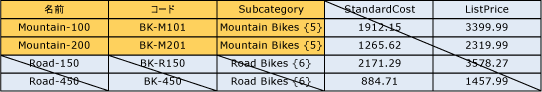

# モデル権限とメンバー権限の重複 (Master Data Services)

[!INCLUDE[appliesto-ss-xxxx-xxxx-xxx-md-winonly](../includes/appliesto-ss-xxxx-xxxx-xxx-md-winonly.md)]

  メンバーに割り当てられている権限は、モデル オブジェクトに割り当てられている権限と重複している可能性があります。 重複が発生すると、より制限の厳しい権限が有効になります。  
  
 メンバーに割り当てられている権限が、対応するモデル オブジェクトの権限とは異なる場合、次のルールが適用されます。  
  
-   **拒否** が他のどの権限をオーバーライドします。  
  
-   モデル レベルの**管理者** 権限はすべての権限をオーバーライドし、サブ レベルで ALL (CRUD) アクセス権限に変更されます。  
  
-   有効なアクセス権限は、メンバーと属性のアクセス権限と交差します。  
  
     たとえば、メンバーの権限に **作成** と **更新**が含まれる場合、属性の権限は **更新**になります。 有効な権限は **更新**です。  
  
 次の図は、属性の権限がメンバーの権限とは異なる場合に、個々の属性値に対して有効な権限を示しています。  
  
   
  
## 例 1  
   
  
 **[モデル]** タブで、Product エンティティに **更新** 権限が割り当てられています。 エンティティのすべての属性がこの権限を継承しています。  
  
 **[階層メンバー]** タブで、派生階層の Mountain Bikes サブカテゴリ ノードに **更新** 権限が割り当てられています。  
  
 結果: **[エクスプローラー]** で、Mountain Bikes ノード内のすべてのメンバーについて、すべての属性値に対する **更新** 権限がユーザーに与えられます。 その他のメンバーと属性は、すべて非表示になります。  
  
   
  
## 例 2  
   
  
 **[モデル]** タブで、Subcategory 属性に **更新** 権限が割り当てられています。  
  
 **[階層メンバー]** タブで、派生階層の Mountain Bikes サブカテゴリ ノードに **読み取り** 権限が明示的に割り当てられています。  
  
 結果: **[エクスプローラー]** で、Mountain Bikes ノード内のメンバーについて、Subcategory 属性値に対する **読み取り** 権限がユーザーに与えられます。 その他のメンバーと属性は、すべて非表示になります。  
  
   
  
## 例 3  
   
  
 **[モデル]** タブで、Subcategory 属性に **読み取り** 権限が割り当てられています。  
  
 **[階層メンバー]** タブで、派生階層の Mountain Bikes サブカテゴリに **更新** 権限が明示的に割り当てられています。  
  
 結果: **[エクスプローラー]** で、属性値に対する **読み取り** 権限がユーザーに与えられます。 その他のメンバーと属性は、すべて非表示になります。  
  
   
  
## 参照  
 [権限の決定方法 (マスター データ サービス)](../master-data-services/how-permissions-are-determined-master-data-services.md)   
 [ユーザー アクセス許可とグループ アクセス許可の重複 (マスター データ サービス)](../master-data-services/overlapping-user-and-group-permissions-master-data-services.md)  
  
  
