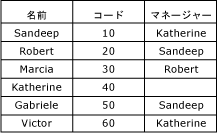

# 再帰型階層 (マスター データ サービス)
  [!INCLUDE[ssMDSshort](../includes/ssmdsshort-md.md)] の再帰型階層は、再帰リレーションシップを含む派生階層です。 再帰リレーションシップは、エンティティ自体に基づくドメインベースの属性がエンティティにある場合に存在します。  
  
## 再帰型階層の例  
 再帰型階層の典型的な例は、組織構造です。 [!INCLUDE[ssMDSshort](../includes/ssmdsshort-md.md)] で、Manager というドメイン ベースの属性を持つ Employee エンティティを作成します。 Manager 属性は、従業員 (employee) のリストから設定されます。 このサンプル組織では、すべての従業員がマネージャーである可能性があります。  
  
   
  
 Employee エンティティおよびドメイン ベースの Manager 属性の間のリレーションシップを強調表示する派生階層を作成できます。  
  
   
  
 階層内の各メンバーを一度だけ含めるために、Null リレーションシップをアンカーできます。 その場合、空白のドメイン ベースの属性値を持つメンバーが階層の最上位レベルに表示されます。  
  
   
  
 Null リレーションシップをアンカーしない場合、メンバーは複数回含まれます。 すべてのメンバーは最上位レベルに表示されます。 すべてのメンバーは、それらが属性であるメンバーの下にも表示されます。  
  
   
  
 この例では、Marcia は最上位レベルにあります。 Marcia はその他の Employee メンバーのドメイン ベースの属性値として使用されていないので、Marcia はいずれの従業員のマネージャーでもありません。 対照的に、Marcia には Manager 属性値として Robert が設定されているので、Robert の下にレベルがあります。  
  
## ルール  
  
-   1 つの派生階層に複数の再帰リレーションシップを含めることはできません。 ただし、他の派生リレーションシップを含めることはできます (たとえば、"マネージャーと従業員" という再帰リレーションシップに、"国とマネージャー" および "従業員と店舗" というリレーションシップを含めることもできます)。  
  
-   (**[階層メンバー]** タブで) メンバー権限を再帰的階層のメンバーに割り当てることはできません。  
  
-   再帰的階層は循環リレーションシップを含むことはできません。 たとえば、Sandeep が Katherine のマネージャーである場合、Katherine を Sandeep のマネージャーにすることはできません。 また、Katherine は Katherine 自身のマネージャーになることもできません。  
  
## 関連タスク  
  
|タスクの説明|トピック|  
|----------------------|-----------|  
|派生階層を作成する。|[派生階層を作成する (マスター データ サービス)](../master-data-services/create-a-derived-hierarchy-master-data-services.md)|  
|既存の派生階層の名前を変更する。|[派生階層名を変更する (マスター データ サービス)](../master-data-services/change-a-derived-hierarchy-name-master-data-services.md)|  
|既存の派生階層を削除する。|[派生階層を削除する (マスター データ サービス)](../master-data-services/delete-a-derived-hierarchy-master-data-services.md)|  
  
## 関連コンテンツ  
  
-   [ドメインベースの属性 (マスター データ サービス)](../master-data-services/domain-based-attributes-master-data-services.md)  
  
-   [派生階層 (マスター データ サービス)](../master-data-services/derived-hierarchies-master-data-services.md)  
  
  