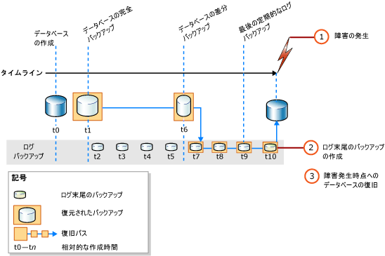

# <a name="complete-database-restores-full-recovery-model"></a>データベースの全体復元 (完全復旧モデル)
[!INCLUDE[appliesto-ss-xxxx-xxxx-xxx-md](../../includes/appliesto-ss-xxxx-xxxx-xxx-md.md)]

  データベースの全体復元の目的は、データベース全体を復元することです。 復元の実行中は、データベース全体がオフラインになります。 データベースの各部がオンラインになる前に、すべてのデータが一貫性のある状態に復旧されます。一貫性のある状態とは、データベースのすべての部分が同じ時点にあり、コミットされていないトランザクションが存在しない状態を示します。  
  
 完全復旧モデルでは、1 つまたは複数のデータ バックアップを復元した後、それ以降のトランザクション ログ バックアップをすべて復元してから、データベースを復旧する必要があります。 そのいずれかのログ バックアップ内の特定の *復旧ポイント* までデータベースを復元することができます。 復旧ポイントとは、特定の日時、マークされたトランザクション、またはログ シーケンス番号 (LSN) を指します。  
  
 特に完全復旧モデルと一括ログ復旧モデルでは、データベースを復元するときに、単一の復元シーケンスを使用する必要があります。 *復元シーケンス* は、1 つ以上の復元フェーズによってデータを移動する、1 つ以上の復元操作で構成されます。  
  
### <a name="untrusted-sources"></a>信頼されていないソース

不明なソースや信頼されていないソースからのデータベースのアタッチまたは復元は_実行しない_ことをお勧めします。 そのようなデータベースには、意図しない [!INCLUDE[tsql](../../includes/tsql-md.md)] コードを実行したり、スキーマまたは物理データベース構造を変更することによりエラーを発生させる悪意のあるコードが含まれている可能性があります。 不明なソースや信頼されていないソースからのデータベースを使用する場合は、事前に運用サーバー以外のサーバー上のデータベースで [DBCC CHECKDB](../../t-sql/database-console-commands/dbcc-checkdb-transact-sql.md) を実行してください。 さらに、ストアド プロシージャやその他のユーザー定義コードなどのデータベース内に記述されたユーザーのコードを調べてください。

### <a name="backups-from-earlier-versions"></a>以前のバージョンからのバックアップ

以前のバージョンの [!INCLUDE[ssNoVersion](../../includes/ssnoversion-md.md)]からのバックアップに対するサポートの情報については、「 [RESTORE &#40;Transact-SQL&#41;](../../t-sql/statements/restore-statements-transact-sql.md)」の「互換性サポート」のセクションを参照してください。
  
##  <a name="PointOfFailure"></a> 障害発生時点へのデータベースの復旧  

 通常、障害が発生した時点までデータベースを復旧するには、次の基本的な手順が必要です。  
  
1.  アクティブなトランザクション ログ (ログの末尾と呼ばれます) をバックアップします。 これにより、ログ末尾のバックアップが作成されます。 アクティブなトランザクション ログを使用できない場合は、そのログ部分にあるすべてのトランザクションが失われます。  
  
    > [!IMPORTANT]  
    >  一括ログ復旧モデルで、一括ログ操作が含まれるすべてのログをバックアップするには、データベース内のすべてのデータ ファイルへのアクセス許可が必要です。 データ ファイルにアクセスできないと、トランザクション ログをバックアップできません。 その場合は、最新のログ バックアップ以降に加えられたすべての変更を手動で再実行する必要があります。  
  
     詳細については、「[ログ末尾のバックアップ &#40;SQL Server&#41;](../../relational-databases/backup-restore/tail-log-backups-sql-server.md)」を参照してください。  
  
2.  データベースの最新の完全バックアップが復元されますが、データベースは復旧されません (RESTORE DATABASE *database_name* FROM *backup_device* WITH NORECOVERY)。  
  
3.  差分バックアップが存在する場合は、データベースを復旧しないで最新の差分バックアップを復元します (RESTORE DATABASE *database_name* FROM *differential_backup_device* WITH NORECOVERY)。  
  
     最新の差分バックアップを復元した方が、復元する必要のあるログ バックアップの数が少なくて済みます。  
  
4.  バックアップを復元した直後に作成された、最初のトランザクション ログのバックアップから順番に、NORECOVERY を指定してログを復元します。  
  
5.  データベースを復旧します (RESTORE DATABASE *database_name* WITH RECOVERY)。 または、この手順を最後のログ バックアップの復元と組み合わせることもできます。  
  
 次の図に、この復元シーケンスを示します。 (1) 障害が発生した後、(2) ログ末尾のバックアップが作成されます。 次に、データベースが障害発生時点まで復元されます。 このときに、データベース バックアップと、それ以降の差分バックアップ、および、ログ末尾のバックアップを含め、差分バックアップ後に作成されたすべてのログ バックアップが復元されます。  
  
   
  
> [!NOTE]  
>  データベースのバックアップを別のサーバー インスタンスに復元する場合は、「 [バックアップと復元によるデータベースのコピー](../../relational-databases/databases/copy-databases-with-backup-and-restore.md)」を参照してください。  
  
###  <a name="TsqlSyntax"></a> 基本的な Transact-SQL RESTORE 構文  
 前の図に示した復元シーケンスの基本的な [RESTORE](../../t-sql/statements/restore-statements-transact-sql.md)[!INCLUDE[tsql](../../includes/tsql-md.md)] 構文は次のとおりです。  
  
1.  RESTORE DATABASE *database* FROM *full database backup* WITH NORECOVERY;  
  
2.  RESTORE DATABASE *database* FROM *full_differential_backup* WITH NORECOVERY;  
  
3.  RESTORE LOG *database* FROM *log_backup* WITH NORECOVERY;  
  
     このログの復元手順を、追加のログ バックアップごとに繰り返します。  
  
4.  RESTORE DATABASE *database* WITH RECOVERY;  
  
###  <a name="ExampleToPoFTsql"></a> 例: 障害発生時点への復元 (Transact-SQL)  
 次の [!INCLUDE[tsql](../../includes/tsql-md.md)] の例は、データベースを障害発生時点まで復元する復元シーケンスに不可欠なオプションを示しています。 この例では、データベースのログ末尾のバックアップを作成します。 次に、データベースの完全バックアップとログ バックアップを復元してから、ログ末尾のバックアップを復元します。 最後に、別の手順でデータベースを復旧します。  
  
> [!NOTE]  
>  この例では、「 [データベースの完全バックアップ &#40;SQL Server&#41;](../../relational-databases/backup-restore/full-database-backups-sql-server.md)」の「互換性サポート」のセクションを参照してください。 [!INCLUDE[ssSampleDBobject](../../includes/sssampledbobject-md.md)] サンプル データベースは完全復旧モデルを使用するように、データベースのバックアップ前に設定されています。  
  
```  
USE master;  
--Create tail-log backup.  
BACKUP LOG AdventureWorks2012   
TO DISK = 'Z:\SQLServerBackups\AdventureWorksFullRM.bak'    
   WITH NORECOVERY;   
GO  
--Restore the full database backup (from backup set 1).  
RESTORE DATABASE AdventureWorks2012   
  FROM DISK = 'Z:\SQLServerBackups\AdventureWorksFullRM.bak'   
  WITH FILE=1,   
    NORECOVERY;  
  
--Restore the regular log backup (from backup set 2).  
RESTORE LOG AdventureWorks2012   
  FROM DISK = 'Z:\SQLServerBackups\AdventureWorksFullRM.bak'   
  WITH FILE=2,   
    NORECOVERY;  
  
--Restore the tail-log backup (from backup set 3).  
RESTORE LOG AdventureWorks2012   
  FROM DISK = 'Z:\SQLServerBackups\AdventureWorksFullRM.bak'  
  WITH FILE=3,   
    NORECOVERY;  
GO  
--recover the database:  
RESTORE DATABASE AdventureWorks2012 WITH RECOVERY;  
GO  
```  
  
##  <a name="PointWithinBackup"></a> ログ バックアップ内の特定の時点へのデータベースの復元  
 一般に、完全復旧モデルでは、データベースの全体復元によって、特定の時点、マークされたトランザクション、またはログ バックアップ内の特定の LSN まで復元することができます。 ただし、一括ログ復旧モデルの場合は、一括ログ操作による変更がログ バックアップに含まれていると、特定の時点への復旧はできません。  
  
### <a name="sample-point-in-time-restore-scenarios"></a>特定の時点への復元のサンプル シナリオ  
 ミッションクリティカルなデータベース システムで、データベースの完全バックアップを毎晩午前 0 時に作成し、データベースの差分バックアップを月曜日から土曜日まで 1 時間ごとに作成し、トランザクション ログのバックアップを 1 日中 10 分間隔で作成するとします。 データベースを水曜日の午前 5 時 19 分の状態に復元するには、 次のようにします。  
  
1.  火曜日の午前 0 時に作成したデータベースの完全バックアップを復元します。  
  
2.  午前 5 時に作成したデータベースの差分バックアップを復元します。 適用します。  
  
3.  水曜日の午前 5 時 10 分に作成したトランザクション ログのバックアップを 適用します。  
  
4.  水曜日の午前 5 時 20 分に作成したトランザクション ログのバックアップを適用し、 午前 5 時 19 分までに発生したトランザクションにだけ復旧処理を適用するように指定します。  
  
 データベースを木曜日の午前 3 時 4 分の状態に復元する必要があり、 木曜日の午前 3 時に作成したデータベースの差分バックアップがない場合は、 次のようにします。  
  
1.  水曜日の午前 0 時に作成したデータベース バックアップを復元します。  
  
2.  木曜日の午前 2 時に作成したデータベースの差分バックアップを 適用します。  
  
3.  木曜日の午前 2 時 10 分から 3 時までに作成したすべての トランザクション ログのバックアップを 適用します。  
  
4.  木曜日の午前 3 時 10 分に作成したトランザクション ログ バックアップを適用し、 復旧処理を午前 3 時 4 分で停止します。  
  
> [!NOTE]  
>  特定の時点への復元の例については、「 [SQL Server データベースを特定の時点に復元する方法 &#40;完全復旧モデル&#41;](../../relational-databases/backup-restore/restore-a-sql-server-database-to-a-point-in-time-full-recovery-model.md)」の「互換性サポート」のセクションを参照してください。  
  
##  <a name="RelatedTasks"></a> 関連タスク  
 **データベースの完全バックアップを復元するには**  
  
-   [SSMS を使用してデータベース バックアップを復元する](../../relational-databases/backup-restore/restore-a-database-backup-using-ssms.md)  
  
-   [データベースを新しい場所に復元する &#40;SQL Server&#41;](../../relational-databases/backup-restore/restore-a-database-to-a-new-location-sql-server.md)  
  
 **データベースの差分バックアップを復元するには**  
  
-   [データベースの差分バックアップの復元 &#40;SQL Server&#41;](../../relational-databases/backup-restore/restore-a-differential-database-backup-sql-server.md)  
  
 **トランザクション ログ バックアップを復元するには**  
  
-   [トランザクション ログ バックアップの復元 &#40;SQL Server&#41;](../../relational-databases/backup-restore/restore-a-transaction-log-backup-sql-server.md)  
  
 **SQL Server 管理オブジェクト (SMO) を使用してバックアップを復元するには**  
  
-   <xref:Microsoft.SqlServer.Management.Smo.Restore.SqlRestore%2A>  
  
 **ログ バックアップ内の特定の時点までデータベースを復元するには**  
  
-   [SQL Server データベースを特定の時点に復元する &#40;完全復旧モデル&#41;](../../relational-databases/backup-restore/restore-a-sql-server-database-to-a-point-in-time-full-recovery-model.md)  
  
-   [マークされたトランザクションを含む関連データベースの復旧](../../relational-databases/backup-restore/recovery-of-related-databases-that-contain-marked-transaction.md)  
  
-   [ログ シーケンス番号への復旧 &#40;SQL Server&#41;](../../relational-databases/backup-restore/recover-to-a-log-sequence-number-sql-server.md)  
  
## <a name="see-also"></a>参照  
 [RESTORE &#40;Transact-SQL&#41;](../../t-sql/statements/restore-statements-transact-sql.md)   
 [BACKUP &#40;Transact-SQL&#41;](../../t-sql/statements/backup-transact-sql.md)   
 [トランザクション ログ バックアップの適用 &#40;SQL Server&#41;](../../relational-databases/backup-restore/apply-transaction-log-backups-sql-server.md)   
 [sp_addumpdevice &#40;Transact-SQL&#41;](../../relational-databases/system-stored-procedures/sp-addumpdevice-transact-sql.md)   
 [データベースの完全バックアップ &#40;SQL Server&#41;](../../relational-databases/backup-restore/full-database-backups-sql-server.md)   
 [差分バックアップ &#40;SQL Server&#41;](../../relational-databases/backup-restore/differential-backups-sql-server.md)   
 [バックアップの概要 &#40;SQL Server&#41;](../../relational-databases/backup-restore/backup-overview-sql-server.md)   
 [復元と復旧の概要 &#40;SQL Server&#41;](../../relational-databases/backup-restore/restore-and-recovery-overview-sql-server.md)  
  
  
