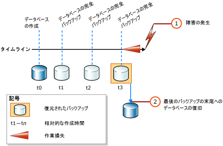
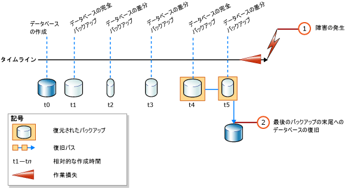

# <a name="complete-database-restores-simple-recovery-model"></a>データベースの全体復元 (単純復旧モデル)
[!INCLUDE[appliesto-ss-xxxx-xxxx-xxx-md](../../includes/appliesto-ss-xxxx-xxxx-xxx-md.md)]

  データベースの全体復元の目的は、データベース全体を復元することです。 復元の実行中は、データベース全体がオフラインになります。 データベースの各部がオンラインになる前に、すべてのデータが一貫性のある状態に復旧されます。一貫性のある状態とは、データベースのすべての部分が同じ時点にあり、コミットされていないトランザクションが存在しない状態を示します。  
  
 単純復旧モデルでは、特定のバックアップ内にある特定の時点にデータベースを復元することはできません。  
  
> [!IMPORTANT]  
>  不明なソースや信頼されていないソースからデータベースをアタッチまたは復元しないことをお勧めします。 そのようなデータベースには、意図しない [!INCLUDE[tsql](../../includes/tsql-md.md)] コードを実行したり、スキーマまたは物理データベース構造を変更することによりエラーを発生させる悪意のあるコードが含まれている可能性があります。 不明または信頼できないソースのデータベースを使用する前に、運用サーバー以外のサーバーでそのデータベースに対し [DBCC CHECKDB](../../t-sql/database-console-commands/dbcc-checkdb-transact-sql.md) を実行し、さらに、そのデータベースのストアド プロシージャやその他のユーザー定義コードなどのコードを調べます。  
  
 **このトピックの内容**  
  
-   [単純復旧モデルでのデータベース復元の概要](#Overview)  
  
-   [関連タスク](#RelatedTasks)  
  
> [!NOTE]  
>  以前のバージョンの [!INCLUDE[ssNoVersion](../../includes/ssnoversion-md.md)]からのバックアップに対するサポートの情報については、「 [RESTORE &#40;Transact-SQL&#41;](../../t-sql/statements/restore-statements-transact-sql.md)」の「互換性サポート」のセクションを参照してください。  
  
##  <a name="Overview"></a> 単純復旧モデルでのデータベース復元の概要  
 単純復旧モデルでのデータベース全体の復元は、データベースの差分バックアップを復元する必要があるかどうかに応じて 1 つまたは 2 つの [RESTORE](../../t-sql/statements/restore-statements-transact-sql.md) ステートメントで行われます。 次の図に示すように、データベースの完全バックアップのみを使用する場合は、最新のバックアップを復元するだけで完了します。  
  
   
  
 データベースの差分バックアップも使用する場合は、データベースを復旧しないで最新の完全バックアップを復元してから、最新の差分バックアップを復元してデータベースを復旧します。 次の図に、このプロセスを示します。  
  
   
  
> [!NOTE]  
>  データベースのバックアップを別のサーバー インスタンスに復元する予定の場合は、「 [バックアップと復元によるデータベースのコピー](../../relational-databases/databases/copy-databases-with-backup-and-restore.md)」を参照してください。  
  
###  <a name="TsqlSyntax"></a> 基本的な Transact-SQL RESTORE 構文  
 データベースの完全バックアップを復元する際に使用する、 [!INCLUDE[tsql](../../includes/tsql-md.md)][RESTORE](../../t-sql/statements/restore-statements-transact-sql.md) の基本構文を次に示します。  
  
 RESTORE DATABASE *database_name* FROM *backup_device* [ WITH NORECOVERY ]  
  
> [!NOTE]  
>  データベースの差分バックアップも復元する場合は、WITH NORECOVERY を指定してください。  
  
 データベース バックアップを復元する際に使用する、 [RESTORE](../../t-sql/statements/restore-statements-transact-sql.md) の基本構文を次に示します。  
  
 RESTORE DATABASE *database_name* FROM *backup_device* WITH RECOVERY  
  
###  <a name="Example"></a> 例 (Transact-SQL)  
 次の例では、まず [BACKUP](../../t-sql/statements/backup-transact-sql.md) ステートメントを使用して、 [!INCLUDE[ssSampleDBobject](../../includes/sssampledbobject-md.md)] データベースの完全バックアップと差分バックアップを作成します。 その後、これらのバックアップを順に復元します。 データベースは、差分データベース バックアップ完了時の状態に復元されます。  
  
 この例は、データベースの全体復元シナリオの復元シーケンスで重要なオプションを示しています。 *復元シーケンス* は、1 つ以上の復元フェーズによってデータを移動する、1 つ以上の復元操作で構成されます。 説明の目的に関係しない構文や詳細は、省略しています。 データベースを復旧する際は、RECOVERY オプションを明示的に指定することをお勧めします。このオプションは既定値ですが、指定しておくと判別がつきやすくなります。  
  
> [!NOTE]  
>  この例の先頭では、 [ALTER DATABASE](../../t-sql/statements/alter-database-transact-sql.md) ステートメントを使用して復旧モデルを `SIMPLE`に設定しています。  
  
```  
USE master;  
--Make sure the database is using the simple recovery model.  
ALTER DATABASE AdventureWorks2012 SET RECOVERY SIMPLE;  
GO  
-- Back up the full AdventureWorks2012 database.  
BACKUP DATABASE AdventureWorks2012   
TO DISK = 'Z:\SQLServerBackups\AdventureWorks2012.bak'   
  WITH FORMAT;  
GO  
--Create a differential database backup.  
BACKUP DATABASE AdventureWorks2012   
TO DISK = 'Z:\SQLServerBackups\AdventureWorks2012.bak'  
   WITH DIFFERENTIAL;  
GO  
--Restore the full database backup (from backup set 1).  
RESTORE DATABASE AdventureWorks2012   
FROM DISK = 'Z:\SQLServerBackups\AdventureWorks2012.bak'   
   WITH FILE=1, NORECOVERY;  
--Restore the differential backup (from backup set 2).  
RESTORE DATABASE AdventureWorks2012   
FROM DISK = 'Z:\SQLServerBackups\AdventureWorks2012.bak'   
   WITH FILE=2, RECOVERY;  
GO  
```  
  
##  <a name="RelatedTasks"></a> 関連タスク  
 **データベースの完全バックアップを復元するには**  
  
-   [単純復旧モデルでのデータベース バックアップの復元 &#40;Transact-SQL&#41;](../../relational-databases/backup-restore/restore-a-database-backup-under-the-simple-recovery-model-transact-sql.md)  
  
-   [SSMS を使用してデータベース バックアップを復元する](../../relational-databases/backup-restore/restore-a-database-backup-using-ssms.md)  
  
-   [データベースを新しい場所に復元する &#40;SQL Server&#41;](../../relational-databases/backup-restore/restore-a-database-to-a-new-location-sql-server.md)  
  
 **データベースの差分バックアップを復元するには**  
  
-   [データベースの差分バックアップの復元 &#40;SQL Server&#41;](../../relational-databases/backup-restore/restore-a-differential-database-backup-sql-server.md)  
  
 **SQL Server 管理オブジェクト (SMO) を使用してバックアップを復元するには**  
  
-   <xref:Microsoft.SqlServer.Management.Smo.Restore.SqlRestore%2A>  
  
## <a name="see-also"></a>参照  
 [RESTORE &#40;Transact-SQL&#41;](../../t-sql/statements/restore-statements-transact-sql.md)   
 [BACKUP &#40;Transact-SQL&#41;](../../t-sql/statements/backup-transact-sql.md)   
 [sp_addumpdevice &#40;Transact-SQL&#41;](../../relational-databases/system-stored-procedures/sp-addumpdevice-transact-sql.md)   
 [データベースの完全バックアップ &#40;SQL Server&#41;](../../relational-databases/backup-restore/full-database-backups-sql-server.md)   
 [差分バックアップ &#40;SQL Server&#41;](../../relational-databases/backup-restore/differential-backups-sql-server.md)   
 [バックアップの概要 &#40;SQL Server&#41;](../../relational-databases/backup-restore/backup-overview-sql-server.md)   
 [復元と復旧の概要 &#40;SQL Server&#41;](../../relational-databases/backup-restore/restore-and-recovery-overview-sql-server.md)  
  
  
