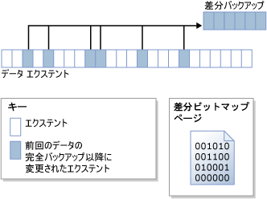

# 差分バックアップ (SQL Server)
[!INCLUDE[appliesto-ss-xxxx-xxxx-xxx-md](../../includes/appliesto-ss-xxxx-xxxx-xxx-md.md)]
  このトピックで取り上げるバックアップと復元は、すべての [!INCLUDE[ssNoVersion](../../includes/ssnoversion-md.md)] データベースに当てはまります。  
  
 差分バックアップは、最新の完全データ バックアップに基づいて行われます。 差分バックアップでは、その完全バックアップの作成後に変更されたデータのみがキャプチャされます。 差分バックアップの基になる完全バックアップを差分の *ベース* といいます。 完全バックアップ (コピーのみのバックアップを除く) は、データベース バックアップ、部分バックアップ、ファイル バックアップなど、一連の差分バックアップのベースとなります。 ファイルの差分バックアップのベース バックアップは、完全バックアップ、ファイル バックアップ、または部分バックアップ内に格納できます。  
  
  
##   利点  
  
-   完全バックアップを作成するときと比べて、差分バックアップはきわめて短時間で作成できます。 差分バックアップでは、差分バックアップのベースとなる完全バックアップ以降に変更されたデータのみが記録されます。 そのため、データのバックアップを頻繁に作成することができ、データ損失のリスクが軽減されます。 ただし、差分バックアップを復元するには、先に差分ベースを復元しておく必要があります。 2 つのバックアップ ファイルが必要となるため、差分バックアップを復元するときは、完全バックアップを復元するときと比べて、より多くの手間と時間がかかります。  
  
-   データベースの差分バックアップは、データベースのある部分が他の部分よりも頻繁に変更される場合に特に役立ちます。 そのような場合にデータベースの差分バックアップを使用すると、完全バックアップのオーバーヘッドをかけることなく頻繁にバックアップを行うことが可能になります。  
  
-   完全復旧モデルでは、差分バックアップを使用することによって、復元する必要のあるログ バックアップの数を減らすことができます。  
  
##   差分バックアップの概要  
 差分バックアップは、差分ベースが作成されてから差分バックアップが作成されるまでの間に変更されたすべての *エクステント* (物理的に連続する 8 ページ分のまとまり) の状態をキャプチャします。 したがって、差分バックアップのサイズは、ベースの作成後に変更されたデータの量に依存します。 通常、ベースが古いほど、新しい差分バックアップの量は多くなります。 一連の差分バックアップにおいて、更新頻度の高いエクステントは、差分バックアップごとに異なるデータを格納している可能性が高くなります。  
  
 次の図に差分バックアップの動作を示します。 この図では、24 個のデータ エクステントがあり、そのうちの 6 個が変更されています。 差分バックアップには、これら 6 個のデータ エクステントのみが含まれます。 差分バックアップ操作は、エクステントごとに 1 つのビットを含むビットマップ ページに依存します。 ベース以降に更新されたエクステントそれぞれにつき、ビットマップ内のビットが 1 に設定されます。  
  
   
  
> [!NOTE]  
>  コピーのみのバックアップを実行しても、差分ビットマップは更新されません。 したがって、コピーのみのバックアップを実行しても、それ以降の差分バックアップに影響はありません。  
  
 通常、差分ベースの直後に作成された差分バックアップは、差分ベースよりも大幅に小さくなります。 そのため、ストレージ領域とバックアップ時間が節約されます。 一方、データベースは時間の経過と共に変化するため、データベースと個々の差分ベースの間の差分は大きくなっていきます。 差分バックアップとそのベースの間の時間が長くなればなるほど、差分バックアップが大きくなる可能性が高くなります。 これは、最終的には差分バックアップが差分ベースのサイズにほぼ等しくなる可能性があることを意味しています。 差分バックアップが大きくなると、高速で小さなバックアップの利点が失われます。  
  
 差分バックアップのサイズが大きくなると、データベースを復元するときに、差分バックアップの復元に要する時間がかなり長くなる場合があります。 このため、定期的に新しい完全バックアップを実行することにより、データの新しい差分ベースを作成することをお勧めします。 たとえば、データベース全体のバックアップ (つまり、データベースの完全バックアップ) を週に 1 回実行し、次の週の完全バックアップまでの間、一連のデータベースの差分バックアップを定期的に実行します。  
  
 復元時には、差分バックアップを復元する前に、ベースを復元する必要があります。 次に、最新の差分バックアップのみを復元して、データベースをその差分バックアップが作成されたときの状態にします。 通常は、最新の完全バックアップを復元してから、その完全バックアップを基にした最新の差分バックアップを復元します。  
  
## メモリ最適化テーブルを含むデータベースの差分バックアップ  
 差分バックアップおよびメモリ最適化テーブルを含むデータベースの詳細については、「 [メモリ最適化テーブルが含まれるデータベースのバックアップ](../../relational-databases/in-memory-oltp/backing-up-a-database-with-memory-optimized-tables.md)」をご覧ください。  
  
##   読み取り専用データベースの差分バックアップ  
 読み取り専用データベースの場合は、完全バックアップと差分バックアップを組み合わせて使用するよりも、完全バックアップを単独で使用する方が管理が容易になります。 データベースが読み取り専用の場合は、ファイルに含まれるメタデータをバックアップやその他の操作で変更することはできません。 このため、差分バックアップに必要な、差分バックアップを開始するログ シーケンス番号 (差分のベース LSN) などのメタデータは **master** データベースに格納されます。 データベースが読み取り専用のときに差分ベースを作成した場合、ベース バックアップ以降に実際に発生した変更よりも多くの変更内容が差分ビットマップに示されます。 **backupset** システム テーブルに格納されている [differential_base_lsn](../../relational-databases/system-tables/backupset-transact-sql.md) は、ベースの作成以降にデータが実際に変更されたかどうかの判断に使用されるため、この余分なデータは読み取られますが、バックアップには書き込まれません。  
  
 読み取り専用データベースの再構築、復元、またはデタッチとアタッチが行われると、差分ベースの情報が失われます。 このことは、 **master** データベースがユーザー データベースと同期されないために発生します。 [!INCLUDE[ssDEnoversion](../../includes/ssdenoversion-md.md)] で、この問題を検出または防止することはできません。 以降の差分バックアップはどれも、最新の完全バックアップに基づいていないことになり、予期しない結果になる可能性があります。 新しい差分ベースを確立するには、データベースの完全バックアップを作成することをお勧めします。  
  
### 読み取り専用データベースで差分バックアップを使用する場合のベスト プラクティス  
 読み取り専用データベースの完全バックアップを作成した後、引き続き差分バックアップを作成することを予定している場合は、 **master** データベースをバックアップします。  
  
 **master** データベースが失われた場合は、まず、このデータベースを復元してから、ユーザー データベースの任意の差分バックアップを復元します。  
  
 後から差分バックアップを使用する予定があり、読み取り専用データベースのデタッチとアタッチを行う場合は、可能な限り早い時点で、読み取り専用データベースと **master** データベースの両方の完全バックアップを実行します。  
  
##   関連タスク  
  
-   [データベースの差分バックアップの作成 &#40;SQL Server&#41;](../../relational-databases/backup-restore/create-a-differential-database-backup-sql-server.md)  
  
-   [データベースの差分バックアップの復元 &#40;SQL Server&#41;](../../relational-databases/backup-restore/restore-a-differential-database-backup-sql-server.md)  
  
  
## 参照  
 [バックアップの概要 &#40;SQL Server&#41;](../../relational-databases/backup-restore/backup-overview-sql-server.md)   
 [データベースの完全バックアップ &#40;SQL Server&#41;](../../relational-databases/backup-restore/full-database-backups-sql-server.md)   
 [データベースの全体復元 &#40;完全復旧モデル&#41;](../../relational-databases/backup-restore/complete-database-restores-full-recovery-model.md)   
 [データベースの全体復元 &#40;単純復旧モデル&#41;](../../relational-databases/backup-restore/complete-database-restores-simple-recovery-model.md)   
 [トランザクション ログのバックアップ &#40;SQL Server&#41;](../../relational-databases/backup-restore/transaction-log-backups-sql-server.md)  
  
  
