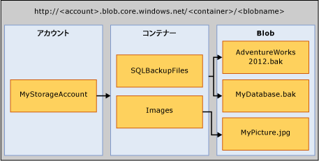

# <a name="sql-server-backup-to-url"></a>SQL Server Backup to URL
[!INCLUDE[tsql-appliesto-ss2016-xxxx-xxxx-xxx_md](../../includes/tsql-appliesto-ss2016-xxxx-xxxx-xxx-md.md)]

  このトピックでは、バックアップ先として Microsoft Azure BLOB ストレージ サービスを使用するために必要な概念、要件、およびコンポーネントについて説明します。 バックアップと復元の機能は、ディスクまたはテープを使用する場合とよく似ていますが、いくつか相違点もあります。 ここでは、これらの相違点とコード例も示します。  
  
## <a name="requirements-components-and-concepts"></a>要件、コンポーネント、および概念  
 **このセクションの内容:**  
  
-   [セキュリティ](#security)  
  
-   [主なコンポーネントと概念の概要](#intorkeyconcepts)  
  
-   [Microsoft Azure BLOB ストレージ サービス](#Blob)  
  
-   [SQL Server のコンポーネント](#sqlserver)  
  
-   [制限事項](#limitations)  
  
-   [BACKUP/RESTORE ステートメントのサポート](#Support)  
  
-   [SQL Server Management Studio でのバックアップ タスクの使用](../../relational-databases/backup-restore/sql-server-backup-to-url.md#BackupTaskSSMS)  
  
-   [メンテナンス プラン ウィザードを使用した SQL Server Backup to URL](../../relational-databases/backup-restore/sql-server-backup-to-url.md#MaintenanceWiz)  
  
-   [SQL Server Management Studio を使用した Windows Azure ストレージからの復元](../../relational-databases/backup-restore/sql-server-backup-to-url.md#RestoreSSMS)  
  
###  <a name="security"></a> セキュリティ  
 Microsoft Azure BLOB ストレージ サービスとの間でバックアップまたは復元を実行する際のセキュリティに関する考慮事項と要件は次のとおりです。  
  
-   Microsoft Azure BLOB ストレージ サービスのコンテナーを作成するときは、アクセス権を **private**に設定することをお勧めします。 アクセス権を private に設定すると、Windows Azure アカウントの認証に必要な情報を指定できるユーザーまたはアカウントだけがアクセスできるようになります。  
  
    > [!IMPORTANT]  
    >  [!INCLUDE[ssNoVersion](../../includes/ssnoversion-md.md)] では、Windows Azure のアカウント名とアクセス キーの認証または Shared Access Signature とアクセス トークンを [!INCLUDE[ssNoVersion](../../includes/ssnoversion-md.md)] 資格情報に保存する必要があります。 この情報は、バックアップ操作または復元操作の実行時に、Windows Azure アカウントに対する認証に使用されます。  
  
-   BACKUP コマンドまたは RESTORE コマンドの発行に使用するユーザー アカウントは、 **資格情報の変更** 権限を持つ **db_backup operator** データベース ロールに属している必要があります。  
  
###  <a name="intorkeyconcepts"></a> 主なコンポーネントと概念の概要  
 次の 2 つのセクションでは、Microsoft Azure BLOB ストレージ サービスと、Microsoft Azure BLOB ストレージ サービスとの間でバックアップまたは復元を実行するときに使用する [!INCLUDE[ssNoVersion](../../includes/ssnoversion-md.md)] コンポーネントについて説明します。 Microsoft Azure BLOB ストレージ サービスとの間でバックアップまたは復元を実行するには、各コンポーネントと、コンポーネント間のやり取りを理解しておくことが重要です。  
  
 このプロセスでは、まず、Azure サブスクリプション内に Windows Azure ストレージ アカウントを作成します。 このストレージ アカウントは、このストレージ アカウントで作成されたすべてのコンテナーとオブジェクトに対する完全な管理者権限を持つ管理者アカウントです。 [!INCLUDE[ssNoVersion](../../includes/ssnoversion-md.md)] では、Windows Azure ストレージ アカウントの名前とアクセス キー値を使用して認証し、Microsoft Azure BLOB ストレージ サービスに対して BLOB の書き込みと読み取りを実行することも、特定のコンテナーで生成された Shared Access Signature トークンを使用して読み取り/書き込み権限を付与することもできます。 Azure ストレージ アカウントの詳細については、「 [Azure ストレージ アカウントについて](http://azure.microsoft.com/en-us/documentation/articles/storage-create-storage-account/) 」をご覧ください。Shared Access Signature の詳細については、「 [Shared Access Signature、第 1 部: SAS モデルについて](http://azure.microsoft.com/en-us/documentation/articles/storage-dotnet-shared-access-signature-part-1/)」をご覧ください。 [!INCLUDE[ssNoVersion](../../includes/ssnoversion-md.md)] 資格情報はこの認証情報を格納するため、バックアップ操作または復元操作中に使用されます。  
  
###  <a name="Blob"></a> Microsoft Azure BLOB ストレージ サービス  
 **ストレージ アカウント:** ストレージ アカウントは、すべてのストレージ サービスの開始点となります。 Microsoft Azure BLOB ストレージ サービスにアクセスするには、まず Windows Azure ストレージ アカウントを作成します。 詳細については、「 [ストレージ アカウントの作成](http://azure.microsoft.com/en-us/documentation/articles/storage-create-storage-account/)」を参照してください。  
  
 **コンテナー:** コンテナーは一連の BLOB をグループ化します。コンテナーには BLOB を無制限に格納できます。 Microsoft Azure BLOB ストレージ サービスに [!INCLUDE[ssNoVersion](../../includes/ssnoversion-md.md)] バックアップを書き込むには、少なくともルート コンテナーを作成しておく必要があります。 コンテナーで Shared Access Signature トークンを生成し、特定のコンテナーでのみオブジェクトへのアクセス権を付与できます。  
  
 **BLOB:** 任意の種類とサイズのファイルです。 Microsoft Azure BLOB ストレージ サービスに格納できる BLOB には、ブロック BLOB とページ BLOB の 2 種類があります。 [!INCLUDE[ssNoVersion](../../includes/ssnoversion-md.md)] バックアップでは、使用する Transact-SQL 構文に応じていずれかの BLOB の種類を使用できます。 BLOB は、https://\<ストレージ アカウント>.blob.core.windows.net/\<コンテナー>/\<BLOB> という URL 形式を使用してアドレス指定できます。 Microsoft Azure BLOB ストレージ サービスの詳細については、「 [.NET を使用して Azure Blob Storage を使用する](http://www.windowsazure.com/develop/net/how-to-guides/blob-storage/)」をご覧ください。 ページ BLOB とブロック BLOB の詳細については、「 [Understanding Block and Page Blobs](http://msdn.microsoft.com/library/windowsazure/ee691964.aspx)」 (ブロック BLOB とページ BLOB について) をご覧ください。  
  
   
  
 **Azure スナップショット:** ある時点で取得された Azure BLOB のスナップショットです。 詳細については、「 [Creating a Snapshot of a Blob](https://msdn.microsoft.com/library/azure/hh488361.aspx)」 (BLOB のスナップショットの作成) を参照してください。 [!INCLUDE[ssNoVersion](../../includes/ssnoversion-md.md)] バックアップでは、Microsoft Azure BLOB ストレージ サービスに格納されたデータベース ファイルの Azure スナップショット バックアップがサポートされるようになりました。 詳細については、「 [Azure でのデータベース ファイルのファイル スナップショット バックアップ](../../relational-databases/backup-restore/file-snapshot-backups-for-database-files-in-azure.md)」を参照してください。  
  
###  <a name="sqlserver"></a> [!INCLUDE[ssNoVersion](../../includes/ssnoversion-md.md)] コンポーネント  
 **URL:** 一意なバックアップ ファイルの Uniform Resource Identifier (URI) を示します。 URL は、 [!INCLUDE[ssNoVersion](../../includes/ssnoversion-md.md)] バックアップ ファイルの場所と名前を指定するために使用されます。 URL は、コンテナーだけでなく、実際の BLOB を参照している必要があります。 BLOB が存在しない場合は作成されます。 既存の BLOB を指定した場合、BLOB 内の既存のバックアップ ファイルを上書きする "WITH FORMAT" オプションを指定しない限り、BACKUP は失敗します。  
  
 サンプル URL 値は、http[s]://ACCOUNTNAME.blob.core.windows.net/\<コンテナー>/\<ファイル名.bak> です。 HTTPS は必須ではありませんが、推奨されています。  
  
 **資格情報:** [!INCLUDE[ssNoVersion](../../includes/ssnoversion-md.md)] 資格情報は、SQL Server の外部にあるリソースへの接続に必要な認証情報を保存するために使用されるオブジェクトです。 ここでは、 [!INCLUDE[ssNoVersion](../../includes/ssnoversion-md.md)] のバックアップおよび復元プロセスで資格情報を使用して、Microsoft Azure BLOB ストレージ サービスと、コンテナーおよび BLOB オブジェクトに対する認証を行います。 資格情報には、ストレージ アカウントの名前と **アクセス キー** の値またはコンテナーの URL と Shared Access Signature トークンが保存されます。 資格情報が作成されたら、BACKUP/RESTORE ステートメントの構文で BLOB の種類と必要な資格情報を指定します。  
  
 Shared Access Signature の作成方法の例については、このトピックで後述する「 [Shared Access Signature の作成](../../relational-databases/backup-restore/sql-server-backup-to-url.md#SAS) 」の例をご覧ください。 [!INCLUDE[ssNoVersion](../../includes/ssnoversion-md.md)] 資格情報の作成方法については、このトピックで後述する「 [Shared Access Signature の作成](../../relational-databases/backup-restore/sql-server-backup-to-url.md#credential) 」の例をご覧ください。  
  
 資格情報の全般的な情報については、「 [資格情報](http://msdn.microsoft.com/library/ms161950.aspx)」をご覧ください。  
  
 資格情報が使用されるその他の例については、「 [SQL Server エージェント プロキシの作成](http://msdn.microsoft.com/library/ms175834.aspx)」ご覧ください。  
  
###  <a name="limitations"></a> 制限事項  
  
-   Premium Storage へのバックアップはサポートされていません。  
  
-   ページ BLOB を使用する場合、サポートされるバックアップの最大サイズは 1 つのページ BLOB の最大サイズ (1 TB) に制限されます。 ブロック BLOB を使用する場合は、サポートされるバックアップの最大サイズがブロック BLOB の最大サイズ (200 GB) に制限されることはありません。ブロック BLOB へのバックアップでは、かなり大きなバックアップ サイズをサポートするストライピングがサポートされているためです。  
  
-   TSQL、SMO、PowerShell コマンドレット、SQL Server Management Studio のバックアップと復元ウィザードを使用して、BACKUP ステートメントや RESTORE ステートメントを実行できます。   
  
-   論理デバイス名の作成はサポートされていません。 そのため、sp_dumpdevice または SQL Server Management Studio を使用してバックアップ デバイスとして URL を追加することはできません。  
  
-   既存のバックアップ BLOB への追加はサポートされていません。 既存の BLOB へのバックアップは **WITH FORMAT** オプションを使用した場合にのみ上書きできます。 ただし、ファイル スナップショット バックアップを使用する場合 ( **WITH FILE_SNAPSHOT** 引数を使用)、元のファイル スナップショット バックアップで作成されたファイル スナップショットが孤立したまま残されるのを避けるために、 **WITH FORMAT** 引数は使用できません。  
  
-   1 回のバックアップ操作での複数の BLOB へのバックアップは、ブロック BLOB を使用し、SQL 資格情報のストレージ アカウント キーではなく、Shared Access Signature (SAS) トークンを使用する場合にのみサポートされます。  
  
-   **BLOCKSIZE** の指定は、ページ BLOB ではサポートされていません。 
  
-   **MAXTRANSFERSIZE** の指定は、ページ BLOB ではサポートされていません。 
  
-   backupset オプション ( **RETAINDAYS** と **EXPIREDATE** ) を指定することはサポートされていません。  
  
-   [!INCLUDE[ssNoVersion](../../includes/ssnoversion-md.md)] では、バックアップ デバイス名に最大 259 文字の制限があります。 BACKUP TO URL では、URL の指定に使用する必須要素に ‘https://.blob.core.windows.net//.bak’ の 36 文字が使用されるため、アカウント、コンテナー、および BLOB の名前は残りの 223 文字で構成します。  
  
###  <a name="Support"></a> BACKUP/RESTORE ステートメントのサポート  
  
|BACKUP/RESTORE ステートメント|Supported|例外|コメント|
|-|-|-|-|
|BACKUP|√|BLOCKSIZE および MAXTRANSFERSIZE は、ブロック BLOB ではサポートされています。 ページ BLOB ではサポートされていません。 | ブロック BLOB への BACKUP には、SQL Server 資格情報に保存された Shared Access Signature が必要です。 ページ BLOB への BACKUP には、[!INCLUDE[ssNoVersion](../../includes/ssnoversion-md.md)] 資格情報に保存されたストレージ アカウント キーが必要であり、WITH CREDENTIAL 引数を指定する必要があります。|  
|RESTORE|√||[!INCLUDE[ssNoVersion](../../includes/ssnoversion-md.md)] 資格情報を定義する必要があります。また、シークレットとしてストレージ アカウント キーを使用して [!INCLUDE[ssNoVersion](../../includes/ssnoversion-md.md)] 資格情報を定義する場合は、WITH CREDENTIAL 引数を指定する必要があります。|  
|RESTORE FILELISTONLY|√||[!INCLUDE[ssNoVersion](../../includes/ssnoversion-md.md)] 資格情報を定義する必要があります。また、シークレットとしてストレージ アカウント キーを使用して [!INCLUDE[ssNoVersion](../../includes/ssnoversion-md.md)] 資格情報を定義する場合は、WITH CREDENTIAL 引数を指定する必要があります。|  
|RESTORE HEADERONLY|√||[!INCLUDE[ssNoVersion](../../includes/ssnoversion-md.md)] 資格情報を定義する必要があります。また、シークレットとしてストレージ アカウント キーを使用して [!INCLUDE[ssNoVersion](../../includes/ssnoversion-md.md)] 資格情報を定義する場合は、WITH CREDENTIAL 引数を指定する必要があります。|  
|RESTORE LABELONLY|√||[!INCLUDE[ssNoVersion](../../includes/ssnoversion-md.md)] 資格情報を定義する必要があります。また、シークレットとしてストレージ アカウント キーを使用して [!INCLUDE[ssNoVersion](../../includes/ssnoversion-md.md)] 資格情報を定義する場合は、WITH CREDENTIAL 引数を指定する必要があります。|  
|RESTORE VERIFYONLY|√||[!INCLUDE[ssNoVersion](../../includes/ssnoversion-md.md)] 資格情報を定義する必要があります。また、シークレットとしてストレージ アカウント キーを使用して [!INCLUDE[ssNoVersion](../../includes/ssnoversion-md.md)] 資格情報を定義する場合は、WITH CREDENTIAL 引数を指定する必要があります。|  
|RESTORE REWINDONLY|−|||  
  
 BACKUP ステートメントの構文と一般的な情報については、「[BACKUP &#40;Transact-SQL&#41;](../../t-sql/statements/backup-transact-sql.md)」をご覧ください。  
  
 RESTORE ステートメントの構文と一般的な情報については、「[RESTORE &#40;Transact-SQL&#41;](../../t-sql/statements/restore-statements-transact-sql.md)」をご覧ください。  
  
### <a name="support-for-backup-arguments"></a>BACKUP の引数のサポート  

|引数|Supported|例外|コメント|  
|-|-|-|-|  
|DATABASE|√|||  
|LOG|√|||  
||  
|TO (URL)|√|ディスクまたはテープの場合とは異なり、URL では論理名の指定と作成はサポートされていません。|この引数は、バックアップ ファイルの URL パスの指定に使用されます。|  
|MIRROR TO|√|||  
|**WITH オプション:**||||  
|CREDENTIAL|√||WITH CREDENTIAL は、BACKUP TO URL オプションを使用して Microsoft Azure BLOB ストレージ サービスにバックアップするときに、シークレットとしてストレージ アカウント キーを使用して [!INCLUDE[ssNoVersion](../../includes/ssnoversion-md.md)] 資格情報を定義する場合にのみサポートされます。|  
|FILE_SNAPSHOT|√|||  
|ENCRYPTION|√||**WITH ENCRYPTION** 引数が指定されている場合、 [!INCLUDE[ssNoVersion](../../includes/ssnoversion-md.md)] ファイル スナップショット バックアップでは、バックアップを作成する前にデータベース全体が TDE で暗号化されていることを確認し、暗号化されていれば、データベースで TDE に指定されたアルゴリズムを使用して、ファイル スナップショット バックアップ ファイル自体を暗号化します。 データベース全体でデータがすべて暗号化されているわけではない場合、バックアップは失敗します (暗号化プロセスがまだ完了していないなど)。|  
|DIFFERENTIAL|√|||  
|COPY_ONLY|√|||  
|COMPRESSION&#124;NO_COMPRESSION|√|ファイル スナップショット バックアップではサポートされていません。||  
|DESCRIPTION|√|||  
|NAME|√|||  
|EXPIREDATE &#124; RETAINDAYS|−|||  
|NOINIT &#124; INIT|−||BLOB に追加することはできません。 バックアップを上書きするには、 **WITH FORMAT** 引数を使用します。 ただし、ファイル スナップショット バックアップを使用する場合 ( **WITH FILE_SNAPSHOT** 引数を使用)、元のバックアップで作成されたファイル スナップショットが孤立したまま残されるのを避けるために、 **WITH FORMAT** 引数は使用できません。|  
|NOSKIP &#124; SKIP|−|||  
|NOFORMAT &#124; FORMAT|√||**WITH FORMAT** を指定した場合を除き、既存の BLOB に対して実行されるバックアップは失敗します。 **WITH FORMAT** を指定すると、既存の BLOB が上書きされます。 ただし、ファイル スナップショット バックアップを使用する場合 ( **WITH FILE_SNAPSHOT** 引数を使用)、元のファイル スナップショット バックアップで作成されたファイル スナップショットが孤立したまま残されるのを避けるために、FORMAT 引数は使用できません。 ただし、ファイル スナップショット バックアップを使用する場合 ( **WITH FILE_SNAPSHOT** 引数を使用)、元のバックアップで作成されたファイル スナップショットが孤立したまま残されるのを避けるために、 **WITH FORMAT** 引数は使用できません。|  
|MEDIADESCRIPTION|√|||  
|MEDIANAME|√|||  
|BLOCKSIZE|√|ページ BLOB ではサポートされていません。 ブロック BLOB ではサポートされています。| ブロック BLOB で許可される 50,000 ブロックの使用を最適化するため、BLOCKSIZE=65536 にすることをお勧めします。 |  
|BUFFERCOUNT|√|||  
|MAXTRANSFERSIZE|√|ページ BLOB ではサポートされていません。 ブロック BLOB ではサポートされています。| 既定値は 1048576 です。 指定できる値は、65536 バイト刻みで最大 4 MB までです。</br> ブロック BLOB で許可される 50,000 ブロックの使用を最適化するため、MAXTRANSFERSIZE=4194304 にすることをお勧めします。 |  
|NO_CHECKSUM &#124; CHECKSUM|√|||  
|STOP_ON_ERROR &#124; CONTINUE_AFTER_ERROR|√|||  
|STATS|√|||  
|REWIND &#124; NOREWIND|−|||  
|UNLOAD &#124; NOUNLOAD|−|||  
|NORECOVERY &#124; STANDBY|√|||  
|NO_TRUNCATE|√|||  
  
 BACKUP の引数の詳細については、「[BACKUP &#40;Transact-SQL&#41;](../../t-sql/statements/backup-transact-sql.md)」をご覧ください。  
  
### <a name="support-for-restore-arguments"></a>RESTORE の引数のサポート  
  
|引数|Supported|例外|コメント|  
|-|-|-|-|  
|DATABASE|√|||  
|LOG|√|||  
|FROM (URL)|√||FROM URL 引数は、バックアップ ファイルの URL パスの指定に使用されます。|  
|**WITH Options:**||||  
|CREDENTIAL|√||WITH CREDENTIAL は、RESTORE FROM URL オプションを使用して Microsoft Azure BLOB ストレージ サービスから復元する場合にのみサポートされます。|  
|PARTIAL|√|||  
|RECOVERY &#124; NORECOVERY &#124; STANDBY|√|||  
|LOADHISTORY|√|||  
|MOVE|√|||  
|[REPLACE]|√|||  
|RESTART|√|||  
|RESTRICTED_USER|√|||  
|FILE|−|||  
|PASSWORD|√|||  
|MEDIANAME|√|||  
|MEDIAPASSWORD|√|||  
|BLOCKSIZE|√|||  
|BUFFERCOUNT|−|||  
|MAXTRANSFERSIZE|−|||  
|CHECKSUM &#124; NO_CHECKSUM|√|||  
|STOP_ON_ERROR &#124; CONTINUE_AFTER_ERROR|√|||  
|FILESTREAM|√|スナップショット バックアップではサポートされていません。||  
|STATS|√|||  
|REWIND &#124; NOREWIND|−|||  
|UNLOAD &#124; NOUNLOAD|−|||  
|KEEP_REPLICATION|√|||  
|KEEP_CDC|√|||  
|ENABLE_BROKER &#124; ERROR_BROKER_CONVERSATIONS &#124; NEW_BROKER|√|||  
|STOPAT &#124; STOPATMARK &#124; STOPBEFOREMARK|√|||  
  
 RESTORE の引数の詳細については、「[RESTORE の引数 &#40;Transact-SQL&#41;](../../t-sql/statements/restore-statements-arguments-transact-sql.md)」をご覧ください。  
  
##  <a name="BackupTaskSSMS"></a> SQL Server Management Studio でのバックアップ タスクの使用  
SQL Server 資格情報を使用して SQL Server Management Studio のバックアップ タスクで URL にデータベースをバックアップできます。  
  
> [!NOTE]  
>  [!INCLUDE[ssNoVersion](../../includes/ssnoversion-md.md)] ファイル スナップショット バックアップを作成するには、または既存のメディア セットを上書きするには、SQL Server Management Studio のバックアップ タスクではなく、Transact-SQL、PowerShell、または C# を使用する必要があります。  
  
 次の手順では、Microsoft Azure Storage へのバックアップを可能にするために SQL Server Management Studio でデータベースのバックアップ タスクに対して行う変更について説明します。  
  
1.  **オブジェクト エクスプローラー**で、SQL Server データベース エンジンのインスタンスに接続し、そのインスタンスを展開します。

2.  **[データベース]**を展開して目的のデータベースを右クリックし、 **[タスク]**をポイントして、 **[バックアップ...]**をクリックします。
  
3.  **[全般]** ページの **[バックアップ先]** セクションで、 **[バックアップ先]** ドロップダウン リストの **[URL]** オプションが使用できるようになります。  **[URL]** オプションを使用して、Windows Azure Storage へのバックアップを作成します。 **[追加]** をクリックすると、 **[バックアップ先の選択]** ダイアログ ボックスが開きます。
   
    1.  **[Azure ストレージ コンテナー]:** バックアップ ファイルを格納する Microsoft Azure ストレージ コンテナーの名前。  ドロップダウン リストから既存のコンテナーを選択するか、コンテナーを手動で入力します。 
  
    2.  **[共有アクセス ポリシー]:** 手動で入力されたコンテナーの Shared Access Signature を入力します。  このフィールドは、既存のコンテナーを選択した場合には使用できません。 
  
    3.  **[バックアップ ファイル]:** バックアップ ファイルの名前。
    
    4.  **[新しいコンテナー]:** Shared Access Signature がない既存のコンテナーを登録するために使用します。  「 [Connect to a Microsoft Azure Subscription](../../relational-databases/backup-restore/connect-to-a-microsoft-azure-subscription.md)」(Microsoft Azure Subscription への接続) を参照してください。
  
> [!NOTE] 
>  **[追加]** は、1 つのメディア セットに対して複数のバックアップ ファイルとストレージ コンテナーをサポートします。
  
 バックアップ先として **[URL]** を選択すると、 **[メディア オプション]** ページの一部のオプションが無効になります。  [データベースのバックアップ] ダイアログの詳細については、次のトピックを参照してください。  
  
 [データベースのバックアップ &#40;全般ページ&#41;](../../relational-databases/backup-restore/back-up-database-general-page.md)  
  
 [データベースのバックアップ &#40;メディア オプション ページ&#41;](../../relational-databases/backup-restore/back-up-database-media-options-page.md)  
  
 [データベースのバックアップ &#40;バックアップ オプション ページ&#41;](../../relational-databases/backup-restore/back-up-database-backup-options-page.md)  
  
 [資格情報の作成- Azure ストレージに対する認証](../../relational-databases/backup-restore/create-credential-authenticate-to-azure-storage.md)  
  
##  <a name="MaintenanceWiz"></a> メンテナンス プラン ウィザードを使用した SQL Server Backup to URL  
 前述のバックアップ タスクと同様に、SQL Server Management Studio のメンテナンス プラン ウィザードでも、バックアップ先として **URL** も選択できるようになりました。また、SQL 資格情報など、Microsoft Azure Storage へのバックアップに必要な他のサポート オブジェクトも追加されました。 詳細については、「 **メンテナンス プラン ウィザードの使用** 」の「 [バックアップ タスクを定義する](../../relational-databases/maintenance-plans/use-the-maintenance-plan-wizard.md#SSMSProcedure)」を参照してください。  
  
> [!NOTE]  
>  Shared Access トークンを使用して、ストライプ バックアップ セット、 [!INCLUDE[ssNoVersion](../../includes/ssnoversion-md.md)] ファイル スナップショット バックアップ、または SQL 資格情報を作成するには、メンテナンス プラン ウィザードのバックアップ タスクではなく、Transact-SQL、PowerShell、または C# を使用する必要があります。  
  
##  <a name="RestoreSSMS"></a> SQL Server Management Studio を使用した Microsoft Azure Storage からの復元  
データベースの復元タスクには、復元元のデバイスとして **[URL]** が含まれます。  次の手順は、復元タスクを使用して Microsoft Azure BLOB ストレージ サービスから復元する方法を示しています。 
  
1.  **[データベース]** を右クリックして、 **[データベースの復元...]**を選択します。 
  
2.  **[全般]** ページで、 **[ソース]** セクションの **[デバイス]** を選択します。
  
3.  参照ボタン ([...]) をクリックし、 **[バックアップ デバイスの選択]** ダイアログ ボックスを開きます。 

4.  **[バックアップ メディアの種類:]** ドロップダウン リストから **[URL]** を選択します。  **[追加]** をクリックして、 **[バックアップ ファイルの場所を選択]** ダイアログ ボックスを開きます。

    1.  **[Azure ストレージ コンテナー]:** バックアップ ファイルを格納する Microsoft Azure ストレージ コンテナーの完全修飾名。  ドロップダウン リストから既存のコンテナーを選択するか、完全修飾コンテナー名を手動で入力します。
      
    2.  **[Shared Access Signature]:**  指定したコンテナーの Shared Access Signature を入力します。
      
    3.  **[追加]:**  Shared Access Signature がない既存のコンテナーを登録するために使用します。  「[Connect to a Microsoft Azure Subscription](../../relational-databases/backup-restore/connect-to-a-microsoft-azure-subscription.md)」(Microsoft Azure Subscription への接続) を参照してください。
      
    4.  **[OK]:** 指定した SQL 資格情報を使用して SQL Server が Microsoft Azure Storage に接続され、**[Microsoft Azure でのバックアップ ファイルの位置指定]** ダイアログ ボックスが開きます。 このページには、ストレージ コンテナーに存在するバックアップ ファイルが表示されます。 復元に使用するファイルを選択して **[OK]**をクリックします。 これにより、 **[バックアップ デバイスの選択]** ダイアログ ボックスが再度表示されます。このダイアログ ボックスで **[OK]** をクリックすると、メインの **[復元]** ダイアログ ボックスに戻って復元を完了できます。 
  
     [[データベースの復元] &#40;[全般] ページ&#41;](../../relational-databases/backup-restore/restore-database-general-page.md)  
  
     [[データベースの復元] &#40;[ファイル] ページ&#41;](../../relational-databases/backup-restore/restore-database-files-page.md)  
  
     [[データベースの復元] &#40;[オプション] ページ&#41;](../../relational-databases/backup-restore/restore-database-options-page.md)  
  
##  <a name="Examples"></a> コード例  
 ここでは、次の例について説明します。  
  
-   [Shared Access Signature の作成](#credential)  
  
-   [データベース全体をバックアップする](#complete)  
    
-   [STOPAT を使って特定の時点の状態に復元する](#PITR)  
  
> [!NOTE]  
>  Microsoft Azure BLOB ストレージ サービスでの SQL Server 2016 の使用方法に関するチュートリアルについては、「 [チュートリアル: Windows Azure ストレージ サービス内の SQL Server データ ファイル](https://msdn.microsoft.com/library/dn466438.aspx)」をご覧ください。  
  
###  <a name="SAS"></a> Shared Access Signature の作成  
 次の例では、新しく作成されたコンテナーで [!INCLUDE[ssNoVersion](../../includes/ssnoversion-md.md)] 資格情報の作成に使用できる Shared Access Signature を作成します。 次のスクリプトは、保存されたアクセス ポリシーに関連付けられた Shared Access Signature を作成します。 詳細については、「 [Shared Access Signature、第 1 部: SAS モデルについて](http://azure.microsoft.com/en-us/documentation/articles/storage-dotnet-shared-access-signature-part-1/)」を参照してください。 この例では、Microsoft Azure Powershell が必要です。 Azure PowerShell のインストールと使用方法については、「 [Azure PowerShell のインストールおよび構成方法](https://azure.microsoft.com/documentation/articles/powershell-install-configure/)」をご覧ください。  

> [!NOTE] 
>  これらのスクリプトは、Azure PowerShell 5.0.10586 を使用して作成されています。

**保存されたアクセス ポリシーに関連付けられた Shared Access Signature**  
  
```Powershell  
# Define global variables for the script  
$prefixName = '<a prefix name>'  # used as the prefix for the name for various objects  
$subscriptionName='<your subscription name>'   # the name of subscription name you will use  
$locationName = '<a data center location>'  # the data center region you will use  
$storageAccountName= $prefixName + 'storage' # the storage account name you will create or use  
$containerName= $prefixName + 'container'  # the storage container name to which you will attach the SAS policy with its SAS token  
$policyName = $prefixName + 'policy' # the name of the SAS policy  


# Set a variable for the name of the resource group you will create or use  
$resourceGroupName=$prefixName + 'rg'   

# adds an authenticated Azure account for use in the session   
Login-AzureRmAccount

# set the tenant, subscription and environment for use in the rest of   
Set-AzureRmContext -SubscriptionName $subscriptionName   

# create a new resource group - comment out this line to use an existing resource group  
New-AzureRmResourceGroup -Name $resourceGroupName -Location $locationName   

# Create a new ARM storage account - comment out this line to use an existing ARM storage account  
New-AzureRmStorageAccount -Name $storageAccountName -ResourceGroupName $resourceGroupName -Type Standard_RAGRS -Location $locationName   

# Get the access keys for the ARM storage account  
$accountKeys = Get-AzureRmStorageAccountKey -ResourceGroupName $resourceGroupName -Name $storageAccountName  

# Create a new storage account context using an ARM storage account  
$storageContext = New-AzureStorageContext -StorageAccountName $storageAccountName -StorageAccountKey $accountKeys[0].Key1 

# Creates a new container in blob storage  
$container = New-AzureStorageContainer -Context $storageContext -Name $containerName  
$cbc = $container.CloudBlobContainer  

# Sets up a Stored Access Policy and a Shared Access Signature for the new container  
$permissions = $cbc.GetPermissions();  
$policyName = $policyName  
$policy = new-object 'Microsoft.WindowsAzure.Storage.Blob.SharedAccessBlobPolicy'  
$policy.SharedAccessStartTime = $(Get-Date).ToUniversalTime().AddMinutes(-5)  
$policy.SharedAccessExpiryTime = $(Get-Date).ToUniversalTime().AddYears(10)  
$policy.Permissions = "Read,Write,List,Delete"  
$permissions.SharedAccessPolicies.Add($policyName, $policy)  
$cbc.SetPermissions($permissions);  

# Gets the Shared Access Signature for the policy  
$policy = new-object 'Microsoft.WindowsAzure.Storage.Blob.SharedAccessBlobPolicy'  
$sas = $cbc.GetSharedAccessSignature($policy, $policyName)  
Write-Host 'Shared Access Signature= '$($sas.Substring(1))''  

# Outputs the Transact SQL to the clipboard and to the screen to create the credential using the Shared Access Signature  
Write-Host 'Credential T-SQL'  
$tSql = "CREATE CREDENTIAL [{0}] WITH IDENTITY='Shared Access Signature', SECRET='{1}'" -f $cbc.Uri,$sas.Substring(1)   
$tSql | clip  
Write-Host $tSql  
```  
  
###  <a name="credential"></a> Shared Access Signature の作成  
 次の例では、Microsoft Azure BLOB ストレージ サービスに対する認証に使用する [!INCLUDE[ssNoVersion](../../includes/ssnoversion-md.md)] 資格情報を作成します。  
  
1.  **ストレージ アカウント ID とアクセス キーを使用**  
  
    ```Transact-sql  
    IF NOT EXISTS  
    (SELECT * FROM sys.credentials   
    WHERE name = '<mycredentialname>')  
    CREATE CREDENTIAL [<mycredentialname>] WITH IDENTITY = '<mystorageaccountname>'  
    ,SECRET = '<mystorageaccountaccesskey>';  
    ```  
  
2.  **Shared Access Signature を使用**  
  
    ```Transact-sql  
    IF NOT EXISTS  
    (SELECT * FROM sys.credentials   
    WHERE name = 'https://<mystorageaccountname>.blob.core.windows.net/<mystorageaccountcontainername>')  
    CREATE CREDENTIAL [https://<mystorageaccountname>.blob.core.windows.net/<mystorageaccountcontainername>] WITH IDENTITY = 'SHARED ACCESS SIGNATURE'  
    ,SECRET = '<SAS_TOKEN>';  
    ```  
  
###  <a name="complete"></a> データベースの完全バックアップの実行  
 次の例では、Microsoft Azure BLOB ストレージ サービスへの AdventureWorks2016 データベースの完全バックアップを実行します。  
  
1.  **ストレージ アカウント ID とアクセス キーを使用した TO URL**  
  
    ```Transact-SQL
    BACKUP DATABASE AdventureWorks2016  
    TO URL = 'https://<mystorageaccountname>.blob.core.windows.net/<mycontainername>/AdventureWorks2016.bak'   
          WITH CREDENTIAL = '<mycredentialname>'   
         ,COMPRESSION  
         ,STATS = 5;  
    GO   
    ```  
  
2.  **Shared Access Signature を使用した TO URL**  
  
    ```Transact-SQL  
    BACKUP DATABASE AdventureWorks2016   
    TO URL = 'https://<mystorageaccountname>.blob.core.windows.net/<mycontainername>/AdventureWorks2016.bak';  
    GO   
    ```  
  

  
  
###  <a name="PITR"></a> STOPAT を使って特定の時点の状態に復元する  
 次の例では、AdventureWorks2016 サンプル データベースを特定の時点の状態に復元し、復元操作を示します。  
  
1.  **Shared Access Signature を使用した FROM URL**  
  
    ```Transact-SQL
    RESTORE DATABASE AdventureWorks2016 FROM URL = 'https://<mystorageaccountname>.blob.core.windows.net/<mycontainername>/AdventureWorks2016_2015_05_18_16_00_00.bak'   
    WITH MOVE 'AdventureWorks2016_data' to 'C:\Program Files\Microsoft SQL Server\<myinstancename>\MSSQL\DATA\AdventureWorks2016.mdf'  
    ,MOVE 'AdventureWorks2016_log' to 'C:\Program Files\Microsoft SQL Server\<myinstancename>\MSSQL\DATA\AdventureWorks2016.ldf'  
    ,NORECOVERY  
    ,REPLACE  
    ,STATS = 5;  
    GO   
  
    RESTORE LOG AdventureWorks2016 FROM URL = 'https://<mystorageaccountname>.blob.core.windows.net/<mycontainername>/AdventureWorks2016_2015_05_18_18_00_00.trn'   
    WITH   
    RECOVERY   
    ,STOPAT = 'May 18, 2015 5:35 PM'   
    GO  
    ```  
  
## <a name="see-also"></a>参照  
 [SQL Server Backup to URL に関するベスト プラクティスとトラブルシューティング](../../relational-databases/backup-restore/sql-server-backup-to-url-best-practices-and-troubleshooting.md)   
 [システム データベースのバックアップと復元 &#40;SQL Server&#41;](../../relational-databases/backup-restore/back-up-and-restore-of-system-databases-sql-server.md)   
 [チュートリアル: Windows Azure ストレージ サービス内の SQL Server データ ファイル](https://msdn.microsoft.com/library/dn466438.aspx)  
  
  
