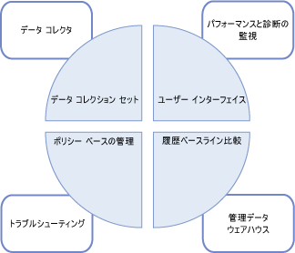
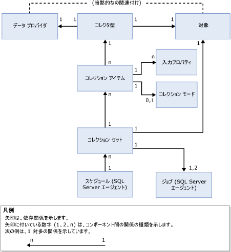

# データ コレクション
[!INCLUDE[appliesto-ss-xxxx-xxxx-xxx-md](../../includes/appliesto-ss-xxxx-xxxx-xxx-md.md)]
  データ コレクターは、さまざまなデータのセットを収集する [!INCLUDE[ssCurrent](../../includes/sscurrent-md.md)] のコンポーネントです。 データ コレクションは、継続的に実行されるかユーザー定義のスケジュールに基づいて実行されます。 データ コレクターは、収集したデータを管理データ ウェアハウスというリレーショナル データベースに格納します。  
  
## データ コレクターとは何ですか。 
 データ コレクターは、 [!INCLUDE[ssCurrent](../../includes/sscurrent-md.md)] のデータ収集プラットフォームの主要なコンポーネントであり、 [!INCLUDE[ssNoVersion](../../includes/ssnoversion-md.md)]によって提供されるツールです。 データ コレクターでは、中心となる 1 つのポイントでデータベース サーバーやアプリケーションのデータを収集できます。 この収集ポイントではさまざまなソースからデータを取得できます。SQL トレースとは異なり、パフォーマンス データに制限されません。  
  
 データ コレクターでは、テスト環境や実稼働環境に合わせてデータ収集の範囲を調整できます。 また、データ コレクターはデータ ウェアハウスも使用します。データ ウェアハウスは、データにさまざまな保有期間を設定して収集したデータを管理できるようにするリレーショナル データベースです。  
  
 データ コレクターは、データ収集の動的なチューニングをサポートし、その API を通じて拡張できます。 詳細については、「 [データ コレクターのプログラミング](https://msdn.microsoft.com/library/53b4752b-055d-4716-b2bc-75b4cce84101)」を参照してください。  
  
 [!INCLUDE[ssCurrent](../../includes/sscurrent-md.md)]のデータ収集およびデータ管理の全体的な戦略にデータ コレクターがどのように組み込まれているかを次の図に示します。  
  
   
  
## 概念  
 データ コレクターは、 [!INCLUDE[ssNoVersion](../../includes/ssnoversion-md.md)] エージェントと [!INCLUDE[ssISnoversion](../../includes/ssisnoversion-md.md)]に統合されており、この 2 つを広範囲にわたって使用します。 したがって、データ コレクターを使用する前に、この 2 つの [!INCLUDE[ssNoVersion](../../includes/ssnoversion-md.md)] コンポーネントのそれぞれに関連するいくつかの概念を理解しておく必要があります。  
  
 [!INCLUDE[ssNoVersion](../../includes/ssnoversion-md.md)]エージェントは、コレクション ジョブのスケジュールおよび実行のために使用されます。 次の概念を理解しておく必要があります。  
  
-   [ジョブ]  
  
-   [ジョブ ステップ]  
  
-   ジョブ スケジュール  
  
-   [サブシステム]  
  
-   プロキシ アカウント  
  
 詳細については、「[管理タスクの自動化 &#40;SQL Server エージェント&#41;](https://msdn.microsoft.com/library/541ee5ac-2c9f-4b74-b4f0-13b7bd5920b0)」を参照してください。  
  
 [!INCLUDE[ssISnoversion](../../includes/ssisnoversion-md.md)] ([!INCLUDE[ssIS](../../includes/ssis-md.md)]) は、個々のデータ プロバイダーからデータを収集するパッケージを実行するために使用されます。 以下の [!INCLUDE[ssIS](../../includes/ssis-md.md)] ツールと概念を理解しておく必要があります。  
  
-   [!INCLUDE[ssIS](../../includes/ssis-md.md)] パッケージ  
  
-   [!INCLUDE[ssIS](../../includes/ssis-md.md)] パッケージ構成  
  
 詳細については、「[Integration Services &#40;SSIS&#41; Packages](../../integration-services/integration-services-ssis-packages.md)」を参照してください。  
  
## 用語  
 **移行先**  
 データ コレクションをサポートする [!INCLUDE[ssDE](../../includes/ssde-md.md)] のエディションにおける [!INCLUDE[ssNoVersion](../../includes/ssnoversion-md.md)] のインスタンス。 サポートされるエディションの詳細については、「 [SQL Server 2016 の各エディションがサポートする機能](~/sql-server/editions-and-supported-features-for-sql-server-2016.md)」の「管理の容易性」を参照してください。  
  
 *対象ルート* では、対象となる階層内のサブツリーを定義します。 *対象セット* は、対象ルートで定義されたサブツリーにフィルターを適用した結果の対象のグループです。 対象ルートはデータベース ( [!INCLUDE[ssNoVersion](../../includes/ssnoversion-md.md)]のインスタンス) またはコンピューター インスタンスです。  
  
**対象になる種類 (target type)**  
 一定の特性と動作を持つ、対象の種類。 たとえば、 [!INCLUDE[ssNoVersion](../../includes/ssnoversion-md.md)] インスタンスの対象は、 [!INCLUDE[ssNoVersion](../../includes/ssnoversion-md.md)] データベースの対象とは異なる特性を持ちます。  
  
 **データ プロバイダー (data provider)**  
 コレクター型にデータを提供する、対象の種類に固有の既知のデータ ソース。  
  
**コレクター型 (collector type)**  
 データの収集および管理データ ウェアハウスへのアップロード用の実際のメカニズムを提供する、 [!INCLUDE[ssIS](../../includes/ssis-md.md)] パッケージの論理ラッパー。  
  
 **コレクション アイテム (collection item)**  
 コレクター型のインスタンス。 コレクション アイテムは、入力プロパティ セットと収集頻度に基づいて作成されます。  
  
 **コレクション セット (collection set)**  
 コレクション アイテムのグループ。 コレクション セットは、ユーザーがユーザー インターフェイスから操作できるデータ収集の単位です。  
  
 **コレクション モード (collection mode)**  
 データを収集し、格納する方法。 コレクション モードにはキャッシュと非キャッシュがあります。 キャッシュ モードは継続的なコレクションをサポートし、非キャッシュ モードは要求時コレクションまたはコレクションのスナップショットで使用されます。  
  
 **管理データ ウェアハウス (management data warehouse)**  
 収集したデータを格納するためのリレーショナル データベース。  
  
 データ コレクター コンポーネント間の依存関係およびリレーションシップを次の図に示します。  
  
   
  
 図に示すように、データ プロバイダーはデータ コレクターの外部にあり、定義することによって対象との暗黙的なリレーションシップを持ちます。 データ プロバイダーは特定の対象 (たとえばリレーショナル エンジンなどの [!INCLUDE[ssNoVersion](../../includes/ssnoversion-md.md)] サービス) に固有で、 [!INCLUDE[ssNoVersion](../../includes/ssnoversion-md.md)]のシステム ビュー、パフォーマンス モニター カウンター、WMI プロバイダーなど、データ コレクターが使用できるデータを提供します。  
  
 コレクター型は、対象の種類に固有であり、対象の種類に対するデータ プロバイダーの論理アソシエーションを基にしています。 コレクター型は、特定のデータ プロバイダーからデータを収集する方法を (スキーマ化されたパラメーターを使用して) 定義し、データ ストレージ スキーマを指定します。 データ プロバイダー スキーマとデータ ストレージ スキーマは、収集したデータを格納するために必要です。 また、コレクター型は、管理データ ウェアハウスの場所も示します。管理データ ウェアハウスは、データ収集を実行するコンピューターにも別のコンピューターにも配置できます。  
  
 図に示すコレクション アイテムは、特定のコレクター型のインスタンスで、コレクター型の XML スキーマなどの入力パラメーターでパラメーター化されています。 すべてのコレクション アイテムは、同じ対象ルートまたは空の対象ルート上で操作する必要があります。 これにより、データ コレクターは、異なる対象ルートからではなく、オペレーティング システムまたは特定の対象ルートからコレクター型を結合できます。  
  
 コレクション アイテムには、値のスナップショットを取得する頻度を決める、収集の頻度を定義します。 コレクション アイテムは、コレクション セットの構成要素ですが、単独では存在できません。  
  
 コレクション セットは、サーバー インスタンス上に定義および配置され、互いに独立して実行できます。 各コレクション セットは、コレクション セットに含まれる全コレクター型の対象の種類に一致する対象に適用できます。 コレクション セットは [!INCLUDE[ssNoVersion](../../includes/ssnoversion-md.md)] エージェント ジョブによって実行され、定義済みのスケジュールに従ってデータが管理データ ウェアハウスにアップロードされます。  
  
 コレクション セット内の別々のインスタンスが収集したデータはすべて同じスケジュールに従って管理データ ウェアハウスにアップロードされます。 このスケジュールは、共有の [!INCLUDE[ssNoVersion](../../includes/ssnoversion-md.md)] エージェント スケジュールとして定義され、複数のコレクション セットから使用できます。 コレクション セットは、単一のエンティティとしてオンまたはオフになります。コレクション アイテムは個別にオンまたはオフにできません。  
  
 コレクション セットを作成または更新する際に、データの収集および管理データ ウェアハウスへのアップロード用のコレクション モードを構成できます。 スケジュールの種類は、コレクションの種類 (キャッシュまたは非キャッシュ) によって決まります。 コレクションがキャッシュ モードの場合、データ収集とアップロードはそれぞれ個別のジョブで実行されます。 コレクションは、 [!INCLUDE[ssNoVersion](../../includes/ssnoversion-md.md)] エージェントの開始時に開始するスケジュールに基づいて実行され、コレクション アイテムで指定された頻度で実行されます。 アップロードは、ユーザーが指定したスケジュールに従って実行されます。  
  
 非キャッシュ モードのコレクションの場合、データ収集とアップロードは、2 段階の単一ジョブで実行されます。 段階 1 が収集、段階 2 がアップロードです。 要求時コレクションにはスケジュールは必要ありません。  
  
 コレクション セットが有効になったら、スケジュールに従うか、または要求に応じて、データ収集を開始できます。 データ収集を開始すると、 [!INCLUDE[ssNoVersion](../../includes/ssnoversion-md.md)] エージェントがデータ コレクターのプロセスを生成し、生成されたプロセスはコレクション セットの [!INCLUDE[ssISnoversion](../../includes/ssisnoversion-md.md)] パッケージを順番に読み込みます。 コレクション型を表すコレクション アイテムは、指定した対象上の適切なデータ プロバイダーからデータを収集します。 収集のサイクルが終わると、このデータは管理データ ウェアハウスにアップロードされます。  
  
## 可能な操作  
  
|[説明]|トピック|  
|----------------------|-----------|  
|データ コレクションの有効化または無効化、コレクション セットの構成の変更、管理データ ウェアハウスのデータの表示など、データ コレクションのさまざまな側面を管理します。|[データ コレクションの管理](../../relational-databases/data-collection/manage-data-collection.md)|  
|レポートを使用し、システム容量の監視やシステム パフォーマンスのトラブルシューティングに役立つ情報を取得します。|[システム データ コレクション セット レポート](../../relational-databases/data-collection/system-data-collection-set-reports.md)|  
|管理データ ウェアハウスを使用し、データ コレクションの対象であるサーバーからデータを収集します。|[管理データ ウェアハウス (management data warehouse)](../../relational-databases/data-collection/management-data-warehouse.md)| 
|SQL Server Profiler のサーバー側のトレース機能を利用し、ジェネリック SQL トレース コレクター型を使用するコレクション セットを作成するためのトレース定義をエクスポートできます。| [SQL Server Profiler を使用して SQL トレース コレクション セットを作成する (SQL Server Management Studio)](use-sql-server-profiler-to-create-a-sql-trace-collection-set.md)
  
  

