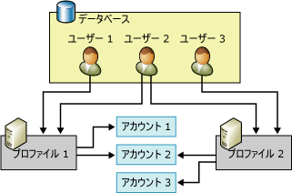

# データベース メール構成オブジェクト
[!INCLUDE[appliesto-ss-xxxx-xxxx-xxx-md](../../includes/appliesto-ss-xxxx-xxxx-xxx-md.md)]
  データベース メールには、2 つの構成オブジェクトがあります。データベース アプリケーションまたは [!INCLUDE[ssNoVersion](../../includes/ssnoversion-md.md)] Agent から電子メールを送信する際、データベース メールによって使用される設定は、データベース構成オブジェクトを通じて構成することができます。  
  
-   データベース メール アカウント  
  
-   データベース メール プロファイル  
  
  
##   データベース メール構成オブジェクトの関係  
 この図には、2 つのプロファイル、3 つのアカウント、および 3 人のユーザーが示されています。 ユーザー 1 には、アカウント 1 とアカウント 2 を使用しているプロファイル 1 へのアクセス権があります。 ユーザー 3 には、アカウント 2 とアカウント 3 を使用しているプロファイル 2 へのアクセス権があります。 ユーザー 2 には、プロファイル 1 とプロファイル 2 の両方へのアクセス権があります。  
  
   
  
  
##   データベース メール アカウント  
 データベース メール アカウントには、Microsoft [!INCLUDE[ssNoVersion](../../includes/ssnoversion-md.md)] から SMTP サーバーへの電子メール メッセージの送信に使用される情報が含まれています。 各アカウントに、1 つの電子メール サーバーの情報が含まれます。  
  
 データベース メールでは、SMTP サーバーとの通信に関して、次に示す 3 つの認証方法をサポートしています。  
  
-   Windows 認証:SMTP サーバーの認証に [!INCLUDE[ssDEnoversion](../../includes/ssdenoversion-md.md)] の Windows サービス アカウントの資格情報を使用します。  
  
-   基本認証:SMTP サーバーの認証用に指定されたユーザー名とパスワードを使用します。  
  
-   匿名認証:SMTP サーバーでは認証が必要ありません。  SMTP サーバーの認証には資格情報をまったく使用しません。  
  
 アカウント情報は、 **msdb** データベースに保存されます。 各アカウントを構成する情報は、次のとおりです。  
  
-   アカウントの名前。  
  
-   アカウントの説明。  
  
-   アカウントの電子メール アドレス。  
  
-   アカウントの表示名。  
  
-   アカウントの返信先情報として使用する電子メール アドレス。  
  
-   電子メール サーバーの名前。  
  
-   電子メール サーバーの種類。 [!INCLUDE[msCoName](../../includes/msconame-md.md)] [!INCLUDE[ssNoVersion](../../includes/ssnoversion-md.md)]の場合は、常に SMTP (簡易メール転送プロトコル) です。  
  
-   電子メール サーバーのポート番号。  
  
-   SSL (Secure Sockets Layer) を使用して SMTP メール サーバーに接続しているかどうかを示すビット列。  
  
-   [!INCLUDE[ssDEnoversion](../../includes/ssdenoversion-md.md)]用に構成された資格情報を使用して SMTP サーバーに接続しているかどうかを示すビット列。  
  
-   (電子メール サーバーで認証が必要な場合) 電子メール サーバーへの認証に使用するユーザー名。  
  
-   (電子メール サーバーで認証が必要な場合) 電子メール サーバーへの認証に使用するパスワード。  
  
 データベース メール構成ウィザードでは、アカウントを作成および管理するための便利な方法が提供されます。 また、 **msdb** の構成ストアド プロシージャを使用して、アカウントを作成および管理することもできます。  
  
  
##   [データベース メール プロファイル]  
 データベース メール プロファイルとは、関連のあるデータベース メール アカウントに順序を付けたコレクションです。 データベース メールを使用して電子メールを送信するアプリケーションでは、アカウントを直接使用するのではなく、プロファイルを指定します。 アプリケーションが使用するオブジェクトから個別の電子メール サーバーに関する情報を分離することで、柔軟性や信頼性が向上します。つまり、プロファイルにより自動フェールオーバーが提供されるので、ある電子メール サーバーが応答していない場合に、データベース メールによって別の電子メール サーバーに自動的にメールが送信されます。 データベース管理者は、アプリケーション コードまたはジョブ ステップを変更する必要なく、アカウントの追加、削除、または再構成を行うことができます。  
  
 プロファイルはデータベース管理者が電子メールへのアクセスを制御するうえでも役立ちます。 データベース メールを送信するには **DatabaseMailUserRole** のメンバーシップが必要です。 プロファイルを使用すると、メールを送信するユーザーおよび使用するアカウントを管理者が柔軟にコントロールできます。  
  
 プロファイルはパブリックまたはプライベートにできます。  
  
 **msdb** データベースの **DatabaseMailUserRole** データベース ロールのすべてのメンバーが、 **パブリック プロファイル** を利用できます。 **DatabaseMailUserRole** ロールのすべてのメンバーは、このプロファイルを使用して電子メールを送信できます。  
  
 **プライベート プロファイル** は、 **msdb** データベースのセキュリティ プリンシパル用に定義されます。 指定したデータベース ユーザー、ロール、および **sysadmin** 固定サーバー ロールのメンバーのみ、このプロファイルを使用して電子メールを送信できます。 既定では、プロファイルはプライベートで、 **sysadmin** 固定サーバー ロールのメンバーのみがアクセスできます。 プライベート プロファイルを使用するには、 **sysadmin** が、プライベート プロファイルを使用するための権限をユーザーに与える必要があります。 また、 **sp_send_dbmail** ストアド プロシージャの EXECUTE 権限は、 **DatabaseMailUserRole**のメンバーにのみ与えられます。 ユーザーが電子メール メッセージを送信できるようにするには、システム管理者がユーザーを **DatabaseMailUserRole** データベース ロールに追加する必要があります。  
  
 プロファイルを使用すると、電子メール サーバーへのメッセージ配信や電子メール サーバーでのメッセージ処理ができなくなった場合の信頼性が高まります。 プロファイル内のアカウントには、通し番号が付けられます。 シーケンス番号によって、データベース メールではプロファイル内のアカウントがどの順番で使用されるかが決まります。 新しい電子メール メッセージが作成されると、メッセージを正常に送信した最後のアカウントが使用されます。ただしその時点で正常に送信されたメッセージが 1 通もない場合は、最も番号が小さいアカウントが使用されます。 そのアカウントが失敗すると、データベース メールでは、このアカウントよりも大きいシーケンス番号を持つアカウントに処理が移ります。このように、データベース メールによってメッセージが正常に送信されるか、一番大きなシーケンス番号のアカウントが失敗するまで順に処理されます。 最も番号が大きいアカウントで失敗した場合、 **sysmail_configure_sp** の **AccountRetryDelay**パラメーターで構成した時間、メールの送信が一時停止されます。その後、最も番号が小さいアカウントからメールの送信プロセスが再開されます。 **sysmail_configure_sp** の **AccountRetryAttempts**パラメーターは、指定されたプロファイルの各アカウントを使用して外部メール プロセスが電子メール メッセージを送信する回数を構成します。  
  
 同じシーケンス番号を持つアカウントが複数存在する場合、データベース メールでは、指定された電子メール メッセージに対して、これらのアカウントのいずれか 1 つのみが使用されます。 この場合、そのシーケンス番号に対してどのアカウントが使用されるか、またメッセージごとに同じアカウントが使用されるかついては、データベース メールでは保証されません。  
  
  
##   データベース メール構成タスク  
 データベース メールの構成タスクを次の表に示します。  
  
|構成タスク|トピック|  
|------------------------|----------------|  
|データベース メール アカウントの作成方法について説明します。|[データベース メール アカウントの作成](../../relational-databases/database-mail/create-a-database-mail-account.md)|  
|データベース メール プロファイルの作成方法について説明します。|[データベース メール プロファイルの作成](../../relational-databases/database-mail/create-a-database-mail-profile.md)|  
|データベース メールの構成方法について説明します。|[データベース メールを構成する](../../relational-databases/database-mail/configure-database-mail.md)|  
|テンプレートを使用してデータベース メール構成スクリプトを作成する方法について説明します。||  
  
  
##   その他のデータベース構成タスク (システム ストアド プロシージャ)  
 データベース メール構成のストアド プロシージャは、 **msdb** データベースにあります。  
  
 次の表は、データベース メールの構成および管理に使用するストアド プロシージャを示しています。  
  
### データベース メール設定  
  
|[オブジェクト名]|[説明]|  
|----------|-----------------|  
|[sysmail_configure_sp (Transact-SQL)](../../relational-databases/system-stored-procedures/sysmail-configure-sp-transact-sql.md)|データベース メールの構成設定を変更します。|  
|[sysmail_help_configure_sp (Transact-SQL)](../../relational-databases/system-stored-procedures/sysmail-help-configure-sp-transact-sql.md)|データベース メールの構成設定を表示します。|  
  
### アカウントおよびプロファイル  
  
|[オブジェクト名]|[説明]|  
|----------|-----------------|  
|[sysmail_add_profileaccount_sp (Transact-SQL)](../../relational-databases/system-stored-procedures/sysmail-add-profileaccount-sp-transact-sql.md)|データベース メール プロファイルにメール アカウントを追加します。|  
|[sysmail_delete_account_sp (Transact-SQL)](../../relational-databases/system-stored-procedures/sysmail-delete-account-sp-transact-sql.md)|データベース メール アカウントを削除します。|  
|[sysmail_delete_profile_sp (Transact-SQL)](../../relational-databases/system-stored-procedures/sysmail-delete-profile-sp-transact-sql.md)|データベース メール プロファイルを削除します。|  
|[sysmail_delete_profileaccount_sp (Transact-SQL)](../../relational-databases/system-stored-procedures/sysmail-delete-profileaccount-sp-transact-sql.md)|データベース メール プロファイルからアカウントを削除します。|  
|[sysmail_help_account_sp (Transact-SQL)](../../relational-databases/system-stored-procedures/sysmail-help-account-sp-transact-sql.md)|データベース メール アカウントに関する情報を一覧表示します。|  
|[sysmail_help_profile_sp (Transact-SQL)](../../relational-databases/system-stored-procedures/sysmail-help-profile-sp-transact-sql.md)|1 つ以上のデータベース メール プロファイルに関する情報を一覧表示します。|  
|[sysmail_help_profileaccount_sp (Transact-SQL)](../../relational-databases/system-stored-procedures/sysmail-help-profileaccount-sp-transact-sql.md)|1 つ以上のデータベース メール プロファイルに関連付けられているアカウントを一覧表示します。|  
|[sysmail_update_account_sp (Transact-SQL)](../../relational-databases/system-stored-procedures/sysmail-update-account-sp-transact-sql.md)|既存のデータベース メール アカウントの情報を更新します。|  
|[sysmail_update_profile_sp (Transact-SQL)](../../relational-databases/system-stored-procedures/sysmail-update-profile-sp-transact-sql.md)|データベース メール プロファイルの説明または名前を変更します。|  
|[sysmail_update_profileaccount_sp (Transact-SQL)](../../relational-databases/system-stored-procedures/sysmail-update-profileaccount-sp-transact-sql.md)|データベース メール プロファイル内のアカウントのシーケンス番号を更新します。|  
  
### Security  
  
|[オブジェクト名]|[説明]|  
|----------|-----------------|  
|[sysmail_add_principalprofile_sp (Transact-SQL)](../../relational-databases/system-stored-procedures/sysmail-add-principalprofile-sp-transact-sql.md)|データベース プリンシパルがデータベース メール プロファイルを使用するための権限を許可します。|  
|[sysmail_delete_principalprofile_sp (Transact-SQL)](../../relational-databases/system-stored-procedures/sysmail-delete-principalprofile-sp-transact-sql.md)|データベース ユーザーがパブリックまたはプライベートのデータベース メール プロファイルを使用するための権限を削除します。|  
|[sysmail_help_principalprofile_sp (Transact-SQL)](../../relational-databases/system-stored-procedures/sysmail-help-principalprofile-sp-transact-sql.md)|特定のデータベース ユーザーのデータベース メール プロファイル情報を一覧表示します。|  
|[sysmail_update_principalprofile_sp (Transact-SQL)](../../relational-databases/system-stored-procedures/sysmail-update-principalprofile-sp-transact-sql.md)|特定のデータベース ユーザーの権限情報を更新します。|  
  
### システムの状態  
  
|[オブジェクト名]|[説明]|  
|----------|-----------------|  
|[sysmail_start_sp &#40;Transact-SQL&#41;](../../relational-databases/system-stored-procedures/sysmail-start-sp-transact-sql.md)|データベース メール外部プログラムおよび関連付けられている SQL Service Broker のキューを開始します。|  
|[sysmail_stop_sp &#40;Transact-SQL&#41;](../../relational-databases/system-stored-procedures/sysmail-stop-sp-transact-sql.md)|データベース メール外部プログラムおよび関連付けられている SQL Service Broker のキューを停止します。|  
|[sysmail_help_status_sp &#40;Transact-SQL&#41;](../../relational-databases/system-stored-procedures/sysmail-help-status-sp-transact-sql.md)|データベース メールが開始されているかどうかを示します。|  
  
##   その他のリファレンス  
  
-   [データベース メールのログ記録と監査](../../relational-databases/database-mail/database-mail-log-and-audits.md)  
  
  
  
