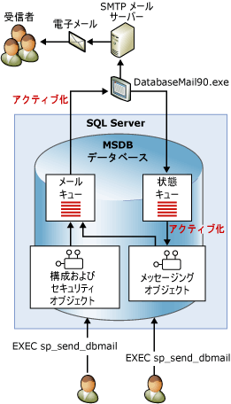

# データベース メール
[!INCLUDE[appliesto-ss-asdbmi-xxxx-xxx-md](../../includes/appliesto-ss-asdbmi-xxxx-xxx-md.md)]
  データベース メールは、[!INCLUDE[ssDEnoversion](../../includes/ssdenoversion-md.md)] または [Azure SQL Database Managed Instance](https://docs.microsoft.com/azure/sql-database/sql-database-managed-instance-index) から電子メール メッセージを送信するためのエンタープライズ ソリューションです。 データベース メールを使用すると、データベース アプリケーションからユーザーに電子メールを送信できます。 メッセージにはクエリ結果を含めることができ、ネットワーク上にあるリソースのファイルも含めることができます。  
  
> [!NOTE] 
> データベース メールは、Azure SQL Database シングルトンおよびエラスティック プールではなく、[!INCLUDE[ssDEnoversion](../../includes/ssdenoversion-md.md)] および [Azure SQL Database Managed Instance](https://docs.microsoft.com/azure/sql-database/sql-database-managed-instance-index) で使用できます。 

##  データベース メールの使用の利点  
 データベース メールは、信頼性、スケーラビリティ、セキュリティ、およびサポート性を念頭に置いて設計されています。  
  
### [信頼性]  
  
-   データベース メールでは、標準的な簡易メール転送プロトコル (SMTP) を使用してメールを送信します。 [!INCLUDE[ssNoVersion](../../includes/ssnoversion-md.md)]を実行するコンピューターに拡張 MAPI クライアントをインストールしなくても、データベース メールを使用できます。  
  
-   プロセスの分離。 [!INCLUDE[ssNoVersion](../../includes/ssnoversion-md.md)]への影響を最小限にするために、電子メールを配信するコンポーネントは [!INCLUDE[ssNoVersion](../../includes/ssnoversion-md.md)]外部の別個のプロセスで実行されます。 [!INCLUDE[ssNoVersion](../../includes/ssnoversion-md.md)] は、外部プロセスが停止または失敗しても、電子メールのキューを続行します。 キューに登録されたメッセージは、外部プロセスまたは SMTP サーバーがオンラインになると送信されます。  
  
-   フェールオーバー アカウント。 データベース メール プロファイルを使用すると、複数の SMTP サーバーを指定できます。 ある SMTP サーバーが使用できない場合は、別の SMTP サーバーにメールを配信できます。  
  
-   クラスター サポート。 データベース メールはクラスターに対応しており、クラスターで完全にサポートされています。  
  
### スケーラビリティ  
  
-   バックグラウンド配信: データベース メールでは、バックグラウンドまたは非同期の配信が提供されています。 **sp_send_dbmail** を呼び出してメッセージを送信すると、データベース メールによって [!INCLUDE[ssSB](../../includes/sssb-md.md)] のキューに要求が追加されます。 ストアド プロシージャが直ちに返されます。 外部の電子メール コンポーネントが要求を受信し、電子メールを配信します。  
  
-   複数のプロファイル: データベース メールを使用すると、[!INCLUDE[ssNoVersion](../../includes/ssnoversion-md.md)] インスタンス内に複数のプロファイルを作成できます。 オプションで、メッセージを送信するときにデータベース メールが使用するプロファイルを選択できます。  
  
-   複数のアカウント: 各プロファイルに、複数のフェールオーバー アカウントを含めることができます。 別々のアカウントを持つ別々のプロファイルを構成して、複数の電子メール サーバーで電子メールを配信できます。  
  
-   64 ビット互換性: データベース メールは、[!INCLUDE[ssNoVersion](../../includes/ssnoversion-md.md)] の 64 ビット インストールで完全にサポートされています。  
  
### Security  
  
-   既定でオフ: [!INCLUDE[ssNoVersion](../../includes/ssnoversion-md.md)] の外部からのアクセスを縮小するために、データベース メールのストアド プロシージャは既定で無効になっています。  
  
-   メールのセキュリティ: データベース メールを送信するには、 **msdb** データベースの **DatabaseMailUserRole** データベース ロールのメンバーである必要があります。  
  
-   プロファイル セキュリティ: データベース メールでは、メール プロファイルにセキュリティが適用されます。 データベース メール プロファイルにアクセスする **msdb** データベース ユーザーまたはグループを選択することによって、 特定のユーザーまたは **msdb**のすべてのユーザーにアクセスを許可できます。 プライベート プロファイルでは、指定した一覧のユーザーにアクセスが制限されます。 パブリック プロファイルは、データベースのすべてのユーザーがアクセスできます。  
  
-   添付ファイル サイズ ガバナー: データベース メールでは、添付ファイル サイズの制限を構成できます。 この制限は、 [sysmail_configure_sp](../../relational-databases/system-stored-procedures/sysmail-configure-sp-transact-sql.md) ストアド プロシージャを使用して変更できます。  
  
-   禁止するファイル拡張子: データベース メールでは、禁止するファイル拡張子の一覧が保持されます。 ユーザーは、一覧に含まれている拡張子を持つファイルを添付できません。 この一覧は、sysmail_configure_sp を使用して変更できます。  
  
-   データベース メールは、 [!INCLUDE[ssNoVersion](../../includes/ssnoversion-md.md)] エンジン サービス アカウントで実行されます。 フォルダー内のファイルを電子メールに添付するには、 [!INCLUDE[ssNoVersion](../../includes/ssnoversion-md.md)] エンジンのアカウントに、対象ファイルのあるフォルダーへのアクセス権限が必要です。  
  
### サポート性  
  
-   統合された構成: データベース メールでは、電子メール アカウントの情報が [!INCLUDE[ssDEnoversion](../../includes/ssdenoversion-md.md)]に保存されます。 外部クライアント アプリケーションでメール プロファイルを管理する必要はありません。 データベース メール構成ウィザードでは、データベース メールを構成するための便利なインターフェイスが提供されています。 また、 [!INCLUDE[tsql](../../includes/tsql-md.md)]を使用して、データベース メール構成を作成および維持することもできます。  
  
-   ログ記録。 電子メールの利用状況は、 [!INCLUDE[ssNoVersion](../../includes/ssnoversion-md.md)]、Microsoft Windows アプリケーション イベント ログ、および **msdb** データベースのテーブルに記録されます。  
  
-   監査: データベース メールでは、送信したメッセージおよび添付ファイルのコピーが **msdb** データベースに保存されます。 データベース メールの利用状況の監査や、保存されているメッセージの確認を簡単に行うことができます。  
  
-   HTML のサポート: データベース メールを使用すると、HTML 形式の電子メールを送信できます。  
  
  
##  データベース メールのアーキテクチャ  
 データベース メールは、Service Broker テクノロジを使用するキュー アーキテクチャを基に設計されています。 ユーザーが **sp_send_dbmail**を実行すると、アイテムがメール キューに挿入され、電子メール メッセージを格納したレコードが作成されます。 メール キューに新しいエントリが挿入されると、データベース メールの外部プロセス (DatabaseMail.exe) が起動します。 外部プロセスは、電子メール情報を読み取り、電子メール メッセージを適切な電子メール サーバーに送信します。 また、送信操作の結果の状態キューにアイテムを挿入します。 状態キューに新しいエントリが挿入されると、電子メール メッセージの状態を更新する内部ストアド プロシージャが起動します。 データベース メールは、システム テーブルに送信済み (または未送信) の電子メール メッセージを格納するだけでなく、電子メールの添付ファイルも記録します。 データベース メール ビューには、トラブルシューティングのためにメッセージの状態が表示されます。また、ストアド プロシージャにより、データベース メール キューの管理が可能になります。  
  
   
  
  
##  データベース メールのコンポーネントの概要  
 データベース メールは次に示す主要なコンポーネントで構成されています。  
  
-   構成およびセキュリティ関連コンポーネント  
  
     データベース メールは、 **msdb** データベースに構成情報とセキュリティ情報を格納します。 構成オブジェクトおよびセキュリティ オブジェクトは、データベース メールで使用されるプロファイルおよびアカウントを作成します。  
  
-   メッセージング関連コンポーネント  
  
     **msdb** データベースは、データベース メールでの電子メール送信に使用されるメッセージング オブジェクトを保持するメール ホスト データベースとして機能します。 これらのオブジェクトには、 **sp_send_dbmail** ストアド プロシージャと、メッセージに関する情報を格納するデータ構造が含まれています。  
  
-   データベース メール実行可能ファイル  
  
     データベース メール実行可能ファイルは、 **msdb** データベース内のキューからメッセージを読み取り、電子メール サーバーにメッセージを送信する外部プログラムです。  
  
-   ログおよび監査関連コンポーネント  
  
     データベース メールは、 **msdb** データベースおよび [!INCLUDE[msCoName](../../includes/msconame-md.md)] Windows アプリケーション イベント ログにログ情報を記録します。  
  
 **データベース メールを使用するためのエージェントの構成:**  
  
 SQL Server エージェントは、データベース メールを使用するように構成できます。 警告通知およびジョブ完了時の自動通知には、この構成が必要です。  
  
> [!WARNING]  
>  また、ジョブ内の個別のジョブ ステップでは、データベース メールを使用するように [!INCLUDE[ssNoVersion](../../includes/ssnoversion-md.md)] エージェントを構成しなくても、電子メールを送信できます。 たとえば、 [!INCLUDE[tsql](../../includes/tsql-md.md)] ジョブ ステップでは、データベース メールを使用してクエリ結果を受信者の一覧に送信できます。  
  
 [!INCLUDE[ssNoVersion](../../includes/ssnoversion-md.md)] エージェントを構成して、次のような場合に電子メール メッセージが指定のオペレーターに送信されるように設定できます。  
  
-   警告が発生した場合。 特定のイベントが発生したときに電子メールによる通知を送信するように警告を構成できます。 たとえば、すぐに対処しなければならない可能性がある特定のデータベース イベントまたはオペレーティング システムの状態がオペレーターに通知されるように、警告を構成できます。 警告の構成の詳細については、「 [警告](../../ssms/agent/alerts.md)」を参照してください。  
  
-   データベースのバックアップやレプリケーション イベントなどの定期タスクが成功または失敗したとき。 たとえば、[!INCLUDE[ssNoVersion](../../includes/ssnoversion-md.md)] エージェント メールを使用して、月末に実行する処理でエラーが発生した場合にオペレーターに通知できます。  
  
  
##   参照  
  
-   [データベース メール構成オブジェクト](../../relational-databases/database-mail/database-mail-configuration-objects.md)  
  
-   [データベース メール メッセージング オブジェクト](../../relational-databases/database-mail/database-mail-messaging-objects.md)  
  
-   [データベース メール外部プログラム](../../relational-databases/database-mail/database-mail-external-program.md)  
  
-   [データベース メールのログ記録と監査](../../relational-databases/database-mail/database-mail-log-and-audits.md)  
  
-   [データベース メールを使用するように SQL Server エージェント メールを構成する](../../relational-databases/database-mail/configure-sql-server-agent-mail-to-use-database-mail.md)  
  
  
  
