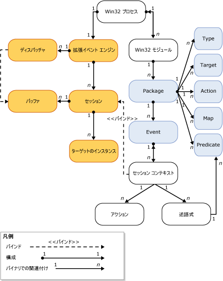

# SQL Server 拡張イベント エンジン
[!INCLUDE[tsql-appliesto-ss2014-asdb-xxxx-xxx_md](../../includes/tsql-appliesto-ss2014-asdb-xxxx-xxx-md.md)]

  [!INCLUDE[ssNoVersion](../../includes/ssnoversion-md.md)] 拡張イベント エンジンは、次の役割を持った各種のサービスおよびオブジェクトで構成されます。  
  
-   イベントの定義を有効にする。  
  
-   イベント データの処理を有効にする。  
  
-   システム内の拡張イベント サービスとオブジェクトを管理する。  
  
-   拡張イベント セッションのリストを保持し、そのリストへのアクセスを管理する。  
  
 拡張イベント エンジンそのものは、イベントまたはイベント発生時のアクションを一切提供しません。 拡張イベント エンジンとの対話は、エンジンを使用するプロセスによって定義されます。 これらのプロセスによって、イベント ポイントが追加され、イベントの発生時に実行されるアクションが指定されます。  
  
 拡張イベント セッションの概略図を次に示します。 詳細については、「 [SQL Server 拡張イベント セッション](../../relational-databases/extended-events/sql-server-extended-events-sessions.md)」を参照してください。  
  
   
  
 次のことを考慮してください。  
  
-   各 Windows プロセスは、1 つまたは複数のモジュール (**Win32 プロセス**、 **Win32 モジュール**) を持つ場合があります。 これらは、 *バイナリ* または *実行可能モジュール*とも呼ばれます。  
  
-   各 Windows プロセス モジュールには、1 つまたは複数の拡張イベント パッケージ (**Package**) が含まれる場合があります。拡張イベント パッケージには、1 つまたは複数の拡張イベント オブジェクト (**Type**、 **Target**、 **Action**、 **Map**、 **Predicate**、および **Event**) が含まれます。  
  
-   ホスト プロセス内に存在できる拡張イベント エンジン (**Extended event engine**) のインスタンスは 1 つだけです。拡張イベント エンジンのインスタンスは次の処理を実行します。  
  
    -   セッション関連の処理を管理する (セッションの列挙など)。  
  
    -   ディスパッチを処理する (**Dispatcher**)。 これはスレッド プールに似ています。  
  
    -   イベントのメモリ バッファー (**Buffer**) を処理する。 バッファーがいっぱいになると、そのバッファーがターゲットにディスパッチされます。  
  
-   セッションが作成された後、イベントは必要に応じてセッション (**Session context**) にバインドされます。  
  
    -   場合によっては、ターゲットのインスタンス (**Target instance**) も作成されてセッションに追加されます。  
  
    -   バッファーがいっぱいになると、そのバッファーがターゲットにディスパッチされます。  
  
## 参照  
 [拡張イベント](../../relational-databases/extended-events/extended-events.md)  
  
  
