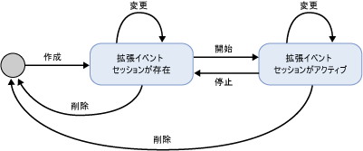
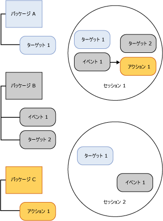

# SQL Server 拡張イベント セッション

[!INCLUDE[appliesto-ss-asdb-xxxx-xxx-md](../../includes/appliesto-ss-asdb-xxxx-xxx-md.md)]

  [!INCLUDE[ssNoVersion](../../includes/ssnoversion-md.md)] 拡張イベント セッションは、拡張イベント エンジンをホストしている [!INCLUDE[ssNoVersion](../../includes/ssnoversion-md.md)] プロセス内で作成されます。 拡張イベント インフラストラクチャとその全体的な処理を理解するには、拡張イベント セッションの次の側面に注目します。  
  
-   セッション状態。 CREATE EVENT SESSION ステートメントおよび ALTER EVENT SESSION ステートメントを実行したときの拡張イベント セッションの各種の状態を表します。  
  
-   セッションの内容と特性。 拡張イベント セッションの内容 (ターゲット、イベントなど) と、これらのオブジェクトがセッション内またはセッション間でどのように関係しているかを表します。  
  
## セッション状態  
 拡張イベント セッションの各種の状態を次の図に示します。  
  
   
  
 前の図を見ると、イベント セッションに対して異なる DDL コマンドが発行されたときに、セッション状態が変化していることがわかります。 このような状態の変化について次の表で説明します。  
  
|図ラベル|DDL ステートメント|[説明]|  
|------------------------|-------------------|-----------------|  
|作成|CREATE EVENT SESSION|CREATE EVENT SESSION によって提供されたメタデータを含むセッション オブジェクトがホスト プロセスによって作成されます。 ホスト プロセスは、セッション定義を検証し、ユーザーの権限レベルを検証した後、メタデータを master データベースに格納します。 このときセッションはまだアクティブではありません。|  
|Alter|ALTER EVENT SESSION, STATE=START|ホスト プロセスによってセッションが開始されます。 ホスト プロセスは、格納されているメタデータを読み取って、セッション定義を検証し、ユーザーの権限レベルを検証して、セッションを作成します。 イベントやターゲットなどのセッション オブジェクトが読み込まれ、イベント処理がアクティブになります。|  
|Alter|ALTER EVENT SESSION, STATE=STOP|ホスト プロセスによってアクティブなセッションが停止されます。ただし、メタデータは保持されます。|  
|Drop|DROP EVENT SESSION|Drop (DROP SESSION) では、セッションがアクティブかどうかに応じて、セッションのメタデータを削除するか、メタデータを削除した上でアクティブなセッションを終了します。|  
  
> [!NOTE]  
>  ALTER EVENT SESSION と DROP EVENT SESSION は、メタデータに適用される場合と、アクティブ セッションとメタデータに適用される場合とがあります。  
  
## セッションの内容と特性  
 拡張イベント セッションには暗黙的な境界があり、あるセッションの構成によって、別のセッションの構成が変更されることはありません。 ただし、イベントまたはターゲットを複数のセッションで使用することは可能です。  
  
 次の図は、セッションの内容、およびパッケージとセッションの関係を示しています。  
  
   
  
 次の点に注目してください。  
  
-   パッケージ オブジェクトとセッション間のマッピングが多対多である。これは、1 つのオブジェクトが複数のセッションに存在できること、および、1 つのセッションに複数のオブジェクトが存在できることを意味します。  
  
-   同じイベント (イベント 1) またはターゲット (ターゲット 1) を複数のセッションで使用できる。  
  
 セッションには次の特徴があります。  
  
-   アクションおよび述語は、セッション単位でイベントにバインドされる。 たとえば、アクション 1 および述語 Z を持つセッション A のイベント 1 は、アクション 2 とアクション 3 を持ち、述語を持たないセッション B のイベント 1 には一切影響しません。  
  
-   セッションには、バッファリングとディスパッチおよび因果関係の追跡を処理するためのポリシーがアタッチされる。  
  
 **バッファリングとディスパッチ**  
  
 バッファリングとは、イベント セッションの実行中にイベント データをどのように格納するかをいいます。  イベント データに使用するメモリ サイズやイベントの削除ポリシーは、バッファリング ポリシーによって指定されます。 ディスパッチとは、ターゲットによって処理される前のイベントがバッファー内に存続する時間のことです。  
  
 **因果関係の追跡**  
  
 因果関係の追跡は、複数のタスクにわたって作業を追跡する機能です。 因果関係の追跡を有効にした場合、発生したイベントには、それぞれシステム全体を通じて一意のアクティビティ ID が割り当てられます。 アクティビティ ID は、GUID 値 (特定のタスクに対して割り当てられ、すべてのイベントを通じて変化しない) とシーケンス番号 (イベントが発生するたびにインクリメントされる) の組み合わせです。 あるタスクが原因で別のタスクで作業が必要になった場合、親のアクティビティ ID が子のタスクに送信されます。 子のタスクは、イベントの初回発生時に親のアクティビティ ID を出力します。  
  
 拡張イベント アーキテクチャは、さまざまなオブジェクトを組み合わせて特定の問題を解決できる柔軟なシステムを提供します。  
  
## 参照  
 [拡張イベント](../../relational-databases/extended-events/extended-events.md)  
  
  
