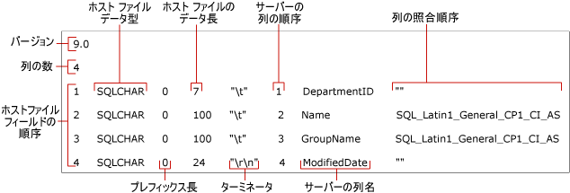

# <a name="non-xml-format-files-sql-server"></a>XML 以外のフォーマット ファイル (SQL Server)
[!INCLUDE[appliesto-ss-asdb-asdw-pdw-md](../../includes/appliesto-ss-asdb-asdw-pdw-md.md)]
  [!INCLUDE[ssCurrent](../../includes/sscurrent-md.md)]では、一括エクスポートおよび一括インポート用に 2 種類のフォーマット ファイルがサポートされています。 *XML 以外のフォーマット ファイル* と *XML フォーマット ファイル*です。  
  
 **このトピックの内容**  
  
-   [利点](#Benefits)  
  
-   [XML 以外のフォーマット ファイルの構造](#Structure)  
  
-   [XML 形式以外のフォーマット ファイルの例](#Examples)  
  
-   [関連タスク](#RelatedTasks)  
  
##  <a name="Benefits"></a> XML 以外のフォーマット ファイルの利点  
  
-   **bcp** コマンドの **format** オプションを指定することで、XML 以外のフォーマット ファイルを自動的に作成できます。  
  
-   **bcp** コマンドで既存のフォーマット ファイルを指定すると、フォーマット ファイルに記録された値がコマンドに使用されます。ファイルの保存形式、プレフィックス長、フィールド長、フィールド ターミネータの入力を求められることはありません。  
  
-   文字データやネイティブ データなど、特定のデータ型のフォーマット ファイルを作成できます。  
  
-   各データ フィールドに対話的に指定された属性を含む XML 以外のフォーマット ファイルを作成できます。 詳細については、「[bcp を使用した互換性のためのデータ形式の指定 &#40;SQL Server&#41;](../../relational-databases/import-export/specify-data-formats-for-compatibility-when-using-bcp-sql-server.md)」を参照してください。  
  
> [!NOTE]  
>  XML フォーマット ファイルには、XML 以外のフォーマット ファイルに比べていくつかの利点があります。 詳細については、「 [XML フォーマット ファイル &#40;SQL Server&#41;](../../relational-databases/import-export/xml-format-files-sql-server.md)です。  
  
##  <a name="Structure"></a> XML 以外のフォーマット ファイルの構造  
 XML 以外のフォーマット ファイルは、特定の構造を持つテキスト ファイルです。 XML 以外のフォーマット ファイルには、各テーブル列のファイル保存形式、プレフィックス長、フィールド長、およびフィールド ターミネータに関する情報が含まれています。  
  
 次の図は、XML 以外のフォーマット ファイルのサンプルの、フォーマット ファイル フィールドを示しています。  
  
 
  
 " **バージョン** " フィールドおよび " **列の数** " フィールドは XML 以外のフォーマット ファイルごとに 1 つだけ存在します。 次の表で、各フィールドの意味を説明します。  
  
|フォーマット ファイル フィールド|[説明]|  
|------------------------|-----------------|  
|バージョン|**bcp** ユーティリティのバージョン番号です。次の値があります。<br /><br /> 9.0 = [!INCLUDE[ssVersion2005](../../includes/ssversion2005-md.md)]<br /><br /> 10.0 = [!INCLUDE[ssKatmai](../../includes/sskatmai-md.md)]<br /><br /> 11.0 = [!INCLUDE[ssSQL11](../../includes/sssql11-md.md)]<br /><br /> 12.0 = [!INCLUDE[ssSQL14](../../includes/sssql14-md.md)]<br /><br /> このバージョン番号は **ではなく**bcp [!INCLUDE[tsql](../../includes/tsql-md.md)]だけで認識されます。<br /><br /> <br /><br /> 注:フォーマット ファイルの読み取りに使用される **bcp** ユーティリティ (Bcp.exe) のバージョンは、フォーマット ファイルの作成に使用されたバージョン、またはそれ以降のバージョンである必要があります。 たとえば、[!INCLUDE[ssSQL11](../../includes/sssql11-md.md)] の **bcp** では、[!INCLUDE[ssKatmai](../../includes/sskatmai-md.md)] の **bcp** によって生成されるバージョン 10.0 のフォーマット ファイルを読み取ることができますが、[!INCLUDE[ssKatmai](../../includes/sskatmai-md.md)] の **bcp** では、[!INCLUDE[ssSQL14](../../includes/sssql14-md.md)] の **bcp** によって生成されるバージョン 12.0 のフォーマット ファイルを読み取ることができません。|  
|列の数|データ ファイルのフィールドの数。 この数は、すべての行で同じである必要があります。|  
  
 他のフォーマット ファイル フィールドには、一括インポートまたは一括エクスポートされるデータ フィールドが記述されます。 各データ フィールドは、フォーマット ファイル内に個別の行を必要とします。 フォーマット ファイルの各行には、次の表で示すフォーマット ファイル フィールドの値が含まれます。  
  
|フォーマット ファイル フィールド|[説明]|  
|------------------------|-----------------|  
|**ホスト ファイル フィールドの順序**|データ ファイル内の各フィールドの位置を示す番号。 行の最初のフィールドは 1 になり、それ以降のフィールドにも順番に番号が付けられます。|  
|**ホスト ファイル データ型**|データ ファイルの特定のフィールドに格納されているデータ型。 ASCII データ ファイルでは、SQLCHAR を使用します。ネイティブ形式のデータ ファイルでは、既定のデータ型を使用します。 詳細については、「 [bcp を使用したファイル ストレージ型の指定 &#40;SQL Server&#41;](../../relational-databases/import-export/specify-file-storage-type-by-using-bcp-sql-server.md)」を参照してください。|  
|**プレフィックス長**|フィールドのプレフィックス長文字の数。 有効なプレフィックス長は、0、1、2、4、および 8 です。 プレフィックス長を指定しない場合は 0 を設定します。 フィールドに NULL データ値が含まれる場合には、プレフィックス長を指定する必要があります。 詳細については、「 [bcp を使用したデータ ファイルのプレフィックス長の指定 &#40;SQL Server&#41;](../../relational-databases/import-export/specify-prefix-length-in-data-files-by-using-bcp-sql-server.md)」を参照してください。|  
|**ホスト ファイルのデータ長**|データ ファイルの特定フィールドに格納されるデータ型の最大バイト数。<br /><br /> 区切り形式のテキスト ファイル用に XML 以外のフォーマット ファイルを作成する場合、各データ フィールドのホスト ファイルのデータ長に 0 を指定できます。 プレフィックス長が 0 で、ターミネータが含まれている、区切り形式のテキスト ファイルをインポートする場合、フィールドで使用されるストレージ領域のサイズはデータにターミネータを加えた長さであるため、フィールド長の値は無視されます。<br /><br /> 詳細については、「 [bcp を使用したフィールド長の指定 &#40;SQL Server&#41;](../../relational-databases/import-export/specify-field-length-by-using-bcp-sql-server.md)」を参照してください。|  
|**ターミネータ**|データ ファイルのフィールドを分割する区切り文字。 一般的なターミネータは、コンマ (,)、タブ (\t)、および行末 (\r\n) です。 詳細については、「 [フィールド ターミネータと行ターミネータの指定 &#40;SQL Server&#41;](../../relational-databases/import-export/specify-field-and-row-terminators-sql-server.md)」を参照してください。|  
|**サーバーの列の順序**|[!INCLUDE[ssNoVersion](../../includes/ssnoversion-md.md)] テーブルで列が表示される順序。 たとえば、データ ファイルの 4 番目のフィールドが、 [!INCLUDE[ssNoVersion](../../includes/ssnoversion-md.md)] テーブルの 6 番目の列にマップされる場合、4 番目のフィールドのサーバーの列の順序は 6 になります。<br /><br /> テーブル内の列がデータ ファイルからデータを受け取らないようにするには、サーバーの列の順序の値に 0 を設定します。|  
|**サーバーの列名**|[!INCLUDE[ssNoVersion](../../includes/ssnoversion-md.md)] テーブルからコピーされる列の名前。 フィールドの実際の名前は必要ありませんが、フォーマット ファイルのフィールドは空白にはできません。|  
|**列の照合順序**|データ ファイル内の文字データや Unicode データを格納するときに使用される照合順序。|  
  
> [!NOTE]  
>  フォーマット ファイルを変更して、フィールドの数や順序がテーブル列とは異なるデータ ファイルから一括インポートできます。 詳細については、このトピックの「 [関連タスク](#RelatedTasks) 」の一覧を参照してください。  
  
##  <a name="Examples"></a> XML 形式以外のフォーマット ファイルの例  
 次の例は、以前に作成された XML 以外のフォーマット ファイル (`myDepartmentIdentical-f-c.fmt`) を示しています。 このファイルには、 `HumanResources.Department` サンプル データベースの `AdventureWorks2012` テーブルの各列の文字データ フィールドが記述されています。  
  
 生成されるフォーマット ファイル `myDepartmentIdentical-f-c.fmt`には、次の情報が含まれます。  
  
```  
12.0  
4  
1       SQLCHAR       0       7       "\t"     1     DepartmentID     ""  
2       SQLCHAR       0       100     "\t"     2     Name             SQL_Latin1_General_CP1_CI_AS  
3       SQLCHAR       0       100     "\t"     3     GroupName        SQL_Latin1_General_CP1_CI_AS  
4       SQLCHAR       0       24      "\r\n"   4     ModifiedDate     ""  
```  
  
> [!NOTE]  
>  この XML 以外のフォーマット ファイルのサンプルに関連するフォーマット ファイル フィールドを示す図については、このトピックの「 [XML 以外のフォーマット ファイルの構造](#Structure)」を参照してください。  
  
##  <a name="RelatedTasks"></a> 関連タスク  
  
-   [フォーマット ファイルの作成 &#40;SQL Server&#41;](../../relational-databases/import-export/create-a-format-file-sql-server.md)  
  
-   [データの一括インポートでのフォーマット ファイルの使用 &#40;SQL Server&#41;](../../relational-databases/import-export/use-a-format-file-to-bulk-import-data-sql-server.md)  
  
-   [フォーマット ファイルを使用したテーブル列のスキップ &#40;SQL Server&#41;](../../relational-databases/import-export/use-a-format-file-to-skip-a-table-column-sql-server.md)  
  
-   [フォーマット ファイルを使用したデータ フィールドのスキップ &#40;SQL Server&#41;](../../relational-databases/import-export/use-a-format-file-to-skip-a-data-field-sql-server.md)  
  
-   [フォーマット ファイルを使用したテーブル列とデータ ファイル フィールドのマッピング &#40;SQL Server&#41;](../../relational-databases/import-export/use-a-format-file-to-map-table-columns-to-data-file-fields-sql-server.md)  
  
## <a name="see-also"></a>参照  
 [bcp ユーティリティ](../../tools/bcp-utility.md)   
 [フォーマット ファイルの作成 &#40;SQL Server&#41;](../../relational-databases/import-export/create-a-format-file-sql-server.md)   
 [XML フォーマット ファイル &#40;SQL Server&#41;](../../relational-databases/import-export/xml-format-files-sql-server.md)   
 [データのインポートまたはエクスポート用のフォーマット ファイル &#40;SQL Server&#41;](../../relational-databases/import-export/format-files-for-importing-or-exporting-data-sql-server.md)  
  
  
