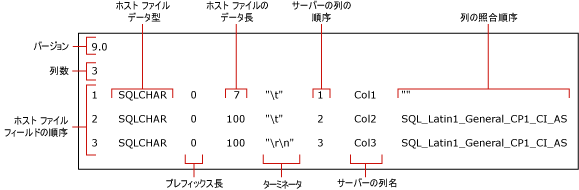

# <a name="use-a-format-file-to-skip-a-table-column-sql-server"></a>フォーマット ファイルを使用したテーブル列のスキップ (SQL Server)
[!INCLUDE[appliesto-ss-asdb-asdw-pdw-md](../../includes/appliesto-ss-asdb-asdw-pdw-md.md)]

この記事では、スキップされた列のデータがソース データ ファイルに存在しない場合に、フォーマット ファイルを使用してテーブル列のインポートをスキップする方法について説明します。 データ ファイルに含めることができるフィールドの数はインポート先のテーブルの列の数よりも少なくなります。つまり、インポート先のテーブルで次の 2 つの条件のうち少なくともどちらかが true である場合のみ、列のインポートをスキップすることができます。
-   スキップされる列が NULL 値である。
-   スキップされる列に既定値が含まれている。  
  
## <a name="sample-table-and-data-file"></a>サンプル テーブルとデータ ファイル  
 この記事の例は、**dbo** スキーマにある `myTestSkipCol` という名前のテーブルを想定しています。 このテーブルは *WideWorldImporters* や *AdventureWorks* などのサンプル データベース、またはその他の任意のデータベースで作成できます。 このテーブルは次のように作成します。  
  
```sql
USE WideWorldImporters;  
GO  
CREATE TABLE myTestSkipCol   
   (  
   Col1 smallint,  
   Col2 nvarchar(50) NULL,  
   Col3 nvarchar(50) not NULL  
   );  
GO  
```  
  
この記事の例では、サンプル データ ファイル `myTestSkipCol2.dat` も使用します。 インポート先のテーブルには 3 つの列が含まれていますが、このデータ ファイルには 2 つのフィールドしか含まれていません。

```  
1,DataForColumn3  
1,DataForColumn3  
1,DataForColumn3  
```  
  
## <a name="basic-steps"></a>基本的な手順

XML 以外のフォーマット ファイルまたは XML フォーマット ファイルを使用して、テーブル列をスキップすることができます。 どちらの場合も、次の 2 つの手順を行います。

1.   **bcp** コマンドライン ユーティリティを使用して、既定のフォーマット ファイルを作成します。

2.   テキスト エディターで、既定のフォーマット ファイルを変更します。

変更後のフォーマット ファイルで、存在するそれぞれのフィールドをインポート先のテーブルの対応する列にマップする必要があります。 どのテーブル列 (複数可) をスキップするかも指定する必要があります。 

たとえば、`myTestSkipCol2.dat` から `myTestSkipCol` テーブルにデータを一括インポートするには、フォーマット ファイルで最初のデータ フィールドを `Col1` にマップし、`Col2` をスキップして、2 番目のフィールドを `Col3` にマップする必要があります。  
 
## <a name="option-1---use-a-non-xml-format-file"></a>オプション #1 - XML 以外のフォーマット ファイルの使用  
  
### <a name="step-1---create-a-default-non-xml-format-file"></a>手順 #1 - XML 以外の既定のフォーマット ファイルの作成  
コマンド プロンプトで次の **bcp** コマンドを実行して、`myTestSkipCol` サンプル テーブル用に作成した、XML 以外の既定のフォーマット ファイルを作成します。  
  
```cmd
bcp WideWorldImporters..myTestSkipCol format nul -f myTestSkipCol_Default.fmt -c -T  
```  

> [!IMPORTANT]  
>  場合によっては、`-S` 引数で接続先サーバー インスタンスの名前を指定する必要があります。 また、`-U` と `-P` の引数を使用したユーザー名とパスワードの指定が必要な場合もあります。 詳細については、「 [bcp Utility](../../tools/bcp-utility.md)」を参照してください。  

上記のコマンドでは、 `myTestSkipCol_Default.fmt`という XML 以外のフォーマット ファイルを作成します。 このフォーマット ファイルは *bcp* で作成した形式なので、 **既定のフォーマット ファイル**といいます。 既定のフォーマット ファイルには、データ ファイル フィールドとテーブル列の一対一の対応が記述されます。  
  
 次のスクリーンショットに、この既定のフォーマット ファイルのサンプルで使用されている値を示します。 
  
   
  
> [!NOTE]  
>  フォーマット ファイル フィールドの詳細については、「[XML 以外のフォーマット ファイル &#40;SQL Server&#41;](../../relational-databases/import-export/non-xml-format-files-sql-server.md)」をご覧ください。  
  
### <a name="step-2---modify-a-non-xml-format-file"></a>手順 #2 - XML 以外のフォーマット ファイルの変更  
XML 以外の既定のフォーマット ファイルを変更するには、2 つの別の方法があります。 どちらの方法も、データ ファイルにデータ フィールドが存在しないこと、および対応するテーブル列にデータが挿入されないことを示します。

テーブル列をスキップするには、既定の XML 以外のフォーマット ファイルを編集し、そのファイルを以下のいずれかの方法で変更します。  

#### <a name="option-1---remove-the-row"></a>オプション #1 - 行の削除
列のスキップに推奨されている方法には、次の 3 つの手順が含まれています。

1.   まず、ソース データ ファイルに存在しないフィールドを記述しているフォーマット ファイルの行をすべて削除します。
2.   次に、削除したフォーマット ファイルの行に続く各行の "ホスト ファイル フィールドの順序" の値を減らします。 "ホスト ファイル フィールドの順序" の値が、データ ファイル内での各データ フィールドの実際の場所を反映した 1 ～ *n*の通し番号になるようにします。
3.   最後に、データ ファイル内の実際のフィールド数が反映されるように、"列の数" フィールドの値を減らします。  
  
次の例は、`myTestSkipCol` テーブルの既定のフォーマット ファイルに基づいています。 変更後のフォーマット ファイルは、最初のデータ フィールドを `Col1`にマップし、 `Col2`をスキップして、2 番目のデータ フィールドを `Col3`にマップしています。 `Col2` に相当する行は削除されています。 最初のフィールドの後ろの区切り記号も `\t` から `,` に変更されています。
  
```  
14.0  
2  
1       SQLCHAR       0       7       ","      1     Col1         ""  
2       SQLCHAR       0       100     "\r\n"   3     Col3         SQL_Latin1_General_CP1_CI_AS  
```  
  
#### <a name="option-2---modify-the-row-definition"></a>オプション #2 - 行定義の変更

スキップするテーブル列に対応するフォーマット ファイルの行の定義を変更することもできます。 変更するフォーマット ファイルの行は、"プレフィックス長"、"ホスト ファイルのデータ長"、および "サーバーの列の順序" の値を 0 に設定する必要があります。 さらに、"ターミネータ" および "列の照合順序" のフィールドを "" (つまり、空または NULL 値) に設定する必要があります。 "サーバーの列名" の値は、実際の列名が不要な場合でも、空でない文字列を指定する必要があります。 残りのフォーマット フィールドは既定値のままにしておく必要があります。  
  
次の例も、 `myTestSkipCol` テーブルの既定のフォーマット ファイルから作成しました。  
  
```  
14.0  
3  
1       SQLCHAR       0       7       ","      1     Col1         ""  
2       SQLCHAR       0       0       ""       0     Col2         ""  
3       SQLCHAR       0       100     "\r\n"   3     Col3         SQL_Latin1_General_CP1_CI_AS  
```  
  
### <a name="examples-with-a-non-xml-format-file"></a>XML 以外のフォーマット ファイルの例 
以下の例は、この記事で既に説明した `myTestSkipCol` サンプル テーブルおよび `myTestSkipCol2.dat` サンプル データ ファイルに基づいています。  
  
#### <a name="using-bulk-insert"></a>BULK INSERT の使用  
この例は、前のセクションの説明のとおりに作成した変更済みの XML 以外のフォーマット ファイルのいずれかを使用することで動作します。 この例では、変更後のフォーマット ファイルの名前を `myTestSkipCol2.fmt`とします。 `BULK INSERT` を使用して `myTestSkipCol2.dat` データ ファイルを一括インポートするには、SSMS で次のコードを実行します。 お使いのコンピューターのサンプル ファイルがある場所のファイル システム パスを更新します。
  
```sql  
USE WideWorldImporters;  
GO  
BULK INSERT myTestSkipCol   
   FROM 'C:\myTestSkipCol2.dat'   
   WITH (FORMATFILE = 'C:\myTestSkipCol2.fmt');  
GO  
SELECT * FROM myTestSkipCol;  
GO  
```  
  
## <a name="option-2---use-an-xml-format-file"></a>オプション #2 - XML フォーマット ファイルの使用  
  
### <a name="step-1---create-a-default-xml-format-file"></a>手順 #1 - 既定の XML フォーマット ファイルの作成   

コマンド プロンプトで次の **bcp** コマンドを実行して、`myTestSkipCol` サンプル テーブル用に作成した、既定の XML フォーマット ファイルを作成します。  
  
```cmd
bcp WideWorldImporters..myTestSkipCol format nul -f myTestSkipCol_Default.xml -c -x -T  
```  
  
> [!IMPORTANT]  
>  場合によっては、`-S` 引数で接続先サーバー インスタンスの名前を指定する必要があります。 また、`-U` と `-P` の引数を使用したユーザー名とパスワードの指定が必要な場合もあります。 詳細については、「 [bcp Utility](../../tools/bcp-utility.md)」を参照してください。  
 
上記のコマンドでは、`myTestSkipCol_Default.xml` という XML フォーマット ファイルを作成します。 このフォーマット ファイルは *bcp* で作成した形式なので、 **既定のフォーマット ファイル**といいます。 既定のフォーマット ファイルには、データ ファイル フィールドとテーブル列の一対一の対応が記述されます。  
  
```xml
<?xml version="1.0"?>  
<BCPFORMAT xmlns="https://schemas.microsoft.com/sqlserver/2004/bulkload/format" xmlns:xsi="http://www.w3.org/2001/XMLSchema-instance">  
 <RECORD>  
  <FIELD ID="1" xsi:type="CharTerm" TERMINATOR="\t" MAX_LENGTH="7"/>  
  <FIELD ID="2" xsi:type="CharTerm" TERMINATOR="\t" MAX_LENGTH="100" COLLATION="SQL_Latin1_General_CP1_CI_AS"/>  
  <FIELD ID="3" xsi:type="CharTerm" TERMINATOR="\r\n" MAX_LENGTH="100" COLLATION="SQL_Latin1_General_CP1_CI_AS"/>  
 </RECORD>  
 <ROW>  
  <COLUMN SOURCE="1" NAME="Col1" xsi:type="SQLSMALLINT"/>  
  <COLUMN SOURCE="2" NAME="Col2" xsi:type="SQLNVARCHAR"/>  
  <COLUMN SOURCE="3" NAME="Col3" xsi:type="SQLNVARCHAR"/>  
 </ROW>  
</BCPFORMAT>  
```  
  
> [!NOTE]  
>  XML フォーマット ファイルの構造については、「[XML フォーマット ファイル &#40;SQL Server&#41;](../../relational-databases/import-export/xml-format-files-sql-server.md)」をご覧ください。  

### <a name="step-2---modify-an-xml-format-file"></a>手順 #2 - XML フォーマット ファイルの変更

これは、`Col2` をスキップする、変更済みの XML フォーマット ファイル `myTestSkipCol2.xml` です。 `Col2` の `FIELD` と `ROW` のエントリが削除され、エントリの番号が変更されています。 最初のフィールドの後ろの区切り記号も `\t` から `,` に変更されています。

```xml
<?xml version="1.0"?>  
<BCPFORMAT xmlns="https://schemas.microsoft.com/sqlserver/2004/bulkload/format" xmlns:xsi="http://www.w3.org/2001/XMLSchema-instance">  
 <RECORD>  
  <FIELD ID="1" xsi:type="CharTerm" TERMINATOR="," MAX_LENGTH="7"/>  
  <FIELD ID="2" xsi:type="CharTerm" TERMINATOR="\r\n" MAX_LENGTH="100" COLLATION="SQL_Latin1_General_CP1_CI_AS"/>  
 </RECORD>  
 <ROW>  
  <COLUMN SOURCE="1" NAME="Col1" xsi:type="SQLSMALLINT"/>  
  <COLUMN SOURCE="2" NAME="Col3" xsi:type="SQLNVARCHAR"/>  
 </ROW>  
</BCPFORMAT>  
```  
 
### <a name="examples-with-an-xml-format-file"></a>XML フォーマット ファイルの例   
以下の例は、この記事で既に説明した `myTestSkipCol` サンプル テーブルおよび `myTestSkipCol2.dat` サンプル データ ファイルに基づいています。

`myTestSkipCol2.dat` から `myTestSkipCol` テーブルにデータをインポートするため、この例では変更した XML フォーマット ファイル `myTestSkipCol2.xml` を使用します。   
  
#### <a name="using-bulk-insert-with-a-view"></a>ビューでの BULK INSERT の使用  

XML フォーマット ファイルでは、**bcp** コマンドまたは `BULK INSERT` ステートメントを使用して直接テーブルにインポートする場合は、列をスキップできません。 ただし、テーブルの最後の列を除くすべての列にインポートできます。 最後の列を除く任意の列をスキップする必要がある場合、データ ファイルに含まれている列のみを含んでいる対象テーブルのビューを作成する必要があります。 その後、データ ファイルからビューにデータを一括インポートできます。  
  
次の例では、`myTestSkipCol` テーブルに `v_myTestSkipCol` ビューを作成します。 このビューでは 2 番目のテーブル列である `Col2`がスキップされます。 その後、 `BULK INSERT` を使用して `myTestSkipCol2.dat` データ ファイルをこのビューにインポートします。  
  
SSMS で、次のコードを実行します。 お使いのコンピューターのサンプル ファイルがある場所のファイル システム パスを更新します。 
  
```sql  
USE WideWorldImporters;  
GO  

CREATE VIEW v_myTestSkipCol AS  
    SELECT Col1,Col3  
    FROM myTestSkipCol;  
GO  
  
BULK INSERT v_myTestSkipCol  
FROM 'C:\myTestSkipCol2.dat'  
WITH (FORMATFILE='C:\myTestSkipCol2.xml');  
GO  
```  

#### <a name="using-openrowsetbulk"></a>OPENROWSET(BULK...) の使用  

`OPENROWSET(BULK...)` を使用してテーブル列をスキップするために XML フォーマット ファイルを使用するには、次のように選択リストおよび対象テーブルの列リストを明示的に指定する必要があります。  
  
    ```sql
    INSERT ...<column_list> SELECT <column_list> FROM OPENROWSET(BULK...) 
    ```

次の例では、 `OPENROWSET` 一括行セット プロバイダーと `myTestSkipCol2.xml` フォーマット ファイルを使用します。 この例では、 `myTestSkipCol2.dat` データ ファイルを `myTestSkipCol` テーブルに一括インポートします。 必要に応じて、ステートメントでは、選択リストおよびターゲット テーブルの列の一覧を明示的に指定します。  
  
SSMS で、次のコードを実行します。 お使いのコンピューターのサンプル ファイルがある場所のファイル システム パスを更新します。
  
```sql  
USE WideWorldImporters;  
GO  
INSERT INTO myTestSkipCol  
  (Col1,Col3)  
    SELECT Col1,Col3  
      FROM  OPENROWSET(BULK  'C:\myTestSkipCol2.Dat',  
      FORMATFILE='C:\myTestSkipCol2.Xml'    
       ) as t1 ;  
GO  
```

## <a name="see-also"></a>参照  
 [bcp Utility](../../tools/bcp-utility.md)   
 [BULK INSERT &#40;Transact-SQL&#41;](../../t-sql/statements/bulk-insert-transact-sql.md)   
 [OPENROWSET &#40;Transact-SQL&#41;](../../t-sql/functions/openrowset-transact-sql.md)   
 [フォーマット ファイルを使用したデータ フィールドのスキップ &#40;SQL Server&#41;](../../relational-databases/import-export/use-a-format-file-to-skip-a-data-field-sql-server.md)   
 [フォーマット ファイルを使用したテーブル列とデータ ファイル フィールドのマッピング &#40;SQL Server&#41;](../../relational-databases/import-export/use-a-format-file-to-map-table-columns-to-data-file-fields-sql-server.md)   
 [データの一括インポートでのフォーマット ファイルの使用 &#40;SQL Server&#41;](../../relational-databases/import-export/use-a-format-file-to-bulk-import-data-sql-server.md)  
  
  
