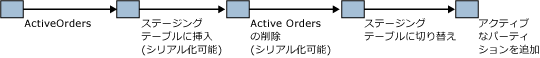

# <a name="application-pattern-for-partitioning-memory-optimized-tables"></a>メモリ最適化テーブルのパーティション分割に関するアプリケーションのパターン
[!INCLUDE[appliesto-ss-asdb-xxxx-xxx-md](../../includes/appliesto-ss-asdb-xxxx-xxx-md.md)]

  [!INCLUDE[hek_2](../../includes/hek-2-md.md)] は、限られた量のアクティブなデータがメモリ最適化テーブルに保持される一方、アクセス頻度の低いデータはディスクで処理される、というパターンをサポートします。 通常、これはデータが **datetime** キーに基づいて格納されるシナリオです。  
  
 パーティション テーブルとメモリ最適化テーブルを共通のスキーマで維持することで、メモリ最適化テーブルでパーティション テーブルをエミュレートすることができます。 アクセス頻度の少ないデータが従来のパーティション テーブルに保持される一方、現在のデータはメモリ最適化テーブルに挿入されて更新されます。  
  
 アクティブなデータがメモリ最適化テーブルに存在することを認識するアプリケーションは、ネイティブ コンパイル ストアド プロシージャを使用してデータにアクセスできます。 データの範囲全体にアクセスする必要がある操作、つまりどのテーブルに関連データが保持されているかを認識できない操作では、解釈された [!INCLUDE[tsql](../../includes/tsql-md.md)] を使用して、メモリ最適化テーブルとパーティション テーブルが結合されます。  
  
 このパーティション切り替えは、次のように行われます。  
  
-   場合によっては基準日を使用して、インメモリ OLTP テーブルのデータをステージング テーブルに挿入します。  
  
-   メモリ最適化テーブルから同じデータを削除します。  
  
-   ステージング テーブルでスワップします。  
  
-   アクティブなパーティションを追加します。  
  
   
アクティブなデータの管理  
  
 ActiveOrders の削除で始まる操作は、データの削除とステージング テーブルでの切り替えの間のクエリのデータ欠落を回避するために、メンテナンス期間中に実行する必要があります。  
  
 関連サンプルについては、「 [アプリケーション レベルのパーティション分割](../../relational-databases/in-memory-oltp/application-level-partitioning.md)」を参照してください。  
  
## <a name="code-sample"></a>コード サンプル  
 次の例は、メモリ最適化テーブルとディスク ベースのパーティション テーブルの使用方法を示しています。 頻繁に使用されるデータはメモリに格納されます。 ディスクにデータを保存するには、新しいパーティションを作成し、パーティション テーブルにデータをコピーします。  
  
 このサンプルの最初の部分では、データベースおよび必要なオブジェクトを作成します。 サンプルの 2 番目の部分では、メモリ最適化テーブルからパーティション テーブルにデータを移動する方法を示します。  
  
```sql  
CREATE DATABASE partitionsample;  
GO  
  
-- enable for In-Memory OLTP - change file path as needed  
ALTER DATABASE partitionsample
    ADD FILEGROUP partitionsample_mod
    CONTAINS MEMORY_OPTIMIZED_DATA;

ALTER DATABASE partitionsample
    ADD FILE(
        NAME = 'partitionsample_mod',
        FILENAME = 'c:\data\partitionsample_mod')
    TO FILEGROUP partitionsample_mod;  
GO  
  
USE partitionsample;  
GO  
  
-- frequently used portion of the SalesOrders - memory-optimized  
  
CREATE TABLE dbo.SalesOrders_hot (  
   so_id INT IDENTITY PRIMARY KEY NONCLUSTERED,  
   cust_id INT NOT NULL,  
   so_date DATETIME2 NOT NULL INDEX ix_date NONCLUSTERED,  
   so_total MONEY NOT NULL,  
   INDEX ix_date_total NONCLUSTERED (so_date desc, so_total desc)  
) WITH (MEMORY_OPTIMIZED=ON)  
GO  
  
-- cold portion of the SalesOrders - partitioned disk-based table  
CREATE PARTITION FUNCTION [ByDatePF](datetime2) AS RANGE RIGHT   
   FOR VALUES();  
GO  
  
CREATE PARTITION SCHEME [ByDateRange]   
   AS PARTITION [ByDatePF]   
   ALL TO ([PRIMARY]);  
GO  
  
CREATE TABLE dbo.SalesOrders_cold (  
   so_id INT NOT NULL,  
   cust_id INT NOT NULL,  
   so_date DATETIME2 NOT NULL,  
   so_total MONEY NOT NULL,  
   CONSTRAINT PK_SalesOrders_cold PRIMARY KEY (so_id, so_date),  
   INDEX ix_date_total NONCLUSTERED (so_date desc, so_total desc)  
) ON [ByDateRange](so_date)  
GO  
  
-- table for temporary partitions  
CREATE TABLE dbo.SalesOrders_cold_staging (  
   so_id INT NOT NULL,  
   cust_id INT NOT NULL,  
   so_date datetime2 NOT NULL,  
   so_total MONEY NOT NULL,  
   CONSTRAINT PK_SalesOrders_cold_staging PRIMARY KEY (so_id, so_date),  
   INDEX ix_date_total NONCLUSTERED (so_date desc, so_total desc),  
   CONSTRAINT CHK_SalesOrders_cold_staging CHECK (so_date >= '1900-01-01')  
)  
GO  
  
-- aggregate view of the hot and cold data  
CREATE VIEW dbo.SalesOrders  
AS SELECT so_id,  
          cust_id,  
          so_date,  
          so_total,  
          1 AS 'is_hot'  
       FROM dbo.SalesOrders_hot  
   UNION ALL  
   SELECT so_id,  
          cust_id,  
          so_date,  
          so_total,  
          0 AS 'is_hot'  
       FROM dbo.SalesOrders_cold;  
GO  
  
-- move all sales orders up to the split date to cold storage  
CREATE PROCEDURE dbo.usp_SalesOrdersOffloadToCold @splitdate datetime2  
   AS  
   BEGIN  
      BEGIN TRANSACTION;  
      -- create new heap based on the hot data to be moved to cold storage  
      INSERT INTO dbo.SalesOrders_cold_staging WITH( TABLOCKX)  
      SELECT so_id , cust_id , so_date , so_total  
         FROM dbo.SalesOrders_hot WITH ( serializable)  
         WHERE so_date <= @splitdate;  
  
      -- remove moved data  
      DELETE FROM dbo.SalesOrders_hot WITH( SERIALIZABLE)  
         WHERE so_date <= @splitdate;  
  
      -- update partition function, and switch in new partition  
      ALTER PARTITION SCHEME [ByDateRange] NEXT USED [PRIMARY];  
  
      DECLARE @p INT = (
        SELECT MAX(partition_number)
            FROM sys.partitions
            WHERE object_id = OBJECT_ID('dbo.SalesOrders_cold'));

      EXEC sp_executesql
        N'ALTER TABLE dbo.SalesOrders_cold_staging
            SWITCH TO dbo.SalesOrders_cold partition @i',
        N'@i int',
        @i = @p;  
  
      ALTER PARTITION FUNCTION [ByDatePF]()  
      SPLIT RANGE( @splitdate);  
  
      -- modify constraint on staging table to align with new partition  
      ALTER TABLE dbo.SalesOrders_cold_staging DROP CONSTRAINT CHK_SalesOrders_cold_staging;  
  
      DECLARE @s nvarchar( 100) = CONVERT( nvarchar( 100) , @splitdate , 121);  
      DECLARE @sql nvarchar( 1000) = N'alter table dbo.SalesOrders_cold_staging   
         add constraint CHK_SalesOrders_cold_staging check (so_date > ''' + @s + ''')';  
      PRINT @sql;  
      EXEC sp_executesql @sql;  
  
      COMMIT;  
END;  
GO  
  
-- insert sample values in the hot table  
INSERT INTO dbo.SalesOrders_hot VALUES(1,SYSDATETIME(), 1);   
GO  
  
INSERT INTO dbo.SalesOrders_hot VALUES(1, SYSDATETIME(), 1);  
GO  
  
INSERT INTO dbo.SalesOrders_hot VALUES(1, SYSDATETIME(), 1);  
GO  
  
-- verify contents of the table  
SELECT *  FROM dbo.SalesOrders;  
GO  
  
-- offload all sales orders to date to cold storage  
DECLARE  @t datetime2 = SYSDATETIME();  
EXEC dbo.usp_SalesOrdersOffloadToCold @t;  
  
-- verify contents of the tables  
SELECT * FROM dbo.SalesOrders;  
GO  
  
-- verify partitions  
SELECT OBJECT_NAME( object_id) , * FROM sys.dm_db_partition_stats ps  
   WHERE object_id = OBJECT_ID( 'dbo.SalesOrders_cold');  
  
-- insert more rows in the hot table  
INSERT INTO dbo.SalesOrders_hot VALUES(2, SYSDATETIME(), 1);  
GO  
  
INSERT INTO dbo.SalesOrders_hot VALUES(2, SYSDATETIME(), 1);  
GO  
  
INSERT INTO dbo.SalesOrders_hot VALUES(2, SYSDATETIME(), 1);  
GO  
  
-- verify contents of the tables  
SELECT * FROM dbo.SalesOrders;  
GO  
  
-- offload all sales orders to date to cold storage  
DECLARE @t datetime2 = SYSDATETIME();  
EXEC dbo.usp_SalesOrdersOffloadToCold @t;  
  
-- verify contents of the tables  
SELECT * FROM dbo.SalesOrders;  
GO  
  
-- verify partitions  
SELECT OBJECT_NAME( object_id) , partition_number , row_count  FROM sys.dm_db_partition_stats ps  
  WHERE object_id = OBJECT_ID( 'dbo.SalesOrders_cold') AND index_id = 1;  
```  
  
## <a name="see-also"></a>参照  
 [メモリ最適化テーブル](../../relational-databases/in-memory-oltp/memory-optimized-tables.md)  
  
  
