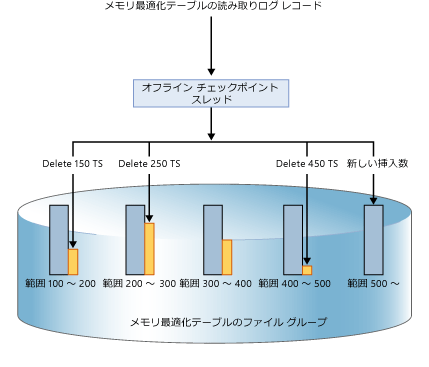
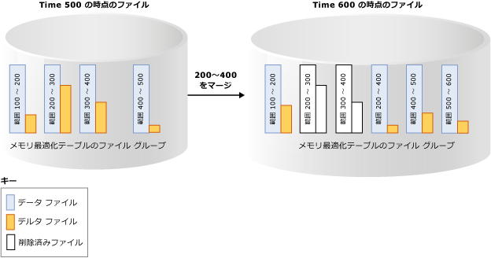

# メモリ最適化テーブルの持続性
[!INCLUDE[appliesto-ss-xxxx-xxxx-xxx-md](../../includes/appliesto-ss-xxxx-xxxx-xxx-md.md)]

  [!INCLUDE[hek_2](../../includes/hek-2-md.md)] により、メモリ最適化テーブルには完全な持続性が提供されます。 メモリ最適化テーブルを変更したトランザクションがコミットされると、基になるストレージが使用可能な場合、 [!INCLUDE[ssNoVersion](../../includes/ssnoversion-md.md)] では、(ディスク ベース テーブルの場合と同様に) この変更が永続的である (データベースの再起動後も保持される) ことが保証されます。 持続性には、トランザクション ログとディスク上ストレージでのデータ変更の保持という、2 つの主なコンポーネントがあります。  
  
 持続性のあるテーブルのサイズ制限の詳細については、「 [メモリ最適化テーブルのメモリ必要量の推定](../../relational-databases/in-memory-oltp/estimate-memory-requirements-for-memory-optimized-tables.md)」を参照してください。 
  
## トランザクション ログ  
 ディスク ベース テーブルまたは持続性のあるメモリ最適化テーブルに対するすべての変更は、1 つ以上のトランザクション ログ レコードにキャプチャされます。 トランザクションのコミット時に、 [!INCLUDE[ssNoVersion](../../includes/ssnoversion-md.md)] は、トランザクションに関連付けられているログ レコードをディスクに書き込んだ後、トランザクションによってコミットされたアプリケーションまたはユーザー セッションと通信します。 これにより、トランザクションによる変更が持続可能であることが保証されます。 メモリ最適化テーブルのトランザクション ログは、ディスク ベース テーブルで使用されている同じログ ストリームと完全に統合されています。 この統合によって、既存のトランザクション ログ バックアップ、復旧、および復元操作は引き続き機能し、追加の手順は必要ありません。 しかし、 [!INCLUDE[hek_2](../../includes/hek-2-md.md)] によりワークロードのトランザクションのスループットを大幅に向上できるため、ログ IO がパフォーマンスのボトルネックになる可能性があります。 このスループットの向上を維持するには、ログ IO サブシステムが負荷の増大に対応できることをご確認ください。  
  
## データ ファイルとデルタ ファイル  
 メモリ最適化テーブルのデータは、自由形式のデータ行としてインメモリ ヒープ データ構造で格納され、メモリ内の 1 つ以上のインデックスでリンクされます。 ディスク ベース テーブルで使用されるような、データ行のページ構造はありません。 長期間にわたって永続化するため、およびトランザクション ログを切り捨てることができるようにするため、メモリ最適化テーブルに対する操作は、一連のデータ ファイルとデルタ ファイルに保存されます。 これらのファイルは、非同期のバック グラウンド プロセスを使用して、トランザクション ログに基づいて生成されます。 データ ファイルとデルタ ファイルは 1 つ以上のコンテナーにあります (FILESTREAM データで使用される同様のメカニズムを使用しています)。 これらのコンテナーは、メモリ最適化ファイル グループの一部になります。  
  
 データはこれらのファイルに厳密な順次形式で書き込まれるため、スピン メディアの場合のディスク待機時間が最小限に抑えられます。 異なるディスクにある複数のコンテナーを使用して、I/O 動作を分散することもできます。 異なるディスクにある複数のコンテナーにデータ ファイルとデルタ ファイルを配置すると、データベースの復元/復旧時に、ディスク上のデータ ファイルとデルタ ファイルからメモリにデータが読み込まれるときのパフォーマンスが向上します。  
  
 ユーザー トランザクションは、直接データ ファイルとデルタ ファイルにアクセスしません。 すべてのデータ読み取りと書き込みには、インメモリ データ構造が使用されます。  
  
### データ ファイル  
 データ ファイルには、1 つ以上のメモリ最適化テーブルからの行が格納されます。これらの行は、INSERT 操作や UPDATE 操作の一部である複数のトランザクションによって挿入されたものです。 たとえば、ある行はメモリ最適化テーブル T1 から挿入され、次の行はメモリ最適化テーブル T2 から挿入されることがあります。 これらの行は、データ アクセスが順次的になるように、トランザクション ログ内のトランザクションの順序でデータ ファイルに追加されます。 これにより、ランダム I/O と比較した場合、I/O スループットが大幅に向上します。  
  
 データ ファイルがいっぱいになると、新しいトランザクションによって挿入される行は別のデータ ファイルに格納されます。 時間が経つにつれて、持続性のあるメモリ最適化テーブルの行を格納するデータ ファイルは増えていきます。データ ファイル間では、時間的に離れたトランザクションからの行が含まれることになりますが、1 つのデータ ファイル内のトランザクション範囲は連続しています。 たとえば、トランザクションのコミット タイムスタンプの範囲が (100, 200) であるデータ ファイルには、コミット タイムスタンプが 100 より大きく 200 以下のトランザクションによって挿入されたすべての行が含まれています。 コミット タイムスタンプとは、コミットの準備ができたトランザクションに割り当てられる、単調に増加する数値です。 各トランザクションには、一意のコミット タイムスタンプが設定されます。  
  
 行が削除または変更されるときは、その行がデータ ファイル内で実際に削除または変更されるのではなく、デルタ ファイルという別の種類のファイルによって、削除された行の追跡が行われます。 更新操作は、それぞれの行の削除操作と挿入操作の組み合わせとして処理されます。 これにより、データ ファイルでランダム IO が発生しないようになっています。  
 
   サイズ:各データ ファイルのサイズは、16 GB を超えるメモリを搭載するコンピューターでは約 128 MB、16 GB 以下のメモリを搭載するコンピューターでは約 16 MB になります。 [!INCLUDE[ssSQL15](../../includes/sssql15-md.md)] では、記憶域サブシステムが十分に高速と見なされる場合、SQL Server で大規模チェックポイント モードを使用できます。 大規模チェックポイント モードでは、データ ファイルのサイズは 1 GB になります。 この場合、高スループットのワークロードに関する記憶域サブシステムの効率を向上させることができます。  
   
### デルタ ファイル  
 各データ ファイルには、同じトランザクション範囲を持つデルタ ファイルが対応付けられています。デルタ ファイルは、そのトランザクション範囲のトランザクションによって挿入された削除済みの行を追跡します。 このデータ ファイルとデルタ ファイルはチェックポイント ファイル ペア (CFP) と呼ばれます。これは Merge 操作の単位であるとともに、割り当てと割り当て解除の単位でもあります。 たとえば、トランザクション範囲 (100、200) に対応するデルタ ファイルには、範囲 (100、200) のトランザクションによって挿入された削除済みの行が格納されます。 データ ファイルと同様に、デルタ ファイルは順次アクセスされます。  
  
 行の削除時には、データ ファイルから行が削除されるのではなく、その行への参照が、このデータ行が挿入されたトランザクション範囲に関連付けられているデルタ ファイルに追加されます。 削除対象のデータ行は既にデータ ファイルに存在するため、デルタ ファイルには参照情報 ( `{inserting_tx_id, row_id, deleting_tx_id }` ) が格納されるだけです。格納順序は、元の削除操作または更新操作のトランザクション ログの順序に従います。  
  

 サイズ:各デルタ ファイルのサイズは、16 GB を超えるメモリを搭載するコンピューターでは約 16 MB、16 GB 以下のメモリを搭載するコンピューターでは約 1 MB になります。 [!INCLUDE[ssSQL15](../../includes/sssql15-md.md)] 以降、記憶域サブシステムが十分に高速と見なされる場合、SQL Server で大規模チェックポイント モードを使用できます。 大規模チェックポイント モードでは、デルタ ファイルのサイズは 128 MB になります。  
 
## データ ファイルとデルタ ファイルの取り込み  
 データ ファイルとデルタ ファイルへのデータの取り込みは、メモリ最適化テーブルに対するコミットされたトランザクションが生成したトランザクション ログ レコードに基づいて行われ、挿入された行や削除された行に関する情報が適切なデータ ファイルとデルタ ファイルに追加されます。 ディスク ベース テーブルでは、チェックポイントの完了時にデータやインデックス ページがランダム I/O でフラッシュされますが、これとは異なり、メモリ最適化テーブルの永続化は連続的なバックグラウンド操作によって行われます。 トランザクションでは、それ以前のいずれかのトランザクションによって挿入された任意の行が削除または更新されることがあるため、複数のデルタ ファイルへのアクセスが発生します。 削除情報は常にデルタ ファイルの末尾に追加されます。 たとえば、下に示す図では、コミット タイムスタンプが 600 のトランザクションでは、1 つの新しい行が挿入され、コミット タイムスタンプが 150、250、および 450 のトランザクションによって挿入された行が削除されます。 4 つのファイル I/O 操作 (3 つは削除された行が対象で、1 つは新しく挿入された行が対象) はすべて、対応するデルタ ファイルとデータ ファイルに対する追加専用の操作です。  
  
   
  
## データ ファイルとデルタ ファイルへのアクセス  
 データ ファイルとデルタ ファイルのペアにアクセスするのは次のような場合です。  
  
 オフライン チェックポイント ワーカー  
 このスレッドでは、メモリ最適化データ行に対する挿入と削除を、対応するデータ ファイルとデルタ ファイルのペアに追加します。 [!INCLUDE[ssSQL14](../../includes/sssql14-md.md)] では、オフライン チェックポイント ワーカーは 1 つあります。 [!INCLUDE[ssSQL15](../../includes/sssql15-md.md)] 以降では、チェックポイント ワーカーは複数あります。  
  
 マージ操作  
 この操作では、1 つ以上のデータ ファイルとデルタ ファイルのペアをマージして、新しいデータ ファイルとデルタ ファイルのペアを作成します。  
  
 クラッシュ後の復旧の処理中  
 [!INCLUDE[ssNoVersion](../../includes/ssnoversion-md.md)] を再起動するか、データベースがオンラインに戻ると、データ ファイルとデルタ ファイルのペアを使用してメモリ最適化データが取り込まれます。 デルタ ファイルは、対応するデータ ファイルから行を読み取るときに、削除された行のフィルターとして機能します。 データ ファイルとデルタ ファイルのペアは独立しているため、データをメモリに取り込む時間を削減するために、これらのファイルは並列処理で読み込まれます。 データがメモリに読み込まれると、インメモリ OLTP エンジンは、メモリ最適化データが完全になるように、まだチェックポイント ファイルで扱われていないアクティブなトランザクション ログ レコードを適用します。  
  
 復元操作の処理中  
 インメモリ OLTP のチェックポイント ファイルはデータベースのバックアップから作成され、1 つ以上のトランザクション ログ バックアップが適用されます。 クラッシュ後の復旧の場合と同様に、インメモリ OLTP エンジンはデータを並列処理でメモリに読み込むので、復旧時間への影響を最小限に抑えることができます。  
  
## データ ファイルとデルタ ファイルのマージ  
 メモリ最適化テーブルのデータは、1 つ以上のデータ ファイルとデルタ ファイルのペア (チェックポイント ファイル ペアまたは CFP とも呼ばれます) に格納されます。 データ ファイルは挿入された行を格納し、デルタ ファイルは削除された行を参照します。 OLTP ワークロードの実行中、DML 操作によって行が更新、挿入、および削除されると、新しい行を保存するために新しい CFP が作成され、削除された行への参照がデルタ ファイルに追加されます。  
  
 DML 操作を行うと、時間と共に、データ ファイルとデルタ ファイルの数が増加するので、ディスク領域使用量が増え、復旧時間が長くなります。  
  
 効率の低下を防ぐために、閉じている前のデータ ファイルとデルタ ファイルは、後で説明するマージ ポリシーに基づいてマージされます。結果のストレージ配列は圧縮され、ファイルの数が少なくなりますが、データ セットは変わりません。  
  
 マージ操作は、内部で定義されているマージ ポリシーに基づいて、1 つ以上の閉じている隣接したチェックポイント ファイル ペア (CFP) を入力として受け取ります。この CFP (マージ ソースと呼ばれます) はデータ ファイルとデルタ ファイルのペアです。続いて、1 つの結果 CFP (マージ ターゲットと呼ばれます) を生成します。 ソース CFP の各デルタ ファイル内のエントリは、対応するデータ ファイルから行をフィルター選択して、不要なデータ行を削除するために使用されます。 ソース CFP の残りの行は、1 つのターゲット CPF に統合されます。 マージが完了すると、結果の CFP でソース CFP (マージ ソース) が置き換えられます。 マージ ソースの CFP は、移行フェーズを経た後でストレージから削除されます。  
  
 次の例では、メモリ最適化テーブルのファイル グループに、タイムスタンプが 500 の時点でデータ ファイルとデルタ ファイルのペアが 4 組あり、以前のトランザクションからのデータが含まれています。 たとえば、最初のデータ ファイルの行は、100 より大きく 200 以下のタイムスタンプを持つトランザクションに対応します。この範囲は (100, 200] と表すこともできます。 2 番目と 3 番目のデータ ファイルは、削除済みとしてマークされている行を考慮すると、入力率が 50% 未満になっています。 これらの 2 つの CFP をマージ操作で結合し、タイムスタンプが 200 より大きく 400 以下 (2 つのファイルの結合範囲) のトランザクションを含む新しい CFP を作成します。 すると、範囲が (500, 600] のもう 1 つの CFP と、トランザクション範囲が (200, 400] の空でないデルタ ファイルが現れます。これは、マージ操作と同時に、ソース CFP から他の行を削除するといったトランザクション アクティビティを実行できることを示しています。  
  
   
  
 バックグラウンド スレッドでは、閉じているすべての CFP がマージ ポリシーを使用して評価され、該当する CFP に対して 1 つ以上のマージ要求が開始されます。 これらのマージ要求は、オフライン チェックポイント スレッドによって処理されます。 マージ ポリシーの評価は定期的に実行され、チェックポイントが閉じられるときにも行われます。  
  
### [!INCLUDE[ssNoVersion](../../includes/ssnoversion-md.md)] マージ ポリシー  
 [!INCLUDE[ssNoVersion](../../includes/ssnoversion-md.md)] には、次のマージ ポリシーが実装されています。  
  
-   削除済みの行を考慮したうえで 2 つ以上の連続する CFP が統合でき、結果の行が目標サイズの 1 つの CFP に収まる場合、マージがスケジュールされます。 前述のように、データ ファイルとデルタ ファイルの目標サイズは元のサイズ設定に対応しています。  
  
-   データ ファイルが目標サイズの 2 倍を上回っており、半分以上の行が削除済みの場合は、単一の CFP を自己マージすることができます。 データ ファイルは目標サイズを上回る可能性があります。たとえば、1 つのトランザクションまたは複数の同時実行トランザクションが大量のデータの INSERT や UPDATE を実行する場合、1 つのトランザクションが複数の CFP にまたがることはできないため、目標サイズを上回ってデータ ファイルを拡張することが強制されます。  
  
 次に、マージ ポリシーに従った CFP のマージの例をいくつか示します。  
  
|隣接する CFP ソース ファイル (入力 %)|マージ対象|  
|-------------------------------------------|---------------------|  
|CFP0 (30%)、CFP1 (50%)、CFP2 (50%)、CFP3 (90%)|(CFP0、CFP1)   CFP2 は選択されません。これを含めると、結果のデータ ファイルが適切なサイズの 100% を超えることになります。|  
|CFP0 (30%)、CFP1 (20%)、CFP2 (50%)、CFP3 (10%)|(CFP0、CFP1、CFP2)。 ファイルは左から選択されます。   CTP3 は選択されません。これを含めると、結果のデータ ファイルが適切なサイズの 100% を超えることになります。|  
|CFP0 (80%)、CFP1 (30%)、CFP2 (10%)、CFP3 (40%)|(CFP1、CFP2、CFP3)。 ファイルは左から選択されます。   CFP0 はスキップされます。これを CFP1 と結合すると、結果のデータ ファイルが適切なサイズの 100% を超えることになるためです。|  
  
 空き領域のある CFP がすべてマージに適合するとは限りません。 たとえば、2 つの隣接する CFP の入力率が 60% の場合、これらはマージの対象にならないため、各 CFP の 40% のストレージは未使用になります。 最悪のケースは、すべての CFP の入力率が 50% になり、ストレージが 50% しか使用されない場合です。 CFP がマージ対象にならず、削除済みの行がストレージに存在していても、それらの削除済みの行は、インメモリ ガベージ コレクションによって既にメモリからは削除されている場合があります。 ストレージとメモリの管理は、ガベージ コレクションから独立しています。 アクティブな CFP (すべての CFP が更新されるわけではありません) から取得されたストレージは、最大でメモリ内の持続性のあるテーブルのサイズの 2 倍になる可能性があります。  
  
### CFP のライフ サイクル  
 CFP は、割り当てが解除されるまでにいくつかの状態を遷移します。 フェーズを辿ってファイルを遷移し、必要なくなったファイルを最終的にクリーンアップするには、データベースのチェックポイントとログのバックアップが必要です。 これらのフェーズの説明については、「[sys.dm_db_xtp_checkpoint_files &#40;Transact-SQL&#41;](../../relational-databases/system-dynamic-management-views/sys-dm-db-xtp-checkpoint-files-transact-sql.md)」を参照してください。  
  
 チェックポイントとその後のログのバックアップを手動で強制的に実行し、ガベージ コレクションを早めることができます。 実稼動環境のシナリオでは、バックアップ方法の一環として実行される自動チェックポイントとログ バックアップにより、CFP はこれらのフェーズをシームレスに移行し、手動による操作は必要ありません。 ガベージ コレクション プロセスが実行されると、その影響として、メモリ最適化テーブルのあるデータベースのストレージ サイズがメモリ内のサイズに比べて大きくなる可能性があります。 チェックポイントとログのバックアップを実行しないと、チェックポイント ファイルのディスク上の使用量は増え続けます。  
  
## 参照  
 [メモリ最適化オブジェクト用ストレージの作成と管理](../../relational-databases/in-memory-oltp/creating-and-managing-storage-for-memory-optimized-objects.md)  
  
  
