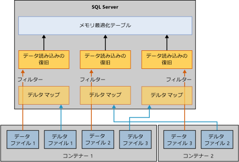

# メモリ最適化テーブルの復元と復旧
[!INCLUDE[appliesto-ss-xxxx-xxxx-xxx-md](../../includes/appliesto-ss-xxxx-xxxx-xxx-md.md)]

メモリ最適化テーブルを使用するデータベースを復旧または復元する基本的なメカニズムは、ディスク ベース テーブルのみを使用するデータベースのメカニズムに似ています。 ただし、ディスク ベース テーブルとは異なり、メモリ最適化テーブルは、データベースがユーザー アクセスに使用できるようになる前にメモリに読み込まれる必要があります。 この要件ではデータベース復旧の新しい手順が追加されます。  
  
サーバーに十分なメモリがない場合、データベースは復旧に失敗し、問題ありの印が付きます。 この問題を解決する方法については、「[メモリ不足の問題の解決](resolve-out-of-memory-issues.md)」を参照してください。 
  
## 読み込み時間に影響する要因
復旧操作または復元操作中に、インメモリ OLTP エンジンは物理メモリに読み込むためにデータ ファイルとデルタ ファイルを読み取ります。 読み込み時間は次の事項によって決まります。  
  
-   読み込むデータの量。  
  
-   シーケンシャル I/O 帯域幅。  
  
-   ファイル コンテナーの数およびプロセッサ コアの数によって決まる、並列処理の次数。  
  
-   再実行される必要があるログのアクティブな部分のログ レコードの数。  

## 復旧のフェーズ
[!INCLUDE[ssNoVersion](../../includes/ssnoversion-md.md)] が再起動すると、各データベースは次の 3 つのフェーズで構成される復旧プロセスを経由します:  
  
1.  **分析**。 このフェーズでは、コミットされたトランザクションとコミットされていないトランザクションを検出するために、アクティブなトランザクション ログにパスが行われます。 インメモリ OLTP エンジンは読み込むチェックポイントを識別し、システム テーブルのログ エントリを再度読み込みます。 また、ファイル割り当てログ レコードの一部を処理します。  
  
2.  **やり直し**。 このフェーズは、ディスク ベース テーブルおよびメモリ最適化テーブルで同時に実行されます。  
  
    - ディスク ベース テーブルの場合、データベースが現在の状態に移動され、コミットされていないトランザクションに使用されたロックを取得します。  
  
    - メモリ最適化テーブルの場合、データとデルタ ファイルのペアのデータがメモリに読み込まれます。 次に、最後の永続的なチェックポイントに基づくアクティブなトランザクション ログでデータが更新されます。  
  
    先行のディスク ベース テーブルおよびメモリ最適化テーブルでの操作が完了すると、データベースにアクセスできます。  
  
3.  **元に戻す**。 このフェーズでは、コミットされていないトランザクションはロールバックされます。  

## 読み込み時間を改善するためのプロセス
メモリ最適化テーブルをメモリに読み込むと、目標復旧時間 (RTO) のパフォーマンスに影響する可能性があります。 データ ファイルおよびデルタ ファイルからメモリ最適化データを読み込む時間を短縮するために、インメモリ OLTP エンジンは次のように並行してデータ ファイルおよびデルタ ファイルを読み込みます。  
  
-   **デルタ マップ フィルターの作成**。 デルタ ファイル ストアは、削除された行を参照します。 コンテナーごとに 1 行のスレッドがデルタ ファイルを読み取り、デルタ マップ フィルターを作成します。 (メモリ最適化データ ファイル グループには、1 つ以上のコンテナーを保持できます。)  
  
-   **データ ファイルのストリーミング**。 デルタ マップ フィルターが作成されると、データ ファイルは論理 CPU と同数のスレッドを使用して読み込まれます。 各スレッドはデータ行を読み込み、関連付けられたデルタ マップを確認し、この行が削除済みとしてマークされていない場合にのみ行をテーブルに挿入します。 復旧のこの部分は、以下の図で説明するように CPU バインドとなる場合があります。  
  
      
  
## 読み込み時間が遅くなる特定のケース
通常、メモリ最適化テーブルは I/O の速度でメモリに読み込むことができますが、データ行をメモリに読み込むときは時間がかかる場合があります。 特定の場合を次に示します:  
  
-   ハッシュ インデックスのバケット数が少ない場合は、過剰な競合が発生してデータ行の挿入に時間がかかる可能性があります。 通常、これは、特に復旧の最後にかけて、常に高い CPU 使用率において発生します。 ハッシュ インデックスを正しく構成していれば、復旧時間に影響することはありません。  
  
-   1 つまたは複数の非クラスター化インデックスを含む大きなメモリ最適化テーブルは、高い CPU 利用率の原因となる場合があります。 作成時にバケット数が測定されるハッシュ インデックスとは異なり、非クラスター化インデックスは動的に拡張します。  
  
## 参照  
 [メモリ最適化テーブルのバックアップ、復元、復旧](https://msdn.microsoft.com/library/3f083347-0fbb-4b19-a6fb-1818d545e281)  
  
  
