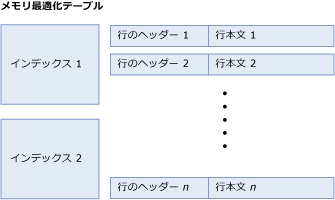
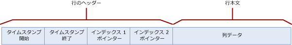
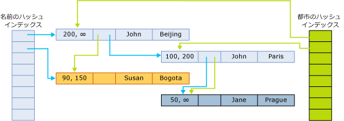

# <a name="table-and-row-size-in-memory-optimized-tables"></a>メモリ最適化テーブルのテーブルと行のサイズ
[!INCLUDE[appliesto-ss-asdb-xxxx-xxx-md](../../includes/appliesto-ss-asdb-xxxx-xxx-md.md)]

[!INCLUDE[ssSQL15](../../includes/sssql15-md.md)] より前のバージョンでは、メモリ最適化テーブルの行内データのサイズは、[8,060 バイト](https://msdn.microsoft.com/library/dn205318(v=sql.120).aspx)より長くすることができませんでした。 しかし、[!INCLUDE[ssSQL15](../../includes/sssql15-md.md)] 以降および Azure SQL Database では、複数の大きな列 (複数の varbinary(8000) 列など) および LOB 列 (varbinary(max)、varchar(max)、nvarchar(max)) を含むメモリ最適化テーブルを作成し、ネイティブにコンパイルされた T-SQL モジュールとテーブル型を使ってこれらの列に対する操作を実行できるようになっています。 
  
行サイズの上限である 8060 バイトを超える列は、行外の、個別の内部テーブルに配置されます。 行外の列ごとに対応する内部テーブルがあり、 それぞれの内部テーブルには非クラスター化インデックスが 1 つ含まれます。 行外の列に使用されるこれらの内部テーブルについて詳しくは、「[sys.memory_optimized_tables_internal_attributes &#40;Transact-SQL&#41;](../../relational-databases/system-catalog-views/sys-memory-optimized-tables-internal-attributes-transact-sql.md)」をご覧ください。 
 
行とテーブルのサイズを計算するとことが役に立つシナリオがあります。
  
-   テーブルが使用するメモリの量  
  
    -   テーブルで使用されるメモリの量は、正確に計算することはできません。 使用されるメモリの量には、多くの要因が影響します。 たとえば、ページ単位のメモリ割り当て、局所性、キャッシュ、余白などの要因です。 また、アクティブなトランザクションが関連付けられている行や、ガベージ コレクションを待機している行には複数のバージョンが存在します。  
  
    -   テーブル内のデータとインデックスに必要な最小サイズは、後で説明する [テーブル サイズ] (table size) の計算によって得られます。  
  
    -   メモリ使用量の計算で得られる値は、最善でも近似値です。配置プランにキャパシティ プランニングを含めることをお勧めします。  
  
-   行のデータ サイズと、そのデータ サイズが行サイズの上限である 8,060 バイト以下であるかどうか。 これを調べるには、以降に説明する行本文サイズ (row body size) の計算を使用します。  

メモリ最適化テーブルは、行のコレクションと、行へのポインターを格納するインデックスで構成されています。 次の図は、インデックスと行を含むテーブルを示しています。行には行ヘッダーと行本文が含まれています。  
  
  
インデックスと行で構成されたメモリ最適化テーブル。  

##  <a name="bkmk_TableSize"></a> テーブル サイズの計算
テーブルのメモリ内サイズ (バイト単位) は、次のように計算されます。  
  
```  
[table size] = [size of index 1] + ... + [size of index n] + ([row size] * [row count])  
```  
  
ハッシュ インデックスのサイズはテーブルの作成時に固定され、実際のバケット数によって決まります。 インデックス指定のときに指定された `bucket_count` は、最も近い 2 のべき乗となるように切り上げられ、これが*実際のバケット数*となります。 たとえば、指定された bucket_count が 100,000 の場合、インデックスの*実際のバケット数*は 131,072 です。  
  
```  
[hash index size] = 8 * [actual bucket count]  
```  

非クラスター化インデックスのサイズは `[row count] * [index key size]`と同程度です。
  
行サイズは、ヘッダーと本文のサイズを合計して算出されます。  
  
```  
[row size] = [row header size] + [actual row body size]  
[row header size] = 24 + 8 * [number of indexes]  
```  
##  <a name="bkmk_RowBodySize"></a> 行本文サイズの計算

**行構造** メモリ最適化テーブルの行は、次のコンポーネントを備えています。  
  
-   行ヘッダーは、行のバージョン管理を実装するために必要なタイムスタンプを格納したものです。 行ヘッダーにはほかにも、(上で説明した) ハッシュ バケットの行のチェーン関係を実装するためのインデックス ポインターが格納されています。  
  
-   行の本文は、実際の列データを格納する部分であり、NULL 値を許容する列の null 配列や可変長データ型のオフセット配列など、補助的な情報が含まれます。  
  
次の図は、2 種類のインデックスを備えたテーブルの行構造を示したものです。  
  
  
  
開始タイムスタンプおよび終了タイムスタンプは、特定の行バージョンが有効である期間を示します。 この間隔で開始されるトランザクションで、この行バージョンが使用されることがあります。 詳細については、「 [Transactions with Memory-Optimized Tables](../../relational-databases/in-memory-oltp/transactions-with-memory-optimized-tables.md)」(メモリ最適化テーブルでのトランザクション) を参照してください。  
  
インデックス ポインターは、ハッシュ バケットに属しているチェーン内の次の行を参照します。 次の図は、(名前と都市の) 2 列があり、名前の列用と都市の列用にそれぞれ 1 つのインデックスを備えたテーブルの構造を示しています。  
  
  
  
この図では、John と Jane の名前がハッシュされ、最初のバケットに格納されます。 Susan は、ハッシュされて 2 番目のバケットに格納されます。 Beijing と Bogota の各都市は、ハッシュされて最初のバケットに格納されます。 Paris と Prague は、ハッシュされて 2 番目のバケットに格納されます。  
  
以上のことから、名前のハッシュ インデックスのチェーンは次のようになります。  
  
-   最初のバケット: (John, Beijing); (John, Paris); (Jane, Prague)  
  
-   2 番目のバケット: (Susan, Bogota)  
  
都市のインデックスのチェーンは次のようになります。  
  
-   最初のバケット: (John, Beijing), (Susan, Bogota)  
  
-   2 番目のバケット: (John, Paris), (Jane, Prague)  
  
終了タイムスタンプの ∞ (無制限) は、これが現在有効になっている行バージョンであることを示します。 この行は、この行バージョンが書き込まれてから更新および削除されていません。  
  
時間が 200 より大きくなると、テーブルには次の行が含まれます。  
  
|[オブジェクト名]|City|  
|----------|----------|  
|John|Beijing|  
|Jane|Prague|  
  
ただし、開始時刻が 100 のアクティブなトランザクションでは、以下のバージョンのテーブルが表示されます。  
  
|[オブジェクト名]|City|  
|----------|----------|  
|John|Paris|  
|Jane|Prague|  
|Susan|Bogata|  
  
行本文サイズ (row body size) の計算について、次の表で説明します。  
  
行本文サイズには、計算されたサイズと実際のサイズという 2 種類の計算があります。  
  
-   計算されたサイズ (*計算された行本体サイズ*) の用途は、行サイズの上限 (8,060 バイト) を超えているかどうかを判断することです。  
  
-   実際のサイズ (*実際の行本体サイズ*) は、行本体がメモリ内およびチェックポイント ファイル内に格納されるときの実際のサイズです。  
  
*計算された行本体サイズ* と *実際の行本体サイズ* の計算方法は似ています。 次の表の最後に説明されているとおり、唯一の違いは、(n)varchar(i) 列と varbinary(i) 列のサイズの計算です。 計算された行本体サイズでは、宣言されたサイズ *i* を列のサイズとして使用しますが、実際の行本体サイズではデータの実際のサイズを使用します。  
  
*実際の行本文サイズ* = SUM(*シャロー型のサイズ*) + 2 + 2 * *ディープ型の列の数*として指定した場合、行本文サイズの計算について、次の表で説明します。  
  
|セクション|サイズ|コメント|  
|-------------|----------|--------------|  
|シャロー型の列|SUM([シャロー型のサイズ])。 個々の型のサイズは次のとおりです (バイト単位)。<br /><br /> **Bit**: 1<br /><br /> **Tinyint**: 1<br /><br /> **Smallint**: 2<br /><br /> **Int**: 4<br /><br /> **Real**: 4<br /><br /> **Smalldatetime**: 4<br /><br /> **Smallmoney**: 4<br /><br /> **Bigint**: 8<br /><br /> **Datetime**: 8<br /><br /> **Datetime2**: 8<br /><br /> **Float**: 8<br /><br /> **Money**: 8<br /><br /> **Numeric** (有効桁数 <=18): 8<br /><br /> **Time**: 8<br /><br /> **Numeric**(有効桁数 > 18): 16<br /><br /> **Uniqueidentifier**: 16||  
|シャロー列の余白|有効な値は次のとおりです。<br /><br /> ディープ型の列が存在し、シャロー列の合計データ サイズが奇数になる場合は 1。<br /><br /> それ以外の場合は、0。|ディープ型は、(var)binary 型と (n)(var)char 型です。|  
|ディープ型の列のオフセット配列|有効な値は次のとおりです。<br /><br /> ディープ型の列がない場合は 0<br /><br /> それ以外の場合は 2 + 2 * [ディープ型の列の数] (number of deep type columns)|ディープ型は、(var)binary 型と (n)(var)char 型です。|  
|NULL 配列|[NULL 値を許容する列の数] / 8 (完全なバイト数になるように切り上げ)。|配列は、NULL 値を許容する列ごとに 1 ビットを保持します。 これは、完全なバイト数になるように切り上げられます。|  
|NULL 配列の余白|有効な値は次のとおりです。<br /><br /> ディープ型の列が存在し、NULL 配列のサイズのバイト数が奇数である場合は 1。<br /><br /> それ以外の場合は、0。|ディープ型は、(var)binary 型と (n)(var)char 型です。|  
|余白|ディープ型の列がない場合は: 0<br /><br /> ディープ型の列がある場合、シャロー列に必要な最大の配置に基づいて、余白の 0 ～ 7 バイトが追加されます。 前に説明したように、各シャロー列の配置は、列のサイズと等しい値にする必要があります。ただし、例外として、GUID 列の配置は 1 バイト (16 ではない) とし、数値列の配置は常に 8 バイト (16 ではない) とする必要があります。 すべてのシャロー列間で必要となる配置の値の中で、最も大きな値が使用されます。それまでの合計サイズ (ディープ型の列を含まない) が必要な配置の倍数になるように、余白として 0 ～ 7 バイトが追加されます。|ディープ型は、(var)binary 型と (n)(var)char 型です。|  
|固定長のディープ型の列|SUM(*固定長のディープ型の列のサイズ*)<br /><br /> 個々の列のサイズは次のとおりです。<br /><br /> char(i) および binary(i) の場合は i。<br /><br /> nchar(i) の場合は 2 * i。|固定長のディープ型の列では、列の型が char(i)、nchar(i)、または binary(i) です。|  
|可変長のディープ型の列の*計算されたサイズ*|SUM(*可変長のディープ型の列の計算されたサイズ*)<br /><br /> 個々の列の計算されたサイズは次のとおりです。<br /><br /> varchar(i) および varbinary(i) の場合は i。<br /><br /> nvarchar(i) の場合は 2 * i。|この行が適用されるのは *計算された行本体サイズ* のみです。<br /><br /> 可変長のディープ型の列では、列の型が varchar(i)、nvarchar(i)、または varbinary(i) です。 計算されたサイズは、列の最大長 (i) で決まります。|  
|可変長のディープ型の列の*実際のサイズ*|SUM(*可変長のディープ型の列の実際のサイズ*)<br /><br /> 個々の列の実際のサイズは次のとおりです。<br /><br /> varchar(i) の場合は n (ここで n は列に格納されている文字数)。<br /><br /> nvarchar(i) の場合は 2 * n (ここで n は列に格納されている文字数)。<br /><br /> varbinary(i) の場合は n (ここで n は列に格納されているバイト数)。|この行が適用されるのは *実際の行本体サイズ* のみです。<br /><br /> 実際のサイズは、行の列内に格納されているデータで決まります。|   
  
##  <a name="bkmk_ExampleComputation"></a> 例: テーブルと行のサイズの計算  
 ハッシュ インデックスの場合、実際のバケット数は最も近い 2 のべき乗に切り上げられます。 たとえば、指定された `bucket_count` が 100,000 ならば、そのインデックスの実際のバケット数は 131,072 です。  
  
次の定義を含む Orders テーブルがあるとします。  
  
```sql  
CREATE TABLE dbo.Orders (  
     OrderID int NOT NULL   
           PRIMARY KEY NONCLUSTERED,  
     CustomerID int NOT NULL   
           INDEX IX_CustomerID HASH WITH (BUCKET_COUNT=10000),  
     OrderDate datetime NOT NULL,  
     OrderDescription nvarchar(1000)  
) WITH (MEMORY_OPTIMIZED=ON)  
GO  
```  
  
このテーブルには 1 つのハッシュ インデックスと 1 つの非クラスター化インデックス (主キー) が含まれていることを注意してください。 さらに、3 個の固定長列および 1 個の可変長列があり、そのうちの 1 個の列は NULL 値を許容します (`OrderDescription`)。 `Orders` テーブルに 8,379 行が含まれ、`OrderDescription` 列の値の平均の長さが 78 文字であるとします。  
  
このテーブルのサイズを判断するには、最初にインデックスのサイズを調べます。 両方のインデックスの bucket_count は 10,000 と指定されています。 これは、最も近い 2 のべき乗に切り上げられて次のようになります: 16384 したがって、Orders テーブルのインデックスの合計サイズは次のとおりです。  
  
```  
8 * 16384 = 131072 bytes  
```  
  
テーブルのデータ サイズは次のとおりです。  
  
```  
[row size] * [row count] = [row size] * 8379  
```  
  
(このテーブルには 8,379 行あります。)次の計算式を使用します。  
  
```  
[row size] = [row header size] + [actual row body size]  
[row header size] = 24 + 8 * [number of indices] = 24 + 8 * 1 = 32 bytes  
```  
  
ここで、[実際の行本文サイズ]を計算します。  
  
-   シャロー型の列:  
  
    ```  
    SUM([size of shallow types]) = 4 [int] + 4 [int] + 8 [datetime] = 16  
    ```  
  
-   シャロー列のサイズが偶数であるため、シャロー列の余白は 0 です。  
  
-   ディープ型の列のオフセット配列:  
  
    ```  
    2 + 2 * [number of deep type columns] = 2 + 2 * 1 = 4  
    ```  
  
-   NULL 配列は 1 です。  
  
-   NULL 配列のサイズが奇数であり、ディープ型の列が存在するため、null 配列の余白は 1 です。  
  
-   余白  
  
    -   必要な配置のうち、最も大きな値は 8 です。  
  
    -   これまでのサイズは、16+ 0 + 4 + 1 + 1 = 22 です。  
  
    -   最も近い 8 の倍数は 24 です。  
  
    -   合計余白は 24 - 22 = 2 バイトです。  
  
-   固定長のディープ型の列はありません (固定長のディープ型の列は 0)。  
  
-   ディープ型の列の実際のサイズは 2 * 78 = 156 です。 単一のディープ型の列である `OrderDescription` は `nvarchar` 型です。  
  
```  
[actual row body size] = 24 + 156 = 180 bytes  
```  
  
次のように計算を完了します。  
  
```  
[row size] = 32 + 180 = 212 bytes  
[table size] = 8 * 16384 + 212 * 8379 = 131072 + 1776348 = 1907420  
```  
  
メモリ内のテーブルの合計サイズは、約 2 MB です。 ただし、メモリ割り当てによって発生する潜在的なオーバーヘッドや、このテーブルにアクセスするトランザクションに必要な行のバージョン管理は考慮されていません。  
  
 実際にこのテーブルおよびインデックスに割り当てられ、使用されるメモリは、次のクエリを使用して取得することができます。  
  
```sql  
select * from sys.dm_db_xtp_table_memory_stats  
where object_id = object_id('dbo.Orders')  
```  

##  <a name="bkmk_OffRowLimitations"></a> 行外列の制限事項
  メモリ最適化テーブルでの行外列の使用に固有の制限事項と注意事項を以下に示します。
  
-   メモリ最適化テーブルに列ストア インデックスがある場合は、すべての列が行内に収まる必要があります。 
-   すべてのインデックス キー列が、行内に格納される必要があります。 インデックス キー列が行内に収まらない場合、インデックスの追加は失敗します。 
-   [行外列を含むメモリ最適化テーブルの変更](../../relational-databases/in-memory-oltp/altering-memory-optimized-tables.md)に関する注意事項。
-   LOB の場合、ディスク ベース テーブルのサイズ制限が反映されます (LOB 値に対する 2 GB の制限)。 
-   パフォーマンスを最適化するには、ほとんどの列を 8,060 バイトに収まるようにすることをお勧めします。 

詳しくは、「[What's new for In-Memory OLTP in SQL Server 2016 since CTP3](https://blogs.msdn.microsoft.com/sqlserverstorageengine/2016/03/25/whats-new-for-in-memory-oltp-in-sql-server-2016-since-ctp3)」(CTP3 以降の SQL Server 2016 でのメモリ内 OLTP に関する新機能) ブログ投稿をご覧ください。   
 
## <a name="see-also"></a>参照  
 [メモリ最適化テーブル](../../relational-databases/in-memory-oltp/memory-optimized-tables.md)  
  
  
