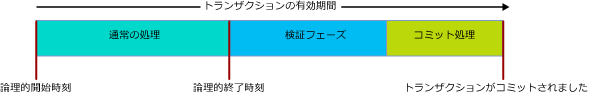

# <a name="transactions-with-memory-optimized-tables"></a>メモリ最適化テーブルでのトランザクション
[!INCLUDE[appliesto-ss-asdb-xxxx-xxx-md](../../includes/appliesto-ss-asdb-xxxx-xxx-md.md)]

ここでは、メモリ最適化テーブルおよびネイティブ コンパイル ストアド プロシージャに固有のトランザクションをあらゆる側面から説明します。  
  
SQL Server のトランザクション分離レベルは、ディスク ベースのテーブルとは異なる方法でメモリ最適化テーブルに適用されます。基になるメカニズムも異なっています。 プログラマは、この違いを理解することで、高スループットのシステムを設計しやすくなります。 トランザクションの整合性という目標は、すべての状況で共有されます。  

メモリ最適化テーブルでのトランザクションに固有のエラー条件については、「 [競合の検出と再試行ロジック](#conflict-detection-and-retry-logic)」のセクションに移動してください。
  
詳細については、「 [SET TRANSACTION ISOLATION LEVEL (Transact-SQL)](../../t-sql/statements/set-transaction-isolation-level-transact-sql.md)」を参照してください。  
  
## <a name="pessimistic-versus-optimistic"></a>ペシミスティックとオプティミスティック  
  
トランザクションの整合性へのアプローチがオプティミスティックかペシミスティックかによって、機能は異なってきます。 メモリ最適化テーブルでは、オプティミスティック アプローチが使用されます。  
  
- ペシミスティック アプローチでは、潜在的な競合を、それが発生する前にロックを使ってブロックします。 ステートメントが実行されるときにロックが取得され、トランザクションがコミットされるとロックが解放されます。  
  
- オプティミスティック アプローチでは、競合がその発生時に検出され、コミット時に検証チェックが実行されます。  
  - メモリ最適化テーブルに対しては、エラー 1205 (デッドロック) は発生しません。  
  
オプティミスティック アプローチはオーバーヘッドが少なく、通常はより効率的です。これは 1 つには、トランザクションの競合がほとんどのアプリケーションであまり発生しないためです。 ペシミスティック アプローチとオプティミスティック アプローチの機能上の主な違いは、競合が発生した場合に、ペシミスティック アプローチでは待機するのに対し、オプティミスティック アプローチでは、トランザクションの 1 つが失敗し、クライアントがそのトランザクションを再試行する必要があるという点です。 機能の違いは、REPEATABLE READ 分離レベルが有効だとさらに大きくなり、SERIALIZABLE レベルで最大になります。  
  
## <a name="transaction-initiation-modes"></a>トランザクション開始モード  
  
SQL Server のトランザクション開始モードは次のとおりです。  
  
- **オートコミット** - シンプルなクエリまたは DML ステートメントが開始されると、トランザクションが暗黙的に開かれ、ステートメントが終了すると、トランザクションが暗黙的にコミットされます。 既定値は**自動コミット**です。  
  - オートコミット モードでは、通常、FROM 句で、メモリ最適化テーブルのトランザクション分離レベルに関するテーブル ヒントをコーディングする必要はありません。  
  
- **Explicit** - Transact-SQL には、BEGIN TRANSACTION コードと共に最終的な COMMIT TRANSACTION コードが含まれています。 2 つ以上のステートメントを、同じトランザクションに含めることができます。  
  - Explicite モードでは、データベース オプションの MEMORY_OPTIMIZED_ELEVATE_TO_SNAPSHOT を使用するか、FROM 句でメモリ最適化テーブルのトランザクション分離レベルに関するテーブル ヒントをコーディングする必要があります。  
  
- **Implicit** - SET IMPLICIT_TRANSACTION ON が有効の場合。 おそらく、IMPLICIT_BEGIN_TRANSACTION という名前の方が適切です。このオプションでは、0 = @@trancount の場合に、各 UPDATE ステートメントの前で、明示的な BEGIN TRANSACTION と同じことを暗黙的に実行するからです。 したがって、明示的な COMMIT TRANSACTION を最終的に発行するかどうかは、T-SQL コード次第です。   
  
- **ATOMIC ブロック** - ATOMIC ブロックのすべてのステートメントは、常に 1 つのトランザクションとして実行されます。 ATOMIC ブロックのアクションは成功した場合に全体がコミットされるか、エラー発生時にすべてがロールバックされるかのどちらかです。 それぞれのネイティブ コンパイル ストアド プロシージャには ATOMIC ブロックが必要です。  
  
### <a name="code-example-with-explicit-mode"></a>Explicit モードのコード例  
  
解釈された Transact-SQL スクリプトでは次を使用します。  
  
- 明示的なトランザクション。
- dbo.Order_mo という名前のメモリ最適化テーブル。
- READ COMMITTED トランザクション分離レベルのコンテキスト。  
  
したがって、メモリ最適化テーブルにテーブル ヒントが必要です。 ヒントは SNAPSHOT またはさらに高い分離レベルを対象にしている必要があります。 コード例の場合、ヒントは WITH (SNAPSHOT) です。 このヒントが削除されている場合、スクリプトでは、41368 エラー (自動再試行が不適切) が発生します。  

#### <a name="error-41368"></a>エラー 41368

READ COMMITTED 分離レベルを使用してメモリ最適化テーブルにアクセスする機能は、オートコミット トランザクションでのみサポートされます。 明示的なトランザクションおよび暗黙的なトランザクションではサポートされていません。 WITH (SNAPSHOT) などのテーブル ヒントを使用して、メモリ最適化テーブルでサポートされる分離レベルを指定します。

```sql
SET TRANSACTION ISOLATION LEVEL READ COMMITTED;  
GO  

BEGIN TRANSACTION;  -- Explicit transaction.  

-- Order_mo  is a memory-optimized table.  
SELECT * FROM  
           dbo.Order_mo  as o  WITH (SNAPSHOT)  -- Table hint.  
      JOIN dbo.Customer  as c  on c.CustomerId = o.CustomerId;  
COMMIT TRANSACTION;
```

データベース オプション `MEMORY_OPTIMIZED_ELEVATE_TO_SNAPSHOT` を使用することで、`WITH (SNAPSHOT)` ヒントの必要はなくなります。 このオプションを `ON`に設定すると、低い分離レベルでのメモリ最適化テーブルへのアクセスは、自動的に SNAPSHOT 分離に昇格されます。  

```sql
ALTER DATABASE CURRENT
    SET MEMORY_OPTIMIZED_ELEVATE_TO_SNAPSHOT = ON;
```

## <a name="row-versioning"></a>行のバージョン管理  
  
メモリ最適化テーブルでは高度な行バージョン管理システムが使用され、最も厳密な分離レベル SERIALIZABLE でも、効率的なオプティミスティック アプローチが実現します。 詳細については、「 [メモリ最適化テーブルの概要](../../relational-databases/in-memory-oltp/introduction-to-memory-optimized-tables.md)」を参照してください。  
  
READ_COMMITTED_SNAPSHOT または SNAPSHOT 分離レベルが有効な場合は、行バージョン管理システムがディスク ベースのテーブルに間接的に含まれます。 このシステムは tempdb に基づいています。一方、メモリ最適化データ構造には、最大限の効率を得るために、行バージョン管理が組み込まれています。  
  
## <a name="isolation-levels"></a>分離レベル 
  
次の表は、トランザクション分離のレベルを、分離が少ないものから順に示しています。 発生する可能性のある競合、およびこれらの競合を処理するための再試行ロジックの詳細については、「 [競合の検出と再試行ロジック](#conflict-detection-and-retry-logic)」を参照してください。 
  
| [分離レベル] | [説明] |   
| :-- | :-- |   
| READ UNCOMMITTED | 使用できません: Read Uncommitted 分離ではメモリ最適化テーブルにアクセスできません。 この場合でも、セッション レベル TRANSACTION ISOLATION LEVEL が READ UNCOMMITTED に設定されていれば、WITH (SNAPSHOT) テーブル ヒントを使用するか、データベース設定 MEMORY_OPTIMIZED_ELEVATE_TO_SNAPSHOT を ON に設定することにより、SNAPSHOT 分離でメモリ最適化テーブルにアクセスすることができます。 | 
| READ COMMITTED | オートコミット モードが有効の場合にのみ、メモリ最適化テーブルに対してサポートされます。 この場合でも、セッション レベル TRANSACTION ISOLATION LEVEL が READ COMMITTED に設定されていれば、WITH (SNAPSHOT) テーブル ヒントを使用するか、データベース設定 MEMORY_OPTIMIZED_ELEVATE_TO_SNAPSHOT を ON に設定することにより、SNAPSHOT 分離でメモリ最適化テーブルにアクセスすることができます。<br/><br/>データベース オプション READ_COMMITTED_SNAPSHOT が ON に設定されている場合は、同じステートメント内でメモリ最適化テーブルとディスク ベースのテーブルの両方に READ COMMITTED 分離でアクセスすることはできません。 |  
| SNAPSHOT | メモリ最適化テーブルでサポートされます。 <br/><br/> 内部的には、SNAPSHOT は、メモリ最適化テーブルを対象とした最も要求が少ないトランザクション分離レベルです。 <br/><br/> SNAPSHOT が使用するシステム リソースは、REPEATABLE READ または SERIALIZABLE での使用量を下回ります。 |  
| REPEATABLE READ | メモリ最適化テーブルでサポートされます。 REPEATABLE READ 分離では、同時実行トランザクションはこのトランザクションが読み取ったどの行もコミット時に更新していないということが保証されます。 <br/><br/> オプティミスティック モデルであるため、このトランザクションが読み取った行を同時実行トランザクションが更新することは妨げられません。 代わりに、REPEATABLE READ 分離に違反していないことをコミット時にこのトランザクションが検証しています。 違反している場合、このトランザクションはロールバックされるため、再試行する必要があります。 | 
| SERIALIZABLE | メモリ最適化テーブルでサポートされます。 <br/><br/> 分離が厳密すぎるため、トランザクションが同時ではなくほぼ順番に実行されることから、 *Serializable* という名前が付いています。 | 

## <a name="transaction-phases-and-lifetime"></a>トランザクション フェーズと有効期間  
  
メモリ最適化テーブルが関係している場合、トランザクションの有効期間は次の図に示すようなフェーズを辿ります。
  
  
  
各フェーズの説明は次のとおりです。  
  
#### <a name="regular-processing-phase-1-of-3"></a>通常の処理:フェーズ 1 (1/3)  
  
- このフェーズは、すべてのクエリとクエリ内の DML ステートメントの実行で構成されます。  
- このフェーズでは、トランザクションの論理的開始時点のメモリ最適化テーブルのバージョンをステートメントが調べます。  
  
#### <a name="validation-phase-2-of-3"></a>検証:フェーズ 2 (2/3)  
  
- 終了時刻を割り当て、それによってトランザクションに論理的完了とマークすると、検証フェーズが始まります。 この完了により、このトランザクションと依存関係があるその他のトランザクションに、トランザクションのすべての変更内容が表示されます。 従属トランザクションは、このトランザクションが正常にコミットされるまではコミットできません。 さらに、このような依存関係を保持するトランザクションは、結果セットをクライアントに返すことはできません。データベースに正常にコミットされたデータのみ、クライアントが参照するようにするためです。  
- このフェーズは、repeatable read と serializable の検証で構成されます。 repeatable read の検証では、トランザクションによって読み取られた行のいずれかが以降更新されたかどうかがチェックされます。 serializable の検証では、このトランザクションによってスキャンされたいずれかのデータ範囲に行が挿入されたかどうかがチェックされます。 スナップショット分離の使用時は、一意キー制約と外部キー制約の整合性を検証するために、「[分離レベルと競合](#isolation-levels)」の表に従って、repeatable read と serializable の両方の検証が行われることがあります。  
  
#### <a name="commit-processing-phase-3-of-3"></a>コミット処理:フェーズ 3 (3/3)  
  
- コミット フェーズでは、持続性のあるテーブルへの変更がログに書き込まれ、そのログはディスクに書き込まれます。 その後、制御がクライアントに返されます。  
- コミット処理が完了すると、すべての従属トランザクションにコミット可能であることが通知されます。  
  
いつものように、トランザクションの作業単位は、データ ニーズに合わせてできるだけシンプルに、かつ小さくまとめてください。  
  
## <a name="conflict-detection-and-retry-logic"></a>競合の検出と再試行ロジック 

トランザクションが失敗してロールバックが行われる原因となるトランザクション関連のエラー条件には、2 種類あります。 ほとんどの場合、このようなエラーが発生したら、デッドロックが発生したときと同様に、トランザクションを再試行する必要があります。
- 同時実行トランザクション間の競合。 これらは更新の競合と検証のエラーであり、トランザクション分離レベル違反や制約違反が原因として考えられます。
- 依存関係のエラー。 これらは、依存するトランザクションのコミットが失敗したこと、または依存関係の数が大きくなりすぎたことに起因します。

メモリ最適化テーブルにアクセスするトランザクションの失敗の原因となるエラー条件を以下に示します。

| エラー コード | [説明] | 原因 |
| :-- | :-- | :-- |
| **41302** | 現在のトランザクションが開始されてから別のトランザクションで更新された行を更新しようとしました。 | このエラー条件は、2 つの同時実行トランザクションが同時に同じ行を更新または削除しようとした場合に発生します。 2 つのトランザクションのうちの 1 つがこのエラー メッセージを受け取り、そのトランザクションは再試行が必要になります。 <br/><br/>  | 
| **41305**| REPEATABLE READ の検証の失敗。 このトランザクションがメモリ最適化テーブルから読み取った行が、このトランザクションのコミット前にコミットした別のトランザクションによって更新されました。 | このエラーは、REPEATABLE READ 分離または SERIALIZABLE 分離の使用時に発生することがあります。また、同時実行トランザクションのアクションが FOREIGN KEY 制約の違反を引き起こした場合も発生する可能性があります。 <br/><br/>外部キー制約のこのような同時違反はまれであり、一般的にはアプリケーション ロジックまたはデータ エントリの問題を示しています。 ただし、FOREIGN KEY 制約に関係する列のインデックスが存在しない場合も、このエラーが発行する可能性があります。 したがって、メモリ最適化テーブルでは、外部キー列のインデックスを必ず作成するようにしてください。 <br/><br/> 外部キー違反によって発生する検証エラーに関する考慮事項の詳細については、SQL Server Customer Advisory Team による [このブログ投稿](https://blogs.msdn.microsoft.com/sqlcat/2016/03/24/considerations-around-validation-errors-41305-and-41325-on-memory-optimized-tables-with-foreign-keys/) を参照してください。 |  
| **41325** | SERIALIZABLE の検証の失敗。 以前スキャンされた範囲に、現在のトランザクションによって新しい行が挿入されました。 これはファントム行と呼ばれます。 | このエラーは、SERIALIZABLE 分離の使用時に発生することがあります。また、同時実行トランザクションのアクションが PRIMARY KEY、UNIQUE、または FOREIGN KEY 制約の違反を引き起こした場合も発生する可能性があります。 <br/><br/> このような同時制約違反はまれであり、一般的にはアプリケーション ロジックまたはデータ エントリの問題を示しています。 ただし、repeatable read の検証エラーと同様に、関係する列のインデックスが指定されていない FOREIGN KEY 制約が存在する場合も、このエラーが発生する可能性があります。 |  
| **41301** | 依存関係のエラー: 後でコミットに失敗した別のトランザクションに依存していました。 | このトランザクション (Tx1) は別のトランザクション (Tx2) が書き込んだデータを読み取ることによって、そのトランザクション (Tx2) への依存関係ができましたが、Tx2 は自身の検証またはコミット処理のフェーズでした。 Tx2 はその後コミットに失敗しました。 Tx2 がコミットに失敗する最も一般的な原因は、repeatable read (41305) および serializable (41325) 検証エラーです。まれな原因として、ログ IO エラーがあります。 |
| **41823** と **41840** | メモリ最適化テーブルとテーブル変数のユーザー データ クォータに到達しました。 | エラー 41823 は SQL Server Express/Web/Standard Edition と [!INCLUDE[sssdsfull](../../includes/sssdsfull-md.md)] の単一データベースに適用されます。 エラー 41840 は [!INCLUDE[sssdsfull](../../includes/sssdsfull-md.md)] のエラスティック プールに適用されます。 <br/><br/> ほとんどの場合、これらのエラーは、ユーザー データの最大サイズに到達したことを示します。エラーを解決する方法は、メモリ最適化テーブルからデータを削除することです。 ただし、このエラーが一時的なものに過ぎないことがまれにあります。 そのため、最初にエラーに遭遇したとき、再試行をお勧めします。<br/><br/> この一覧にある他のエラーと同様に、41823 と 41840 はアクティブなトランザクションを中止させます。 |
| **41839** | トランザクションがコミット依存関係の最大数を超えました。 |**適用対象:** [!INCLUDE[ssSQL15](../../includes/sssql15-md.md)]」を参照してください。 [!INCLUDE[ssnoversion](../../includes/ssnoversion-md.md)] と [!INCLUDE[sssdsfull](../../includes/sssdsfull-md.md)] の後続版には、コミット依存関係の数に上限がありません。<br/><br/> ある特定のトランザクション (Tx1) が依存できるトランザクションの数には制限があります。 そのようなトランザクションは出力依存関係です。 また、ある特定のトランザクション (Tx1) に依存できるトランザクションの数にも制限があります。 そのようなトランザクションは入力依存関係です。 両方とも 8 が限度です。 <br/><br/> このエラーの最も一般的なケースは、1 つの書き込みトランザクションによって書き込まれたデータに多数の読み取りトランザクションがアクセスする場合です。 同じデータの大規模スキャンを読み取りトランザクションがすべて実行している場合、および書き込みトランザクションの検証またはコミット処理に時間がかかる場合は、この条件が発生する可能性が高くなります。たとえば、書き込みトランザクションが serializable 分離で大規模スキャンを実行します (検証フェーズが長くなる)。また、トランザクション ログが低速ログ IO デバイスに置かれます (コミット処理が長くなる)。 読み取りトランザクションが大規模スキャンを実行しているものの、数行しかアクセスしないと思われる場合、インデックスが欠落している可能性があります。 同様に、書き込みトランザクションが serializable 分離を使用して大規模スキャンを実行しているものの、数行しかアクセスしないと思われる場合も、このエラーは、インデックスの欠落を示しています。 <br/><br/> コミット依存関係の数の制限は、トレース フラグ **9926** を使用することによって引き上げることができます。 このトレース フラグは、インデックスが欠落していないことを確認した後もこのエラー条件が発生する場合のみ使用してください。上記のケースにおけるこうした問題が隠されてしまう可能性があるからです。 もう 1 つの注意点は、依存関係グラフが複雑になると、システムの非効率につながる可能性があるということです。各トランザクションの入力依存関係と出力依存関係の両方の数が大きくなり、個々のトランザクションに依存関係の層が多数存在するようになるからです。  |
  
### <a name="retry-logic"></a>再試行ロジック 

上記の条件のいずれかが原因でトランザクションが失敗した場合は、そのトランザクションを再試行する必要があります。
  
再試行ロジックは、クライアント側またはサーバー側に実装できます。 一般的には、クライアント側に再試行ロジックを実装することをお勧めします。この方がより効率的であり、トランザクションが返した結果セットをエラーが発生する前に処理できるからです。  
  
#### <a name="retry-t-sql-code-example"></a>再試行 T-SQL コードの例  
  
T-SQL を使用したサーバー側の再試行ロジックは、結果セットをクライアントに返さないトランザクションでのみ使用してください。 そうしないと、再試行によってクライアントに返されると想定された以上の結果セットが返される場合があります。  
  
次の解釈された T-SQL スクリプトは、メモリ最適化テーブルに関するトランザクション競合に関連付けられたエラーの再試行ロジックを示しています。

```sql
-- Retry logic, in Transact-SQL.
DROP PROCEDURE If Exists usp_update_salesorder_dates;
GO

CREATE PROCEDURE usp_update_salesorder_dates
AS
BEGIN
    DECLARE @retry INT = 10;

    WHILE (@retry > 0)
    BEGIN
        BEGIN TRY
            BEGIN TRANSACTION;

            UPDATE dbo.SalesOrder_mo WITH (SNAPSHOT)
                set OrderDate = GetUtcDate()
                where CustomerId = 42;

            UPDATE dbo.SalesOrder_mo WITH (SNAPSHOT)
                set OrderDate = GetUtcDate()
                where CustomerId = 43;

            COMMIT TRANSACTION;

            SET @retry = 0;  -- //Stops the loop.
        END TRY

        BEGIN CATCH
            SET @retry -= 1;

            IF (@retry > 0 AND
                ERROR_NUMBER() in (41302, 41305, 41325, 41301, 41823, 41840, 41839, 1205)
                )
            BEGIN
                IF XACT_STATE() = -1
                    ROLLBACK TRANSACTION;

                WAITFOR DELAY '00:00:00.001';
            END
            ELSE
            BEGIN
                PRINT 'Suffered an error for which Retry is inappropriate.';
                THROW;
            END
        END CATCH

    END -- //While loop
END;
GO

--  EXECUTE usp_update_salesorder_dates;
```

## <a name="cross-container-transaction"></a>複数コンテナーにまたがるトランザクション  
  
次の場合、トランザクションは複数コンテナーにまたがるトランザクションと呼ばれます。  
  
- 解釈された Transact-SQL のメモリ最適化テーブルにアクセスする。  
- トランザクションが既に開いているときに、ネイティブ プロシージャを実行する (XACT_STATE() = 1)。 

「複数コンテナーにまたがる」という用語は、2 つのトランザクション管理コンテナー (1 つはディスク ベースのテーブル用、もう 1 つはメモリ最適化テーブル用) にまたがってトランザクションが実行されることに由来します。  
  
複数コンテナーにまたがる単一のトランザクション内で、ディスク ベースのテーブルへのアクセスとメモリ最適化テーブルへのアクセスに、それぞれ異なる分離レベルを使用できます。 この違いは、WITH (SERIALIZABLE) のような明示的なテーブル ヒントか、データベース オプション MEMORY_OPTIMIZED_ELEVATE_TO_SNAPSHOT によって表されます。このデータベース オプションを使用すると、TRANSACTION ISOLATION LEVEL が READ COMMITTED または READ UNCOMMITTED として構成されていれば、メモリ最適化テーブルの分離レベルが暗黙的にスナップショットに昇格されます。  
  
Transact-SQL コードの例を次に示します。  
  
- ディスク ベースのテーブル Table_D1 は、READ COMMITTED 分離レベルを使用してアクセスされます。  
- メモリ最適化テーブル Table_MO7 は、SERIALIZABLE 分離レベルを使用してアクセスされます。 Table_MO6 には特定の分離レベルが関連付けられていません。挿入は常に一貫しており、基本的に serializable 分離で実行されるからです。  


```sql
-- Different isolation levels for
-- disk-based tables versus memory-optimized tables,
-- within one explicit transaction.

SET TRANSACTION ISOLATION LEVEL READ COMMITTED;
go

BEGIN TRANSACTION;

    -- Table_D1 is a traditional disk-based table, accessed using READ COMMITTED isolation.

    SELECT * FROM Table_D1;


    -- Table_MO6 and Table_MO7 are memory-optimized tables.
    -- Table_MO7 is accessed using SERIALIZABLE isolation,
    --   while Table_MO6 does not have a specific isolation level.

    INSERT Table_MO6
        SELECT * FROM Table_MO7 WITH (SERIALIZABLE);

COMMIT TRANSACTION;
go
```

## <a name="limitations"></a>制限事項  
  
- 複数データベースにまたがるトランザクションは、メモリ最適化テーブルではサポートされません。 トランザクションがメモリ最適化テーブルにアクセスする場合、そのトランザクションは、他のデータベースにはアクセスできません。ただし次を除きます。  
  - tempdb データベース。  
  - マスター データベースからの読み取り専用。  
  
- 分散トランザクションはサポートされていません。BEGIN DISTRIBUTED TRANSACTION が使用されている場合、トランザクションは、メモリ最適化テーブルにアクセスできません。  
  
## <a name="natively-compiled-stored-procedures"></a>ネイティブ コンパイル ストアド プロシージャ  
  
- ネイティブ プロシージャでは、次のように、ATOMIC ブロックが、ブロック全体に対してトランザクション分離レベルを宣言する必要があります。  
  - `... BEGIN ATOMIC WITH (TRANSACTION ISOLATION LEVEL = SNAPSHOT, ...) ...`  
  
- ネイティブ プロシージャの本文では、明示的なトランザクション制御ステートメントは許可されません。 BEGIN TRANSACTION、ROLLBACK TRANSACTION など、どれも許可されていません。  
  
- ATOMIC ブロックに関するトランザクション制御の詳細については、「[ATOMIC ブロック](atomic-blocks-in-native-procedures.md)」を参照してください  
  
## <a name="other-transaction-links"></a>その他のトランザクション リンク  
  
- [[SET IMPLICIT_TRANSACTIONS]](../../t-sql/statements/set-implicit-transactions-transact-sql.md)  
  
- [sp_getapplock (Transact-SQL)](../../relational-databases/system-stored-procedures/sp-getapplock-transact-sql.md)  
  
- [データベース エンジンでの行のバージョン管理に基づく分離レベル](https://msdn.microsoft.com/library/ms177404.aspx)  
  
- [トランザクションの持続性の制御](../../relational-databases/logs/control-transaction-durability.md)   
