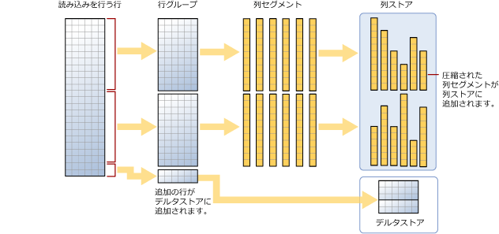

# <a name="columnstore-indexes---data-loading-guidance"></a>列ストア インデックス - データ読み込みガイダンス
[!INCLUDE[tsql-appliesto-ss2012-all_md](../../includes/tsql-appliesto-ss2012-all-md.md)]

標準的な SQL 一括読み込みとトリクル挿入メソッドを使用して、列ストア インデックスにデータを読み込むためのオプションと推奨事項です。 列ストア インデックスへのデータの読み込みは、分析に備えてデータをインデックスに移動するため、すべてのデータ ウェアハウスのプロセスにおいて不可欠な要素です。
  
 列ストア インデックスを初めて使用する場合は、 「[列ストア インデックス - 概要](../../relational-databases/indexes/columnstore-indexes-overview.md)」と「[列ストア インデックス - アーキテクチャ](../../relational-databases/indexes/columnstore-indexes-architecture.md)」を参照してください。
  

## <a name="what-is-bulk-loading"></a>一括読み込みとは
*一括読み込み*は、大量の行がデータ ストアに追加される方法を表します。 これは、バッチの行を対象とするため、データを列ストア インデックスに移動するために、最もパフォーマンスが良い方法です。 一括読み込みでは、行グループを最大容量まで入れ、直接列ストアに圧縮します。 行グループごとに最小値の 102,400 行に一致しない読み込みの最後の行のみが、デルタストアに移動されます。  
一括読み込みを実行するには、[bcp ユーティリティ](https://msdn.microsoft.com/library/ms162802.aspx)、[Integration Services](https://msdn.microsoft.com/library/ms141026.aspx) を使用したり、ステージング テーブルから行を選択したりすることができます。

  
  
 上記の図に示すように、一括読み込みでは、  
  
* データは事前に並べ替えられません。 データは受信順に行グループに挿入されます。
* バッチ サイズが 102400 以上の場合、行は圧縮された行グループに直接移動されます。 効率的に一括でインポートするために 102400 以上のバッチ サイズを選択することをお勧めします。バックグラウンド スレッドの組ムーバー (TM) により圧縮された行グループに最終的に行が移動される前に、データ行がデルタ行グループに移動されないようにすることができるためです。
* バッチ サイズが 102400 未満の場合、または残りの行が 102400 未満の場合、行はデルタ行グループに読み込まれます。

>![注] 非クラスター化列ストア インデックス データを含む行ストア テーブルでは、[!INCLUDE[ssNoVersion](../../includes/ssnoversion-md.md)] は常にデータをベース テーブルに挿入します。 データが列ストア インデックスに直接挿入されることはありません。  

一括読み込みには、次の組み込みのパフォーマンスの最適化があります。
 
-   並列読み込み。 それぞれ別のデータ ファイルを読み込む、複数の同時一括読み込み (bcp または一括インポート) を行うことができます。 SQL Server への行ストア一括読み込みとは異なり、各一括インポート スレッドでは排他的ロックを使用して排他的にデータを別の行グループ (圧縮行グループまたはデルタ行グループ) に読み込むため、TABLOCK を指定する必要はありません。 TABLOCK を使用すると、テーブルで排他的ロックが適用され、データを並列でインポートすることはできません。  
  
-   最小ログ記録。 一括読み込みでは、圧縮行グループに直接移動するデータに最小ログ記録を使用します。 デルタ行グループに移動するデータは、完全に記録されます。 これには、102,400 行未満のバッチ サイズがすべて含まれます。 ただし、一括読み込みの目的は、ほとんどのデータに対してデルタ行グループを使用しないことです。  
  
-   ロックの最適化。  圧縮された行グループに読み込む場合は、行グループに対する X ロックが獲得されます。 ただし、デルタ行グループへの一括読み込みの場合、X ロックは行グループで獲得されますが、X 行グループ ロックはロック階層の一部ではないため、SQL Server は引き続き PAGE/EXTENT のロックを行います。  
  
列ストア インデックスに非クラスター化 btree インデックスがある場合、インデックス自体のロックやログの最適化は行われませんが、前述のとおり、クラスター化列ストア インデックスの最適化は引き続き行われます。  


  
## <a name="plan-bulk-load-sizes-to-minimize-delta-rowgroups"></a>デルタ行グループを最小限にする一括読み込みサイズを計画する
ほとんどの行が列ストアに圧縮され、デルタ行グループに配置されていないときに、列ストア インデックスは最高のパフォーマンスを発揮します。 行が列ストアに直接移動し、できる限りデルタストアを使用しない読み込みのサイズにすることが最適です。

次のシナリオでは、読み込まれた行が列ストアに直接移動する場合やデルタストアに移動する場合について説明します。 この例では、行グループはそれぞれ 102,400 ～ 1,048,576 個の行を持つことができます。 実際には、行グループの最大サイズは、メモリが不足している場合、1,048,576 行より小さくなることがあります。  
  
|一括読み込みを行う行|圧縮された行グループに追加される行|デルタ行グループに追加される行|  
|-----------------------|-------------------------------------------|--------------------------------------|  
|102,000|0|102,000|  
|145,000|145,000<br /><br /> 行グループのサイズ: 145,000|0|  
|1,048,577|1,048,576<br /><br /> 行グループのサイズ: 1,048,576|1|  
|2,252,152|2,252,152<br /><br /> 行グループのサイズ: 1,048,576、1,048,576、155,000|0|  
  
 次の例は、1,048,577 個の行をテーブルに読み込んだ結果を示しています。 この結果では、列ストアに 1 つの圧縮された行グループ (圧縮された列セグメントとして)、およびデルタストアに 1 行があります。  
  
```  
SELECT object_id, index_id, partition_number, row_group_id, delta_store_hobt_id, state state_desc, total_rows, deleted_rows, size_in_bytes   
FROM sys.dm_db_column_store_row_group_physical_stats  
```  
  
   
  
## <a name="use-a-staging-table-to-improve-performance"></a>ステージング テーブルを使用してパフォーマンスを向上させる
さらに変換を実行する前で、ステージングにのみデータを読み込んでいる場合は、ヒープ テーブルにデータを読み込むほうが、クラスター化列ストア テーブルにデータを読み込むよりも高速になります。 さらに、[一時テーブル][Temporary] へのデータの読み込みも、永続記憶域にテーブルを読み込むよりも高速になります。  

 データの読み込みの一般的なパターンでは、ステージング テーブルにデータを読み込み、変換を行ってから、以下のコマンドを使用してターゲット テーブルに読み込みます。  
  
```  
INSERT INTO <columnstore index>  SELECT <list of columns> FROM <Staging Table>  
  
```  
  
 このコマンドでは、BCP や一括挿入と同じように列ストア インデックスにデータを読み込みますが、データは単一のバッチにまとめられます。 ステージング テーブルの行数が 102400 未満の場合、行はデルタ行グループに読み込まれ、それ以外の場合、行は圧縮された列グループに直接読み込まれます。  この INSERT 操作はシングル スレッドの場合に限られていました。 データの並列読み込みを行う場合、複数のステージング テーブルを作成するか、ステージング テーブルの重複していない行の範囲を指定して INSERT/SELECT を実行することができます。  このような制限は SQL Server 2016 にはありません。 次のコマンドではステージング テーブルからデータを並列で読み込みますが、TABLOCK を指定する必要があります。  
  
```  
INSERT INTO <columnstore index>  WITH (TABLOCK)  SELECT <list of columns> FROM <Staging Table>  
```  
  
 ステージング テーブルからクラスター化列ストア インデックスへの一括読み込みで使用可能な最適化を以下に示します。  
  
-   ログの最適化: データが圧縮された行グループに読み込まれる場合は、最小ログ記録が行われます。 デルタ行グループにデータが読み込まれる場合、最小ログ記録は行われません。  
  
-   ロックの最適化: 圧縮された行グループに読み込む場合は、行グループに対する X ロックが獲得されます。 ただし、デルタ行グループでは、X ロックは行グループで獲得されますが、X 行グループ ロックはロック階層の一部ではないため、SQL Server は引き続き PAGE/EXTENT のロックを行います。  
  
 非クラスター化インデックスがある場合、インデックス自体のロックやログの最適化は行われませんが、前述のとおり、クラスター化列ストア インデックスの最適化は引き続き行われます。  
  
## <a name="what-is-trickle-insert"></a>トリクル挿入とは

*トリクル挿入*は、個々の行が列ストア インデックスに移動する方法を表します。 トリクル挿入では、[INSERT INTO](https://msdn.microsoft.com/library/ms174335.aspx) ステートメントを使用します。 トリクル挿入を使用すると、すべての行はデルタストアに移動されます。 これは行が少数のときに便利ですが、大量の読み込みは実用的ではありません。
  
```  
INSERT INTO <table-name> VALUES (<set of values>)  
```  
  
 クラスター化列ストア インデックスに値を挿入するために INSERT INTO を使用する並行スレッドでは、同じデルタストア行グループに行が挿入される場合があることに注意してください。  
  
 列グループに 1,048, 576 個の行が含まれると、デルタ行グループは閉じられたと見なされますが、クエリや更新/削除操作では引き続き使用できます。ただし、新しく挿入される行は既存のデルタストア列グループまたは新しく作成されたデルタストア列グループに移動します。 閉じられたデルタ行グループを 5 分程度ごとに定期的に圧縮する *組ムーバー (TM)* というバックグラウンド スレッドがあります。 閉じられたデルタ行グループを圧縮する場合、次のコマンドを明示的に呼び出すことができます。  
  
```  
ALTER INDEX <index-name> on <table-name> REORGANIZE  
```  
  
 デルタ行グループを強制的に閉じ、圧縮する場合は、以下のコマンドを実行できます。 行の読み込みが終了し、新しい行は必要ない場合、このコマンドを実行できます。 デルタ行グループを明示的に閉じ、圧縮することで、より多くのストレージを確保し、分析クエリのパフォーマンスを向上させることができます。 新しい行を挿入する必要がない場合は、このコマンドを呼び出すことをお勧めします。  
  
```  
ALTER INDEX <index-name> on <table-name> REORGANIZE with (COMPRESS_ALL_ROW_GROUPS = ON)  
```  
  
## <a name="how-loading-into-a-partitioned-table-works"></a>パーティション テーブルへの読み込みのしくみ  
 パーティション分割されたデータの場合、 [!INCLUDE[ssNoVersion](../../includes/ssnoversion-md.md)] はまずパーティションに各行を割り当て、次にパーティション内のデータの columnstore 処理を実行します。 各パーティションには、独自の行グループと少なくとも 1 つのデルタ行グループがあります。  
  

 ## <a name="next-steps"></a>次の手順
 読み込みの詳細については、こちらの[ブログの投稿](http://blogs.msdn.com/b/sqlcat/archive/2015/03/11/data-loading-performance-considerations-on-tables-with-clustered-columnstore-index.aspx)を参照してください。  

