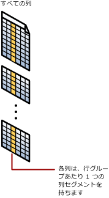

# 列ストア インデックス: 概要
[!INCLUDE[appliesto-ss-asdb-asdw-pdw-md](../../includes/appliesto-ss-asdb-asdw-pdw-md.md)]

列ストア インデックスは、大規模なデータ ウェアハウス ファクト テーブルを格納し、そのテーブルにクエリを実行する際の標準となります。 このインデックスは列ベースのデータ ストレージとクエリ処理を使用して、従来の行指向ストレージと比較して最大 **10 倍のクエリ パフォーマンス**をデータ ウェアハウスで実現します。 また、非圧縮データ サイズと比較して、最大 **10 倍のデータ圧縮**を実現することも可能です。 [!INCLUDE[ssSQL15](../../includes/sssql15-md.md)] 以降、列ストア インデックスでは運用分析が可能になりました。トランザクション ワークロードでパフォーマンスの高いリアルタイム分析を実行することができます。  
  
関連するシナリオについての詳細は次のとおりです。  
  
-   [データ ウェアハウスの列ストア インデックス](../../relational-databases/indexes/columnstore-indexes-data-warehouse.md)  
-   [列ストアを使用したリアルタイム運用分析の概要](../../relational-databases/indexes/get-started-with-columnstore-for-real-time-operational-analytics.md)  
  
## 列ストア インデックスとは  
列ストア インデックスは、列指向データ形式を使用してデータを格納、取得、および管理するためのテクノロジです ("*列ストア*" と呼ばれます)。  
  
### 主な用語と概念  
ここでは、列ストア インデックスに関連する主な用語と概念について説明します。  
  
#### 列ストア
列ストアは、行と列を含むテーブルとして論理的に編成され、列方向のデータ形式で物理的に格納されているデータです。  
  
#### 行ストア
行ストアは、行と列を含むテーブルとして論理的に編成され、行方向のデータ形式で物理的に格納されているデータです。 この形式は、リレーショナル テーブル データを格納する従来の方法です。 [!INCLUDE[ssNoVersion](../../includes/ssnoversion-md.md)] では、行ストアは、基になるデータ ストレージ形式が、ヒープ、クラスター化インデックス、またはメモリ最適化テーブルであるテーブルを示します。  
  
> [!NOTE]  
> 列ストア インデックスの説明では、データ ストレージの形式を強調するために行ストアと列ストア という用語が使用されます。  
  
#### 行グループ
行グループは、同時に列ストア形式に圧縮される行のグループです。 通常、1 つの行グループには、行グループあたりの最大行数である 1,048,576 行が含まれます。  
  
高パフォーマンスと高い圧縮率を実現するために、列ストア インデックスは、テーブルを行グループにスライスし、各行グループを列方向に圧縮します。 行グループ内の行数は、高い圧縮率が実現される程度に多く、インメモリ操作の利点を得られる程度に少なくなければなりません。    

#### 列セグメント
列セグメントは、行グループ内のデータ列です。  
  
-   それぞれの行グループには、テーブルの 1 つの列につき 1 つの列セグメントが含まれます。  
-   それぞれの列セグメントは一緒に圧縮され、物理メディアに格納されます。  
  
  
  
#### クラスター化列ストア インデックス
クラスター化列ストア インデックスは、テーブル全体に対する物理ストレージです。    
  
  
  
列セグメントの断片化を低減し、パフォーマンスを高めるために、列ストア インデックスでは、一部のデータを、クラスター化インデックス ("*デルタストア*" と呼ばれます) と削除された行の ID の btree リストに格納することがあります。 デルタストア操作は内部で処理されます。 列ストア インデックスは、正しいクエリ結果を返すために、列ストアとデルタストアの両方からのクエリ結果を結合します。  
  
#### デルタ行グループ
デルタ行グループは、列ストア インデックスでのみ使用されるクラスター化インデックスです。 これは、行数がしきい値に達して列ストアに移動できるまで行を格納することで、列ストアの圧縮とパフォーマンスを高めます。  

デルタ行グループは、最大行数に達すると閉じられます。 閉じている行グループは、組ムーバー プロセスによって確認されます。 プロセスによって閉じている行グループが見つけられると、その行グループは圧縮され、列ストアに格納されます。  
  
#### デルタストア
列ストア インデックスは、複数のデルタ行グループを持つことができます。 すべてのデルタ行グループを総称して、デルタストアと呼びます。   

大規模な一括読み込みでは、行のほとんどがデルタストアを通らずに列ストアに直接移動します。 一括読み込みの最後に位置する行の数は、行グループの最小サイズである 102,400 行を満たすには足りないことがあります。 その結果、それらの行は列ストアではなくデルタストアに移動します。 102,400 行未満の小規模な一括読み込みでは、すべての行がデルタストアに直接移動します。  
  
#### 非クラスター化列ストア インデックス
非クラスター化列ストア インデックスとクラスター化列ストアインデックスは同じように機能します。 異なるのは、非クラスター化列ストア インデックスが行ストア テーブルに作成されたセカンダリ インデックスであるのに対し、クラスター化インデックスはテーブル全体のプライマリ ストレージである点です。  
  
非クラスター化インデックスには、基になるテーブルの行と列の一部または全体のコピーが含まれています。 インデックスはテーブルの 1 つ以上の列として定義され、行のフィルター処理条件をオプションで設定できます。  
  
非クラスター化列ストア インデックスによりリアルタイム運用分析が可能になります。ここで、OLTP ワークロードは基になるクラスター化インデックスを使用します。一方、列ストア インデックスでは同時に分析が実行されます。 詳細については、「[列ストアを使用したリアルタイム運用分析の概要](../../relational-databases/indexes/get-started-with-columnstore-for-real-time-operational-analytics.md)」をご覧ください。  
  
#### バッチ モード実行
バッチ モード実行は、複数の行をまとめて処理するためのクエリ処理方法です。 バッチ モード実行は、列ストア ストレージ形式と緊密に統合され、このストレージ形式に合わせて最適化されています。 バッチ モード実行は、"*ベクター ベースの*" 実行、または "*ベクター化された*" 実行と呼ばれることもあります。 列ストア インデックスのクエリではバッチ モード実行が使用され、これによりクエリ パフォーマンスが、通常、2 から 4 倍向上します。 詳細については、「[クエリ処理アーキテクチャ ガイド](../query-processing-architecture-guide.md#execution-modes)」をご覧ください。 
  
##   列ストア インデックスを使用する理由  
列ストア インデックスにより、非常に高いレベルでデータ圧縮が実現し (通常 10 倍)、データ ウェアハウスのストレージ コストが大幅に削減されます。 分析においても、列ストア インデックスは btree インデックスと比べて桁違いに優れたパフォーマンスを発揮します。 列ストア インデックスは、データ ウェアハウスと分析のワークロードに対して推奨されるデータ ストレージ形式です。 [!INCLUDE[ssSQL15](../../includes/sssql15-md.md)]以降、運用ワークロードにおけるリアルタイム分析で列ストア インデックスを使用できます。  
  
列ストア インデックスが高速に動作する理由:  
  
-   列には同じドメインの値 (一般的に似たような値) が格納されます。これにより圧縮率が上がります。 システム内における I/O のボトルネックが最小化または除外され、メモリ使用量が大幅に減少します。  
  
-   高い圧縮比率により、メモリ使用量が削減され、クエリのパフォーマンスが向上します。 さらに、[!INCLUDE[ssNoVersion](../../includes/ssnoversion-md.md)] がより多くのクエリやデータ操作をインメモリで実行できるため、クエリのパフォーマンスを向上させることが可能です。  
  
-   バッチ実行では、複数の行をまとめて処理することで、クエリのパフォーマンスを高めます (通常 2 から 4 倍)。  
  
-   クエリはテーブルから少数の列のみを選択することが多く、物理メディアからの合計 I/O を低減します。  
  
## 列ストア インデックスを使用するタイミング  
推奨されるユース ケース  
  
-   クラスター化列ストア インデックスを使用して、データ ウェアハウス ワークロード用にファクト テーブルと大きなディメンション テーブルを格納します。 この方法により、クエリのパフォーマンスとデータ圧縮が最大で 10 倍向上します。 詳しくは、「[データ ウェアハウスの列ストア インデックス](~/relational-databases/indexes/columnstore-indexes-data-warehouse.md)」をご覧ください。  
  
-   非クラスター化列ストア インデックスを使用して、OLTP ワークロードでリアルタイム分析を実行します。 詳細については、「[列ストアを使用したリアルタイム運用分析の概要](../../relational-databases/indexes/get-started-with-columnstore-for-real-time-operational-analytics.md)」をご覧ください。  
  
### 行ストア インデックスと列ストア インデックスはどのように選択すればよいですか。  
行ストア インデックスは、データをシークして特定の値を検索するクエリや、狭い範囲の値でのクエリを実行する場合に、最適なパフォーマンスを発揮します。 トランザクション ワークロードでは、テーブル スキャンではなく主にテーブル シークを必要とする傾向があるため、行ストア インデックスを使用してください。  
  
列ストア インデックスは、特に大規模なテーブルで、大量のデータをスキャンする分析クエリを実行するときにパフォーマンスが高くなります。 この列ストア インデックスは、特にファクト テーブルのデータ ウェアハウスと分析のワークロードで使用します。ファクト テーブルでは、テーブル シークではなく完全なテーブル スキャンが必要になることが多いためです。  
  
### 行ストアと列ストアを同じテーブルで結合できますか。  
可能。 [!INCLUDE[ssSQL15](../../includes/sssql15-md.md)] 以降、更新可能な非クラスター化列ストア インデックスを、行ストア テーブルに作成できます。 列ストア インデックスには選択された列のコピーが格納されるため、このデータ用に追加の容量が必要になります。ただし、選択されたデータは平均で 10 倍に圧縮されます。 列ストア インデックスの分析と行ストア インデックスのトランザクションを同時に実行できます。 行ストア テーブルでデータが変更されると列ストアが更新されます。このため、両方のインデックスが同じデータに対して作業を行うことになります。  
  
[!INCLUDE[ssSQL15](../../includes/sssql15-md.md)] 以降、列ストア インデックス上に 1 つまたは複数の非クラスター化行ストア インデックスを持たせて、基になる列ストア上で効率的にテーブルを検索できるようになりました。 他のオプションも使用できます。 たとえば、行ストア テーブルで UNIQUE 制約を使用することで、主キー制約を適用できます。 一意でない値は行ストア テーブルに挿入できないため、[!INCLUDE[ssNoVersion](../../includes/ssnoversion-md.md)] で列ストアにその値を挿入することはできません。  
  
## メタデータ  
列ストア インデックス内のすべての列は、付加列としてメタデータに格納されます。 列ストア インデックスはキー列を持ちません。  

|||
|-|-|  
|[sys.indexes &#40;Transact-SQL&#41;](../../relational-databases/system-catalog-views/sys-indexes-transact-sql.md)|[sys.index_columns &#40;Transact-SQL&#41;](../../relational-databases/system-catalog-views/sys-index-columns-transact-sql.md)|  
|[sys.partitions &#40;Transact-SQL&#41;](../../relational-databases/system-catalog-views/sys-partitions-transact-sql.md)|[sys.internal_partitions &#40;Transact-SQL&#41;](../../relational-databases/system-catalog-views/sys-internal-partitions-transact-sql.md)|  
|[sys.column_store_segments &#40;Transact-SQL&#41;](../../relational-databases/system-catalog-views/sys-column-store-segments-transact-sql.md)|[sys.column_store_dictionaries &#40;Transact-SQL&#41;](../../relational-databases/system-catalog-views/sys-column-store-dictionaries-transact-sql.md)|  
|[sys.column_store_row_groups &#40;Transact-SQL&#41;](../../relational-databases/system-catalog-views/sys-column-store-row-groups-transact-sql.md)|[sys.dm_db_column_store_row_group_operational_stats &#40;Transact-SQL&#41;](../../relational-databases/system-dynamic-management-views/sys-dm-db-column-store-row-group-operational-stats-transact-sql.md)|  
|[sys.dm_db_column_store_row_group_physical_stats &#40;Transact-SQL&#41;](../../relational-databases/system-dynamic-management-views/sys-dm-db-column-store-row-group-physical-stats-transact-sql.md)|[sys.dm_column_store_object_pool &#40;Transact-SQL&#41;](../../relational-databases/system-dynamic-management-views/sys-dm-column-store-object-pool-transact-sql.md)|  
|[sys.dm_db_column_store_row_group_operational_stats &#40;Transact-SQL&#41;](../../relational-databases/system-dynamic-management-views/sys-dm-db-column-store-row-group-operational-stats-transact-sql.md)|[sys.dm_db_index_operational_stats &#40;Transact-SQL&#41;](../../relational-databases/system-dynamic-management-views/sys-dm-db-index-operational-stats-transact-sql.md)|  
|[sys.dm_db_index_physical_stats &#40;Transact-SQL&#41;](../../relational-databases/system-dynamic-management-views/sys-dm-db-index-physical-stats-transact-sql.md)||  
  
## 関連タスク  
クラスター化列ストア インデックスとしてリレーショナル テーブルを指定していない限り、そのリレーショナル テーブルでは、行ストアが、基になるデータ形式として使用されます。 `WITH CLUSTERED COLUMNSTORE INDEX` オプションを指定しない場合、`CREATE TABLE` によって行ストア テーブルが作成されます。  
  
`CREATE TABLE` ステートメントでテーブルを作成する際に、`WITH CLUSTERED COLUMNSTORE INDEX` オプションを指定することでそのテーブルを列ストアとして作成できます。 既に、行ストア テーブルがある場合、その行ストアは、`CREATE COLUMNSTORE INDEX` ステートメントを使用して列ストアに変換できます。  
  
|タスク|参照トピック|注|  
|----------|----------------------|-----------|  
|テーブルを列ストアとして作成する。|[CREATE TABLE &#40;Transact-SQL&#41;](../../t-sql/statements/create-table-transact-sql.md)|[!INCLUDE[ssSQL15](../../includes/sssql15-md.md)]以降、テーブルをクラスター化列ストア インデックスとして作成できます。 最初に行ストア テーブルを作成し、次に列ストアに変換する必要はありません。|  
|列ストア インデックスを持つメモリ テーブルを作成します。|[CREATE TABLE &#40;Transact-SQL&#41;](../../t-sql/statements/create-table-transact-sql.md)|[!INCLUDE[ssSQL15](../../includes/sssql15-md.md)]以降、列ストア インデックスを持つ、メモリ最適化テーブルを作成できます。 列ストア インデックスは、テーブルの作成後に `ALTER TABLE ADD INDEX` 構文を使用して追加することもできます。|  
|行ストア テーブルを列ストアに変換する。|[CREATE COLUMNSTORE INDEX &#40;Transact-SQL&#41;](../../t-sql/statements/create-columnstore-index-transact-sql.md)|既存のヒープまたはバイナリ ツリーを列ストアに変換します。 この変換を実行するときの既存のインデックスとインデックス名の処理方法を例示します。|  
|列ストア テーブルを行ストアに変換する。|[CREATE CLUSTERED INDEX &#40;Transact-SQL&#41;](../../t-sql/statements/create-columnstore-index-transact-sql.md#d-convert-a-columnstore-table-to-a-rowstore-table-with-a-clustered-index)、[列ストア テーブルを行ストア ヒープに戻す](../../t-sql/statements/create-columnstore-index-transact-sql.md#e-convert-a-columnstore-table-back-to-a-rowstore-heap) |この変換は通常は必要ありませんが、状況によっては必要になる場合があります。 列ストアをヒープまたはクラスター化インデックスに変換する方法を例示します。|  
|行ストア テーブルで列ストア インデックスを作成する。|[CREATE COLUMNSTORE INDEX &#40;Transact-SQL&#41;](../../t-sql/statements/create-columnstore-index-transact-sql.md)|行ストア テーブルでは列ストア インデックスを 1 つ使用できます。 [!INCLUDE[ssSQL15](../../includes/sssql15-md.md)]以降、列ストア インデックスにフィルター条件を指定できるようになりました。 基本構文を例示します。|  
|運用分析のパフォーマンスの高いインデックスを作成する。|[列ストアを使用したリアルタイム運用分析の概要](../../relational-databases/indexes/get-started-with-columnstore-for-real-time-operational-analytics.md)|補完的な列ストア インデックスと btree インデックスを作成する方法について説明します。OLTP クエリでは btree インデックスが使用され、分析クエリでは列ストア インデックスが使用されます。|  
|データ ウェアハウス用のパフォーマンスの高い列ストア インデックスを作成する。|[データ ウェアハウスの列ストア インデックス](~/relational-databases/indexes/columnstore-indexes-data-warehouse.md)|列ストア テーブルで btree インデックスを使用して、パフォーマンスの高いデータ ウェアハウス クエリを作成する方法について説明します。|  
|btree インデックスを使用して列ストア インデックスに主キー制約を適用する|[データ ウェアハウスの列ストア インデックス](~/relational-databases/indexes/columnstore-indexes-data-warehouse.md)|btree インデックスと列ストア インデックスを組み合わせて、列ストア インデックスに主キー制約を適用する方法を示します。|  
|列ストア インデックスを削除する。|[DROP INDEX &#40;Transact-SQL&#41;](../../t-sql/statements/drop-index-transact-sql.md)|列ストア インデックスを削除するには、btree インデックスが使用する標準の `DROP INDEX` 構文を使用します。 クラスター化列ストア インデックスを削除すると、列ストア テーブルがヒープに変換されます。|  
|列ストア インデックスから行を削除する。|[DELETE &#40;Transact-SQL&#41;](../../t-sql/statements/delete-transact-sql.md)|[DELETE &#40;Transact-SQL&#41;](../../t-sql/statements/delete-transact-sql.md) を使用して行を削除します。   **列ストアの行**: [!INCLUDE[ssNoVersion](../../includes/ssnoversion-md.md)] は行を論理的に削除されたとしてマークしますが、インデックスが再構築されるまで行の物理ストレージを再確保することはありません。   **デルタストアの行**: [!INCLUDE[ssNoVersion](../../includes/ssnoversion-md.md)] は論理的および物理的に行を削除します。|  
|列ストア インデックスの行を更新する。|[UPDATE &#40;Transact-SQL&#41;](../../t-sql/queries/update-transact-sql.md)|[UPDATE &#40;Transact-SQL&#41;](../../t-sql/queries/update-transact-sql.md) を使用して行を更新します。   **列ストアの行**: [!INCLUDE[ssNoVersion](../../includes/ssnoversion-md.md)] は行を論理的に削除されたとしてマークし、更新された行をデルタストアに挿入します。   **デルタストアの行**: [!INCLUDE[ssNoVersion](../../includes/ssnoversion-md.md)] は、デルタストアの行を更新します。|  
|データを列ストア インデックスに読み込む。|[列ストア インデックス データの読み込み](~/relational-databases/indexes/columnstore-indexes-data-loading-guidance.md)||  
|デルタストアのすべての行を強制的に列ストアに移動します。|[ALTER INDEX &#40;Transact-SQL&#41;](../../t-sql/statements/alter-index-transact-sql.md) ... `REBUILD`   [インデックスの再編成と再構築](../../relational-databases/indexes/reorganize-and-rebuild-indexes.md)|`ALTER INDEX` に `REBUILD` オプションを指定すると、すべての行が列ストアに強制的に移動されます。|  
|列ストア インデックスを最適化する。|[ALTER INDEX &#40;Transact-SQL&#41;](../../t-sql/statements/alter-index-transact-sql.md)|`ALTER INDEX ... REORGANIZE` は、列ストア インデックスをオンラインで最適化します。|  
|テーブルと列ストア インデックスをマージする。|[MERGE &#40;Transact-SQL&#41;](../../t-sql/statements/merge-transact-sql.md)||  
  
## 参照  
 [列ストア インデックス データの読み込み](~/relational-databases/indexes/columnstore-indexes-data-loading-guidance.md)   
 [列ストア インデックスのバージョン管理機能の概要](~/relational-databases/indexes/columnstore-indexes-what-s-new.md)   
 [列ストア インデックスのクエリ パフォーマンス](~/relational-databases/indexes/columnstore-indexes-query-performance.md)   
 [列ストアを使用したリアルタイム運用分析の概要](../../relational-databases/indexes/get-started-with-columnstore-for-real-time-operational-analytics.md)   
 [データ ウェアハウスの列ストア インデックス](~/relational-databases/indexes/columnstore-indexes-data-warehouse.md)   
 [列ストア インデックスの最適化](~/relational-databases/indexes/columnstore-indexes-defragmentation.md)   
 [SQL Server インデックス デザイン ガイド](../../relational-databases/sql-server-index-design-guide.md)   
 [列ストア インデックスのアーキテクチャ](../../relational-databases/sql-server-index-design-guide.md#columnstore_index)   
  
  
