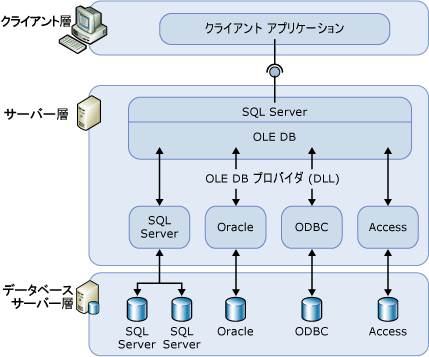

# リンク サーバー (データベース エンジン)

[!INCLUDE[appliesto-ss-asdbmi-xxxx-xxx-md](../../includes/appliesto-ss-asdbmi-xxxx-xxx-md.md)]

  リンク サーバーを使用すると、[!INCLUDE[ssDEnoversion](../../includes/ssdenoversion-md.md)] および [Azure SQL Database Managed Instance](https://docs.microsoft.com/azure/sql-database/sql-database-managed-instance-index) では、リモート データ ソースからデータを読み取ったり、[!INCLUDE[ssNoVersion](../../includes/ssnoversion-md.md)] のインスタンスの外部にあるリモート データベース サーバー (たとえば、OLE DB データ ソース) に対してコマンドを実行することができます。 通常、リンク サーバーを構成する目的は、 [!INCLUDE[ssDE](../../includes/ssde-md.md)] の別のインスタンスまたは別のデータベース製品 (Oracle など) のテーブルを含んだ [!INCLUDE[tsql](../../includes/tsql-md.md)] ステートメントを [!INCLUDE[ssNoVersion](../../includes/ssnoversion-md.md)]から実行できるようにすることです。 [!INCLUDE[msCoName](../../includes/msconame-md.md)] Access、Excel、Azure CosmosDB など、さまざまな種類の OLE DB データ ソースをリンク サーバーとして構成できます。

> [!NOTE]
> リンク サーバーは、[!INCLUDE[ssDEnoversion](../../includes/ssdenoversion-md.md)] および Azure SQL Database Managed Instance で使用できます。 Azure SQL Database シングルトンおよびエラスティック プールでは使用できません。 [Managed Instance には、ここに示されるいくつかの制限](https://docs.microsoft.com/azure/sql-database/sql-database-managed-instance-transact-sql-information#linked-servers)があります。 

## リンク サーバーを使用する場合

  リンク サーバーを使用すると、他のデータベース内のデータをフェッチおよび更新できる分散データベースを実装することができます。 これらは、カスタム アプリケーション コードを作成したりリモート データ ソースから直接読み込むことなく、データベース シャーディングを実装する必要があるシナリオで適切なソリューションです。 リンク サーバーには次の利点があります。  
  
-   [!INCLUDE[ssNoVersion](../../includes/ssnoversion-md.md)]の外部のデータにアクセスできる。  
  
-   企業内のさまざまなデータ ソースに対して分散クエリ、更新、コマンド、およびトランザクションを実行できる。  
  
-   さまざまなデータ ソースを同じように処理できる。  
  
リンク サーバーの構成は、 [!INCLUDE[ssManStudioFull](../../includes/ssmanstudiofull-md.md)] または [sp_addlinkedserver &#40;Transact-SQL&#41;](../../relational-databases/system-stored-procedures/sp-addlinkedserver-transact-sql.md) ステートメントを使用して行うことができます。 各 OLE DB プロバイダーは、必要なパラメーターの数と型という点で大きく異なります。 たとえば、プロバイダーによっては、 [sp_addlinkedsrvlogin &#40;Transact-SQL&#41;](../../relational-databases/system-stored-procedures/sp-addlinkedsrvlogin-transact-sql.md)からコマンドを実行できるようにするには、リンク サーバーを構成します。 [!INCLUDE[ssNoVersion](../../includes/ssnoversion-md.md)] から OLE DB ソース上のデータを更新できる OLE DB プロバイダーもあれば、 読み取り専用データ アクセスに特化したものも存在します。 各 OLE DB プロバイダーの詳細については、該当する OLE DB プロバイダーのドキュメントを参照してください。  
  
## リンク サーバーのコンポーネント  
 リンク サーバーの定義では、次のオブジェクトを指定します。  
  
-   OLE DB プロバイダー  
  
-   OLE DB データ ソース  
  
*OLE DB プロバイダー* は、特定のデータ ソースを管理し、相互運用する DLL です。 *OLE DB データ ソース* は、OLE DB を使用してアクセスできる特定のデータベースを識別します。 リンク サーバーの定義を使用してクエリが行われるデータ ソースは通常はデータベースですが、さまざまなファイルやファイル形式用の OLE DB プロバイダーが存在します。 これには、テキスト ファイル、ワークシートのデータ、およびフルテキスト検索の結果が含まれます。  
  
[!INCLUDE[msCoName](../../includes/msconame-md.md)] [!INCLUDE[ssNoVersion](../../includes/ssnoversion-md.md)] Native Client OLE DB プロバイダー (PROGID: SQLNCLI11) は、[!INCLUDE[ssNoVersion](../../includes/ssnoversion-md.md)] 用の公式の OLE DB プロバイダーです。  
  
> [!NOTE]  
> [!INCLUDE[ssNoVersion](../../includes/ssnoversion-md.md)] 分散クエリは、必要な OLE DB インターフェイスを実装しているすべての OLE DB プロバイダーで処理できるように設計されています。 ただし、 [!INCLUDE[ssNoVersion](../../includes/ssnoversion-md.md)] では、 [!INCLUDE[ssNoVersion](../../includes/ssnoversion-md.md)] Native Client OLE DB プロバイダーなど、特定のプロバイダーに対してのみテストが行われています。  
  
## リンク サーバーの詳細  
 次の図に、基本的なリンク サーバー構成を示します。  
  
   
  
リンク サーバーは、通常は分散クエリの処理に使用します。 クライアント アプリケーションからリンク サーバー経由で分散クエリが実行されるときは、 [!INCLUDE[ssNoVersion](../../includes/ssnoversion-md.md)] でコマンドが解析され、OLE DB に要求が送信されます。 行セット要求は、プロバイダーに対するクエリの実行や、プロバイダーのベース テーブルを開くなどの形式をとります。  
  
> [!NOTE]
> データ ソースがリンク サーバー経由でデータを返すには、そのデータ ソースの OLE DB プロバイダー (DLL) が [!INCLUDE[ssNoVersion](../../includes/ssnoversion-md.md)]のインスタンスと同じサーバー上に存在する必要があります。  
  
> [!IMPORTANT] 
> OLE DB プロバイダーを使用する場合、[!INCLUDE[ssNoVersion](../../includes/ssnoversion-md.md)] サービスを実行しているアカウントには、プロバイダーがインストールされているディレクトリとそのすべてのサブディレクトリに対する読み取り権限と実行権限が必要です。 これには、Microsoft によってリリースされたプロバイダー、およびすべてのサードパーティのプロバイダーが含まれます。 
  
## プロバイダーの管理  
[!INCLUDE[ssNoVersion](../../includes/ssnoversion-md.md)] が OLE DB プロバイダーを読み込んで使用する方法を制御する一連のオプションは、レジストリで指定されます。  
  
## リンク サーバー定義の管理  
リンク サーバーをセットアップするときは、接続情報とデータ ソース情報を [!INCLUDE[ssNoVersion](../../includes/ssnoversion-md.md)]に登録します。 登録後、1 つの論理名でデータ ソースを参照できます。  
  
ストアド プロシージャとカタログ ビューを使用して、リンク サーバーの定義を管理できます。  
  
-   **sp_addlinkedserver**を実行して、リンク サーバーの定義を作成します。  
  
-   [!INCLUDE[ssNoVersion](../../includes/ssnoversion-md.md)] sys.servers **システム カタログ ビューに対してクエリを実行して、** の特定のインスタンスに定義されたリンク サーバーに関する情報を表示します。  
  
-   **sp_dropserver**を実行して、リンク サーバーの定義を削除します。 このストアド プロシージャを使用して、リモート サーバーを削除することもできます。  
  
[!INCLUDE[ssManStudioFull](../../includes/ssmanstudiofull-md.md)]を使用して、リンク サーバーを定義することもできます。 オブジェクト エクスプローラーで **[サーバー オブジェクト]** を右クリックし、 **[新規作成]** をポイントして、 **[リンク サーバー]** をクリックします。 リンク サーバー名を右クリックして **[削除]** をクリックすると、リンク サーバーの定義を削除できます。  
  
 リンク サーバーに対して分散クエリを実行する場合は、クエリを実行するデータ ソースごとに 4 つの部分で構成される完全修飾テーブル名を指定します。 この 4 つの部分で構成される名前は、<_リンク サーバー名>.<カタログ_> **.** <_スキーマ_> **.** <_オブジェクト名_> という形式にする必要があります。  
  
> [!NOTE]  
> リンク サーバーは、どのサーバーで定義されたかを示す (ループ バックする) ように定義することができます。 ループバック サーバーは、単一のサーバー ネットワークで分散クエリを使用するアプリケーションをテストする際に最も有効です。 ループバック リンク サーバーはテスト用であり、分散トランザクションなどの多くの操作ではサポートされていません。  
  
## Related Tasks  
 [リンク サーバーの作成 &#40;SQL Server データベース エンジン&#41;](../../relational-databases/linked-servers/create-linked-servers-sql-server-database-engine.md)  
  
 [sp_addlinkedserver &#40;Transact-SQL&#41;](../../relational-databases/system-stored-procedures/sp-addlinkedserver-transact-sql.md)  
  
 [sp_addlinkedsrvlogin &#40;Transact-SQL&#41;](../../relational-databases/system-stored-procedures/sp-addlinkedsrvlogin-transact-sql.md)  
  
 [sp_dropserver &#40;Transact-SQL&#41;](../../relational-databases/system-stored-procedures/sp-dropserver-transact-sql.md)  
  
## 関連コンテンツ  
 [sys.servers &#40;Transact-SQL&#41;](../../relational-databases/system-catalog-views/sys-servers-transact-sql.md)  
  
 [sp_linkedservers &#40;Transact-SQL&#41;](../../relational-databases/system-stored-procedures/sp-linkedservers-transact-sql.md)  
  
  
