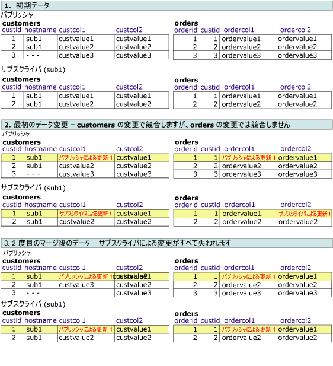
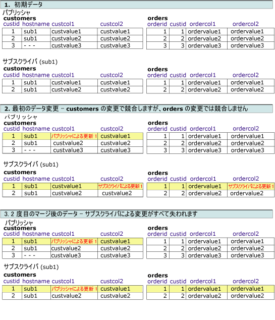
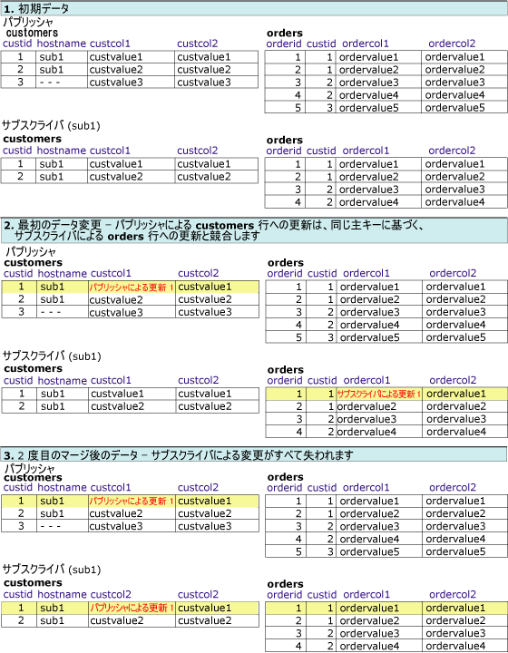

# 論理レコードの競合の検出および解決
  ここでは、論理レコードの使用時に利用できる、競合検出および競合解決方法のさまざまな組み合わせを紹介します。 マージ レプリケーションでの競合は、複数のノードが同じデータを変更したとき、またはマージ レプリケーションが変更をレプリケートするときに制約違反などの特定の種類のエラーに遭遇したときに発生します。 競合の検出および解決の詳細については、「 [Advanced Merge Replication Conflict Detection and Resolution](../../../relational-databases/replication/merge/advanced-merge-replication-conflict-detection-and-resolution.md)」を参照してください。  
  
 アーティクルに対して競合の追跡と競合解決のレベルを指定するには、「 [Specify the Conflict Tracking and Resolution Level for Merge Articles](../../../relational-databases/replication/publish/specify-the-conflict-tracking-and-resolution-level-for-merge-articles.md)」を参照してください。  
  
## 競合検出  
 論理レコードの競合が検出された方法は、2 つのアーティクル プロパティによって決まります。 **column_tracking** と **logical_record_level_conflict_detection**します。 [!INCLUDE[ssVersion2005](../../../includes/ssversion2005-md.md)] およびそれ以降のバージョンは論理レコード レベルの検出もサポートします。  
  
  **Logical_record_level_conflict_detection** アーティクルのプロパティを TRUE または FALSE に設定することができます。 この値はトップ レベルの親アーティクルに対してのみ設定してください。子アーティクルでは無視されます。 マージ レプリケーションが以前のバージョンのように競合を検出してこの値が FALSE の場合は、 [!INCLUDE[ssNoVersion](../../../includes/ssnoversion-md.md)], の値のみに基づいて、 **column_tracking** 、アーティクルのプロパティです。 この値が TRUE の場合は、マージ レプリケーションは無視されます、 **column_tracking** 、アーティクルのプロパティと、論理レコードのどこかの変更が行われた場合に競合を検出します。 たとえば、次のシナリオについて考えてみます。  
  
   
  
 **Customers**、 **Orders**、または **OrderItems** テーブルの Customer2 論理レコードに対して 2 人のユーザーが値を変更した場合に競合が検出されます。 この例では、UPDATE ステートメントにより変更が行われていますが、INSERT または DELETE ステートメントによる変更でも競合が検出されることがあります。  
  
## 競合解決  
 既定では、マージ レプリケーションは優先度に基づくロジックを使用して競合を解決します。 2 つのサブスクライバー データベースで競合する変更が行われた場合、サブスクリプションの優先度が高いサブスクライバー側の変更が優先されます。優先度が同じである場合は、パブリッシャーに先に到達した変更が優先されます。 行レベルおよび列レベルの検出では、優先度の低い行は常に優先される行全体で上書きされます。  
  
  **Logical_record_level_conflict_resolution** アーティクルのプロパティを TRUE または FALSE に設定することができます。 この値はトップ レベルの親アーティクルに対してのみ設定してください。子アーティクルでは無視されます。 この値が TRUE の場合、優先される論理レコード全体が優先度の低い論理レコードを上書きします。 FALSE の場合、優先される個々の行は、別のサブスクライバーまたはパブリッシャーからのものである可能性があります。 たとえば、 **Orders** テーブルの行についてはサブスクライバー A が優先され、 **OrderItems** テーブルの関連する行についてはサブスクライバー B が優先される、という場合があります。 この結果、論理レコードの **Orders** 行はサブスクライバー A のものになり、 **OrderItems** 行はサブスクライバー B のものとなります。  
  
## 競合解決と検出の設定の相関関係  
 競合の結果は、競合の検出および解決の設定の相関関係によって異なります。 次の例では、優先度に基づく競合解決法が使用されているものとします。 論理レコードを使用する場合、以下のケースが考えられます。  
  
-   行レベルまたは列レベルの検出、行レベルの解決  
  
-   列レベルの検出、論理レコード レベルの解決  
  
-   行レベルの検出、論理レコード レベルの解決  
  
-   論理レコード レベルの検出、論理レコード レベルの解決  
  
### 行レベルまたは列レベルの検出、行レベルの解決  
 この例では、パブリケーションは次のように構成されています。  
  
-   **column_tracking** true または FALSE  
  
-   **logical_record_level_conflict_detection** false  
  
-   **logical_record_level_conflict_resolution** false  
  
 この場合、検出は行レベルまたは列レベルであり、解決は行レベルです。 これらは、論理レコードに対するすべての変更を 1 つの単位としてレプリケートさせる利点を活かしながら、論理レコード レベルでの競合の検出または解決を行わないように設定されています。  
  
### 列レベルの検出、論理レコード レベルの解決  
 この例では、パブリケーションは次のように構成されています。  
  
-   **column_tracking** true  
  
-   **logical_record_level_conflict_detection** false  
  
-   **logical_record_level_conflict_resolution** true  
  
 パブリッシャーとサブスクライバーは同じデータセットから開始され、論理レコードは **orders** テーブルと **customers** テーブル間で定義されています。 パブリッシャーは **customers** テーブルの **custcol1** 列および **orders** テーブルの **ordercol1** 列を変更します。 サブスクライバーは **customers** テーブルの同じ行の **custcol1** および **orders** テーブルの同じ行の **ordercol2** 列を変更します。 **customers** テーブルの同じ列に対する変更で競合が発生しますが、 **orders** テーブルへの変更では競合は発生しません。  
  
 競合は論理レコード レベルで解決されるため、レプリケーション処理中にパブリッシャー側で行われた変更が優先され、サブスクライバー テーブルの変更を置換します。  
  
   
  
### 行レベルの検出、論理レコード レベルの解決  
 この例では、パブリケーションは次のように構成されています。  
  
-   **column_tracking** false  
  
-   **logical_record_level_conflict_detection** false  
  
-   **logical_record_level_conflict_resolution** true  
  
 パブリッシャーとサブスクライバーは同じデータセットから開始します。 パブリッシャーは **customers** テーブルの **custcol1** 列を変更します。 サブスクライバーは **customers** テーブルの **custcol2** 列および **orders** テーブルの **ordercol2** 列を変更します。 **customers** テーブルの同じ行に対する変更で競合が発生しますが、サブスクライバーの **orders** テーブルへの変更では競合は発生しません。  
  
 競合は論理レコード レベルで解決されるため、同期中にパブリッシャー側で行われた変更が優先され、サブスクライバー テーブルの変更を置換します。  
  
   
  
### 論理レコード レベルの検出、論理レコード レベルの解決  
 この例では、パブリケーションは次のように構成されています。  
  
-   **logical_record_level_conflict_detection** true  
  
-   **logical_record_level_conflict_resolution** true  
  
 パブリッシャーとサブスクライバーは同じデータセットから開始します。 パブリッシャーは **customers** テーブルの **custcol1** 列を変更します。 サブスクライバーは **orders** テーブルの **ordercol1** 列を変更します。 同じ行または列に変更はありませんので、同じ論理レコードの変更が適用されますが、 **custid**= 1、論理レコード レベルでは競合として検出されます。  
  
 競合は論理レコード レベルでも解決されるため、同期中にパブリッシャー側で行われた変更が優先され、サブスクライバー テーブルの変更を置換します。  
  
   
  
## 参照  
 [論理レコードによる関連行への変更のグループ化](../../../relational-databases/replication/merge/group-changes-to-related-rows-with-logical-records.md)  
  
  