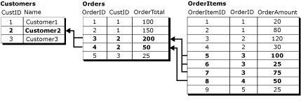
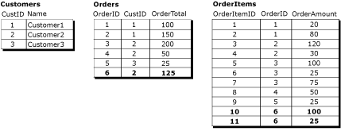

# 論理レコードによる関連行への変更のグループ化
    
> [!NOTE]  
>  [!INCLUDE[ssNoteDepFutureAvoid](../../../includes/ssnotedepfutureavoid-md.md)]  
  
 マージ レプリケーションの既定の動作では、データの変更は行ごとに処理されます。 この動作は多くの場合に適切ですが、アプリケーションによっては、関連する行を 1 つの単位として処理することが必要です。 マージ レプリケーションの論理レコード機能を使用すると、異なるテーブルの関連する行の間にリレーションシップを定義し、それらの行を 1 つの単位として処理できます。  
  
> [!NOTE]  
>  論理レコード機能は、単独で使用することも、結合フィルターと組み合わせて使用することもできます。 結合フィルターの詳細については、次を参照してください。 [結合フィルター](../../../relational-databases/replication/merge/join-filters.md)します。 論理レコードを使用するには、パブリケーションの互換性レベルが少なくとも 90 RTM である必要があります。  
  
 以下の 3 つの関連テーブルについて考えてみます。  
  
   
  
  **顧客** テーブルはこのリレーションシップで親テーブルであり、主キー列を持つ **CustID**します。  **注文** テーブルに主キー列 **OrderID**, の外部キー制約を持つ、 **CustID** 列を参照する、 **CustID** 内の列、 **顧客** テーブルです。 同様に、 **OrderItems** テーブルに主キー列 **OrderItemID**, の外部キー制約を持つ、 **OrderID** 列を参照する、 **OrderID** 内の列、 **注文** テーブルです。  
  
 内のすべての行の論理レコードは、この例では、 **注文** 、1 つに関連付けられているテーブル **CustID** 値とすべての行の **OrderItems** 内の行に関連するテーブル、 **注文** テーブルです。 次の図は、Customer2 の論理レコードに含まれる、3 つのテーブルのすべての行を示しています。  
  
   
  
 アーティクル間の論理レコード リレーションシップを定義するを参照してください。 [、論理レコード リレーションシップ間でマージ テーブル アーティクルを定義する](../../../relational-databases/replication/publish/define-a-logical-record-relationship-between-merge-table-articles.md)です。  
  
## 論理レコードの利点  
 論理レコード機能には、2 つの主な利点があります。  
  
-   データ変更が 1 つの単位として適用されます。  
  
-   競合の検出および解決が、複数のテーブルの複数の行で同時に実行されます。  
  
### 変更を 1 つの単位として適用  
 論理レコードを使用している場合、マージ処理が接続の切断などで中断されると、関連するレプリケートされた変更の部分的に完了したセットは、ロールバックされます。 たとえば、大文字と小文字が、サブスクライバーを追加して、新しい注文を **OrderID** = 6 と 2 つの新しい行に、 **OrderItems** テーブルと **OrderItemID** = 10 と **OrderItemID** = 11 **OrderID** = 6。  
  
   
  
 後に、レプリケーション プロセスが中断された場合、 **注文** 行の **OrderID** = 6 はその前に完了すると、 **OrderItems** 10 と 11 が完了し、論理レコードを使用しない、 **OrderTotal** の場合は値 **OrderID** = 6 の合計と同じにすることはできません、 **OrderAmount** の値、 **OrderItems** 行です。 論理レコードを使用している場合、 **注文** 行の **OrderID** = 6 には、関連するまではコミットされません **OrderItems** 変更をレプリケートします。  
  
 別のシナリオで、論理レコードを使用していて、だれかがマージ処理による変更の適用中にテーブルに対してクエリを実行した場合、そのユーザーには、変更がすべて完了するまで、部分的にレプリケートされた変更は表示されません。 レプリケーション プロセスが行の注文データをアップロードするなどの **OrderID** = 6 ユーザー クエリ、テーブル、レプリケーション プロセスがレプリケートされる前に、 **OrderItems** 、行、 **OrderTotal** 値はありませんの合計と同じ、 **OrderAmount** 値。 論理レコードを使用している場合、 **注文** 行にまで表示されませんが、 **OrderItems** 行が完了し、トランザクションは単位としてコミットされました。  
  
### 複数のテーブルへの競合処理の適用  
 2 つのサブスクライバーが上記のデータセットを保持しているケースを考えてみます。  
  
-   最初のサブスクライバーの変更にユーザー、 **OrderAmount** の **OrderItemID** 100 から 150 に 5 と **OrderTotal** の **OrderID** 200 から 250 に 3 です。  
  
-   2 番目のユーザーがサブスクライバーを変更、 **OrderAmount** の **OrderItemID** 25 から 125 に 6 と **OrderTotal** の **OrderID** 3 は 200 から 300 です。  
  
 さまざまな、論理レコードを使用せず、これらの変更がレプリケートされるかどうか **OrderTotal** 値と競合が発生し、そのうち片方だけがレプリケートされます。 競合しない変更、 **OrderItems** せず、最終的な競合テーブルがレプリケートされることに **OrderTotal** を矛盾した状態値、 **OrderItems** 行です。 論理レコードがこのシナリオで使用されている場合、 **OrderItems** 変更が失われたに関連付けられている **注文** テーブルの変更もロールバックは、[戻る] と [最後の **OrderTotal** 値の正確な集計になります、 **OrderItems** 行です。  
  
 競合の検出と論理レコードによる、解決に関連するオプションの詳細については、次を参照してください。 [論理レコードを解決する競合を検出して](../../../relational-databases/replication/merge/detecting-and-resolving-conflicts-in-logical-records.md)します。  
  
## 論理レコードの使用に関する注意点  
 論理レコードを使用するときは、以下の点に注意してください。  
  
### 全般的な注意点  
  
-   論理レコード内のテーブルは可能な限り少なくすることをお勧めします。テーブル数は 5 つ以下にすることをお勧めします。  
  
-   論理レコードでは、次のデータ型の列は参照できません。  
  
    -   **varchar (max)** と **nvarchar (max)**  
  
    -   **varbinary(max)**  
  
    -   **テキスト** と **ntext**  
  
    -   **image**  
  
    -   **XML**  
  
    -   **UDT (UDT)**  
  
-   パブリッシュされたテーブルの外部キーのリレーションシップを CASCADE オプションで定義することはできません。 詳細については、次を参照してください。 [テーブルの作成と #40 です。Transact SQL と #41;](../../../t-sql/statements/create-table-transact-sql.md)  [変更テーブルと #40 です。Transact SQL と #41;](../../../t-sql/statements/alter-table-transact-sql.md)します。  
  
-   論理リレーション句で使用されている列は更新できません。  
  
-   ビジネス ロジック ハンドラーまたはカスタム競合回避モジュールによるカスタム競合解決は、論理レコードに含まれているアーティクルについてはサポートされていません。  
  
-   パラメーター化されたフィルターを含むパブリケーションで論理レコードが使用されている場合、各サブスクライバーをそのパーティションのスナップショットで初期化する必要があります。 サブスクライバーを別の方法で初期化した場合、マージ エージェントは失敗します。 詳しくは、「 [Snapshots for Merge Publications with Parameterized Filters](../../../relational-databases/replication/snapshots-for-merge-publications-with-parameterized-filters.md)」をご覧ください。  
  
-   論理レコードに関連する競合は、競合表示モジュールに表示されません。 これらの競合に関する情報を表示するには、レプリケーション ストアド プロシージャを使用します。 詳細については、次を参照してください [#40; (&)、マージ パブリケーションの競合情報の表示。レプリケーション TRANSACT-SQL プログラミングと #41;](../../../relational-databases/replication/view conflict information for merge publications.md)します。  
  
### パブリケーションの設定  
  
-   パブリケーションの互換性レベルは 90 RTM 以上である必要があります。 詳細については、の「パブリケーション互換性レベル」を参照してください [レプリケーションの旧バージョンとの互換性](../../../relational-databases/replication/replication-backward-compatibility.md)します。  
  
-   パブリケーションではネイティブ スナップショット モードを使用する必要があります。 論理レコードをサポートしない [!INCLUDE[ssEW](../../../includes/ssew-md.md)] にレプリケートしている場合を除き、これが既定になります。  
  
-   パブリケーションでは Web 同期は許可されません。 Web 同期の詳細については、「 [Web Synchronization for Merge Replication](../../../relational-databases/replication/web-synchronization-for-merge-replication.md)」を参照してください。  
  
-   フィルター選択されたパブリケーションで論理レコードを使用するには  
  
    -   事前計算済みパーティションも使用する必要があります。 事前計算済みパーティションの要件は、論理レコードにも適用されます。 詳細については、次を参照してください。 [事前計算済みパーティションを持つパラメーター化されたフィルター パフォーマンスの最適化](../../../relational-databases/replication/merge/optimize-parameterized-filter-performance-with-precomputed-partitions.md)します。  
  
    -   重複しないパラメーター化されたフィルターは使用できません。 詳細については、「'パーティションのオプション] の設定」セクションを参照してください。 [パラメーター化された行フィルター](../../../relational-databases/replication/merge/parameterized-row-filters.md)します。  
  
-   パブリケーションは、結合フィルターを使用している場合、 **結合一意キー** にプロパティを設定する必要があります **true** のすべての結合の論理レコードのリレーションシップに関連するフィルター。 詳しくは、「 [Join Filters](../../../relational-databases/replication/merge/join-filters.md)」をご覧ください。  
  
### テーブル間のリレーションシップ  
  
-   論理レコードを介して関連付けられたテーブルは、主キーと外部キーのリレーションシップを持っている必要があります。  
  
-   NOT FOR REPLICATION オプションは外部キー制約には設定できません。  
  
-   子テーブルは親テーブルを 1 つだけ持つことができます。  
  
     たとえば、データベース追跡の Class と Students が、次のような設計になっているとします。  
  
       
  
     このリレーションシップでは、3 つのテーブルを表す論理レコードを使うことはできません内の行 **ClassMembers** 主キーの単一行に関連付けられていません。 テーブル **クラス** と **ClassMembers** 、テーブルは、論理レコードを形成できますまだ **ClassMembers** と **受講者**, が、すべての 3 つです。  
  
-   パブリケーションに循環結合フィルター リレーションシップを含めることはできません。  
  
     テーブルの例を使用する **顧客**, 、**注文**, 、および **OrderItems**, 場合、に、論理レコードを使用することできませんでした、 **注文** テーブルが参照する外部キー制約にも、 **OrderItems** テーブルです。  
  
## 論理レコードのパフォーマンスへの影響  
 論理レコード機能を使用すると、パフォーマンスに影響を与えます。 論理レコードを使用しない場合、レプリケーション エージェントは特定のアーティクルに対するすべての変更を同時に処理できます。また、変更は行ごとに適用されるため、変更を適用するために必要なロックおよびトランザクション ログの要件は、最小限になります。  
  
 論理レコードを使用する場合、マージ エージェントは各論理レコード全体に対する変更をまとめて処理する必要があります。 これにより、マージ エージェントが行をレプリケートするためにかかる時間に影響を与えます。 さらに、エージェントは各論理レコードに対して個別にトランザクションを開くため、ロックの要件が増大します。  
  
## 参照  
 [マージ レプリケーションのアーティクルのオプション](../../../relational-databases/replication/merge/article-options-for-merge-replication.md)  
  
  