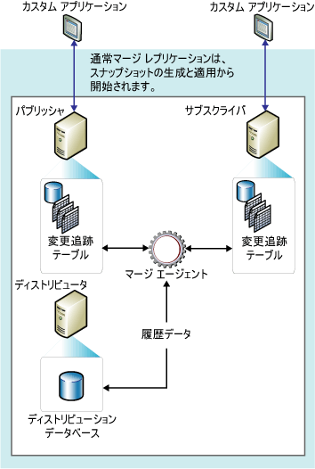

# マージ レプリケーション
[!INCLUDE[appliesto-ss-xxxx-xxxx-xxx-md](../../../includes/appliesto-ss-xxxx-xxxx-xxx-md.md)]
  一般にマージ レプリケーションは、トランザクション レプリケーションと同様に、パブリケーションのデータベース オブジェクトとデータのスナップショットで開始されます。 その後にパブリッシャーとサブスクライバーで行われたデータおよびスキーマの変更は、トリガーを使って追跡されます。 サブスクライバーは、ネットワークに接続されたときにパブリッシャーと同期して、前回の同期以降にパブリッシャーとサブスクライバーの間で変更されたすべての行を交換します。  
  
 マージ レプリケーションは、一般にサーバー対クライアント環境で使用されます。 マージ レプリケーションは、以下の状況に適しています。  
  
-   複数のサブスクライバーで別々の時刻に同じデータを更新し、それらの変更をパブリッシャーや他のサブスクライバーに反映する場合がある。  
  
-   サブスクライバーで、データを受信し、オフラインで変更を行い、後でパブリッシャーおよび他のサブスクライバーと変更を同期する必要がある。  
  
-   各サブスクライバーが、データの別々の部分を必要とする。  
  
-   競合が発生する可能性があり、発生した場合にはそれを検出して解決できる必要がある。  
  
-   アプリケーションで、中間状態のデータにアクセスするのではなく、最終的な変更結果が必要である。 たとえば、サブスクライバーでパブリッシャーと同期する前に行が 5 回変更された場合、最終的な変更結果 (つまり、5 回目の値) を反映させるために、パブリッシャーでは 1 回だけ変更されます。  
  
 マージ レプリケーションでは、さまざまなサイトが自律的に動作し、更新内容が後で 1 つにマージされます。 更新は複数のノードで発生するため、パブリッシャーおよび複数のサブスクライバーで同じデータが更新されている場合があります。 したがって、更新をマージする際に競合が発生する可能性があるため、マージ レプリケーションには競合を処理するいくつかの方法が用意されています。  
  
 マージ レプリケーションは、 [!INCLUDE[ssNoVersion](../../../includes/ssnoversion-md.md)] スナップショット エージェントおよびマージ エージェントによって実装されます。 パブリケーションがフィルター選択されていない場合や静的フィルターを使用している場合、スナップショット エージェントでは 1 つのスナップショットが作成されます。 パブリケーションがパラメーター化されたフィルターを使用している場合、スナップショット エージェントではデータのパーティションごとに 1 つのスナップショットが作成されます。 マージ エージェントは、初期スナップショットをサブスクライバーに適用します。 また、初期スナップショットの作成後にパブリッシャーまたはサブスクライバーで発生したデータの増分変更がマージされ、ユーザーが構成したルールに従って競合を検出し、解決します。  
  
 変更を追跡するため、マージ レプリケーション (およびキュー更新サブスクリプションを使用したトランザクション レプリケーション) では、パブリッシュされたすべてのテーブルのすべての行を一意に識別できる必要があります。 マージ レプリケーションを実行するには、列 **rowguid** をすべてのテーブルに追加します。ただし、データ型が **uniqueidentifier** で **ROWGUIDCOL** プロパティが設定されている列が、テーブルに既にある場合を除きます (このような列がある場合は、その列が使用されます)。 テーブルがパブリケーションから削除されると、 **rowguid** 列も削除されます。既存の列を追跡に使用していた場合は、その列は削除されません。 フィルターには、レプリケーションで行の識別に使用される **rowguidcol** を含めることはできません。 **newid()** 列の既定値として **rowguid** 関数が使用されますが、必要に応じて各行に GUID を指定できます。 ただし、値 00000000-0000-0000-0000-000000000000 は指定しないでください。  
  
 次の図は、マージ レプリケーションで使用されるコンポーネントを示しています。  
  
   
  
  
