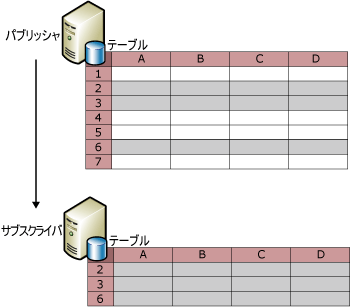
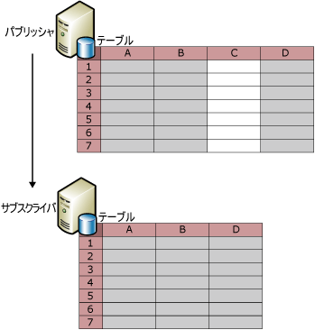
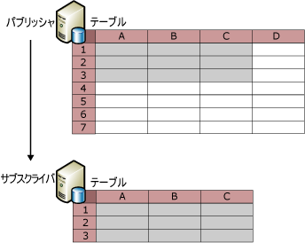

# パブリッシュされたデータのフィルター選択
  テーブル アーティクルをフィルター選択すると、パブリッシュされるデータのパーティションを作成できます。 パブリッシュされたデータをフィルター選択することによって、次のことができるようになります。  
  
-   ネットワーク上で送信するデータ量を最小限に抑えられる。  
  
-   サブスクライバーで必要となる保存領域を削減できます。  
  
-   各サブスクライバーの要件に基づいてパブリケーションとアプリケーションをカスタマイズできます。  
  
-   サブスクライバーがデータを更新する場合に、異なるデータ パーティションを異なるサブスクライバーに送信できるので (2 つのサブスクライバーが同一のデータ値を更新することはない)、競合をなくす、または減らすことができます。  
  
-   機密データの送信を回避できます。 行フィルターと列フィルターを使用して、サブスクライバーによるデータへのアクセスを制限できます。 マージ レプリケーションにおいて HOST_NAME() を含むパラメーター化されたフィルターを使用する場合は、セキュリティ上の留意事項があります。 詳細については、「HOST_NAME() によるフィルター選択」のセクションを参照してください [パラメーター化された行フィルター](../../../relational-databases/replication/merge/parameterized-row-filters.md)します。  
  
 レプリケーションでは、4 種類のフィルターが利用できます。  
  
-   静的行フィルター。すべての種類のレプリケーションで使用できます。  
  
     静的行フィルターを使用して、パブリッシュする行のサブセットを選択できます。 フィルター選択されたパブリケーションに対するすべてのサブスクライバーは、フィルター選択されたテーブルの同じ行のサブセットを受信します。 詳細については、このトピックの「静的行フィルター」を参照してください。  
  
-   列フィルター。すべての種類のレプリケーションで使用できます。  
  
     列フィルターを使用して、パブリッシュする列のサブセットを選択できます。 詳細については、このトピックの「列フィルター」を参照してください。  
  
-   パラメーター化された行フィルター。マージ レプリケーションでのみ使用できます。  
  
     パラメーター化された行フィルターを使用して、パブリッシュする行のサブセットを選択できます。 すべてのサブスクライバーに同じ行のサブセットを送信する静的フィルターと異なり、パラメーター化された行フィルターは、サブスクライバーにより提供されたデータの値を使用し、サブスクライバーにそれぞれ別の行のサブセットを送信します。 詳しくは、「 [Parameterized Row Filters](../../../relational-databases/replication/merge/parameterized-row-filters.md)」をご覧ください。  
  
-   結合フィルター。マージ レプリケーションでのみ使用できます。  
  
     結合フィルターを使用して、1 つのパブリッシュされたテーブルから別のパブリッシュされたテーブルに行フィルターを拡張できます。 詳しくは、「 [Join Filters](../../../relational-databases/replication/merge/join-filters.md)」をご覧ください。  
  
## 静的行フィルター  
 次の図は、行 2、3、および 6 のみがパブリケーションに含まれるようにフィルター選択される、パブリッシュされたテーブルを示します。  
  
   
  
 静的行フィルターは、WHERE 句を使用してパブリッシュするのに適したデータを選択します。WHERE 句の最後の部分を指定してください。 検討してください、 **Product テーブル** 、Adventure Works サンプル データベースを含む列 **ProductLine**します。 マウンテン バイクに関連した製品についてのデータがある行のみをパブリッシュするには、`ProductLine = 'M'` を指定します。  
  
 静的行フィルターにより、各パブリケーションに対するデータセットは 1 つのみとなります。 前の例では、すべてのサブスクライバーは、マウンテン バイクに関連する製品についてのデータがある行のみを受信します。 別のサブスクライバーがロード バイクに関連する製品についてのデータがある行のみを必要としている場合は、次のようになります。  
  
-   スナップショット レプリケーションまたはトランザクション レプリケーションにより、別のパブリケーションを作成し、両方のパブリケーションにテーブルを含めることができます (そのパブリケーションのアーティクルに対するフィルター句で、`ProductLine = 'R')` を指定します)。  
  
    > [!NOTE]  
    >  トランザクション パブリケーションの行フィルターは、オーバーヘッドを大幅に増やす原因となる場合があります。パブリッシュされたテーブルのログ行ごとにアーティクルのフィルター句を評価して、ログ行をレプリケートする必要があるかどうかを判断するからです。 各レプリケーション ノードが全データの読み込みをサポートできる場合、および、データセット全体がそれほど大きくない場合には、トランザクション パブリケーションの行フィルターは避けてください。  
  
-   マージ レプリケーションでは、静的行フィルターで複数のパブリケーションを作成するのではなく、パラメーター化された行フィルターを使用します。 詳しくは、「 [Parameterized Row Filters](../../../relational-databases/replication/merge/parameterized-row-filters.md)」をご覧ください。  
  
 を定義または静的行フィルターを変更するのには、を参照してください。 [静的行フィルター定義および変更](../../../relational-databases/replication/publish/define-and-modify-a-static-row-filter.md)します。  
  
## 列フィルター  
 次の図は、列 C をフィルター選択により除外するパブリケーションを示します。  
  
   
  
 以下に示すように、行フィルターと列フィルターを組み合わせることも可能です。  
  
   
  
 パブリケーションが作成されたら、列のフィルター選択を使用して、既存のパブリケーションからは列を削除してパブリッシャーのテーブルの列を保持することもできますし、パブリケーションに既存の列を含めることもできます。 新しい列をテーブルに追加し、それをパブリッシュされたアーティクルに追加するなど、その他の変更の場合は、スキーマ変更のレプリケーションを使用します。 詳細については、列の追加」および「列の削除」セクションでは、トピックを参照してください。 [パブリケーション データベースでスキーマ変更を行う](../../../relational-databases/replication/publish/make-schema-changes-on-publication-databases.md)します。  
  
 次の表に一覧表示した列の型は、特定の種類のパブリケーションからはフィルター選択により除外することができません。  
  
|列の型|パブリケーションの種類とオプション|  
|-----------------|-------------------------------------|  
|主キー列|主キー列は、トランザクション パブリケーションのすべてのテーブルで必要です。 マージ パブリケーションのテーブルでは、主キーは必要ではありませんが、主キー列が存在する場合、これをフィルター選択することはできません。|  
|外部キー列|パブリケーションの新規作成ウィザードを使用して作成されたすべてのパブリケーション。 外部キー列は、Transact-SQL ストアド プロシージャを使用して、フィルター選択できます。 詳細については、 [列フィルター定義および変更](../../../relational-databases/replication/publish/define-and-modify-a-column-filter.md)します。|  
| **Rowguid** 列|マージ パブリケーション*|  
| **Msrepl_tran_version** 列|更新可能なサブスクリプションを有効にしたスナップショットまたはトランザクション パブリケーション|  
|NULL を許容せず、既定値または IDENTITY プロパティが設定されていない列|更新可能なサブスクリプションを有効にしたスナップショットまたはトランザクション パブリケーション|  
|一意の制約またはインデックスのある列|更新可能なサブスクリプションを有効にしたスナップショットまたはトランザクション パブリケーション|  
|SQL Server 7.0 マージ パブリケーションのすべての列|SQL Server 7.0 マージ パブリケーションで列をフィルター処理することはできません。|  
|Timestamp|SQL Server 7.0 のスナップショット パブリケーションまたは更新可能なサブスクリプションを許可するトランザクション パブリケーション|  
  
 \*マージ パブリケーションでテーブルをパブリッシュすると、そのテーブルに既にデータ型の列が含まれています **uniqueidentifier** で、 **ROWGUIDCOL** プロパティを設定するレプリケーションこの列を使用という列を作成する代わりに **rowguid**します。 この場合、この既存の列をパブリッシュする必要があります。  
  
 定義または列のフィルターを変更、次を参照してください。 [列フィルター定義および変更](../../../relational-databases/replication/publish/define-and-modify-a-column-filter.md)します。  
  
## フィルター選択に関する注意点  
 データをフィルター選択するときは、以下の点に注意してください。  
  
-   行フィルターで参照されるすべての列は、パブリケーションに含まれている必要があります。 つまり、行フィルターで使用される列を除外する列フィルターを使用することはできません。  
  
-   サブスクリプションを初期化した後でフィルターを追加、または変更する場合は、サブスクリプションは再初期化する必要があります。  
  
-   フィルターで使用される列に許容される最大バイト数は、マージ パブリケーションでは、アーティクルにつき 1,024 バイト、トランザクション パブリケーションでは、アーティクルにつき 8,000 バイトです。  
  
-   次のデータ型を持つ列は、行フィルターまたは結合フィルターで参照できません。  
  
    -   **varchar (max)、nvarchar (max)**  
  
    -   **varbinary(max)**  
  
    -   **text、ntext**  
  
    -   **image**  
  
    -   **XML**  
  
    -   **UDT (UDT)**  
  
-   トランザクション レプリケーションでは、インデックス付きビューをビューまたはテーブルとしてレプリケートできます。 このビューをテーブルとしてレプリケートする場合、テーブルから列をフィルター選択することはできません。  
  
 行フィルターは、データベース間で動作するようには設計されていません。 [!INCLUDE[ssNoVersion](../../../includes/ssnoversion-md.md)] 実行を意図的に制限 **sp_replcmds** (フィルターが実行) をデータベース所有者に (**dbo**)。  **Dbo** データベース間の権限がありません。 CDC (Change Data Capture) が追加された [!INCLUDE[ssKatmai](../../../includes/sskatmai-md.md)] 、 **sp_replcmds** ロジックが、変更追跡情報をユーザーに返すクエリでテーブルを設定します。 セキュリティ上の理由から、 [!INCLUDE[ssNoVersion](../../../includes/ssnoversion-md.md)] このロジックの実行を制限できるように、悪意のある **dbo** この実行パスを乗っ取ることができません。 たとえば、悪意のある **dbo** 呼び出しているユーザーのコンテキストで実行を取得し、CDC テーブルのトリガーを追加することが **sp_replcmds**, 、ここでログ リーダー エージェント。  かどうか、エージェントが実行されているアカウントがより高い特権が、悪意のある **dbo** 、特権の昇格可能性があります。  
  
## 参照  
 [データとデータベース オブジェクトのパブリッシュ](../../../relational-databases/replication/publish/publish-data-and-database-objects.md)  
  
  