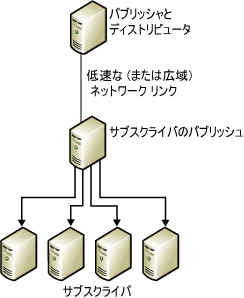
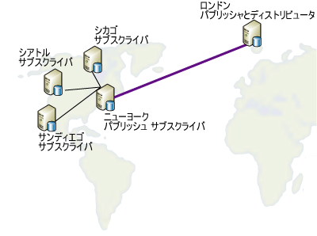

# データの再パブリッシュ
[!INCLUDE[appliesto-ss-asdbmi-xxxx-xxx-md](../../includes/appliesto-ss-asdbmi-xxxx-xxx-md.md)]
  再パブリッシュ モデルでは、パブリッシャーがデータをサブスクライバーに送信し、このサブスクライバーがそのデータを任意の数の他のサブスクライバーに再パブリッシュします。 これは、パブリッシャーが、低速、またはコストが高い通信リンクを使用してサブスクライバーにデータを送信する必要がある場合に役立ちます。 多数のサブスクライバーがそのリンクの端末に接続されている場合には、リパブリッシャーの使用によりディストリビューションの負荷の大部分がそのリンク側に移ります。  
  
 データの再パブリッシュを行うには、以下の手順を実行します。  
  
1.  パブリッシャーでパブリケーションを作成します。  
  
2.  再パブリッシュ サブスクライバーのパブリケーションに対してサブスクリプションを作成します。  
  
3.  サブスクリプションを初期化します。 サブスクリプションは、再パブリッシュ サブスクライバーでパブリケーションが作成される前に、初期化する必要があります。この初期化を行わなかった場合、レプリケーションは失敗します。  
  
4.  再パブリッシュ サブスクライバーで、サブスクリプション データベース内にパブリケーションを作成します。  
  
5.  他のサブスクライバーへの再パブリッシュ サブスクライバーで、パブリケーションに対するサブスクリプションを作成します。  
  
6.  サブスクリプションを初期化します。  

> [!NOTE]  
>  再パブリッシュ トポロジでマージ レプリケーションを使用する場合、すべての再パブリッシュ サブスクライバーはサーバー サブスクリプションを使用する必要があります。 サブスクリプションの種類の詳細については、「[パブリケーションのサブスクライブ](../../relational-databases/replication/subscribe-to-publications.md)」を参照してください。  
  
 以下の図では、パブリッシャーとリパブリッシャーの両方が、各自のローカル ディストリビューターとして動作します。 それぞれがリモート ディストリビューターを使用するように設定された場合は、各ディストリビューターは、低速またはコストが高い通信リンクの、それぞれのパブリッシャーと同じ側に置く必要があります。 パブリッシャーとリモート ディストリビューターは、信頼性の高い、高速通信リンクで接続する必要があります。  
  
   
  
 どのサーバーも、パブリッシャーとサブスクライバーの両方として動作できます。 たとえば、以下の図では、ロンドンにあるテーブルを、シカゴ、ニューヨーク、サンディエゴ、シアトルの 4 つの米国の都市に配信する必要がある場合のパブリケーションを示しています。 この場合は、ニューヨークのサイトが以下の条件を満たしているので、ロンドンでパブリッシュされたテーブルをニューヨークにあるサーバーがサブスクライブするように選択します。  
  
-   ロンドンとのネットワーク リンクが比較的信頼できること。  
  
-   ロンドンとニューヨークの通信コストが妥当であること。  
  
-   ニューヨークと他の 3 つの米国のサブスクライバー サイトが適切なネットワーク通信回線で結ばれていること。  
  
       
  
 レプリケーションでは、次の表に示す再パブリッシュのシナリオがサポートされます。  
  
|パブリッシャー|パブリッシュ元のサブスクライバー|サブスクライバー (Subscriber)|  
|---------------|---------------------------|----------------|  
|トランザクション パブリケーション|トランザクション サブスクリプション/トランザクション パブリケーション|トランザクション サブスクリプション|  
|トランザクション パブリケーション|トランザクション サブスクリプション/マージ パブリケーション*|マージ サブスクリプション|  
|マージ パブリケーション|マージ サブスクリプション/マージ パブリケーション|マージ サブスクリプション|  
|マージ パブリケーション|マージ サブスクリプション/トランザクション パブリケーション|トランザクション サブスクリプション|  
  
 \* マージ パブリケーションで `@published_in_tran_pub` プロパティを設定する必要があります。 既定では、トランザクション レプリケーションにより、サブスクライバーでテーブルが読み取り専用として処理されることが予測されます。 マージ レプリケーションにより、トランザクション サブスクリプションのテーブルでデータの変更が行われる場合、データが集約できなくなる可能性があります。 このリスクを回避するため、マージ パブリケーションではこのようなテーブルをダウンロードのみとして指定することをお勧めします。 これはマージ サブスクライバーがテーブルにデータの変更をアップロードすることを防ぎます。 詳細については、「[ダウンロード専用アーティクルを使用したマージ レプリケーションのパフォーマンス最適化](../../relational-databases/replication/merge/optimize-merge-replication-performance-with-download-only-articles.md)」を参照してください。  
  
## 参照  
 [[ディストリビューションの構成]](../../relational-databases/replication/configure-distribution.md)   
 [データとデータベース オブジェクトのパブリッシュ](../../relational-databases/replication/publish/publish-data-and-database-objects.md)   
 [Subscribe to Publications](../../relational-databases/replication/subscribe-to-publications.md)   
 [サブスクリプションの初期化](../../relational-databases/replication/initialize-a-subscription.md)   
 [データの同期](../../relational-databases/replication/synchronize-data.md)  
  
  
