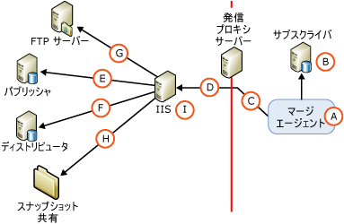

# Web 同期のセキュリティ アーキテクチャ
  [!INCLUDE[msCoName](../../../includes/msconame-md.md)] [!INCLUDE[ssNoVersion](../../../includes/ssnoversion-md.md)] Web 同期のセキュリティの構成の詳細に制御を有効にします。 ここでは、Web 同期の構成に含めることができるすべてのコンポーネントを紹介し、コンポーネント間で行われる接続に関する情報を示します。 [!INCLUDE[ssNoteWinAuthentication](../../../includes/ssnotewinauthentication-md.md)]  
  
 次の図は、考えられるすべての接続を示していますが、特定のトポロジでは要求されない接続もあります。 たとえば、FTP サーバーへの接続は、FTP を使用してスナップショットを配信する場合にのみ必要です。  
  
   
  
 次の表では、上記の図に示したコンポーネントと接続について説明します。  
  
## A. マージ エージェントを実行する Windows ユーザー  
 同期中、マージ エージェント (A) がサブスクライバーで開始されます。 マージ エージェントは、[!INCLUDE[ssNoVersion](../../../includes/ssnoversion-md.md)] エージェントのジョブ ステップまたはスタンドアロンのカスタム アプリケーションから開始できます。 マージ エージェントが開始された場合、 [!INCLUDE[ssNoVersion](../../../includes/ssnoversion-md.md)] エージェント ジョブ ステップでは、マージ エージェントを指定した Windows ユーザーのコンテキストで実行します。 Windows ユーザーを指定しないと、マージ エージェントは [!INCLUDE[ssNoVersion](../../../includes/ssnoversion-md.md)] エージェントの Windows サービス アカウントのコンテキストで実行されます。  
  
|アカウントの種類|アカウントを指定する場所|  
|---------------------|------------------------------------|  
|Windows ユーザー|[!INCLUDE[tsql](../../../includes/tsql-md.md)]:、 **@job_login** と **@job_password** のパラメーター [sp_addmergepullsubscription_agent](../../../relational-databases/system-stored-procedures/sp-addmergepullsubscription-agent-transact-sql.md)します。   RMO (レプリケーション管理オブジェクト): <xref:Microsoft.SqlServer.Replication.IprocessSecurityContext.Login%2A> と <xref:Microsoft.SqlServer.Replication.IprocessSecurityContext.Password%2A> プロパティ <xref:Microsoft.SqlServer.Replication.PullSubscription.SynchronizationAgentProcessSecurity%2A>します。|  
|[!INCLUDE[ssNoVersion](../../../includes/ssnoversion-md.md)] エージェントの Windows サービス アカウント|[!INCLUDE[ssNoVersion](../../../includes/ssnoversion-md.md)] 構成マネージャー|  
|スタンドアロンのアプリケーション|マージ エージェントは、アプリケーションを実行している Windows ユーザーのコンテキストで実行されます。|  
  
## B. サブスクライバーへの接続  
 マージ エージェントは、Windows 認証または [!INCLUDE[ssNoVersion](../../../includes/ssnoversion-md.md)] 認証を使用してサブスクライバーに接続します。 Windows ユーザーまたは [!INCLUDE[ssNoVersion](../../../includes/ssnoversion-md.md)] を指定するログインは、のメンバーであるデータベース ユーザーを関連付ける必要がある、 **dbowner** サブスクリプション データベースの固定データベース ロール。  
  
> [!NOTE]  
>  マージ エージェントが [!INCLUDE[ssNoVersion](../../../includes/ssnoversion-md.md)] エージェント ジョブから起動された場合、常に Windows 認証が使用されます。 マージ エージェントがプログラムから起動された場合も、明示的に [!INCLUDE[ssNoVersion](../../../includes/ssnoversion-md.md)] 認証が指定されている場合を除いて、Windows 認証が使用されます。  
  
|認証の種類|認証を指定する場所|  
|----------------------------|-------------------------------------------|  
|Windows 認証です。|マージ エージェントは、マージ エージェント (A) に指定されている Windows ユーザーのコンテキストで接続します。|  
|[!INCLUDE[ssNoVersion](../../../includes/ssnoversion-md.md)] 認証は、以下が指定されている場合にのみ使用されます。   の値 RMO: <xref:Microsoft.SqlServer.Replication.SecurityMode.Standard> の <xref:Microsoft.SqlServer.Replication.MergeSynchronizationAgent.SubscriberSecurityMode%2A>します。 -マージ エージェントのコマンドライン: の値 **0** の **SubscriberSecurityMode**します。|RMO: <xref:Microsoft.SqlServer.Replication.MergeSynchronizationAgent.SubscriberLogin%2A> と <xref:Microsoft.SqlServer.Replication.MergeSynchronizationAgent.SubscriberPassword%2A>します。   マージ エージェントのコマンドライン: **- SubscriberLogin** と **- SubscriberLogin**します。|  
  
## C. 発信プロキシ サーバーへの接続  
 サブスクライバーの内部ネットワークへのアクセスを制限する発信プロキシ サーバーが存在する場合にのみ、この接続に Windows ユーザーを指定します。  
  
|認証の種類|認証を指定する場所|  
|----------------------------|-------------------------------------------|  
|[Windows 認証]|RMO: <xref:Microsoft.SqlServer.Replication.MergeSynchronizationAgent.InternetProxyLogin%2A> と <xref:Microsoft.SqlServer.Replication.MergeSynchronizationAgent.InternetProxyPassword%2A> と <xref:Microsoft.SqlServer.Replication.MergeSynchronizationAgent.InternetProxyServer%2A>します。   マージ エージェントのコマンドライン: **- InternetProxyLogin** と **- InternetProxyPassword** と **-internetproxyserver**します。|  
  
## D. IIS への接続  
 サブスクライバーに接続して変更をサブスクリプション データベースから抽出した後、マージ エージェントは [!INCLUDE[msCoName](../../../includes/msconame-md.md)] インターネット インフォメーション サービス (IIS) への HTTPS 要求を作成し、データ変更を XML メッセージとしてアップロードします。 マージ エージェントには、IIS に対するログオンの権限が必要です。  
  
|認証の種類|認証を指定する場所|  
|----------------------------|-------------------------------------------|  
|次のいずれかを指定する場合は、基本認証を使用します。   -   [!INCLUDE[tsql](../../../includes/tsql-md.md)]: の値 **0** の、 **@internet_security_mode** のパラメーター [sp_addmergepullsubscription_agent](../../../relational-databases/system-stored-procedures/sp-addmergepullsubscription-agent-transact-sql.md)します。 の値 RMO: <xref:Microsoft.SqlServer.Replication.SecurityMode.Standard> の <xref:Microsoft.SqlServer.Replication.MergeSynchronizationAgent.InternetSecurityMode%2A>します。 -マージ エージェントのコマンドライン: の値 **0** の **- InternetSecurityMode**します。|[!INCLUDE[tsql](../../../includes/tsql-md.md)]:、 **@internet_login** と **@internet_password** のパラメーター [sp_addmergepullsubscription_agent](../../../relational-databases/system-stored-procedures/sp-addmergepullsubscription-agent-transact-sql.md)します。   RMO: <xref:Microsoft.SqlServer.Replication.MergeSynchronizationAgent.InternetLogin%2A> と <xref:Microsoft.SqlServer.Replication.MergeSynchronizationAgent.InternetPassword%2A>します。   マージ エージェントのコマンドライン: **-internetlogin** と **- InternetPassword**します。|  
|統合認証1 は、次のいずれかを指定する場合に使用します。   -   [!INCLUDE[tsql](../../../includes/tsql-md.md)]: の値 **1** の、 **@internet_security_mode** のパラメーター [sp_addmergepullsubscription_agent](../../../relational-databases/system-stored-procedures/sp-addmergepullsubscription-agent-transact-sql.md)します。 の値 RMO: <xref:Microsoft.SqlServer.Replication.SecurityMode.Integrated> の <xref:Microsoft.SqlServer.Replication.MergeSynchronizationAgent.InternetSecurityMode%2A>です。 -マージ エージェントのコマンドライン: の値 **1** の **- InternetSecurityMode**します。|マージ エージェントは、マージ エージェント (A) に指定されている Windows ユーザーのコンテキストで接続します。|  
  
 1 のすべてのコンピューターが同じドメイン内またはが互いに信頼関係がある複数のドメインの場合のみ、統合認証を使用できます。  
  
> [!NOTE]  
>  統合認証を使用する場合は、委任が必要です。 サブスクライバーから IIS への接続には、基本認証と SSL を使用することをお勧めします。  
  
## E. パブリッシャーへの接続  
 [!INCLUDE[ssNoVersion](../../../includes/ssnoversion-md.md)] レプリケーション リスナーおよびマージ レプリケーション競合回避モジュール コンポーネントは、IIS を実行しているコンピューター上でホストされます。 これらのコンポーネントでは、以下の処理が実行されます。  
  
-   「D.  IIS への接続」で説明している HTTPS 要求を取得します。  
  
-   パブリケーション データベースへの SQL 接続を行い、アップロードされた変更をパブリケーション データベースに適用します。  
  
-   ダウンロードされた変更を抽出し、マージ エージェントに HTTPS 応答を返送します。  
  
 マージ レプリケーション競合回避モジュールは、Windows 認証または [!INCLUDE[ssNoVersion](../../../includes/ssnoversion-md.md)] 認証のいずれかを使用してパブリッシャーに接続します。 指定する Windows ユーザーまたは [!INCLUDE[ssNoVersion](../../../includes/ssnoversion-md.md)] ログインは、次の条件を満たしている必要があります。  
  
-   パブリケーション アクセス リスト (PAL) に登録されている。 詳細については、次を参照してください。 [パブリッシャーのセキュリティ保護](../../../relational-databases/replication/security/secure-the-publisher.md)します。  
  
-   パブリケーション データベースのユーザーに関連付けられている。  
  
|認証の種類|認証を指定する場所|  
|----------------------------|-------------------------------------------|  
|次のいずれかを指定する場合は、Windows 認証を使用します。   -   [!INCLUDE[tsql](../../../includes/tsql-md.md)]: の値 **1** の、 **@publisher_security_mode** のパラメーター [sp_addmergepullsubscription_agent](../../../relational-databases/system-stored-procedures/sp-addmergepullsubscription-agent-transact-sql.md)します。 の値 RMO: <xref:Microsoft.SqlServer.Replication.SecurityMode.Integrated> の <xref:Microsoft.SqlServer.Replication.MergeSynchronizationAgent.PublisherSecurityMode%2A>です。 -マージ エージェントのコマンドライン: の値 **1** の **-publishersecuritymode**します。|マージ エージェントは、IIS (D) への接続に指定されている Windows ユーザーのコンテキストでパブリッシャーに接続します。 パブリッシャーと IIS が異なるコンピューター上に存在し、接続 (D) に統合認証を使用する場合は、IIS を実行しているコンピューター上で Kerberos 委任を有効にする必要があります。 詳細については、Windows のマニュアルを参照してください。|  
|[!INCLUDE[ssNoVersion](../../../includes/ssnoversion-md.md)] 次のいずれかを指定する場合は、認証が使用します。   -   [!INCLUDE[tsql](../../../includes/tsql-md.md)]: の値 **0** の、 **@publisher_security_mode** のパラメーター [sp_addmergepullsubscription_agent](../../../relational-databases/system-stored-procedures/sp-addmergepullsubscription-agent-transact-sql.md)します。 の値 RMO: <xref:Microsoft.SqlServer.Replication.SecurityMode.Standard> の <xref:Microsoft.SqlServer.Replication.MergeSynchronizationAgent.PublisherSecurityMode%2A>します。 -マージ エージェントのコマンドライン: の値 **0** の **-publishersecuritymode**します。|[!INCLUDE[tsql](../../../includes/tsql-md.md)]:、 **@publisher_login** と **@publisher_password** のパラメーター [sp_addmergepullsubscription_agent](../../../relational-databases/system-stored-procedures/sp-addmergepullsubscription-agent-transact-sql.md)します。   RMO: <xref:Microsoft.SqlServer.Replication.MergeSynchronizationAgent.PublisherLogin%2A> と <xref:Microsoft.SqlServer.Replication.MergeSynchronizationAgent.PublisherPassword%2A>します。   マージ エージェントのコマンドライン: **-publisherlogin** と **- PublisherPassword**します。|  
  
## F. ディストリビューターへの接続  
 IIS を実行しているコンピューター上でホストされるマージ レプリケーション競合回避モジュールもディストリビューターに接続します。 マージ レプリケーション競合回避モジュールは、Windows 認証または [!INCLUDE[ssNoVersion](../../../includes/ssnoversion-md.md)] 認証のいずれかを使用してディストリビューターに接続します。 指定する Windows ユーザーまたは [!INCLUDE[ssNoVersion](../../../includes/ssnoversion-md.md)] ログインは、次の条件を満たしている必要があります。  
  
-   パブリケーション アクセス リスト (PAL) に登録されている。 詳細については、次を参照してください。 [パブリッシャーのセキュリティ保護](../../../relational-databases/replication/security/secure-the-publisher.md)します。  
  
-   ディストリビューション データベースのユーザーに関連付けられている。 **Guest** ユーザーでもかまいません。  
  
 スナップショット共有は、通常、ディストリビューター上に存在します。 スナップショット共有の詳細については、後半の「H.  スナップショット共有へのアクセス」を参照してください。  
  
|-認証の種類|認証を指定する場所|  
|-------------------------------|-------------------------------------------|  
|次のいずれかを指定する場合は、Windows 認証を使用します。   -   [!INCLUDE[tsql](../../../includes/tsql-md.md)]: の値 **1** の、 **@distributor_security_mode** のパラメーター [sp_addmergepullsubscription_agent](../../../relational-databases/system-stored-procedures/sp-addmergepullsubscription-agent-transact-sql.md)します。 の値 RMO: <xref:Microsoft.SqlServer.Replication.SecurityMode.Integrated> の <xref:Microsoft.SqlServer.Replication.MergeSynchronizationAgent.DistributorSecurityMode%2A>です。 -マージ エージェントのコマンドライン: の値 **1** の **-distributorsecuritymode**します。|マージ エージェントは、IIS (D) への接続に指定されている Windows ユーザーのコンテキストでディストリビューターに接続します。 ディストリビューターと IIS が異なるコンピューター上に存在し、接続 (D) に統合認証を使用する場合は、IIS を実行しているコンピューター上で Kerberos 委任を有効にする必要があります。 詳細については、Windows のマニュアルを参照してください。|  
|[!INCLUDE[ssNoVersion](../../../includes/ssnoversion-md.md)] 次のいずれかを指定する場合は、認証が使用します。   -   [!INCLUDE[tsql](../../../includes/tsql-md.md)]: の値 **0** の、 **@distributor_security_mode** のパラメーター [sp_addmergepullsubscription_agent](../../../relational-databases/system-stored-procedures/sp-addmergepullsubscription-agent-transact-sql.md)します。 の値 RMO: <xref:Microsoft.SqlServer.Replication.SecurityMode.Standard> の <xref:Microsoft.SqlServer.Replication.MergeSynchronizationAgent.DistributorSecurityMode%2A>します。 -マージ エージェントのコマンドライン: の値 **0** の **-distributorsecuritymode**します。|[!INCLUDE[tsql](../../../includes/tsql-md.md)]:、 **@distributor_login** と **@distributor_password** のパラメーター [sp_addmergepullsubscription_agent](../../../relational-databases/system-stored-procedures/sp-addmergepullsubscription-agent-transact-sql.md)します。   RMO: <xref:Microsoft.SqlServer.Replication.MergeSynchronizationAgent.DistributorLogin%2A> と <xref:Microsoft.SqlServer.Replication.MergeSynchronizationAgent.DistributorPassword%2A>   マージ エージェントのコマンドライン: **で-distributorlogin** と **-distributorpassword**します。|  
  
## G. FTP サーバーへの接続  
 スナップショットをサブスクライバーに適用する前に、IIS を実行しているコンピューターに、UNC の場所ではなく FTP サーバーからスナップショット ファイルをダウンロードする場合にのみ、この接続に Windows ユーザーを指定します。 詳細については、次を参照してください。 [FTP でスナップショットを転送](../../../relational-databases/replication/transfer-snapshots-through-ftp.md)します。  
  
|認証の種類|認証を指定する場所|  
|----------------------------|-------------------------------------------|  
|[Windows 認証]|[!INCLUDE[tsql](../../../includes/tsql-md.md)]:、 **@ftp_login** と **@ftp_password** のパラメーター [sp_addmergepublication](../../../relational-databases/system-stored-procedures/sp-addmergepublication-transact-sql.md)します。   RMO: <xref:Microsoft.SqlServer.Replication.Publication.FtpLogin%2A> と <xref:Microsoft.SqlServer.Replication.Publication.FtpPassword%2A>します。|  
  
## H. スナップショット共有へのアクセス  
 スナップショット共有には、IIS を実行しているコンピューター上でホストされるマージ レプリケーション競合回避モジュールを使用してアクセスします。  
  
|認証の種類|認証を指定する場所|  
|----------------------------|-------------------------------------------|  
|[Windows 認証]|マージ エージェントは、IIS (D) への接続に指定されている Windows ユーザーのコンテキストでスナップショット共有に接続します。 スナップショット共有と IIS が異なるコンピューター上に存在し、接続 (D) に統合認証を使用する場合は、IIS を実行しているコンピューター上で Kerberos 委任を有効にする必要があります。 詳細については、Windows のマニュアルを参照してください。|  
  
## I. IIS のアプリケーション プール アカウント  
 このアカウントは、[!INCLUDE[winxpsvr](../../../includes/winxpsvr-md.md)] の場合は IIS を実行しているコンピューター上で W3wp.exe プロセスを開始するために、また、[!INCLUDE[win2kfamily](../../../includes/win2kfamily-md.md)] の場合は Dllhost.exe プロセスを開始するために使用します。 これらのプロセスによって、IIS を実行しているコンピューター上で [!INCLUDE[ssNoVersion](../../../includes/ssnoversion-md.md)] レプリケーション リスナーやマージ レプリケーション競合回避モジュールなどのアプリケーションがホストされます。 このアカウントが必要に対する読み取りし、実行アクセス許可で IIS を実行しているコンピューターは、次のレプリケーション Dll:  
  
-   Replisapi  
  
-   Replrec  
  
-   Replprov  
  
-   Msgprox  
  
-   Xmlsub  
  
 また、このアカウントは IIS_WPG グループの一部である必要があります。 詳細については、セクションを参照して"アクセス許可を設定、 [!INCLUDE[ssNoVersion](../../../includes/ssnoversion-md.md)] レプリケーション リスナー"で [Web 同期用に IIS 構成](../../../relational-databases/replication/configure-iis-for-web-synchronization.md)します。  
  
|アカウントの種類|アカウントを指定する場所|  
|---------------------|------------------------------------|  
|必要な権限を持つ Windows ユーザー|インターネット インフォメーション サービス (IIS) マネージャー。|  
  
## 参照  
 [Web 同期の構成](../../../relational-databases/replication/configure-web-synchronization.md)   
 [レプリケーション マージ エージェント](../../../relational-databases/replication/agents/replication-merge-agent.md)  
  
  