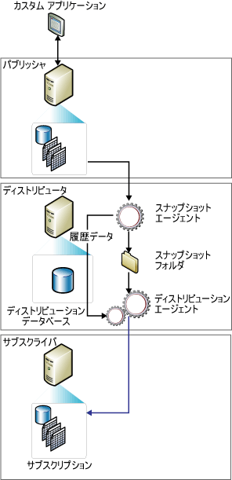

# スナップショット レプリケーション
[!INCLUDE[appliesto-ss-asdbmi-xxxx-xxx-md](../../includes/appliesto-ss-asdbmi-xxxx-xxx-md.md)]
  スナップショット レプリケーションでは、特定の時間に表示されていた状態のデータを配信します。データに対する更新は監視されません。 同期が発生するとデータ全体のスナップショットが作成され、サブスクライバーに送信されます。  
  
> [!NOTE]  
>  スナップショット レプリケーションを単独で使用することもできますが、スナップショット処理 (パブリケーションで指定されたすべてのオブジェクトとデータのコピーを作成する処理) を使用して、トランザクション パブリケーションとマージ パブリケーション用にデータおよびデータベース オブジェクトの初期セットを提供することも一般的です。  
  
 次の条件に 1 つ以上当てはまる場合は、スナップショット レプリケーションを単独で使用する方法が最適です。  
  
-   データの変更頻度が低い。  
  
-   パブリッシャーで期限切れになったデータのコピーが一定の期間存在していても問題がない。  
  
-   レプリケートするデータの量が少ない。  
  
-   短時間に大量の変更が発生する。  
  
 データの変更が大量であるが頻度が低い場合は、スナップショット レプリケーションが最適です。 たとえば、販売組織が製品価格の一覧を保持しており、全価格が一年に一度か二度まとめて更新される場合、データ変更後に全体のスナップショットをレプリケートすることをお勧めします。 特定の種類のデータのスナップショットが頻繁に発生する場合にも適しています。 たとえば、比較的小さいテーブルが日中パブリッシャーで更新され、その更新を即時に反映しなくても問題ない場合に、変更を夜間にスナップショットとして配信することもできます。  
  
 スナップショット レプリケーションでは、増分変更を追跡しないので、トランザクション レプリケーションと比べてパブリッシャー上で連続して発生するオーバーヘッドは小さくなります。 ただし、レプリケートされるデータセットが大きい場合、スナップショットを生成して適用するために多くのリソースが必要となります。 スナップショット レプリケーションの利用を検討する場合には、データセット全体のサイズとデータの変更頻度を考慮してください。  
  
 **このトピックの内容**  
  
 [スナップショット レプリケーションの動作方法](#HowWorks)  
  
 [スナップショット エージェント](#SnapshotAgent)  
  
 [ディストリビューション エージェントとマージ エージェント](#DistAgent)  
  
##   スナップショット レプリケーションの動作方法  
 既定では、3 種類のレプリケーションすべてでスナップショットを使用してサブスクライバーが初期化されます。 [!INCLUDE[ssNoVersion](../../includes/ssnoversion-md.md)] スナップショット エージェントは、必ずスナップショット ファイルを生成しますが、ファイルを配信するエージェントは、使用するレプリケーションの種類によって異なります。 スナップショット レプリケーションとトランザクション レプリケーションでは、ディストリビューション エージェントを使用してファイルが配信されますが、マージ レプリケーションでは、 [!INCLUDE[ssNoVersion](../../includes/ssnoversion-md.md)] マージ エージェントが使用されます。 スナップショット エージェントはディストリビューター側で実行されます。 ディストリビューション エージェントとマージ エージェントは、プッシュ サブスクリプションの場合はディストリビューター側で、プル サブスクリプションの場合はサブスクライバー側で実行されます。  
  
 スナップショットは、サブスクリプションの作成直後、またはパブリケーションの作成時に設定したスケジュールに従って生成および適用できます。 スナップショット エージェントは、パブリッシュされたテーブルやデータベース オブジェクトのスキーマとデータを含むスナップショット ファイルを作成し、ファイルをパブリッシャーのスナップショット フォルダーに格納して、追跡情報をディストリビューターのディストリビューション データベースに記録します。 ディストリビューターを構成する際に既定のスナップショットフォルダーを指定しますが、既定のフォルダーを代替または追加する場所として、パブリケーションに対して代替位置を指定できます。  
  
 このトピックで説明する標準のスナップショット処理の他に、パラメーター化されたフィルターを使用したマージ パブリケーションでは、2 段階のスナップショット処理が使用されます。  
  
 次の図に、スナップショット レプリケーションの主要なコンポーネントを示します。  
  
   
  
##   スナップショット エージェント  
 マージ レプリケーションの場合は、スナップショット エージェントが起動するたびにスナップショットが生成されます。 トランザクション レプリケーションでは、スナップショットの生成はパブリケーション プロパティ **immediate_sync**の設定で決まります。 プロパティが TRUE に設定されていると (パブリケーションの新規作成ウィザードを使用する際の既定の設定)、スナップショット エージェントを実行するたびにスナップショットが生成され、いつでもスナップショットをサブスクライバーに適用できます。 プロパティが FALSE に設定されていると ( **sp_addpublication**を使用する場合の既定の設定)、最後にスナップショット エージェントを実行してから新しいサブスクリプションが追加された場合にのみスナップショットが生成されます。サブスクライバーは、スナップショット エージェントが完了するまで同期することはできません。  
  
 スナップショット エージェントは以下の手順を実行します。  
  
1.  ディストリビューターからパブリッシャーへの接続を確立し、必要に応じてパブリッシュされたテーブルのロックを設定します。  
  
    -   マージ パブリケーションの場合、スナップショット エージェントはロックを設定しません。  
  
    -   トランザクション パブリケーションの場合、既定では、スナップショット生成の初期フェーズの間だけロックを設定します。  
  
    -   スナップショット パブリケーションの場合は、スナップショット生成処理の間中ロックが保持されます。  
  
2.  各アーティクルに対するテーブル スキーマのコピーを .sch ファイルに書き込みます。 インデックス、制約、ストアド プロシージャ、ビュー、ユーザー定義関数などの他のデータベース オブジェクトがパブリッシュされている場合は、追加のスクリプト ファイルが生成されます。  
  
3.  パブリッシュされたテーブルのデータをパブリッシャーでコピーし、スナップショット フォルダーにデータを書き込みます。 スナップショットは、一連の一括コピー プログラム (BCP) ファイルとして生成されます。  
  
4.  スナップショット パブリケーションとトランザクション パブリケーションの場合、ディストリビューション データベース内の **MSrepl_commands** テーブルと **MSrepl_transactions** テーブルに行を追加します。 **MSrepl_commands** テーブル中のエントリは、.sch ファイルと .bcp ファイル、その他のスナップショット ファイルの場所を示すコマンドと、スナップショットの作成前後に実行するスクリプトへの参照です。 **MSrepl_transactions** テーブル内のエントリは、サブスクライバーの同期に関連するコマンドです。  
  
     マージ パブリケーションの場合は、スナップショット エージェントで実行する手順が追加されます。  
  
5.  パブリッシュされたテーブルのすべてのロックを解放します。  
  
 スナップショットの生成中に、パブリッシュされたテーブルのスキーマを変更しないでください。 スナップショット ファイルが生成されると、Windows エクスプローラーを使用して、スナップショット フォルダーにあるそれらのファイルを参照できます。  
  
##   ディストリビューション エージェントとマージ エージェント  
 スナップショット パブリケーションの場合、そのパブリケーションに対してディストリビューション エージェントが起動するたびに、まだ同期されておらず、再初期化のマークが付いているか新しいアーティクルを含む各サブスクライバーへ、新しいスナップショットを移動します。  
  
 スナップショット レプリケーションとトランザクション レプリケーションの場合、ディストリビューション エージェントは以下の手順を実行します。  
  
1.  ディストリビューターへの接続を確立します。  
  
2.  ディストリビューターのディストリビューション データベースにある **MSrepl_commands** テーブルと **MSrepl_transactions** テーブルを調査します。 最初のテーブルからスナップショット ファイルの位置を読み取り、両方のテーブルからサブスクライバー同期コマンドを読み取ります。  
  
3.  スキーマとコマンドをサブスクリプション データベースに適用します。  
  
 フィルター選択されていないマージ レプリケーション パブリケーションの場合、マージ エージェントは以下の手順を実行します。  
  
1.  パブリッシャーへの接続を確立します。  
  
2.  パブリッシャー上の **sysmergeschemachange** テーブルを調べ、サブスクライバーで適用する必要のある新しいスナップショットがあるかどうかを判断します。  
  
3.  新しいスナップショットを利用できる場合、 **sysmergeschemachange**で指定された位置のスナップショット ファイルをサブスクリプション データベースに適用します。  
  
  
