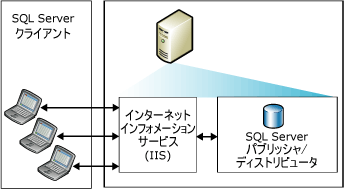
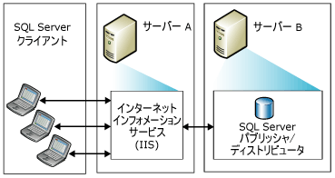
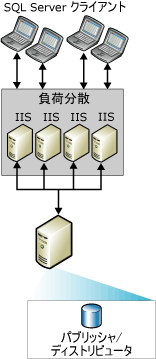
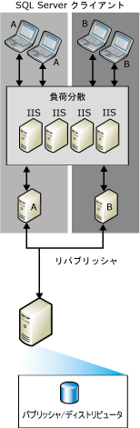

# Web 同期トポロジ
[!INCLUDE[appliesto-ss-xxxx-xxxx-xxx-md](../../includes/appliesto-ss-xxxx-xxxx-xxx-md.md)]
  さまざまな [!INCLUDE[msCoName](../../includes/msconame-md.md)] [!INCLUDE[ssNoVersion](../../includes/ssnoversion-md.md)] Web 同期レプリケーション トポロジを選択できます。 Web 同期の一般的な構成には以下のものがあります。  
  
-   シングル サーバー  
  
-   2 台のサーバー  
  
-   複数台の [!INCLUDE[msCoName](../../includes/msconame-md.md)] インターネット インフォメーション サービス (IIS) システムと [!INCLUDE[ssNoVersion](../../includes/ssnoversion-md.md)] の再パブリッシュ  
  
 Web 同期の構成の詳細については、「[Configure Web Synchronization (Web 同期の構成)](../../relational-databases/replication/configure-web-synchronization.md)」をご覧ください。  
  
## シングル サーバー  
 最も単純なトポロジでは、IIS、 [!INCLUDE[ssNoVersion](../../includes/ssnoversion-md.md)] パブリッシャー、 [!INCLUDE[ssNoVersion](../../includes/ssnoversion-md.md)] ディストリビューターをすべて 1 つのサーバー上に配置します。 サブスクライバーは、パブリッシャー上の IIS に接続することによって同期します。 パブリッシャーは、ファイアウォール内に置くこともできます。  
  
> [!NOTE]  
>  この構成は、イントラネットを使用する場合にのみお勧めします。 他のケースでは、IIS サーバーと [!INCLUDE[ssNoVersion](../../includes/ssnoversion-md.md)] パブリッシャー/ディストリビューターを別々のコンピューター上に配置することをお勧めします。  
  
   
  
## 2 台のサーバー  
 IIS を展開しているサーバーとは別のサーバーに、 [!INCLUDE[ssNoVersion](../../includes/ssnoversion-md.md)] のパブリッシャーとディストリビューターを構成することもできます。 IIS を実行しているサーバーは、ファイアウォールを使用してインターネットから切り離すことができます。 サブスクライバーは IIS に接続することによって同期します。  
  
   
  
## 複数台の IIS システムと SQL Server の再パブリッシュ  
 多数のサブスクライバーをサポートし、それらを同時に同期する必要がある場合は、IIS を実行している複数のコンピューターに処理の負荷を分散させることができます。  
  
   
  
 [!INCLUDE[ssNoVersion](../../includes/ssnoversion-md.md)]を実行しているコンピューターにも負荷の分散が必要となった場合は、複数のコンピューターに再パブリッシュの階層を作成することもできます。 最上位レベルのパブリッシャーはデータをサブスクライバーにパブリッシュし、これを受けてサブスクライバーはデータを再パブリッシュします。結果としてサブスクライバーからの要求の負荷が分散されます。  
  
> [!NOTE]  
>  サブスクライバーは、特定のパブリッシャーとのみ同期できます。 たとえば、リパブリッシャー A が使用できない場合に、リパブリッシャー A に対するサブスクライバーをリパブリッシャー B と同期することはできません。  
  
   
  
## 参照  
 [Web 同期の構成](../../relational-databases/replication/configure-web-synchronization.md)   
 [マージ レプリケーションの Web 同期](../../relational-databases/replication/web-synchronization-for-merge-replication.md)  
  
  
