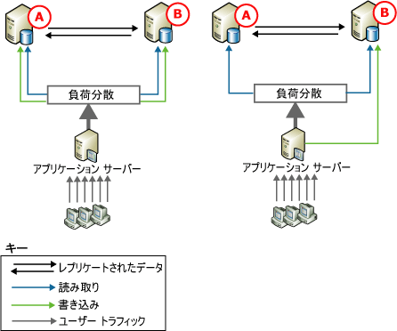
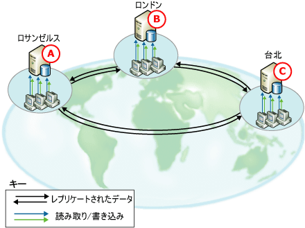
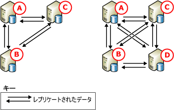

# ピア ツー ピア トランザクション レプリケーション
[!INCLUDE[appliesto-ss-xxxx-xxxx-xxx-md](../../../includes/appliesto-ss-xxxx-xxxx-xxx-md.md)]

  ピア ツー ピア レプリケーションは、データのコピーを複数のサーバー インスタンス ( *ノード*) で保持することにより、可用性の高いスケールアウト ソリューションを実現します。 ピア ツー ピア レプリケーションはトランザクション レプリケーションを基礎としており、トランザクション的に一貫性のある変更がほぼリアルタイムで反映されます。 これにより、読み取り操作のスケールアウトを必要とするアプリケーションで、クライアントからの読み取りを複数のノードに分散することができます。 また、データがほぼリアルタイムで複数のノードに保持されるため、データの冗長性が実現され、データの可用性が向上します。  
  
 たとえば Web アプリケーションでは、 ピア ツー ピア レプリケーションを利用すると次のようなメリットがあります。  
  
-   カタログのクエリやその他の読み取りが複数のノードに分散されるため、 読み取りが増加してもパフォーマンスを維持できます。  
  
-   システムのいずれかのノードに障害が発生した場合、アプリケーション層でそのノードへの書き込みを別のノードにリダイレクトできるため、 可用性が維持されます。  
  
-   ノードのメンテナンスやシステム全体のアップグレードが必要な場合も、それぞれのノードをオフラインにして再度システムに追加することができるため、アプリケーションの可用性に影響が及ぶことはありません。  
  
 ピア ツー ピア レプリケーションでは、読み取り操作のスケール アウトは実現されますが、トポロジへの書き込みのパフォーマンスは 1 つのノードの場合と変わりません。 これは、すべての挿入、更新、および削除が、最終的にすべてのノードに反映されるためです。 特定のノードに変更が適用されたことをレプリケーションが認識するため、変更がノードを何度も循環することはありません。 次のような理由から、各行の書き込み操作は 1 つのノードだけで実行することをお勧めします。  
  
-   行が複数のノードで変更されると、他のノードに反映される際に競合が発生したり、場合によっては更新データが失われたりする可能性があります。  
  
-   変更がレプリケートされるときには常にある程度の遅延が生じます。 最新の変更が直ちに反映される必要があるアプリケーションでは、複数のノードで動的に負荷を分散すると問題が発生する場合があります。  
  
 ピア ツー ピア レプリケーションには、ピア ツー ピア トポロジの競合の検出を有効にするオプションが含まれています。 このオプションは、検出されない競合によって引き起こされる問題 (アプリケーションの動作の矛盾や更新データの喪失など) の防止に役立ちます。 このオプションを有効にすると、競合する変更が、ディストリビューション エージェントの障害を引き起こす重大なエラーとして既定で扱われるようになります。 競合が発生した場合は、その競合が手動で解決されて、トポロジでデータの一貫性が確保されるまで、トポロジが一貫性のない状態のままになります。 詳細については、「 [Conflict Detection in Peer-to-Peer Replication](../../../relational-databases/replication/transactional/peer-to-peer-conflict-detection-in-peer-to-peer-replication.md)」を参照してください。  
  
> [!NOTE]  
>  データの不整合が生じないようにするため、競合の検出を有効にしている場合でも、ピア ツー ピア トポロジで競合を発生させないようにしてください。 特定の行の書き込み操作が 1 つのノードだけで行われるようにするには、データにアクセスしてそのデータを変更するアプリケーションで、挿入、更新、および削除の各操作をパーティション分割する必要があります。 これにより、1 つのノードの特定の行に対する変更は、トポロジ内の他のすべてのノードと同期されてから、別のノードでその行が変更されるようになります。 競合の検出と解決のための高度な機能がアプリケーションに必要な場合は、マージ レプリケーションを使用します。 詳細については、「[Merge Replication](../../../relational-databases/replication/merge/merge-replication.md)」 (マージ レプリケーション) と「[Detect and Resolve Merge Replication Conflicts](../../../relational-databases/replication/merge/advanced-merge-replication-conflict-detection-and-resolution.md)」 (マージ レプリケーションの競合の検出と解決) を参照してください。  
  
## ピア ツー ピア トポロジ  
 次のシナリオは、ピア ツー ピア レプリケーションの典型的な使用方法を示しています。  
  
### 2 つの参加データベースがあるトポロジ  
   
  
 上の図にはいずれも、2 つの参加データベースがあり、ユーザーのトラフィックは、アプリケーション サーバーを通じてデータベースに送信されています。 この構成は、Web サイトからワークグループ アプリケーションまでさまざまなアプリケーションに使用でき、次のような利点があります。  
  
-   読み取りが 2 つのサーバーに分散されるため、読み取りのパフォーマンスが向上する。  
  
-   1 つのノードでメンテナンスが必要な場合や障害が発生した場合に高い可用性を実現する。  
  
 どちらの図でも、読み取り処理の負荷が参加データベース間で分散されていますが、更新の処理は次のように異なっています。  
  
-   左側の図では、更新は 2 つのサーバー間でパーティション分割されています。 たとえば、データベースに製品カタログが含まれている場合、カスタム アプリケーションでは、A ～ M で始まる製品名についてはノード **A** に更新を送信し、N ～ Z で始まる製品名についてはノード **B** に更新を送信するようにできます。その後、更新は他のノードにレプリケートされます。  
  
-   右側の図では、すべての更新がノード **B** に送信されます。そこから、更新はノード **A** にレプリケートされます。**B** がメンテナンスなどの理由でオフラインになると、アプリケーション サーバーはすべての処理を **A** に送信できます。**B** がオンラインに戻ると、更新は B に送られて、アプリケーション サーバーはすべての更新を **B** に移動することも、**A** への送信を維持することもできます。  
  
 ピア ツー ピア レプリケーションはどちらの方法もサポートしますが、右側の図にある中央の更新例は、標準トランザクション レプリケーションでも頻繁に使用されます。  
  
### 3 つ以上の参加データベースがあるトポロジ  
   
  
 この図は、ロサンゼルス、ロンドン、台北にオフィスを持つ、世界規模のソフトウェア サポート企業にデータを提供する 3 つの参加データベースを示しています。 各オフィスのサポート エンジニアはカスタマー コールを受けて、各カスタマー コールに関する情報を入力および更新します。 3 つのオフィスの時間帯は 8 時間の時差があるため、勤務時間が重なることはありません。 台北オフィスが閉まるときに、ロンドン オフィスが開きます。 1 つのオフィスが閉まっているときに 1 つのコールが進行している場合、コールは、次に開くオフィスの代表者に転送されます。  
  
 それぞれのオフィスにはデータベースとアプリケーション サーバーが 1 つずつあり、サポート エンジニアがカスタマー コールに関する情報を入力、更新する際に使用されています。 トポロジは時間でパーティション分割されるので、 現在営業中のノードでのみ更新が行われ、その更新は他の参加データベースに送られます。 このトポロジには、次のような利点があります。  
  
-   孤立せず独立性を維持。各オフィスはデータを個別に挿入、更新、または削除できますが、それらはすべて他の参加データベースにレプリケートされるため、データを共有することもできます。  
  
-   参加データベースのいずれかで障害が発生したり、メンテナンスが行われている場合に高い可用性を実現。  
  
       
  
 この図は、3 つのノードで構成されるトポロジへの 1 つのノードの追加を示しています。 このシナリオでは、次のような場合にノードを追加できます。  
  
-   別のオフィスが開いている場合。  
  
-   ディスク障害やその他の重大な障害が発生したときに、より高い可用性を提供してメンテナンスをサポートしたり、フォールト トレランスを強化する場合。  
  
 3 つおよび 4 つのノードで構成されるトポロジはどちらも、すべてのデータベースが他のすべてのデータベースにパブリッシュおよびサブスクライブしていることに注目してください。 これにより、1 つ以上のノードでメンテナンスが必要な場合や障害が発生した場合に、最大限の可用性が実現されます。 ノードを追加するときには、配置と管理のパフォーマンスおよび複雑さを考慮して可用性とスケーラビリティを調整する必要があります。  
  
## ピア ツー ピア レプリケーションの構成  
 ピア ツー ピア レプリケーション トポロジの構成は、一連の標準トランザクション パブリケーションおよびサブスクリプションの構成とよく似ています。 次のトピックで説明する手順では、3 ノード システムの構成を説明しますが、これは上のピア ツー ピア トポロジを示す図の左側の構成と似ています。  
  
## ピア ツー ピア レプリケーションの使用に関する注意点  
 ここでは、ピア ツー ピア レプリケーションを使用する際に考慮する必要がある情報とガイドラインを示します。  
  
### 全般的な注意点  
  
-   ピア ツー ピア レプリケーションは、 [!INCLUDE[ssNoVersion](../../../includes/ssnoversion-md.md)]の Enterprise バージョンでのみ使用できます。  
  
-   ピア ツー ピア レプリケーションに参加するすべてのデータベースに、同一のスキーマとデータを含める必要があります。  
  
    -   オブジェクト名、オブジェクト スキーマ、およびパブリケーション名が同一である必要があります。  
  
    -   パブリケーションで、スキーマ変更のレプリケートが許可されている (パブリケーション プロパティ **replicate_ddl** が既定の **1** に設定されている) 必要があります。詳細については、「[パブリケーション データベースでのスキーマの変更](../../../relational-databases/replication/publish/make-schema-changes-on-publication-databases.md)」を参照してください。  
  
    -   行と列のフィルター処理はサポートされません。  
  
-   ノードごとに独自のディストリビューション データベースを使用することをお勧めします。 これにより、単一地点での失敗が発生する可能性を低減できます。  
  
-   テーブルおよびその他のオブジェクトは、単一のパブリケーション データベース内の複数のピア ツー ピア パブリケーションに含めることはできません。  
  
-   サブスクリプションを作成するには、パブリケーションをピア ツー ピア レプリケーションで有効にする必要があります。  
  
-   サブスクリプションは、バックアップを使用するか、 **[レプリケーションのサポートのみ]** オプションで初期化する必要があります。 詳細については、「[Initialize a Transactional Subscription Without a Snapshot](../../../relational-databases/replication/initialize-a-transactional-subscription-without-a-snapshot.md)」 (スナップショットを使用しないトランザクション サブスクリプションの初期化) を参照してください。  
  
-   ID 列の使用はお勧めできません。 ID を使用する場合は、各参加データベースのテーブルに割り当てられた範囲を手動で管理する必要があります。 詳細については、「[Replicate Identity Columns](../../../relational-databases/replication/publish/replicate-identity-columns.md)」 (ID 列のレプリケート) で、"Assigning Ranges for Manual Identity Range Management" (手動で ID 範囲を管理する場合の範囲の割り当て) セクションを参照してください。  
  
### 機能の制限  
 ピア ツー ピア レプリケーションではトランザクション レプリケーションの主要な機能がサポートされていますが、次のオプションはサポートされていません。  
  
-   スナップショットを使用した初期化および再初期化  
  
-   行と列のフィルター選択  
  
-   timestamp 列  
  
-   [!INCLUDE[ssNoVersion](../../../includes/ssnoversion-md.md)] 以外のパブリッシャーとサブスクライバー  
  
-   即時更新とキュー更新サブスクリプション  
  
-   匿名サブスクリプション  
  
-   部分サブスクリプション  
  
-   アタッチ可能なサブスクリプションと変換可能なサブスクリプション (どちらも [!INCLUDE[ssVersion2005](../../../includes/ssversion2005-md.md)] では非推奨)  
  
-   共有ディストリビューション エージェント  
  
-   ディストリビューション エージェントのパラメーター **-SubscriptionStreams** とログ リーダー エージェントのパラメーター **-MaxCmdsInTran**  
  
-   アーティクルの `@destination_owner` および `@destination_table` プロパティ。

-   ピア ツー ピア トランザクション レプリケーションでは、ピア ツー ピア パブリケーションの一方向トランザクション サブスクリプションを作成できません   
  
 次のプロパティには特別な注意が必要です。  
  
-   パブリケーションの `@allow_initialize_from_backup` プロパティの値は、**true** にする必要があります。  
  
-   アーティクルでは、`@replicate_ddl` プロパティを値 **true** にし、`@identityrangemanagementoption` を値 **manual** にして、`@status` のオプション **24** を設定する必要があります。  
  
-   アーティクルのプロパティ `@ins_cmd`、`@del_cmd`、および `@upd_cmd` の値を、**SQL** に設定することはできません。  
  
-   サブスクリプションの `@sync_type` プロパティの値は、**none** または **automatic** にする必要があります。  
  
### メンテナンスの注意事項  
 いくつかのアクションを実行する場合は、システムを休止状態にする必要があります。 システムの停止を実行するには、すべてのノードのパブリッシュされたテーブルで処理を停止し、他のすべてのノードからのすべての変更を各ノードが受信しているかどうかを確認します。  
  
||SQL Server 2005 ピアのみ、または SQL Server 2005 ピアと SQL Server 2008 以降のピアの組み合わせ|SQL Server 2005 ピアのみ、または SQL Server 2005 ピアと SQL Server 2008 以降のピアの組み合わせ|SQL2008 以降のピア|SQL2008 以降のピア|  
|-|------------------------------------------------------------------------------------------------------|------------------------------------------------------------------------------------------------------|------------------------------|------------------------------|  
|トポロジへのノードの追加|完全なトポロジで 2 つのノード: 休止処理は必要ありません。 `sync_type = 'initialize with backup'`を使用します。|2 つを超えるノード: 休止処理が必要です。|`sync_type = 'replication support only'`:休止処理が必要です。|`sync_type = 'initialize with backup'` および `'initialize from lsn'`:休止処理は必要ありません。|  
  
 トポロジのスキーマを変更する場合 (アーティクルの追加または削除)、休止処理が必要です。 詳細については、「[Administer a Peer-to-Peer Topology &#40;Replication Transact-SQL Programming&#41;](../../../relational-databases/replication/administration/administer-a-peer-to-peer-topology-replication-transact-sql-programming.md)」 (ピア ツー ピア トポロジの管理 &#40;レプリケーション Transact-SQL プログラミング&#41;) を参照してください。  
  
 トポロジからノードを削除する場合、休止処理は必要ありません。  
  
 [sp_changearticle](../../../relational-databases/system-stored-procedures/sp-changearticle-transact-sql.md) を使用してアーティクルのプロパティを変更する場合、休止処理は必要ありません。 (P2P に関して) 実行可能な変更は、 `description`、 `ins_cmd`、 `upd_cmd`、および `del_cmd` プロパティです。  
  
 アーティクルのスキーマを変更する場合 (列の追加または削除)、休止処理は必要ありません。  
  
-   アーティクルの追加: 既存の構成にアーティクルを追加する場合、システムを休止させた後、CREATE TABLE ステートメントを実行し、トポロジの各ノードで初期データを読み込み、トポロジの各ノードで新しいアーティクルを追加する必要があります。  
  
-   アーティクルの削除: すべてのノードで一貫性のある状態を保持するには、トポロジを休止させる必要があります。  
  
 詳細については、「[Quiesce a Replication Topology &#40;Replication Transact-SQL Programming&#41;](../../../relational-databases/replication/administration/quiesce-a-replication-topology-replication-transact-sql-programming.md)」と (レプリケーション トポロジの停止 (レプリケーション Transact-SQL プログラミング)) 「[Administer a Peer-to-Peer Topology &#40;Replication Transact-SQL Programming&#41;](../../../relational-databases/replication/administration/administer-a-peer-to-peer-topology-replication-transact-sql-programming.md)」 (ピア ツー ピア トポロジの管理 (レプリケーション Transact-SQL プログラミング)) を参照してください。  
  
-   ピア ツー ピア トポロジに新しいノードを追加する場合は、新しいノードの追加後に作成されたバックアップのみを使用して復元する必要があります。  
  
-   ピア ツー ピア トポロジでは、サブスクリプションの再初期化を実行できません。 ノードで新しいデータのコピーを確実に保持する必要がある場合は、そのノードでバックアップを復元してください。  
  
## 参照  
 [ピア ツー ピア トポロジの管理 &#40;レプリケーション Transact-SQL プログラミング&#41;](../../../relational-databases/replication/administration/administer-a-peer-to-peer-topology-replication-transact-sql-programming.md)   
 [スナップショット レプリケーションおよびトランザクション レプリケーションのバックアップと復元の方式](../../../relational-databases/replication/administration/strategies-for-backing-up-and-restoring-snapshot-and-transactional-replication.md)   
 [トランザクション レプリケーション](../../../relational-databases/replication/transactional/transactional-replication.md)  
  
  
