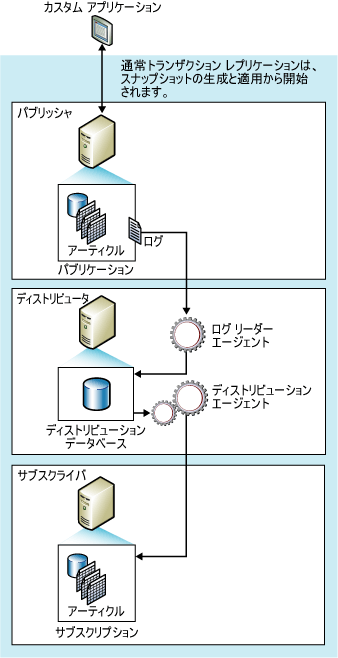

# トランザクション レプリケーション
[!INCLUDE[appliesto-ss-asdb-xxxx-xxx-md.md](../../../includes/appliesto-ss-asdb-xxxx-xxx-md.md)]
  一般にトランザクション レプリケーションは、パブリケーションのデータベース オブジェクトとデータのスナップショットで開始されます。 最初のスナップショットが取得されるとすぐ、それ以後パブリッシャーでデータやスキーマが変更されると、通常はその都度 (ほぼリアルタイムで) サブスクライバーに配信されるようになります。 データの変更は、パブリッシャーで発生したのと同じ順序で、同じトランザクションの中で、サブスクライバーに適用されます。したがって、パブリケーション内では、トランザクションの一貫性が保証されます。  
  
 トランザクション レプリケーションは一般にサーバー間の環境で使用され、次のような場合に適しています。  
  
-   増分変更をその都度サブスクライバーに反映する場合。  
  
-   アプリケーションで、パブリッシャーでの変更をサブスクライバーに反映するまでの待機時間を短くする必要がある場合。  
  
-   アプリケーションで中間状態のデータにアクセスする必要がある場合。 たとえば行が 5 回変更された場合、トランザクション レプリケーションでは、その行の最終的な変更結果だけでなく、それぞれの変更にアプリケーションで応答すること (トリガーを起動するなど) ができます。  
  
-   パブリッシャーで大量の挿入、更新、および削除が行われる場合。  
  
-   パブリッシャーまたはサブスクライバーが[!INCLUDE[ssNoVersion](../../../includes/ssnoversion-md.md)] 以外のデータベース (Oracle など) である場合。  
  
 既定では、変更はパブリッシャーには反映されないため、トランザクション パブリケーションに対するサブスクライバーは読み取り専用として処理されます。 ただし、サブスクライバーでの更新を許可するオプションも用意されています。  

[!INCLUDE[azure-sql-db-replication-supportability-note](../../../includes/azure-sql-db-replication-supportability-note.md)]
  
##   トランザクション レプリケーションの動作方法  
 トランザクション レプリケーションは、 [!INCLUDE[ssNoVersion](../../../includes/ssnoversion-md.md)] のスナップショット エージェント、ログ リーダー エージェント、およびディストリビューション エージェントによって実装されます。 スナップショット エージェントは、パブリッシュされたテーブルやデータベース オブジェクトのスキーマとデータを含むスナップショット ファイルを作成し、ファイルをスナップショット フォルダーに格納して、同期ジョブをディストリビューターのディストリビューション データベースに記録します。  
  
 ログ リーダー エージェントは、トランザクション レプリケーション用に構成した各データベースのトランザクション ログを監視し、レプリケーションのマークが付けられたトランザクションをトランザクション ログから、信頼性の高いストア アンド フォワード キューとして機能するディストリビューション データベースにコピーします。 ディストリビューション エージェントは、スナップショット フォルダーからの初期スナップショット ファイルと、ディストリビューション データベース テーブルに保持されているトランザクションをサブスクライバーにコピーします。  
  
 パブリッシャーでの増分変更は、待機時間が最小となるように連続実行できるディストリビューション エージェントのスケジュールに従って、またはスケジュールされた間隔で、サブスクライバーに送られます。 即時更新オプションまたはキュー更新オプションなしでトランザクション レプリケーションを使用する場合、データはパブリッシャーで変更されるため、更新の競合は回避されます。 最終的には、すべてのサブスクライバーがパブリッシャーと同じ値になります。 即時更新オプションまたはキュー更新オプションをトランザクション レプリケーションで使用する場合、更新はサブスクライバーで行われます。キュー更新の場合、競合が発生する可能性があります。  
  
 次の図に、トランザクション レプリケーションの主要なコンポーネントを示します。  
  
   
  
##   初期データセット  
 新しいトランザクション レプリケーションでパブリッシャーから増分変更を受信する前に、サブスクライバーは、パブリッシャーのテーブルと同じスキーマおよびデータを持つテーブルを格納する必要があります。 初期データセットは、通常、スナップショット エージェントにより作成され、ディストリビューション エージェントにより配信および適用されるスナップショットです。 初期データセットは、バックアップや、 [!INCLUDE[ssNoVersion](../../../includes/ssnoversion-md.md)] Integration Services などでも提供されます。  
  
 スナップショットがサブスクライバーに配信および適用されると、初期スナップショットを待っているサブスクライバーだけが影響を受けます。 そのパブリケーションに対するその他のサブスクライバー (既に初期化済みのもの) は影響を受けません。  
  
## 同時実行スナップショット処理  
 スナップショット レプリケーションは、スナップショット生成中にレプリケーションの一部としてパブリッシュされたすべてのテーブルに、共有ロックをかけます。 これにより、パブリッシュ テーブルで更新が行われることが防止されます。 トランザクション レプリケーションでの既定である、同時実行スナップショット処理では、スナップショットの生成中に共有ロックが設定されることはありません。ユーザーはレプリケーションが初期スナップショット ファイルを作成している間も作業を継続できます。  
  
##   スナップショット エージェント  
 スナップショット エージェントがトランザクション レプリケーションで初期スナップショットを実装する手順はスナップショット レプリケーションと同じです (ただし、上記の同時実行スナップショット処理に該当する部分は除きます)。  
  
 スナップショット ファイルが作成されると、 [!INCLUDE[msCoName](../../../includes/msconame-md.md)] Windows エクスプローラーを使用してスナップショット フォルダー内のそれらのファイルを参照できます。  
  
##   データの変更およびログ リーダー エージェント  
 ログ リーダー エージェントはディストリビューターで実行されます。通常は連続実行されますが、設定したスケジュールに従って実行することもできます。 ログ リーダー エージェントを実行すると、パブリケーション トランザクション ログ (通常の [!INCLUDE[ssNoVersion](../../../includes/ssnoversion-md.md)] データベース エンジン動作時にトランザクションの追跡と復旧に使用するものと同じデータベース ログ) の読み取り後、レプリケーション用にマークが付けられているトランザクション内のデータに対する INSERT、UPDATE、DELETE ステートメントなどの変更が識別されます。 次に、それらのトランザクションが、ディストリビューターのディストリビューション データベースにバッチでコピーされます。 ログ リーダー エージェントでは、内部ストアド プロシージャ **sp_replcmds** を使用して、レプリケーション用にマークを付けたコマンドの次のセットをログから取得します。 ディストリビューション データベースは、ストア アンド フォワード キューになります。ここから、変更をサブスクライバーに送信します。 コミットされたトランザクションだけがディストリビューション データベースに送信されます。  
  
 トランザクションのバッチ全体がディストリビューション データベースに正常に書き込まれるとコミットされます。 ログ リーダー エージェントは、ディストリビューターへのコマンドの各バッチがコミットされた後で、 **sp_repldone** を呼び出して、レプリケーションが最後に完了した日付をマークします。 最後に、ログ リーダー エージェントは、トランザクション ログ内の削除する行をマークします。 レプリケートされるのを待機している行は、削除されません。  
  
 トランザクション コマンドは、すべてのサブスクライバーに反映されるまで、または、最大ディストリビューション保有期間に達するまで、ディストリビューション データベースに保持されます。 サブスクライバーは、トランザクションがパブリッシャーで適用されたときと同じ順序でトランザクションを受信します。  
  
##   ディストリビューション エージェント  
 ディストリビューション エージェントは、プッシュ サブスクリプションのディストリビューターと、プル サブスクリプションのサブスクライバーで動作します。 エージェントは、トランザクションをディストリビューション データベースからサブスクライバーに移動します。 サブスクリプションが検証対象としてマークされている場合、ディストリビューション エージェントは、パブリッシャーのデータとサブスクライバーのデータが一致しているかどうかも確認します。  

## パブリケーションの種類 
トランザクション レプリケーションでは、以下の 4 種類のパブリケーションが提供されます。  
  
|[パブリケーションの種類]|[説明]|  
|----------------------|-----------------|  
|標準トランザクション パブリケーション|サブスクライバーのデータがすべて読み取り専用であるトポロジに適したパブリケーションです (トランザクション レプリケーションでは、このパブリケーションがサブスクライバーで強制されるわけではありません)。   Transact-SQL またはレプリケーション管理オブジェクト (RMO) を使用する場合、標準トランザクション パブリケーションが既定で作成されます。 パブリケーションの新規作成ウィザードを使用する場合、 **[パブリケーションの種類]** ページで **[トランザクション パブリケーション]** を選択すると、標準トランザクション パブリケーションが作成されます。   パブリケーションの作成の詳細については、「[データとデータベース オブジェクトのパブリッシュ](../../../relational-databases/replication/publish/publish-data-and-database-objects.md)」を参照してください。|  
|更新可能なサブスクリプションを含むトランザクション パブリケーション|このパブリケーションの特徴として以下が挙げられます。   -各場所には同一のデータが格納され、パブリッシャーとサブスクライバーが 1 つずつ含まれます。   -サブスクライバーで行を更新することができます。  -これは、高可用性および読み取りのスケーラビリティが求められるサーバー環境に最適なトポロジです。  詳細については、「[更新可能なサブスクリプション](../../../relational-databases/replication/transactional/updatable-subscriptions-for-transactional-replication.md)」を参照してください。|  
|ピア ツー ピア トポロジ|このパブリケーションの特徴として以下が挙げられます。  -各場所には同一のデータが格納され、パブリッシャーおよびサブスクライバーの両方の役割を果たします。  -同一の行は一度に 1 つの場所でのみ変更できます。  -[競合検出](../../../relational-databases/replication/transactional/peer-to-peer-conflict-detection-in-peer-to-peer-replication.md)をサポートします。   -これは、高可用性および読み取りのスケーラビリティが求められるサーバー環境に最適なトポロジです。  詳細については、「[ピア ツー ピア トランザクション レプリケーション](../../../relational-databases/replication/transactional/peer-to-peer-transactional-replication.md)」を参照してください。|  
|双方向トランザクション レプリケーション|このパブリケーションの特徴として以下が挙げられます。 双方向レプリケーションは、ピア ツー ピア レプリケーションに似ています、ただし、競合の解決は提供されません。 また、双方向レプリケーションは、2 台のサーバーに制限されます。    詳細については、「[双方向トランザクション レプリケーション](../../../relational-databases/replication/transactional/bidirectional-transactional-replication.md)」を参照してください。 |  
  
  
