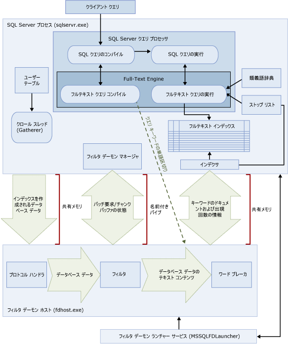

# <a name="full-text-search"></a>フルテキスト検索
[!INCLUDE[appliesto-ss-asdb-xxxx-xxx-md](../../includes/appliesto-ss-asdb-xxxx-xxx-md.md)]

[!INCLUDE[ssNoVersion](../../includes/ssnoversion-md.md)] および [!INCLUDE[ssSDSFull](../../includes/sssdsfull-md.md)] のフルテキスト検索は、ユーザーおよびアプリケーションが [!INCLUDE[ssNoVersion](../../includes/ssnoversion-md.md)] テーブルの文字ベースのデータに対してフルテキスト クエリを実行できるようにします。
  
## <a name="basic-tasks"></a>基本的なタスク
このトピックでは、フルテキスト検索の概要とそのコンポーネントおよびアーキテクチャについて説明します。 すぐに使い始めたい場合は、この基本的なタスクを参照してください。
-   [フルテキスト検索の概要](../../relational-databases/search/get-started-with-full-text-search.md)
-   [フルテキスト カタログの作成と管理](../../relational-databases/search/create-and-manage-full-text-catalogs.md)
-   [フルテキスト インデックスの作成と管理](../../relational-databases/search/create-and-manage-full-text-indexes.md)
-   [フルテキスト インデックスの作成](../../relational-databases/search/populate-full-text-indexes.md)
-   [フルテキスト検索でのクエリ](../../relational-databases/search/query-with-full-text-search.md)

> [!NOTE]
> Full-Text Search is an optional component of the [!INCLUDE[ssNoVersion](../../includes/ssnoversion-md.md)] データベース エンジンのオプションのコンポーネントです。 SQL Server をインストールしたときにフルテキスト検索を選択しなかった場合は、SQL Server セットアップを再実行して追加します。

## <a name="overview"></a>概要
フルテキスト インデックスには、テーブルの 1 つ以上の文字ベースの列が含まれます。 これらの列のデータ型は、**char**、**varchar**、**nchar**、**nvarchar**、**text**、**ntext**、**image**、**xml**、または **varbinary (max)** のいずれかおよび **FILESTREAM** です。 各フルテキスト インデックスによってテーブルの 1 つ以上の列にインデックスが設定され、列ごとに特定の言語を使用できます。  
  
 フルテキスト クエリでは、英語や日本語などの特定の言語の規則に基づいて語や句を操作することにより、フルテキスト インデックス内のテキスト データに対して言語検索を実行できます。 フルテキスト クエリには、単純な語や句、または複数の形式の語や句を含めることができます。 フルテキスト クエリでは、1 つ以上の一致 ( *ヒット*とも呼ばれます) が含まれているすべてのドキュメントが返されます。 一致は、フルテキスト クエリに指定されたすべての語句が対象のドキュメントに含まれていて、その他の検索条件 (一致する語句間の距離など) を満たしているときに、発生します。    
  
##  <a name="queries"></a> フルテキスト検索クエリ  
 フルテキスト インデックスに列が追加されると、ユーザーとアプリケーションはその列のテキストに対してフルテキスト クエリを実行できるようになります。 クエリで検索できる対象は次のとおりです。  
  
-   1 つ以上の語または句 (*単純語句*)  
  
-   指定したテキストで始まる語または句 (*プレフィックス語句*)  
  
-   特定の語の変化形 (*生成語*)  
  
-   他の語または句に近接する語または句 (*近接語句*)  
  
-   特定の語のシノニム形 (*類義語*)  
  
-   重み付け値を使用している語または句 (*重み付け語句*)  
  
 フルテキスト クエリでは大文字と小文字は区別されません。 たとえば、"Aluminum" を検索した場合と "aluminum" を検索した場合では、同じ結果が返されます。  
  
 フルテキスト クエリでは、少数の [!INCLUDE[tsql](../../includes/tsql-md.md)] 述語 (CONTAINS と FREETEXT) および関数 (CONTAINSTABLE と FREETEXTTABLE) が使用されます。 ただし、ビジネス シナリオの検索目的によってフルテキスト クエリの構造は異なります。 例:  
  
-   e ビジネス - Web サイト上で製品を検索する場合:  
  
    ```  
    SELECT product_id   
    FROM products   
    WHERE CONTAINS(product_description, "Snap Happy 100EZ" OR FORMSOF(THESAURUS,'Snap Happy') OR '100EZ')   
    AND product_cost < 200 ;  
    ```  
  
-   人員採用のシナリオ - [!INCLUDE[ssNoVersion](../../includes/ssnoversion-md.md)] の使用経験を持つ候補者を検索する場合:  
  
    ```  
    SELECT candidate_name,SSN   
    FROM candidates   
    WHERE CONTAINS(candidate_resume,"SQL Server") AND candidate_division = 'DBA';  
    ```  
  
 詳細については、「 [フルテキスト検索でのクエリ](../../relational-databases/search/query-with-full-text-search.md)」を参照してください。  
  
##  <a name="like"></a> フルテキスト検索クエリと LIKE 述語の比較
 フルテキスト検索とは異なり、 [LIKE](../../t-sql/language-elements/like-transact-sql.md) [!INCLUDE[tsql](../../includes/tsql-md.md)] 述語は、文字パターンにのみで動作します。 また、フォーマットされたバイナリ データのクエリには LIKE 述語を使用できません。 さらに、構造化されていない大量のテキスト データに対して LIKE クエリを実行すると、同じデータに対して同等のフルテキスト検索を実行する場合に比べてはるかに時間がかかります。 数百万行のテキスト データに対して LIKE クエリを実行すると、結果が得られるまでに数分かかる場合があります。一方、同じデータに対してフルテキスト クエリを実行すると、返される行数にもよりますが、数秒以内で結果を取得できます。  
  
##  <a name="architecture"></a> フルテキスト検索のアーキテクチャ
 フルテキスト検索のアーキテクチャは、次のプロセスで構成されています。  
  
-   [!INCLUDE[ssNoVersion](../../includes/ssnoversion-md.md)] プロセス (sqlservr.exe)。  
  
-   フィルター デーモン ホスト プロセス (fdhost.exe)。  
  
     セキュリティ上の理由から、フィルターはフィルター デーモン ホストと呼ばれる個別のプロセスによって読み込まれます。 fdhost.exe プロセスは、FDHOST ランチャー サービス (MSSQLFDLauncher) によって作成され、FDHOST ランチャー サービス アカウントのセキュリティ資格情報を基に実行されます。 そのため、フルテキスト インデックスやフルテキスト クエリを使用する場合は、FDHOST ランチャー サービスが実行されている必要があります。 このサービスのサービス アカウントの設定の詳細については、「 [フルテキスト フィルター デーモン ランチャーのサービス アカウントの設定](../../relational-databases/search/set-the-service-account-for-the-full-text-filter-daemon-launcher.md)」を参照してください。  
  
 この 2 つのプロセスには、フルテキスト検索のアーキテクチャのコンポーネントが含まれます。 次の図は、各コンポーネントとその関係をまとめたものです。 図の後で、各コンポーネントについて説明します。  
  
   

###  <a name="sqlprocess"></a> SQL Server プロセス  
 [!INCLUDE[ssNoVersion](../../includes/ssnoversion-md.md)] プロセスでは、フルテキスト検索に次のコンポーネントが使用されます。  
  
-   **ユーザー テーブル。** これらのテーブルには、フルテキスト インデックスを作成する対象のデータが格納されます。  
  
-   **フルテキスト Gatherer。** フルテキスト Gatherer は、フルテキスト クロール スレッドと連携して動作します。 このコンポーネントは、フルテキスト インデックス作成のスケジュール設定や実行、およびフルテキスト カタログの監視を行います。  
  
-   **類義語辞典ファイル。** このファイルには、検索語句のシノニムが含まれています。 詳細については、「 [フルテキスト検索に使用する類義語辞典ファイルの構成と管理](../../relational-databases/search/configure-and-manage-thesaurus-files-for-full-text-search.md)」を参照してください。  
  
-   **ストップリスト オブジェクト。** ストップリスト オブジェクトには、頻繁に出現する、検索に不要な語の一覧が含まれています。 詳細については、「 [フルテキスト検索に使用するストップワードとストップリストの構成と管理](../../relational-databases/search/configure-and-manage-stopwords-and-stoplists-for-full-text-search.md)」を参照してください。  
  
-   **[!INCLUDE[ssNoVersion](../../includes/ssnoversion-md.md)] クエリ プロセッサ。** クエリ プロセッサは、SQL クエリをコンパイルして実行します。 SQL クエリにフルテキスト検索クエリが含まれる場合、コンパイル時と実行時にクエリが Full-Text Engine に送信されます。 クエリ結果は、フルテキスト インデックスと照合されます。  
  
-   **Full-Text Engine。** [!INCLUDE[ssNoVersion](../../includes/ssnoversion-md.md)] の Full-Text Engine は、クエリ プロセッサと完全に統合されています。 Full-Text Engine は、フルテキスト クエリをコンパイルして実行します。 クエリの実行の一環として、Full-Text Engine が類義語辞典とストップリストから入力を受け取る場合があります。  

    >[!NOTE]  
    >  [!INCLUDE[ssKatmai](../../includes/sskatmai-md.md)] 以降では、Full-Text Engine は、個別のサービスではなく [!INCLUDE[ssNoVersion](../../includes/ssnoversion-md.md)] プロセス内に存在します。 Full-Text Engine をデータベース エンジンに統合することにより、フルテキストの管理、混合クエリの最適化、および全体的なパフォーマンスが向上しています。  

-   **インデックス ライター (インデクサー)。** インデックス ライターは、インデックスが作成されたトークンの保存に使用される構造を構築します。  
  
-   **フィルター デーモン マネージャー。** フィルター デーモン マネージャーは、Full-Text Engine フィルター デーモン ホストの状態を監視します。  
  
###  <a name="fdhostprocess"></a> Filter Daemon Host process  
 フィルター デーモン ホストは、Full-Text Engine によって起動されるプロセスです。 このプロセスでは、次に示されているフルテキスト検索コンポーネントが実行されます。これらのコンポーネントは、テーブルのデータにアクセスしたりフィルターを適用したり、データを単語に区切ったりします。また、クエリ入力の単語区切りやステミングを行います。  
  
 フィルター デーモン ホストのコンポーネントは次のとおりです。  
  
-   **プロトコル ハンドラー。** このコンポーネントは、メモリからデータを取り出して追加処理を行ったり、指定されたデータベースのユーザー テーブルのデータにアクセスしたりします。 このコンポーネントの役割の 1 つは、フルテキスト インデックスが設定された列からデータを収集し、フィルター デーモン ホストに渡すことです。その後にフィルター デーモン ホストで、必要に応じてフィルターやワード ブレーカーが適用されます。  
  
-   **フィルター。** 一部のデータ型では、ドキュメント内のデータにフルテキスト インデックスを設定する前にフィルター処理が必要になります。 **varbinary**、 **varbinary(max)** 、 **image**、 **xml** 列のデータなどです。 特定のドキュメントで使用されるフィルターは、そのドキュメント型によって異なります。 たとえば、Microsoft Word (.doc) 文書、Microsoft Excel (.xls) ドキュメント、および XML (.xml) ドキュメントでは、それぞれ異なるフィルターが使用されます。 フィルターは、ドキュメントからテキストのチャンクを抽出し、埋め込みの書式設定を削除してテキストを保持します。場合によっては、テキストの位置に関する情報も保持されます。 結果は、テキスト情報のストリームになります。 詳細については、「 [検索用フィルターの構成と管理](../../relational-databases/search/configure-and-manage-filters-for-search.md)」を参照してください。  
  
-   **ワード ブレーカーとステミング機能。** ワード ブレーカーは、特定の言語の語彙の規則に基づいて単語の境界を検出する言語固有のコンポーネントです (*単語区切り*)。 各ワード ブレーカーには、動詞を活用して変化形の拡張を行う言語固有のステミング機能コンポーネントが関連付けられています。 インデックスの作成時、フィルター デーモン ホストでは、ワード ブレーカーとステミング機能を使用して特定のテーブル列のテキスト データに関する言語分析を実行します。 列のインデックス作成に使用されるワード ブレーカーとステミング機能は、フルテキスト インデックスのテーブル列に関連付けられた言語によって決まります。 詳細については、「 [検索用のワード ブレーカーとステミング機能の構成と管理](../../relational-databases/search/configure-and-manage-word-breakers-and-stemmers-for-search.md)」を参照してください。  
  
##  <a name="processing"></a> フルテキスト検索処理  
 フルテキスト検索は Full-Text Engine によって実行されます。 Full-Text Engine にはインデックス作成サポートとクエリ サポートの 2 つの役割があります。  
  
###  <a name="indexing"></a> フルテキスト インデックス作成のプロセス  
 フルテキスト作成 (クロールとも呼ばれます) を開始すると、Full-Text Engine は大きなデータをバッチでメモリにプッシュして、フィルター デーモン ホストに通知します。 フィルター デーモン ホストは、データをフィルター処理してから分解し、逆単語リストに変換します。 次にフルテキスト検索が、変換されたデータを単語リストからプルし、データを処理してストップワードを削除し、バッチ用の単語リストを 1 つ以上の逆インデックスに保持します。  
  
 **varbinary(max)** 型または **image** 型の列に格納されたデータにインデックスを作成する場合には、 **IFilter** インターフェイスを実装するフィルターが、そのデータに指定されたファイル フォーマット ( [!INCLUDE[msCoName](../../includes/msconame-md.md)] Word など) に基づいてテキストを抽出します。 場合によっては、フィルター コンポーネントは **varbinary(max)** 型または **image** 型のデータを filterdata フォルダーに書き込む必要があります。この場合、メモリへのプッシュは行われません。  
  
 一連の処理の中で、生成されたテキスト データがワード ブレーカーに渡され、そこで個々のトークンまたはキーワードに分解されます。 トークン化に使用する言語は列レベルで指定するか、 **varbinary(max)** 型、 **image**型、または **xml** 型データのいずれかからフィルター コンポーネントによって識別されます。  
  
 この後、追加の処理によってストップワードが削除され、トークンが正規化されて、フルテキスト インデックスまたはインデックス フラグメントに格納されます。  
  
 作成が完了すると、最終的なマージ プロセスが起動され、インデックス フラグメントが 1 つのマスター フルテキスト インデックスにマージされます。 これにより、多数のインデックス フラグメントではなく、1 つのマスター インデックスのみをクエリすれば済むため、クエリのパフォーマンスが向上し、関連順位付けにもより的確なスコア (評価) 統計を適用できます。  
  
###  <a name="querying"></a> フルテキスト クエリのプロセス  
 クエリ プロセッサは、処理を行うためにクエリのフルテキストの一部を Full-Text Engine に送ります。 Full-Text Engine は、単語区切りと、必要に応じて、類義語の拡張、語幹への分割、ストップワード (ノイズ ワード) の処理を実行します。 次に、クエリのフルテキストの一部を SQL 演算子の形式で、主にストリーミング テーブル値関数 (STVF) として表現します。 クエリの実行中、STVF は正しい結果を取り出すために逆インデックスにアクセスします。 結果は、この時点でクライアントに戻されるか、さらに処理を加えてからクライアントに戻されます。  

## <a name="full-text-index-architecture"></a>フルテキスト インデックスのアーキテクチャ
  フルテキスト インデックスの情報は、特定の単語や単語の組み合わせをすばやく検索できるフルテキスト クエリをコンパイルするために Full-Text Engine で使用されます。 フルテキスト インデックスには、データベース テーブルの 1 つ以上の列の重要な語およびその場所に関する情報が保存されます。 フルテキスト インデックスは、Full-Text Engine for [!INCLUDE[ssNoVersion](../../includes/ssnoversion-md.md)]により構築および管理されるトークンベースの特殊な機能インデックスです。 フルテキスト インデックスの作成手順は、他のタイプのインデックスの作成手順とは異なります。 特定の行に格納された値に基づいて B ツリー構造を作成するのではなく、Full-Text Engine は、インデックスを作成するテキストの個々のトークンに基づいて、反転、スタック、および圧縮されたインデックス構造を作成します。  フルテキスト インデックスのサイズを制限する要因となるのは、 [!INCLUDE[ssNoVersion](../../includes/ssnoversion-md.md)] のインスタンスが実行されているコンピューターで使用できるメモリ リソースのみです。  
  
 [!INCLUDE[ssKatmai](../../includes/sskatmai-md.md)]以降では、フルテキスト インデックスはデータベース エンジンと統合されており、以前のバージョンの [!INCLUDE[ssNoVersion](../../includes/ssnoversion-md.md)]のようにファイル システムには格納されません。 新しいデータベースでは、フルテキスト カタログは、ファイル グループに属さない仮想オブジェクトです。これは、フルテキスト インデックスのグループを指す論理的概念に過ぎません。 ただし、 [!INCLUDE[ssVersion2005](../../includes/ssversion2005-md.md)] データベースをアップグレードする場合は、データ ファイルを含むフルテキスト カタログの新しいファイル グループが作成されます。詳細については、「 [フルテキスト検索のアップグレード](../../relational-databases/search/upgrade-full-text-search.md)」を参照してください。  
  
1 つのテーブルに対し、1 つのフルテキスト インデックスしか使用できません。 フルテキスト インデックスをテーブルに作成するためには、一意で NULL が許容されない列がそのテーブルに 1 つ必要です。 フルテキスト インデックスを作成できるのは、データ型が **char**、 **varchar**、 **nchar**、 **nvarchar**、 **text**、 **ntext**、 **image**、 **xml**、 **varbinary**および **varbinary(max)** の列です。これらの列には、フルテキスト検索用のインデックスを作成できます。 データ型が  **varbinary**、 **varbinary(max)** 、 **image**、または **xml** の列にフルテキスト インデックスを作成する場合は、型列を指定する必要があります。 *型列* は、各行のドキュメントのファイル拡張子 (.doc、.pdf、.xls など) を格納するテーブル列です。  

###  <a name="structure"></a> フルテキスト インデックスの構造  
 フルテキスト インデックスの構造をよく理解しておくことは、Full-Text Engine の動作を理解するのに役立ちます。 このトピックでは、 **の** Document [!INCLUDE[ssSampleDBCoShort](../../includes/sssampledbcoshort-md.md)] テーブルの抜粋をテーブル例として使用します。 この抜粋には、テーブルの 2 つの列 ( **DocumentID** 列および **Title** 列) と 3 つの行のみが含まれています。  
  
 この例では、 **Title** 列に対してフルテキスト インデックスが作成されているものとします。  
  
|DocumentID|[タイトル]|  
|----------------|-----------|  
|1|Crank Arm and Tire Maintenance|  
|2|Front Reflector Bracket and Reflector Assembly 3|  
|3|Front Reflector Bracket Installation|  
  
 たとえば、次のテーブル (フラグメント 1) は、 **Document** テーブルの **Title** 列に対して作成されたフルテキスト インデックスの内容を示しています。 フルテキスト インデックスには、この表に示されているより多くの情報が含まれています。 このテーブルは、フルテキスト インデックスの論理表現であり、例を挙げる目的で紹介しています。 行は、ディスクの使用量を最適化するために圧縮形式で格納されます。  
  
 データが元のドキュメントとは逆になっていることに注意してください。 これはキーワードがドキュメント ID にマップされているためです。 このため、フルテキスト インデックスは一般に逆インデックスと呼ばれます。  
  
 キーワード "and" がフルテキスト インデックスから削除されていることにも注意してください。 これは "and" がストップワードであり、フルテキスト インデックスからストップワードを削除することで、ディスク領域を大幅に節約し、クエリのパフォーマンスを向上させることができるためです。 ストップワードの詳細については、「 [フルテキスト検索に使用するストップワードとストップリストの構成と管理](../../relational-databases/search/configure-and-manage-stopwords-and-stoplists-for-full-text-search.md)」を参照してください。  
  
 **フラグメント 1**  
  
|Keyword|ColId|DocId|個数|  
|-------------|-----------|-----------|----------------|  
|Crank|1|1|1|  
|Arm|1|1|2|  
|Tire|1|1|4|  
|メンテナンス|1|1|5|  
|Front|1|2|1|  
|Front|1|3|1|  
|Reflector|1|2|2|  
|Reflector|1|2|5|  
|Reflector|1|3|2|  
|Bracket|1|2|3|  
|Bracket|1|3|3|  
|アセンブリ|1|2|6|  
|3|1|2|7|  
|インストール|1|3|4|  
  
 **Keyword** 列には、インデックス作成時に抽出された単一のトークン表現が含まれています。 ワード ブレーカーが、トークンの構成要素を決定します。  
  
 **ColId** 列には、フルテキスト インデックスが作成されている特定の列に対応する値が含まれています。  
  
 **DocId** 列には、フルテキスト インデックスが作成されているテーブルで特定のフルテキスト キー値にマップされる 8 バイトの整数値が含まれています。 このマッピングは、フルテキスト キーが整数データ型でない場合に必要になります。 このような場合、フルテキスト キー値と **DocId** 値とのマッピングは、DocId Mapping テーブルと呼ばれる別のテーブルで保持されます。 これらのマッピングをクエリするには、 [sp_fulltext_keymappings](../../relational-databases/system-stored-procedures/sp-fulltext-keymappings-transact-sql.md) システム ストアド プロシージャを使用します。 検索条件を満たすには、上記の表の DocId 値と DocId Mapping テーブルを結合し、クエリ対象のベース テーブルから行を取得する必要があります。 ベース テーブルのフルテキスト キー値が整数データ型の場合は、その値を DocId として直接使用できるため、マッピングは必要ありません。 したがって、整数データ型のフルテキスト キー値を使用すると、フルテキスト クエリを最適化できます。  
  
 **Occurrence** 列には整数値が含まれます。 DocId 値ごとに、その DocId 内の特定キーワードの相対的な単語オフセットに対応するオカレンス値の一覧があります。 オカレンス値は、句または近接検索の判定に役立ちます。たとえば、句には数値の近いオカレンス値が含まれます。 また、関連性スコアを計算するのにも役立ちます。たとえば、DocId のキーワードのオカレンス数をスコアリングに使用できます。   
  
###  <a name="fragments"></a> フルテキスト インデックス フラグメント  
 論理フルテキスト インデックスは、通常、複数の内部テーブルに分割されます。 各内部テーブルは、フルテキスト インデックス フラグメントと呼ばれます。 これらのフラグメントの一部は、他のフラグメントよりも新しいデータを含んでいることがあります。 たとえば、DocId が 3 である次の行をユーザーが更新し、テーブルの変更が自動的に追跡される場合、新しいフラグメントが作成されます。  
  
|DocumentID|[タイトル]|  
|----------------|-----------|  
|3|Rear Reflector|  
  
 次に示すフラグメント 2 には、フラグメント 1 より新しい、DocId 3 に関するデータが含まれています。 したがって、ユーザーが "Rear Reflector" をクエリした場合、フラグメント 2 に含まれている DocId 3 のデータが使用されます。 各フラグメントには、 [sys.fulltext_index_fragments](../../relational-databases/system-catalog-views/sys-fulltext-index-fragments-transact-sql.md) カタログ ビューを使用してクエリできる作成タイムスタンプが付いています。  
  
 **フラグメント 2**  
  
|Keyword|ColId|DocId|Occ|  
|-------------|-----------|-----------|---------|  
|Rear|1|3|1|  
|Reflector|1|3|2|  
  
 フラグメント 2 を見ればわかるように、フルテキスト クエリでは、各フラグメントを内部的にクエリし、古いエントリを破棄する必要があります。 したがって、非常に多くのフルテキスト インデックス フラグメントがフルテキスト インデックスに含まれている場合、クエリのパフォーマンスが大幅に低下する可能性があります。 フラグメントの数を減らすには、 [ALTER FULLTEXT CATALOG](../../t-sql/statements/alter-fulltext-catalog-transact-sql.md)[!INCLUDE[tsql](../../includes/tsql-md.md)] ステートメントの REORGANIZE オプションを使用してフルテキスト カタログを再構成します。 このステートメントは *マスター マージ*を実行します。マスター マージでは、フラグメントが単一のより大きなフラグメントにマージされ、フルテキスト インデックスから古いエントリがすべて削除されます。  
  
 再構成が完了すると、次の行が例のインデックスに格納されます。  
  
|Keyword|ColId|DocId|Occ|  
|-------------|-----------|-----------|---------|  
|Crank|1|1|1|  
|Arm|1|1|2|  
|Tire|1|1|4|  
|メンテナンス|1|1|5|  
|Front|1|2|1|  
|Rear|1|3|1|  
|Reflector|1|2|2|  
|Reflector|1|2|5|  
|Reflector|1|3|2|  
|Bracket|1|2|3|  
|アセンブリ|1|2|6|  
|3|1|2|7|  

### <a name="differences-between-full-text-indexes-and-regular-sql-server-indexes"></a>フルテキスト インデックスと標準の SQL Server インデックスの違い:  
  
|フルテキスト インデックス|標準の SQL Server インデックス|  
|------------------------|--------------------------------|  
|1 つのテーブルに対し、1 つのフルテキスト インデックスしか使用できません。|1 つのテーブルに対し、複数の標準インデックスを使用できます。|  
|フルテキスト インデックスへのデータの追加は*作成*と呼ばれ、スケジュールによる要求または個別の要求のどちらかを通じて要求できます。または、新規データの追加と共に自動的に行うことができます。|関連するデータが挿入、更新、または削除されたときに、自動的に更新されます。|  
|同じデータベース内で 1 つ以上のフルテキスト カタログにグループ化されます。|グループ化されません。|  

##  <a name="components"></a> フルテキスト検索の言語コンポーネントと言語サポート
 フルテキスト検索では、英語、スペイン語、中国語、日本語、アラビア語、ベンガル語、ヒンディー語など、約 50 種類の言語を使用できます。 サポートされているフルテキスト言語の一覧については、「[sys.fulltext_languages &#40;Transact-SQL&#41;](../../relational-databases/system-catalog-views/sys-fulltext-languages-transact-sql.md)」を参照してください。 フルテキスト インデックスに含まれている各列には Microsoft Windows ロケール識別子 (LCID) が関連付けられています。これは、フルテキスト検索でサポートされている言語を表します。 たとえば、LCID 1033 は米国英語を表し、LCID 2057 は英国英語を表しています。 [!INCLUDE[ssNoVersion](../../includes/ssnoversion-md.md)] では、サポート対象の言語ごとに、その言語で格納されているフルテキスト データのインデックスを作成し、クエリを実行するための言語コンポーネントが用意されています。  
  
 言語固有のコンポーネントは、次のとおりです。  
  
-   **ワード ブレーカーとステミング機能。** ワード ブレーカーは、各言語の語彙規則に基づいて単語の境界を検出します (*単語区切り*)。 各ワード ブレーカーには、その言語の動詞を活用するステミング機能が関連付けられています。 詳細については、「 [検索用のワード ブレーカーとステミング機能の構成と管理](../../relational-databases/search/configure-and-manage-word-breakers-and-stemmers-for-search.md)」を参照してください。  
  
-   **ストップリスト。** 基本的なストップワード (ノイズ ワードとも呼ばれます) をまとめたシステム ストップリストが用意されています。 *ストップワード* とは、検索に役立たないためにフルテキスト クエリで無視される語です。 たとえば、英語ロケールでは、"a"、"and"、"is"、"the" などの語はストップワードと見なされます。 通常は、類義語辞典ファイルおよびストップリストを 1 つ以上構成する必要があります。 詳細については、「 [フルテキスト検索に使用するストップワードとストップリストの構成と管理](../../relational-databases/search/configure-and-manage-stopwords-and-stoplists-for-full-text-search.md)」を参照してください。  
  
-   **類義語辞典ファイル。** [!INCLUDE[ssNoVersion](../../includes/ssnoversion-md.md)] グローバル類義語辞典ファイルと共に、各フルテキスト言語の類義語辞典ファイルもインストールされます。 インストールされた類義語辞典ファイルは基本的には空ですが、このファイルを編集して、特定の言語またはビジネス シナリオ用のシノニムを定義することができます。 フルテキスト データに合わせた類義語辞典を作成すると、そのデータのフルテキスト クエリのスコープを効果的に拡張できます。 詳細については、「 [フルテキスト検索に使用する類義語辞典ファイルの構成と管理](../../relational-databases/search/configure-and-manage-thesaurus-files-for-full-text-search.md)」を参照してください。  
  
-   **フィルター (iFilters)。**  **varbinary(max)** 、 **image**、または **xml** データ型の列に格納されたドキュメントのインデックスを作成するには、追加の処理を実行するためのフィルターが必要です。 このフィルターは、ドキュメントの種類ごと (.doc、.pdf、.xls、.xml など) に用意する必要があります。 詳細については、「 [検索用フィルターの構成と管理](../../relational-databases/search/configure-and-manage-filters-for-search.md)」を参照してください。  
  
 ワード ブレーカー (およびステミング機能) とフィルターは、フィルター デーモン ホスト プロセス (fdhost.exe) で実行されます。  

[!INCLUDE[tsql-appliesto-ss2008-asdb-xxxx-xxx_md](../../includes/tsql-appliesto-ss2008-asdb-xxxx-xxx-md.md)]

