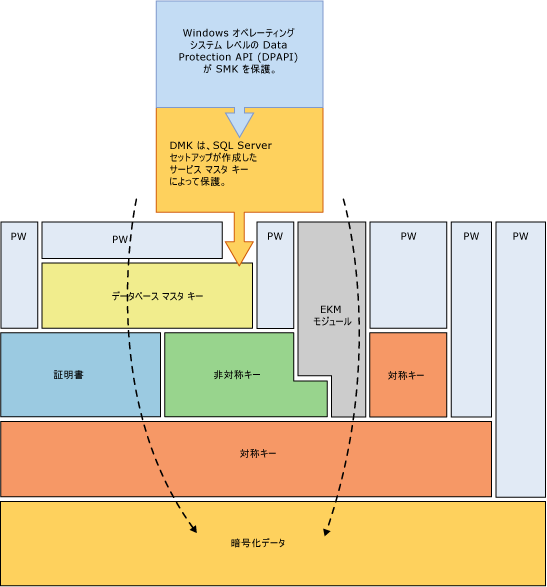
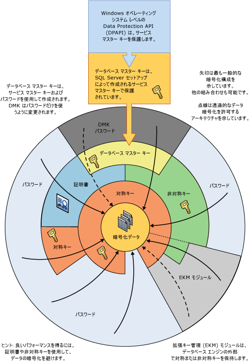

# 暗号化階層
[!INCLUDE[appliesto-ss-asdb-xxxx-xxx-md](../../../includes/appliesto-ss-asdb-xxxx-xxx-md.md)]
  [!INCLUDE[ssNoVersion](../../../includes/ssnoversion-md.md)] では、暗号化とキーの階層的な管理インフラストラクチャを使用してデータを暗号化します。 各層では、証明書、非対称キー、および対称キーの組み合わせを使用して、その層の下位にある層を暗号化します。 拡張キー管理 (EKM) モジュールで、非対称キーと対称キーを [!INCLUDE[ssNoVersion](../../../includes/ssnoversion-md.md)] の外部に格納できます。  
  
 次の図は、暗号化階層のそれぞれの層がその下位にある層を暗号化することを示しており、最も一般的な暗号化構成を示しています。 階層の先頭へのアクセスは、通常、パスワードで保護されます。  
  
   
  
 次の概念に注意してください。  
  
-   最適なパフォーマンスを得るには、証明書や非対称キーではなく、対称キーを使用してデータを暗号化します。  
  
-   データベース マスター キーは、サービス マスター キーによって保護されます。 サービス マスター キーは、 [!INCLUDE[ssNoVersion](../../../includes/ssnoversion-md.md)] セットアップで作成され、Windows データ保護 API (DPAPI) を使用して暗号化されます。  
  
-   追加の層を重ねる他の暗号化階層も使用できます。  
  
-   拡張キー管理 (EKM) モジュールは、SQL Server の外部で対称または非対称キーを保持します。  
  
-   透過的なデータ暗号化 (TDE) では、データベース暗号化キーという対称キーを使用する必要があります。データベース暗号化キーは、master データベースのデータベース マスター キーによって保護される証明書、または EKM に格納された非対称キーによって保護されます。  
  
-   サービス マスター キーとすべてのデータベース マスター キーは対称キーです。  
  
 次の図は、同じ情報を別の方法で示しています。  
  
   
  
 この図は、さらに次の概念を示しています。  
  
-   この図では、矢印は一般的な暗号化階層を示しています。  
  
-   EKM 内の対称キーと非対称キーによって、 [!INCLUDE[ssNoVersion](../../../includes/ssnoversion-md.md)]に格納されている対称キーと非対称キーへのアクセスを保護できます。 EKM に結ばれた点線は、 [!INCLUDE[ssNoVersion](../../../includes/ssnoversion-md.md)]に格納されている対称キーと非対称キーの代わりに EKM 内のキーを使用できることを示しています。  
  
## 暗号化メカニズム  
 [!INCLUDE[ssNoVersion](../../../includes/ssnoversion-md.md)] には、次の暗号化メカニズムが用意されています。  
  
-   [!INCLUDE[tsql](../../../includes/tsql-md.md)] 関数  
  
-   非対称キー  
  
-   対称キー  
  
-   証明書  
  
-   透過的なデータ暗号化  
  
### Transact-SQL 関数  
 個々のアイテムは、 [!INCLUDE[tsql](../../../includes/tsql-md.md)] 関数を使用して挿入または更新するときに暗号化できます。 詳細については、「[ENCRYPTBYPASSPHRASE &#40;Transact-SQL&#41;](../../../t-sql/functions/encryptbypassphrase-transact-sql.md)」および「[DECRYPTBYPASSPHRASE &#40;Transact-SQL&#41;](../../../t-sql/functions/decryptbypassphrase-transact-sql.md)」を参照してください。  
  
### 証明書  
 通常は単に証明書と呼ばれる公開キー証明書は、公開キーの値を、対応する秘密キーを保持する人物、デバイス、またはサービスの ID にバインドする、デジタル署名されたステートメントです。 証明書は、CA (証明機関) によって発行および書名されます。 CA から証明書を受け取るエンティティは、その証明書のサブジェクトです。 通常、証明書には次の情報が含まれています。  
  
-   サブジェクトの公開キー。  
  
-   サブジェクトの ID 情報 (名前や電子メール アドレスなど)。  
  
-   有効期間。 これは、証明書が有効であると見なされる期間です。  
  
     証明書は、証明書で指定された期間中のみ有効です。すべての証明書には、 **有効期間の開始日** と **有効期間の終了日** の日付が含まれています。 これらの日付によって、有効期間の境界が設定されます。 証明書の有効期間が終了すると、現在期限が切れている証明書のサブジェクトを使用して新しい証明書を要求する必要があります。  
  
-   発行者の ID 情報。  
  
-   発行者のデジタル署名。  
  
     この署名により、公開キーとサブジェクトの ID 情報のバインドが有効であることが証明されます (デジタル署名情報の処理により、その情報だけでなく、送信者が保持している一部の機密情報が署名と呼ばれるタグに変換されます)。  
  
 証明書の主な利点は、個々のサブジェクトのパスワードの設定をホストで保守する必要性がなくなる点です。 ホストでは、証明書の発行者の信頼を確立するだけで済みます。信頼された発行者は、多数の証明書に署名できます。  
  
 セキュリティで保護された Web サーバーなどのホストが、信頼されているルート機関として発行者を指定すると、このときホストは、発行された証明書のバインドを確立するために発行者が使用したポリシーを暗黙的に信頼することになります。 つまりホストは、証明書のサブジェクトの ID が発行者側で確認されているものと見なします。 ホストが発行者を信頼されているルート機関として指定する際は、発行者の公開キーが含まれている発行者の自己署名付きの証明書を、ホスト コンピューターの信頼されているルート証明機関の証明書ストアに配置します。 中間または下位の証明機関が信頼されるのは、信頼されているルート証明機関からの有効な証明書パスを持っている場合のみです。  
  
 発行者は、証明書の有効期限が切れる前に、証明書を取り消すことができます。 証明書を取り消すと、証明書で評価されている公開キーと ID のバインドが取り消されます。 各発行者は、特定の証明書の有効性をチェックするときにプログラムで使用できる、証明書の廃止リストを保持しています。  
  
 [!INCLUDE[ssNoVersion](../../../includes/ssnoversion-md.md)] によって作成された自己署名付きの証明書は、X.509 標準に従っており、X.509 v1 フィールドをサポートしています。  
  
### 非対称キー  
 非対称キーは、秘密キーとそれに対応する公開キーで構成されています。 各キーは、他方のキーで暗号化されたデータを暗号化解除できます。 非対称の暗号化と暗号化解除は、比較的リソースを集中して消費しますが、対称の暗号化よりも高レベルのセキュリティを提供します。 非対称キーは、データベース内のストレージに対する対称キーの暗号化に使用できます。  
  
### 対称キー  
 対称キーは、暗号化と暗号化解除の両方で使用される 1 つのキーです。 対称キーを使用した暗号化および暗号化解除は、高速であり、データベース内の機密データでの定型的な使用に適しています。  
  
### 透過的なデータ暗号化  
 透過的なデータ暗号化 (TDE) は、対称キーを使用した暗号化の特殊なケースです。 TDE では、データベース暗号化キーという対称キーを使用してデータベース全体を暗号化します。 データベース暗号化キーは、データベース マスター キーまたは EKM モジュールに格納された非対称キーによって保護される、他のキーまたは証明書によって保護されます。 詳細については、「[透過的なデータ暗号化 &#40;TDE&#41;](../../../relational-databases/security/encryption/transparent-data-encryption.md)」を参照してください。  
  
## 関連コンテンツ  
 [SQL Server の保護](../../../relational-databases/security/securing-sql-server.md)  
  
 [セキュリティ関数 &#40;Transact-SQL&#41;](../../../t-sql/functions/security-functions-transact-sql.md)  
  
## 参照  
 [権限の階層 &#40;データベース エンジン&#41;](../../../relational-databases/security/permissions-hierarchy-database-engine.md)   
 [セキュリティ保護可能](../../../relational-databases/security/securables.md)  
  
  
