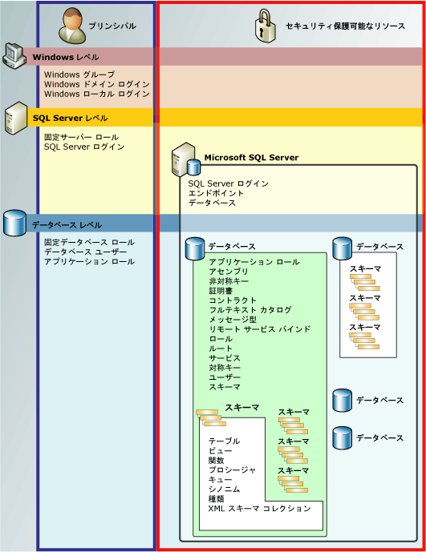

# 権限の階層 (データベース エンジン)
[!INCLUDE[appliesto-ss-asdb-asdw-pdw-md](../../includes/appliesto-ss-asdb-asdw-pdw-md.md)]

  [!INCLUDE[ssDE](../../includes/ssde-md.md)] では、権限を使用してセキュリティで保護できるエンティティの階層コレクションが管理されています。 これらのエンティティを、 *セキュリティ保護可能なリソース*と呼びます。 最も顕著なセキュリティ保護可能なリソースはサーバーとデータベースですが、さらに細かいレベルで個別の権限を設定できます。 [!INCLUDE[ssNoVersion](../../includes/ssnoversion-md.md)] 適切な権限が許可されていることを確認することにより、セキュリティ保護可能なリソースに対するプリンシパルによる操作を制御しています。  
  
 次の図は、 [!INCLUDE[ssDE](../../includes/ssde-md.md)] の権限階層における関係を示します。  
  
 権限システムは [!INCLUDE[ssNoVersion](../../includes/ssnoversion-md.md)]、 [!INCLUDE[ssSDS](../../includes/sssds-md.md)]、 [!INCLUDE[ssDW](../../includes/ssdw-md.md)]、 [!INCLUDE[ssAPS](../../includes/ssaps-md.md)]のすべてのバージョンで同様に機能しますが、一部のバージョンでは使用できない機能もあります。 たとえば、サーバー レベルの権限は、Azure 製品では構成できません。  
  
   
  
## SQL Server 権限の一覧表  
 [!INCLUDE[ssDE](../../includes/ssde-md.md)] のすべてのアクセス許可を示した pdf 形式のポスター サイズの一覧表については、[https://aka.ms/sql-permissions-poster](https://aka.ms/sql-permissions-poster) を参照してください。  
  
## 権限を使用した作業  
 権限は、使い慣れた [!INCLUDE[tsql](../../includes/tsql-md.md)] クエリ (RANT、DENY、REVOKE) で操作できます。 権限に関する情報は、 [sys.server_permissions](../../relational-databases/system-catalog-views/sys-server-permissions-transact-sql.md) カタログ ビューおよび [sys.database_permissions](../../relational-databases/system-catalog-views/sys-database-permissions-transact-sql.md) カタログ ビューに表示されます。 組み込み関数を使用して権限に関する情報をクエリすることもできます。  
  
 権限システムの設計の詳細については、「 [データベース エンジンの権限の概要](../../relational-databases/security/authentication-access/getting-started-with-database-engine-permissions.md)」を参照してください。  
  
## 参照  
 [SQL Server の保護](../../relational-databases/security/securing-sql-server.md)   
 [アクセス許可 &#40;データベース エンジン&#41;](../../relational-databases/security/permissions-database-engine.md)   
 [Securables](../../relational-databases/security/securables.md)   
 [プリンシパル &#40;データベース エンジン&#41;](../../relational-databases/security/authentication-access/principals-database-engine.md)   
 [GRANT &#40;Transact-SQL&#41;](../../t-sql/statements/grant-transact-sql.md)   
 [REVOKE &#40;Transact-SQL&#41;](../../t-sql/statements/revoke-transact-sql.md)   
 [DENY &#40;Transact-SQL&#41;](../../t-sql/statements/deny-transact-sql.md)   
 [HAS_PERMS_BY_NAME &#40;Transact-SQL&#41;](../../t-sql/functions/has-perms-by-name-transact-sql.md)   
 [sys.fn_builtin_permissions &#40;Transact-SQL&#41;](../../relational-databases/system-functions/sys-fn-builtin-permissions-transact-sql.md)   
 [sys.server_permissions &#40;Transact-SQL&#41;](../../relational-databases/system-catalog-views/sys-server-permissions-transact-sql.md)   
 [sys.database_permissions &#40;Transact-SQL&#41;](../../relational-databases/system-catalog-views/sys-database-permissions-transact-sql.md)  
  
  
