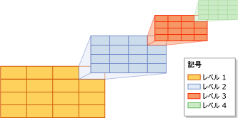
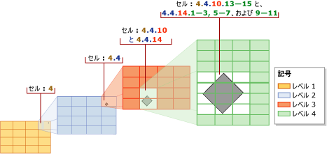
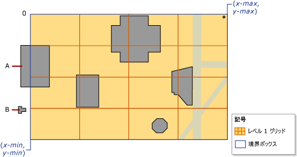
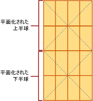

# <a name="spatial-indexes-overview"></a>空間インデックスの概要
[!INCLUDE[appliesto-ss-asdb-xxxx-xxx-md](../../includes/appliesto-ss-asdb-xxxx-xxx-md.md)]
  [!INCLUDE[ssNoVersion](../../includes/ssnoversion-md.md)] では、空間データと空間インデックスがサポートされています。 *空間インデックス* は拡張インデックスの一種で、空間列にインデックスを設定することができます。 空間列とは、空間データ型 ( **geometry** や **geography**など) のデータを含むテーブル列です。  
  
> [!IMPORTANT]  
>  空間インデックスに影響を及ぼす機能を含め、 [!INCLUDE[ssSQL11](../../includes/sssql11-md.md)]で導入された空間機能の詳細な説明とサンプルについては、ホワイト ペーパー『 [New Spatial Features in SQL Server 2012 (SQL Server 2012 の新しい空間機能)](https://go.microsoft.com/fwlink/?LinkId=226407)』をダウンロードしてご覧ください。  
  
##  <a name="about"></a> 空間インデックスについて  
  
###  <a name="decompose"></a> インデックスを作成する空間のグリッド階層への分解  
 [!INCLUDE[ssNoVersion](../../includes/ssnoversion-md.md)]では、空間インデックスは B ツリーを使用して構築されます。したがって、インデックスでは、B ツリーの線形な順序で 2 次元の空間データを表現する必要があります。 このため、 [!INCLUDE[ssNoVersion](../../includes/ssnoversion-md.md)] では、データを空間インデックスに読み取る前に、空間を階層に均一に分解します。 このインデックス作成プロセスでは、空間が 4 つのレベルから成る *グリッド階層* に *分解*されます。 これらのレベルはそれぞれ、 *レベル 1* (最上位レベル)、 *レベル 2*、 *レベル 3*、および *レベル 4*と呼ばれます。  
  
 各レベルでは、1 つ上のレベルがさらに分解されます。したがって、上のレベルのセルに次のレベルの完全なグリッドが含まれます。 特定のレベルのすべてのグリッドは、両方の軸に沿って同じ数のセルを持ちます (4 × 4、8 × 8 など)。それらのセルのサイズはすべて同じです。  
  
 次の図では、グリッド階層の各レベルで右上のセルが 4 × 4 のグリッドに分解されています。 実際にはすべてのセルがこのように分解されます。 したがって、たとえば空間を 4 つのレベルの 4 × 4 のグリッドに分解すると、実際にはレベル 4 のセルが合計 65,536 個生成されます。  
  
   
  
> [!NOTE]  
>  空間インデックスのための空間の分解は、アプリケーション データが使用する測定単位に依存しません。  
  
 グリッド階層のセルは、ヒルベルト空間充てん曲線のバリエーションを使用して直線的に番号付けされます。 ただし、ここでは説明をわかりやすくするために、ヒルベルト曲線によって行われる実際の番号付けの代わりに単純な行方向の番号付けを使用します。 次の図では、建物を表すいくつかの多角形と通りを表す線が、既に 4 × 4 のレベル 1 グリッドに配置されています。 レベル 1 のセルには、左上のセルから順番に 1 ～ 16 の番号が付けられています。  
  
   
  
#### <a name="grid-density"></a>グリッド密度  
 グリッドの軸に沿ったセルの数により、グリッドの *密度*が決まります。この数が多いほど密度が高くなります。 たとえば、8 × 8 のグリッド (64 個のセル) は、4 × 4 のグリッド (16 個のセル) より高密度です。 グリッド密度はレベルごとに定義されます。  
  
 空間インデックスの [CREATE SPATIAL INDEX](../../t-sql/statements/create-spatial-index-transact-sql.md)[!INCLUDE[tsql](../../includes/tsql-md.md)] ステートメントでサポートされている GRIDS 句を使用すると、レベルごとに異なるグリッド密度を指定できます。 特定のレベルのグリッド密度を指定するには、次のいずれかのキーワードを使用します。  
  
|Keyword|グリッドの構成|セルの数|  
|-------------|------------------------|---------------------|  
|LOW|4 × 4|16|  
|MEDIUM|8 × 8|64|  
|HIGH|16 × 16|256|  
  
 [!INCLUDE[ssNoVersion](../../includes/ssnoversion-md.md)]では、データベース互換性レベルが 100 以上に設定されている場合、既定ですべてのレベルが MEDIUM になります。 データベース互換性レベルが 110 以上に設定されている場合、既定で自動グリッド スキームになります。 (自動グリッドは、8 レベル構成の HLLLLLLL を示します)。インデックス グリッド密度を変えるのではなく、ヒントでオブジェクトあたりのセル数とオブジェクトあたりのクエリ ウィンドウ セル数を変えることができます。 
  
 既定以外のグリッド密度を指定することで分解プロセスを制御できます。 たとえば、レベルごとに異なるグリッド密度を使用して、インデックスを作成する空間や空間列のオブジェクトのサイズに基づいてインデックスを微調整することができます。  
  
> [!NOTE]  
>  空間インデックスのグリッド密度は、データベース互換性レベルが 100 以下に設定されている場合、 [sys.spatial_index_tessellations](../../relational-databases/system-catalog-views/sys-spatial-index-tessellations-transact-sql.md) カタログ ビューの level_1_grid、level_2_grid、level_3_grid、level_4_grid の各列で確認できます。 **GEOMETRY_AUTO_GRID**/**GEOGRAPHY_AUTO_GRID** テセレーション スキームのオプションでは、これらの列は設定されません。 自動グリッド オプションを使用する場合、sys.spatial_index_tessellations カタログ ビューのこれら各列の値は **NULL** 値になります。  
  
###  <a name="tessellation"></a> テセレーション  
 インデックスを作成する空間がグリッド階層に分解された後、空間列のデータが行単位で読み取られます。 空間オブジェクト (インスタンス) のデータの読み取りが完了すると、空間インデックスによってそのオブジェクトに対して *テセレーション プロセス* が実行されます。 テセレーション プロセスでは、オブジェクトを、そのオブジェクトが接する一連のグリッド セル (*接するセル*) に関連付けることによって、オブジェクトをグリッド階層に当てはめます。 テセレーション プロセスはグリッド階層のレベル 1 で開始され、 *幅優先* でレベル全体にわたって続けられます。 このプロセスは、場合によっては 4 つのレベルすべてにわたって続けられます (一度に 1 レベルずつ処理されます)。  
  
 テセレーション プロセスが終了すると、そのオブジェクトについて、一連の接するセルが空間インデックスに記録されます。 空間インデックスでは、記録されたそれらのセルを参照することにより、空間内のオブジェクトの場所を、同じくインデックスに格納されている空間列の他のオブジェクトを基準にして特定できます。  
  
#### <a name="tessellation-rules"></a>テセレーション ルール  
 オブジェクトについて記録される接するセルの数を制限するために、テセレーション プロセスではいくつかのテセレーション ルールが適用されます。 これらのルールにより、テセレーション プロセスの深さと、接するセルのうちのどれがインデックスに記録されるかが決まります。  
  
 これらのルールを以下に示します。  
  
-   カバリング ルール  
  
     オブジェクトがセルを完全に覆っている場合、そのセルはオブジェクトに *覆われている* と言います。 覆われているセルはカウントされますが、テセレーションはされません。 このルールはグリッド階層のすべてのレベルで適用されます。 これにより、テセレーション プロセスが簡略化され、空間インデックスに記録されるデータの量が減ります。  
  
-   オブジェクトごとのセル数のルール  
  
     このルールでは、 *オブジェクトごとのセル数の制限*を適用します。オブジェクトごとのセル数の制限は、レベル 1 以外のレベルで各オブジェクトについてカウントできるセルの最大数を決定します。 これにより、下位レベルでオブジェクトについて記録できる情報の量が制御されます。  
  
-   最下位のセルのルール  
  
     このルールでは、オブジェクトに対してテセレーションされた最下位のセルのみを記録することにより、オブジェクトを最も近い形で再現できます。 親のセルはオブジェクトごとのセル数に含まれず、インデックスにも記録されません。  
  
 これらのテセレーション ルールは、各グリッド レベルで再帰的に適用されます。 以降では、テセレーション ルールについてさらに詳しく説明します。  
  
#### <a name="covering-rule"></a>カバリング ルール  
 オブジェクトがセルを完全に覆っている場合、そのセルはオブジェクトに *覆われている* と言います。 たとえば次の図では、レベル 2 のセルの 1 つ (15.11) が八角形の中心部分に完全に覆われています。  
  
   
  
 覆われているセルはカウントされ、インデックスに記録されます。そのセルはそれ以上テセレーションされません。  
  
#### <a name="cells-per-object-rule"></a>オブジェクトごとのセル数のルール  
 各オブジェクトのテセレーションの範囲は、主に空間インデックスの *オブジェクトごとのセル数の制限* によって決まります。 この制限は、テセレーションでオブジェクトごとにカウントできるセルの最大数を定義します。 ただし、オブジェクトごとのセル数のルールはレベル 1 には適用されません。したがって、レベル 1 ではこの制限を超える可能性があります。 レベル 1 のカウントがオブジェクトごとのセル数の制限に達したり、この制限を超えたりすると、下位レベルでそれ以上テセレーションが行われなくなります。  
  
 カウントがオブジェクトごとのセル数の制限に達していなければ、テセレーション プロセスは続行されます。 接するセルの中で最も番号が小さいセル (たとえば前の図ではセル 15.6) から始めて各セルがテストされ、そのセルをカウントするかテセレーションするかが評価されます。 テセレーションするとオブジェクトごとのセル数の制限を超えてしまう場合、セルはテセレーションされずにカウントされます。 そうでない場合は、セルがテセレーションされ、オブジェクトが接している下位レベルのセルがカウントされます。 このようにして、テセレーション プロセスが幅優先でレベル全体にわたって続けられます。 このプロセスは、制限に達するか、カウントするセルがなくなるまで、テセレーションされたセルの下位レベルのグリッドに対して再帰的に繰り返されます。  
  
 たとえば先ほどの、八角形がレベル 1 グリッドのセル 15 に完全に収まっている図では、 セル 15 がテセレーションされて、八角形がレベル 2 の 9 つのセルに分解されています。 この例では、オブジェクトごとのセル数の制限が 9 以上と想定されています。 オブジェクトごとのセル数の制限が 8 以下の場合は、セル 15 はテセレーションされず、セル 15 のみがオブジェクトに対してカウントされます。  
  
 既定では、オブジェクトごとのセル数の制限は 16 です。この値は、ほとんどの空間インデックスで、スペースと精度のバランスが取れた値になります。 ただし、[CREATE SPATIAL INDEX](../../t-sql/statements/create-spatial-index-transact-sql.md) [!INCLUDE[tsql](../../includes/tsql-md.md)] ステートメントでサポートされている CELLS_PER_OBJECT **=** _n_ 句を使用すると、オブジェクトごとのセル数の制限を 1 から 8,192 の範囲で指定できます。  
  
> [!NOTE]  
>  空間インデックスの **cells_per_object** の設定は、[sys.spatial_index_tessellations](../../relational-databases/system-catalog-views/sys-spatial-index-tessellations-transact-sql.md) カタログ ビューで確認できます。  
  
#### <a name="deepest-cell-rule"></a>最下位のセルのルール  
 最下位のセルのルールでは、下位レベルのセルはすべてその上のセルに属しているという事実が利用されています。レベル 4 のセルはレベル 3 のセルに、レベル 3 のセルはレベル 2 のセルに、レベル 2 のセルはレベル 1 のセルにそれぞれ属しています。 たとえば、セル 1.1.1.1 に属しているオブジェクトは、セル 1.1.1、セル 1.1、およびセル 1 にも属しています。 こうしたセルの階層関係の情報はクエリ プロセッサに組み込まれているため、 インデックスに記録するのは最下位レベルのセルだけで済みます。これにより、インデックスに格納する情報を最小限に抑えられます。  
  
 次の図では、比較的小さな菱形の多角形がテセレーションされています。 このインデックスで使用されているオブジェクトごとのセル数の制限は既定の 16 で、この小さなオブジェクトではその制限に達しないため、 テセレーションはレベル 4 まで続けられます。 この多角形は、次のレベル 1 から 3 のセルにも存在しています。4、4.4、および 4.4.10 と 4.4.14。 しかし、最下位のセルのルールが使用されるため、テセレーションでカウントされるのは次のレベル 4 の 12 個のセルだけです。4.4.10.13 から 15 と 4.4.14.1 から 3、4.4.14.5 から 7、および 4.4.14.9 から 11。  
  
   
  
###  <a name="schemes"></a> テセレーション スキーム  
 空間インデックスの動作の一部は、 *テセレーション スキーム*によって決まります。 テセレーション スキームはデータ型固有です。 [!INCLUDE[ssNoVersion](../../includes/ssnoversion-md.md)]では、空間インデックスで次の 2 つのテセレーション スキームがサポートされています。  
  
-   *ジオメトリ グリッド テセレーション*。 **geometry** データ型用のスキームです。  
  
-   *地理グリッド テセレーション スキーム*。 **geography** データ型の列に適用されます。  
  
> [!NOTE]  
>  空間インデックスの **tessellation_scheme** 設定は、 [sys.spatial_index_tessellations](../../relational-databases/system-catalog-views/sys-spatial-index-tessellations-transact-sql.md) カタログ ビューで確認できます。  
  
#### <a name="geometry-grid-tessellation-scheme"></a>ジオメトリ グリッド テセレーション スキーム  
 GEOMETRY_AUTO_GRID テセレーションは、 **以降の** geometry [!INCLUDE[ssNoVersion](../../includes/sssql11-md.md)] データ型用の既定のテセレーション スキームです。  GEOMETRY_GRID テセレーションは、 [!INCLUDE[ssNoVersion](../../includes/sskatmai-md.md)]の geometry データ型で使用できる唯一のテセレーション スキームです。 ここでは、空間インデックスの操作に関連するジオメトリ グリッド テセレーションの特徴 (サポートされるメソッドと境界ボックス) について説明します。  
  
> [!NOTE]  
>  このテセレーション スキームを明示的に指定するには、[CREATE SPATIAL INDEX](../../t-sql/statements/create-spatial-index-transact-sql.md) [!INCLUDE[tsql](../../includes/tsql-md.md)] ステートメントの USING (GEOMETRY_AUTO_GRID/GEOMETRY_GRID) 句を使用します。  
  
##### <a name="the-bounding-box"></a>境界ボックス  
 幾何データで用いられる平面は無限に広がっていますが、 [!INCLUDE[ssNoVersion](../../includes/ssnoversion-md.md)]の空間インデックスは有限の空間を必要とします。 ジオメトリ グリッド テセレーション スキームでは、分解のための有限の空間を確立するために、四角形の *境界ボックス*が必要になります。 境界ボックスは 4 つの座標によって定義されます **(** _x-min_ **,** _y-min_ **)** および **(** _x-max_ **,** _y-max_ **)** 。これらの座標は、空間インデックスのプロパティとして格納されます。 各座標の意味は次のとおりです。  
  
-   *x-min* は、境界ボックスの左下隅の x 座標です。  
  
-   *y-min* は、左下隅の y 座標です。  
  
-   *x-max* は、右上隅の x 座標です。  
  
-   *y-max* は、右上隅の y 座標です。  
  
> [!NOTE]  
>  これらの座標は、[CREATE SPATIAL INDEX](../../t-sql/statements/create-spatial-index-transact-sql.md) [!INCLUDE[tsql](../../includes/tsql-md.md)] ステートメントの BOUNDING_BOX 句で指定します。  
  
 座標 **(** _x-min_ **,** _y-min_ **)** および **(** _x-max_ **,** _y-max_ **)** により、境界ボックスの位置とサイズが決まります。 境界ボックスの外側の空間は、番号 0 の 1 つのセルとして扱われます。  
  
 空間インデックスは、境界ボックスの内側の空間を分解します。 境界ボックスがグリッド階層のレベル 1 のグリッドで満たされ、 幾何オブジェクトをグリッド階層に配置するためにオブジェクトの座標が境界ボックスの座標と比較されます。  
  
 次の図には、境界ボックスの座標 **(** _x-min_ **,** _y-min_ **)** および **(** _x-max_ **,** _y-max_ **)** によって定義される点が示されています。 また、グリッド階層の最上位レベルが 4 × 4 のグリッドとして示されています。 下位のレベルはわかりやすくするために省略されています。 境界ボックスの外側の空間はゼロ (0) によって示されています。 オブジェクト A はボックスから一部はみ出しており、オブジェクト B は完全にボックスの外側 (セル 0) にあります。  
  
   
  
 境界ボックスは、アプリケーションの空間データの一部分に対応します。 空間列に格納されているデータがインデックスの境界ボックスに完全に含まれるか、一部のみが含まれるかは、アプリケーションによって異なります。 空間インデックスの恩恵を受けることができるのは、完全に境界ボックスの内側にあるオブジェクトに対して計算される操作だけです。 したがって、 **geometry** 列の空間インデックスの利点を最大限に活用するためには、ほとんど、またはすべてのオブジェクトが含まれるように境界ボックスを指定する必要があります。  
  
> [!NOTE]  
>  空間インデックスのグリッド密度は、 [sys.spatial_index_tessellations](../../relational-databases/system-catalog-views/sys-spatial-index-tessellations-transact-sql.md) カタログ ビューの bounding_box_xmin、bounding_box_ymin、bounding_box_xmax、および bounding_box_ymax columns の各列で確認できます。  
  
#### <a name="the-geography-grid-tessellation-scheme"></a>地理グリッド テセレーション スキーム  
 このテセレーション スキームは、 **geography** 列のみに適用されます。 ここでは、地理グリッド テセレーションによってサポートされるメソッドの概要と、測地空間が平面に投影されてグリッド階層に分解されるしくみを説明します。  
  
> [!NOTE]  
>  このテセレーション スキームを明示的に指定するには、[CREATE SPATIAL INDEX](../../t-sql/statements/create-spatial-index-transact-sql.md) [!INCLUDE[tsql](../../includes/tsql-md.md)] ステートメントの USING (GEOGRAPHY_AUTO_GRID/GEOGRAPHY_GRID) 句を使用します。  
  
##### <a name="projection-of-the-geodetic-space-onto-a-plane"></a>測地空間の平面への投影  
 **geography** インスタンス (オブジェクト) の計算では、オブジェクトを含む空間を測地の楕円体として扱います。 地理グリッド テセレーション スキームでは、この空間を分解するために、まず、楕円体の表面が上下の半球に分割されます。その後、次の手順が実行されます。  
  
1.  各半球を四角錐の面に投影します。  
  
2.  2 つの四角錐を平面化します。  
  
3.  平面化された四角錐を結合して、非ユークリッド平面を形成します。  

 次の図は、この 3 つの手順による分解プロセスの概略図です。 四角錐の点線は、各四角錐の 4 つの面の境界を表しています。 手順 1. と 2. は、測地の楕円体を表しています。緑の横線は赤道の緯線を表し、一連の緑の縦線は複数の経線を表します。 手順 1. では、2 つの半球が四角錐に投影されています。 手順 2. では、四角錐が平面化されています。 手順 3. は、平面を形成するために結合された後の平面化された四角錐を表しています。いくつかの緯線が投影されているのがわかります。 これらの投影された線は直線化されていて、四角錐のどこに投影されたかによって長さが異なっています。  
  
   
  
 空間が平面に投影されたら、今度はその平面が 4 つのレベルから成るグリッド階層に分解されます。 レベルごとに異なるグリッド密度を使用できます。 次の図は、4 × 4 のレベル 1 グリッドに分解された後の平面を示しています。 グリッド階層の下位レベルはわかりやすくするために省略されています。 実際には、平面は 4 つのレベルから成るグリッド階層に完全に分解されます。 分解のプロセスが完了すると、geography 列の地理データが行単位で読み取られ、各オブジェクトに対して順番にテセレーション プロセスが実行されます。  
  
   
  
##  <a name="methods"></a> 空間インデックスでサポートされるメソッド  
  
###  <a name="geometry"></a> 空間インデックスでサポートされるジオメトリ メソッド  
 空間インデックスは、特定の条件下で次のセット指向のジオメトリ メソッドをサポートします。STContains()、STDistance()、STEquals()、STIntersects()、STOverlaps()、STTouches()、STWithin()。 空間インデックスでサポートされるために、これらのメソッドは、クエリの WHERE 句または JOIN ON 句内で、次の一般的な述語の形式で使用する必要があります。  
  
 *geometry1*.*method_name*(*geometry2*)*comparison_operator**valid_number*  
  
 NULL 以外の結果を返すには、 *geometry1* と *geometry2* の [SRID (Spatial Reference Identifier)](../../relational-databases/spatial/spatial-reference-identifiers-srids.md)が同じであることが必要です。 それ以外の場合は、NULL を返します。  
  
 空間インデックスは、次の述語形式をサポートします。  
  
-   *geometry1*.[STContains](../../t-sql/spatial-geometry/stcontains-geometry-data-type.md)(*geometry2*) = 1  
  
-   *geometry1*.[STDistance](../../t-sql/spatial-geometry/stdistance-geometry-data-type.md)(*geometry2*) < *数値*  
  
-   *geometry1*.[STDistance](../../t-sql/spatial-geometry/stdistance-geometry-data-type.md)(*geometry2*) <= *数値*  
  
-   *geometry1*.[STEquals](../../t-sql/spatial-geometry/stequals-geometry-data-type.md)(*geometry2*)= 1  
  
-   *geometry1*.[STIntersects](../../t-sql/spatial-geometry/stintersects-geometry-data-type.md)(*geometry2*)= 1  
  
-   *geometry1.* [STOverlaps](../../t-sql/spatial-geometry/stoverlaps-geometry-data-type.md) *(geometry2) = 1*  
  
-   *geometry1*.[STTouches](../../t-sql/spatial-geometry/sttouches-geometry-data-type.md)(*geometry2*) = 1  
  
-   *geometry1*.[STWithin](../../t-sql/spatial-geometry/stwithin-geometry-data-type.md)(*geometry2*)= 1  
  
###  <a name="geography"></a> 空間インデックスでサポートされる地理メソッド  
 空間インデックスは、特定の条件下で、次のセット指向の地理メソッドをサポートします。STIntersects()、STEquals()、STDistance()。 空間インデックスでサポートされるために、これらのメソッドは、クエリの WHERE 句内で、次の一般的な述語の形式で使用する必要があります。  
  
 *geography1*.*method_name*(*geography2*)*comparison_operator**valid_number*  
  
 NULL 以外の結果を返すには、 *geography1* と *geography2* の [SRID (Spatial Reference Identifier)](../../relational-databases/spatial/spatial-reference-identifiers-srids.md)が同じであることが必要です。 それ以外の場合は、NULL を返します。  
  
 空間インデックスは、次の述語形式をサポートします。  
  
-   *geography1*.[STIntersects](../../t-sql/spatial-geography/stintersects-geography-data-type.md)(*geography2*)= 1  
  
-   *geography1*.[STEquals](../../t-sql/spatial-geography/stequals-geography-data-type.md)(*geography2*)= 1  
  
-   *geography1*.[STDistance](../../t-sql/spatial-geography/stdistance-geography-data-type.md)(*geography2*) < *数値*  
  
-   *geography1*.[STDistance](../../t-sql/spatial-geography/stdistance-geography-data-type.md)(*geography2*) <= *数値*  
  
### <a name="queries-that-use-spatial-indexes"></a>空間インデックスを使用するクエリ  
 空間インデックスは、 **WHERE** 句にインデックス付き空間演算子を含むクエリのみでサポートされています。 たとえば、次のような構文を考えてみます。  
  
```  
[spatial object].SpatialMethod([reference spatial object]) [ = | < ] [const literal or variable]  
```  
  
 クエリ オプティマイザーは、空間演算に交換法則が成立することを理解しています (つまり `@a.STIntersects(@b) = @b.STInterestcs(@a)` )。 ただし、比較構文の先頭に空間演算子がない場合、空間インデックスは使用されません (たとえば、 `WHERE 1 = spatial op` では空間インデックスは使用されません)。 空間インデックスを使用するには、比較構文を書き直します (たとえば、 `WHERE spatial op = 1`のようにします)。  
  
 他のインデックスと同様に、空間インデックスがサポートされていても、空間インデックスを使用するかどうかはコストに基づいて決定されます。そのため、必要な条件をすべて満たしている場合でも、クエリ オプティマイザーが空間インデックスを使用しないこともあります。 空間インデックスが使用されたか確認するにはプラン表示を使用し、必要に応じてクエリ ヒントを指定して、目的のクエリ プランを表示します。  
  
 ニアレスト ネイバー タイプのクエリも空間インデックスをサポートしますが、それは、特定のクエリ構文が使用された場合だけです。 適切な構文は次のとおりです。  
  
```  
SELECT TOP(K) [WITH TIES] *   
FROM <Table> AS T [WITH(INDEX(<SpatialIndex>))]  
WHERE <SpatialColumn>.STDistance(@reference_object) IS NOT NULL  
ORDER BY <SpatialColumn>.STDistance(@reference_object) [;]  
```  
  
## <a name="see-also"></a>参照  
 [空間データ &#40;SQL Server&#41;](../../relational-databases/spatial/spatial-data-sql-server.md)  
  
  
