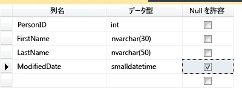
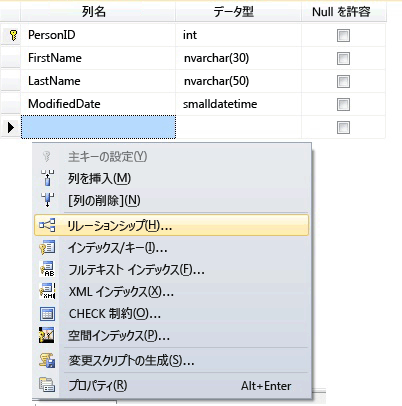
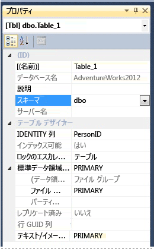

# <a name="create-tables-database-engine"></a>テーブルの作成 (データベース エンジン)
[!INCLUDE[tsql-appliesto-ss2016-all-md](../../includes/tsql-appliesto-ss2016-all-md.md)]

  [!INCLUDE[ssManStudioFull](../../includes/ssmanstudiofull-md.md)] または [!INCLUDE[tsql](../../includes/tsql-md.md)] を使用して新しいテーブルを作成して名前を付け、それを既存のデータベースに追加できます。  
  

  
##  <a name="Permissions"></a> 最初に権限を確認してください。  
このタスクには、データベースの CREATE TABLE 権限と、テーブルを作成するスキーマの ALTER 権限が必要です。  
  
 CREATE TABLE ステートメント内の列を CLR ユーザー定義型として定義する場合は、その型の所有権か、その型に対する REFERENCES 権限が必要です。  
  
 CREATE TABLE ステートメント内の列に XML スキーマ コレクションが関連付けられている場合は、その XML スキーマ コレクションの所有権か、そのスキーマ コレクションに対する REFERENCES 権限が必要です。  
  
 
## <a name="using-table-designer"></a>テーブル デザイナーを使用する  
  
1.  SSMS の **オブジェクト エクスプローラー**で、変更するデータベースを含む [!INCLUDE[ssDE](../../includes/ssde-md.md)] のインスタンスに接続します。  
  
2.  **オブジェクト エクスプローラー**で、 **[データベース]** ノードを展開し、新しいテーブルを格納するデータベースを展開します。  
  
3.  オブジェクト エクスプローラーで、データベースの **[テーブル]** ノードを右クリックし、 **[新しいテーブル]** をクリックします。  
  
4.  次の図に示すように、列名を入力し、データ型を選択した後、各列で null 値を許可するかどうかを選択します。  
  
       
  
5.  他のプロパティ (ID 列または計算列の値など) を指定するには、列をクリックし、列のプロパティ タブで適切なプロパティを選択します。 列のプロパティの詳細については、「[テーブル列のプロパティ &#40;SQL Server Management Studio&#41;](../../relational-databases/tables/table-column-properties-sql-server-management-studio.md)」を参照してください。  
  
6.  列を主キーとして指定するには、列を右クリックし、 **[主キーの設定]** をクリックします。 詳細については、「 [Create Primary Keys](../../relational-databases/tables/create-primary-keys.md)」を参照してください。  
  
7.  外部キーのリレーションシップ、CHECK 制約、またはインデックスを作成するには、テーブル デザイナー ペイン内で右クリックし、次の図に示すように、一覧からオブジェクトを選択します。  
  
       
  
     これらのオブジェクトの詳細については、「 [Create Foreign Key Relationships](../../relational-databases/tables/create-foreign-key-relationships.md)」、「 [Create Check Constraints](../../relational-databases/tables/create-check-constraints.md) 」、および「 [Indexes](../../relational-databases/indexes/indexes.md)」を参照してください。  
  
8.  既定では、テーブルは **dbo** スキーマに含まれています。 テーブルに対して別のスキーマを指定するには、テーブル デザイナー ペイン内で右クリックし、次の図に示すように、 **[プロパティ]** を選択します。 **[スキーマ]** ボックスの一覧で、適切なスキーマを選択します。  
  
       
  
     スキーマの詳細については、「 [Create a Database Schema](../../relational-databases/security/authentication-access/create-a-database-schema.md)」を参照してください。  
  
9. **[ファイル]** メニューの **[<*テーブル名*> を保存]** をクリックします。  
  
10. **[名前の選択]** ダイアログ ボックスで、テーブルの名前を入力し、 **[OK]** をクリックします。  
  
11. 新しいテーブルを表示するには、 **オブジェクト エクスプローラー**で、 **[テーブル]** ノードを展開し、 **F5** キーを押してオブジェクトの一覧を更新します。 新しいテーブルがテーブルの一覧に表示されます。  
  
##  <a name="TsqlProcedure"></a> Transact-SQL の使用  
  
## <a name="using-query-editor"></a>クエリ エディターを使用する  
  
1.  **オブジェクト エクスプローラー**で、 [!INCLUDE[ssDE](../../includes/ssde-md.md)]のインスタンスに接続します。  
  
2.  [標準] ツール バーの **[新しいクエリ]** をクリックします。  
  
3.  次の例をコピーしてクエリ ウィンドウに貼り付け、 **[実行]** をクリックします。  
  
    ```  
    CREATE TABLE dbo.PurchaseOrderDetail  
    (  
        PurchaseOrderID int NOT NULL  
        ,LineNumber smallint NOT NULL  
        ,ProductID int NULL  
        ,UnitPrice money NULL  
        ,OrderQty smallint NULL  
        ,ReceivedQty float NULL  
        ,RejectedQty float NULL  
        ,DueDate datetime NULL  
    );  
    ```  
  
 詳細については、「[CREATE TABLE &#40;Transact-SQL&#41;](../../t-sql/statements/create-table-transact-sql.md)」を参照してください。  
  
  
