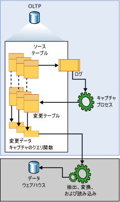

# <a name="about-change-data-capture-sql-server"></a>変更データ キャプチャについて (SQL Server)
[!INCLUDE[tsql-appliesto-ss2008-asdbmi-xxxx-xxx-md](../../includes/tsql-appliesto-ss2008-asdbmi-xxxx-xxx-md.md)]
  変更データ キャプチャは、 [!INCLUDE[ssNoVersion](../../includes/ssnoversion-md.md)] のテーブルに対して適用された挿入、更新、削除の各アクティビティを記録して、 変更の詳細を、利用しやすいリレーショナル形式で格納します。 変更された行に対応する列情報が、その変更をターゲット環境に適用するために必要なメタデータと共にキャプチャされ、追跡対象となるソース テーブルの列構造がミラー化された変更テーブルに格納されます。 コンシューマーは、用意されているテーブル値関数を使用して、変更データに体系的にアクセスできます。  
  
 この技術の対象となるデータ コンシューマーの好例が、ETL (抽出、変換、読み込み) アプリケーションです。 ETL アプリケーションは、 [!INCLUDE[ssNoVersion](../../includes/ssnoversion-md.md)] のソース テーブルからデータ ウェアハウスやデータ マートに変更データをインクリメンタルに読み込みます。 ソース テーブルの変更をデータ ウェアハウス内のソース テーブルの表現に反映する必要がありますが、ソースのレプリカを更新するエンド ツー エンドのテクノロジでは不適切です。 ここで必要となるのは、対象となる異質なデータ表現に対して適用できるように構成された変更データの確実なストリームです。 [!INCLUDE[ssNoVersion](../../includes/ssnoversion-md.md)] の変更データ キャプチャはこの技術を提供します。  
  
## <a name="change-data-capture-data-flow"></a>変更データ キャプチャのデータ フロー  
 次の図は、変更データ キャプチャの主なデータ フローを示しています。  
  
   
  
 変更データ キャプチャの変更データのソースは [!INCLUDE[ssNoVersion](../../includes/ssnoversion-md.md)] トランザクション ログです。 追跡対象のソース テーブルに対して挿入、更新、削除の各操作が適用されると、それらの変更を記述するエントリがこのログに追加されます。 このログは、キャプチャ プロセスへの入力として機能します。 このプロセスによってログが読み取られ、変更に関する情報が、追跡対象のテーブルに関連付けられている変更テーブルに追加されます。 用意されている関数を使用すると、指定した範囲にこの変更テーブルに追加された変更を列挙できます。この情報は、フィルター処理された結果セットの形式で返されます。 通常は、このフィルター処理された結果セットを使用して、アプリケーション プロセスによって外部環境のソースの表現が更新されます。  
  
## <a name="understanding-change-data-capture-and-the-capture-instance"></a>変更データ キャプチャとキャプチャ インスタンスについて  
 データベース内の個々のテーブルの変更を追跡するには、まずそのデータベースで変更データ キャプチャを明示的に有効にする必要があります。 これは、 [sys.sp_cdc_enable_db](../../relational-databases/system-stored-procedures/sys-sp-cdc-enable-db-transact-sql.md)ストアド プロシージャを使用して実行します。 データベースを有効にした後、 [sys.sp_cdc_enable_table](../../relational-databases/system-stored-procedures/sys-sp-cdc-enable-table-transact-sql.md)ストアド プロシージャを使用して、ソース テーブルを追跡対象テーブルとして指定できます。 テーブルに対して変更データ キャプチャを有効にすると、関連付けられたキャプチャ インスタンスが作成されます。これにより、ソース テーブルの変更データの伝播がサポートされます。 キャプチャ インスタンスは、1 つの変更テーブルと、最大 2 つのクエリ関数で構成されます。 キャプチャ インスタンスの構成の詳細を記述するメタデータは、変更データ キャプチャのメタデータ テーブル ( **cdc.change_tables**、 **cdc.index_columns**、および **cdc.captured_columns**) に保持されます。 この情報を取得するには、 [sys.sp_cdc_help_change_data_capture](../../relational-databases/system-stored-procedures/sys-sp-cdc-help-change-data-capture-transact-sql.md)ストアド プロシージャを使用します。  
  
 キャプチャ インスタンスに関連付けられているオブジェクトはすべて、有効にされたデータベースの変更データ キャプチャ スキーマに作成されます。 キャプチャ インスタンスの名前は、データベースのキャプチャ インスタンス間で重複しない有効なオブジェクト名である必要があります。 既定の名前は、ソース テーブルの \<*スキーマ名*\_*テーブル名*> です。 関連付けられている変更テーブルの名前は、キャプチャ インスタンス名の末尾に **_CT** を付けた名前になります。 すべての変更のクエリを実行する関数の名前は、キャプチャ インスタンス名の先頭に **fn_cdc_get_all_changes_** を付けた名前になります。 キャプチャ インスタンスが **net changes** をサポートするように構成されている場合は、**net_changes** クエリ関数も作成されます。この関数の名前は、キャプチャ インスタンス名の先頭に **fn_cdc_get_net_changes\_** を付けた名前になります。  
  
## <a name="change-table"></a>変更テーブル  
 変更データ キャプチャの変更テーブルの最初の 5 つの列は、メタデータ列です。 これらは、記録された変更に関係する追加情報を提供します。 残りの列には、識別されたソース テーブルのキャプチャ対象列の名前 (および通常は型) が反映されます。 これらの列は、ソース テーブルから収集されたキャプチャ対象列のデータを保持します。  
  
 ソース テーブルに適用された挿入または削除の各操作は、変更テーブル内の 1 つの行として表されます。 挿入操作の結果となる行のデータ列には挿入後の列の値が含まれ、 削除操作の結果となる行のデータ列には削除前の列の値が含まれます。 更新操作では、更新前の列の値を識別する行と更新後の列の値を識別する行の 2 つの行エントリが必要になります。  
  
 変更テーブルの各行には、変更アクティビティの解釈に使用される追加のメタデータも含まれています。 __$start_lsn 列は、変更に割り当てられたコミット ログ シーケンス番号 (LSN) を識別します。 コミット LSN では、同じトランザクション内でコミットされた変更が識別されるだけでなく、それらのトランザクションが順序付けられます。 \_\_$seqval 列は、同じトランザクション内で発生したさらに多くの変更を順序付けるために使用できる列です。 \_\_$operation 列は、変更に関連付けられている操作を記録します(1 = 削除、2 = 挿入、3 = 更新 (前イメージ)、4 = 更新 (後イメージ))。 \_\_$update_mask 列は、キャプチャ対象列ごとに 1 つのビットを定義する可変ビット マスクです。 挿入と削除のエントリでは常にすべてのビットが設定されます。 更新の行では、変更された列に対応するビットのみが設定されます。  
  
## <a name="change-data-capture-validity-interval-for-a-database"></a>データベースの変更データ キャプチャの有効期間  
 データベースの変更データ キャプチャの有効期間とは、キャプチャ インスタンスが変更データを利用できる期間です。 この有効期間は、データベース テーブルに対して最初のキャプチャ インスタンスが作成されたときに始まり、現在まで続きます。  
  
 変更テーブルに格納されるデータは、定期的かつ体系的にクリーンアップしないと、増大して管理しきれなくなります。 このため、変更データ キャプチャのクリーンアップ プロセスにより、保有期間に基づくクリーンアップ ポリシーが適用されます。 このプロセスでは、まず、時間制限を満たすように有効期間の下端が移動されます。 次に、有効期限が切れた変更テーブル エントリが削除されます。 既定では、3 日分のデータが保持されます。  
  
 上端では、キャプチャ プロセスによって変更データの新しいバッチがコミットされるたびに、変更テーブルのエントリを持つ各トランザクションに対応する新しいエントリが **cdc.lsn_time_mapping** に追加されます。 このマッピング テーブルでは、コミット ログ シーケンス番号 (LSN) とトランザクションのコミット時間の両方 (columns start_lsn と tran_end_time) が保持されます。 **cdc.lsn_time_mapping** 内で最も大きい LSN 値は、データベースの有効期間の上限を表します。 それに対応するコミット時間は、保有期間に基づくクリーンアップの新しい下限を計算するための基礎として使用されます。  
  
 キャプチャ プロセスではトランザクション ログから変更情報を抽出するため、変更がソース テーブルにコミットされてから、関連付けられている変更テーブルにその変更が反映されるまでの間に、構造的な待機時間が生じます。 この待機時間は一般に小さいとはいえ、関連するログ エントリの処理がキャプチャ プロセスによって完了するまでは変更データを利用できないということを覚えておく必要があります。  
  
## <a name="change-data-capture-validity-interval-for-a-capture-instance"></a>キャプチャ インスタンスの変更データ キャプチャの有効期間  
 データベースの有効期間と個々のキャプチャ インスタンスの有効期間は一致するのが一般的ですが、一致しない場合もあります。 キャプチャ インスタンスの有効期間は、キャプチャ プロセスがそのキャプチャ インスタンスを認識して、関連する変更のログをその変更テーブルに記録し始めたときに始まります。 その結果、キャプチャ インスタンスが別々の時間に作成された場合は、最初は各キャプチャ インスタンスがそれぞれ異なる下端を持つことになります。 定義されている各キャプチャ インスタンスの現在の下端は、 [sys.sp_cdc_help_change_data_capture](../../relational-databases/system-stored-procedures/sys-sp-cdc-help-change-data-capture-transact-sql.md) によって返される結果セットの start_lsn 列で確認できます。 クリーンアップ プロセスによって変更テーブルのエントリがクリーンアップされると、すべてのキャプチャ インスタンスの start_lsn 値が、使用可能な変更データの新しい下限を反映して調整されます。 調整されるのは、その時点で start_lsn 値が新しい下限より小さいキャプチャ インスタンスだけです。 通常は、新しいキャプチャ インスタンスが作成されなければ、時間が経つにつれて、すべてのインスタンスの有効期間がデータベースの有効期間と一致するようになります。  
  
 有効期間は変更データのコンシューマーにとって重要です。これは、要求の抽出範囲が、キャプチャ インスタンスの現在の変更データ キャプチャの有効期間によって完全にカバーされている必要があるからです。 抽出範囲の下端が有効期間の下端より左にある場合は、積極的なクリーンアップによって変更データが失われる可能性があります。 抽出範囲の上端が有効期間の上端より右にある場合も、その抽出範囲によって表される期間の処理がまだ完了していないために、変更データが失われる可能性があります。  
  
 関数 [sys.fn_cdc_get_min_lsn](../../relational-databases/system-functions/sys-fn-cdc-get-min-lsn-transact-sql.md) はキャプチャ インスタンスの LSN の現在の最小値の取得に使用し、 [sys.fn_cdc_get_max_lsn](../../relational-databases/system-functions/sys-fn-cdc-get-max-lsn-transact-sql.md) は LSN の現在の最大値の取得に使用します。 変更データのクエリを実行する際には、指定する LSN の範囲がこの 2 つの LSN 値の間にないと、変更データ キャプチャのクエリ関数が失敗します。  
  
## <a name="handling-changes-to-source-tables"></a>ソース テーブルに対する変更の処理  
 追跡対象となるソース テーブルの列の変更への対応は、下流のコンシューマーにとって困難な課題になります。 ソース テーブルで変更データ キャプチャを有効にしても、そうした DDL の変更の発生を防ぐことはできませんが、変更データ キャプチャを使用すると、基になるソース テーブルの列構造が変更されていた場合でも、API を通じて返される、配信される結果セットは変更されないようにすることで、コンシューマーへの影響を緩和することができます。 この固定された列構造は、定義済みのクエリ関数がアクセスする基になる変更テーブルにも反映されます。  
  
 変更テーブルへの書き込みを行うキャプチャ プロセスでは、列構造が固定された変更テーブルに対応するために、ソース テーブルで変更データ キャプチャが有効にされたときにキャプチャ対象として指定されていない新しい列は無視されます。 追跡されている列が削除された場合には、その後の変更エントリでその列に NULL 値が割り当てられます。 一方、既存の列のデータ型が変更された場合は、追跡されている列のデータが失われないようにするために、その変更が変更テーブルに反映されます。 また、追跡されているテーブルの列構造の変更が検出されると、その変更が cdc.ddl_history テーブルに書き込まれます。 下流のアプリケーションで調整を加える必要がある場合に通知されるようにするには、 [sys.sp_cdc_get_ddl_history](../../relational-databases/system-stored-procedures/sys-sp-cdc-get-ddl-history-transact-sql.md)ストアド プロシージャを使用します。  
  
 通常は、関連付けられているソース テーブルに DDL の変更が適用されても、現在のキャプチャ インスタンスの構造はそのまま保持されます。 ただし、そのテーブルの 2 つ目のキャプチャ インスタンスを作成して、そのインスタンスに新しい列構造が反映されるようにすることもできます。 これにより、同じソース テーブルに対する変更が、それぞれ異なる列構造を持つ 2 つの個別の変更テーブルに記録されるようになります。 その結果、一方の変更テーブルで現在実行中のプログラムに引き続きデータを提供しながら、もう一方の変更テーブルを開発環境で使用して新しい列データの組み込みに取り組むことができます。 このようにキャプチャ メカニズムで両方の変更テーブルに並行してデータを書き込むことができれば、一方の変更テーブルからもう一方の変更テーブルに、変更データを失うことなく移行できるようになります。 この移行は、2 つの変更データ キャプチャ タイムラインが重複している期間であればいつでも行うことができます。 移行が完了したら、古いキャプチャ インスタンスは削除できます。  
  
> [!NOTE]  
>  1 つのソース テーブルに同時に関連付けることのできるキャプチャ インスタンスは最大 2 つです。  
  
## <a name="relationship-between-the-capture-job-and-the-transactional-replication-logreader"></a>キャプチャ ジョブとトランザクション レプリケーション ログ リーダーの関係  
 変更データ キャプチャ プロセスのロジックは、ストアド プロシージャの [sp_replcmds](../../relational-databases/system-stored-procedures/sp-replcmds-transact-sql.md)に組み込まれています。これは、sqlservr.exe の一部として作成された内部サーバー関数で、トランザクション レプリケーションでトランザクション ログから変更を取得するためにも使用されます。 データベースで有効になっているのが変更データ キャプチャだけの場合は、sp_replcmds を呼び出すための手段として、変更データ キャプチャの SQL Server エージェント キャプチャ ジョブを作成します。 レプリケーションも存在する場合は、トランザクション ログ リーダーを使用するだけで、両方のコンシューマーの変更データのニーズを満たすことができます。 これにより、同じデータベースでレプリケーションと変更データ キャプチャの両方が有効になっている場合にログの競合を大幅に削減できます。  
  
 変更データをキャプチャするためのこの 2 つの操作モードの切り替えは、変更データ キャプチャが有効になっているデータベースのレプリケーションの状態が変更されるたびに自動的に行われます。  
  
> [!IMPORTANT]  
>  キャプチャ ロジックのインスタンスはどちらも、 [!INCLUDE[ssNoVersion](../../includes/ssnoversion-md.md)] エージェントが実行されていないとプロセスを実行できません。  
  
 キャプチャ プロセスの主なタスクは、ログをスキャンして、列データとトランザクション関連の情報を変更データ キャプチャの変更テーブルに書き込むことです。 キャプチャ プロセスでは、データを書き込むすべての変更データ キャプチャ変更テーブルでトランザクション的に一貫した境界を確保するために、各スキャン サイクルで独自のトランザクションを開いてコミットします。 新たに変更データ キャプチャが有効にされたテーブルがあるとそれが検出されて、ログの変更エントリをアクティブに監視するテーブルのセットにそのテーブルが自動的に追加されます。 同様に、変更データ キャプチャが無効にされた場合にもそれが検出されて、変更データをアクティブに監視するテーブルのセットからそのソース テーブルが削除されます。 ログのセクションの処理が完了すると、サーバー ログ切り捨てロジックに情報が送られて、切り捨ての対象となるログ エントリが識別されます。  
  
> [!NOTE]  
>  データベースの変更データ キャプチャが有効になっている場合は、復旧モードが単純復旧に設定されていても、キャプチャ対象としてマークされた変更がすべてキャプチャ プロセスで収集されるまで、ログの切り捨て位置が進められることはありません。 キャプチャ プロセスが実行されておらず、収集対象の変更がある場合は、CHECKPOINT を実行してもログが切り捨てられることはありません。  
  
 キャプチャ プロセスは、追跡対象のテーブルに対する DDL の変更の履歴を保持するためにも使用されます。 変更データ キャプチャが有効になっているデータベースまたはテーブルが削除されたり、変更データ キャプチャが有効になっているテーブルの列が追加、変更、または削除されたりするたびに、変更データ キャプチャに関連付けられている DDL ステートメントのエントリがデータベース トランザクション ログに作成されます。 これらのログ エントリがキャプチャ プロセスによって処理されると、関連する DDL イベントが cdc.ddl_history テーブルに書き込まれます。 追跡対象のテーブルに影響を与えた DDL イベントに関する情報を取得するには、 [sys.sp_cdc_get_ddl_history](../../relational-databases/system-stored-procedures/sys-sp-cdc-get-ddl-history-transact-sql.md)ストアド プロシージャを使用します。  
  
## <a name="change-data-capture-agent-jobs"></a>変更データ キャプチャのエージェント ジョブ  
 変更データ キャプチャが有効になっているデータベースには、通常、2 つの [!INCLUDE[ssNoVersion](../../includes/ssnoversion-md.md)] エージェント ジョブが関連付けられています。1 つはデータベース変更テーブルへの書き込みに使用されるジョブ、もう 1 つは変更テーブルのクリーンアップを行うジョブです。 どちらのジョブも、 [!INCLUDE[tsql](../../includes/tsql-md.md)] コマンドを実行する 1 つの手順で構成されています。 呼び出される [!INCLUDE[tsql](../../includes/tsql-md.md)] コマンドは、ジョブのロジックを実装する変更データ キャプチャの定義済みストアド プロシージャです。 これらのジョブは、データベースの最初のテーブルの変更データ キャプチャを有効にしたときに作成されます。 クリーンアップ ジョブは常に作成されます。 キャプチャ ジョブは、データベースに定義済みのトランザクション パブリケーションがない場合にのみ作成されます。 データベースで変更データ キャプチャとトランザクション レプリケーションの両方が有効になっている場合に、データベースに定義済みのパブリケーションがなくなったためにトランザクション ログ リーダー ジョブが削除されたときにも作成されます。  
  
 キャプチャ ジョブとクリーンアップ ジョブはどちらも既定のパラメーターを使用して作成されます。 キャプチャ ジョブはすぐに開始され、 継続的に実行されます。各スキャン サイクルで最大 1000 のトランザクションが処理されます。サイクル間の待ち時間は 5 秒です。 クリーンアップ ジョブは毎日午前 2 時に実行されます。 変更テーブルのエントリは 4320 分 (3 日間) 保持されます。1 つの DELETE ステートメントで最大 5000 のエントリを削除できます。  
  
 変更データ キャプチャのエージェント ジョブは、データベースで変更データ キャプチャが無効にされると削除されます。 また、変更データ キャプチャとトランザクション レプリケーションの両方が有効になっている場合に、データベースに最初のパブリケーションが追加されたときに削除されることもあります。  
  
 内部では、 [sys.sp_cdc_add_job](../../relational-databases/system-stored-procedures/sys-sp-cdc-add-job-transact-sql.md) ストアド プロシージャと [sys.sp_cdc_drop_job](../../relational-databases/system-stored-procedures/sys-sp-cdc-drop-job-transact-sql.md)ストアド プロシージャをそれぞれ使用して、変更データ キャプチャのエージェント ジョブが作成および削除されます。 これらのストアド プロシージャは、管理者がこれらのジョブの作成および削除を制御できるように公開されています。  
  
 変更データ キャプチャのエージェント ジョブについて、既定の構成を管理者が明示的に制御することはできませんが、 既定の構成パラメーターを変更できるように [sys.sp_cdc_change_job](../../relational-databases/system-stored-procedures/sys-sp-cdc-change-job-transact-sql.md) ストアド プロシージャが用意されています。 さらに、 [sys.sp_cdc_help_jobs](../../relational-databases/system-stored-procedures/sys-sp-cdc-help-jobs-transact-sql.md) ストアド プロシージャを使用すると、現在の構成パラメーターを表示できます。 キャプチャ ジョブとクリーンアップ ジョブの構成パラメーターは、どちらも起動時に msdb.dbo.cdc_jobs テーブルから抽出されます。 [sys.sp_cdc_change_job](../../relational-databases/system-stored-procedures/sys-sp-cdc-change-job-transact-sql.md) を使用してこれらの値に変更を加えた場合、その変更を有効にするには、ジョブをいったん停止してから再開する必要があります。  
  
 変更データ キャプチャのエージェント ジョブを開始および停止できるように、さらに 2 つのストアド プロシージャ ( [sys.sp_cdc_start_job](../../relational-databases/system-stored-procedures/sys-sp-cdc-start-job-transact-sql.md) と [sys.sp_cdc_stop_job](../../relational-databases/system-stored-procedures/sys-sp-cdc-stop-job-transact-sql.md)) が用意されています。  
  
> [!NOTE]  
>  キャプチャ ジョブを開始したり停止したりしても、変更データが失われることはありません。 変更テーブルに格納される変更エントリについて、アクティブにログがスキャンされなくなるだけです。 要求のピーク時にキャプチャ ジョブを停止して、ピーク時を過ぎたら再開することにより、ログ スキャンの負荷をピーク時に合理的に取り除くことができます。  
  
 この 2 つの [!INCLUDE[ssNoVersion](../../includes/ssnoversion-md.md)] エージェント ジョブはどちらも、変更データ キャプチャ環境の基本的なニーズに対応できるように十分な柔軟性と構成可能性を備えていますが、 コア機能を提供する基になるストアド プロシージャが公開されているため、さらなるカスタマイズも可能です。  
  
 NETWORK SERVICE アカウントでデータベース エンジン サービスまたは SQL Server エージェント サービスを実行中の場合、変更データ キャプチャは正しく機能できません。 この結果、エラー 22832 が発生します。  
 
## <a name="working-with-database-and-table-collation-differences"></a>データベースとテーブルの照合順序が違う場合の対応

データベースの照合順序と、変更データ キャプチャ用に構成されたテーブルの列の照合順序が異なる状況について認識しておくことが重要です。 CDC は、中間記憶域を使用して、サイド テーブルを設定します。 テーブルにデータベースの照合順序とは異なる照合順序を持つ CHAR または VARCHAR 型の列があり、これらの列に非 ASCII 文字 (2 バイト DBCS 文字など) が格納される場合、CDC は変更されたデータとベース テーブル内のデータの整合性を維持できない可能性があります。 これは、中間記憶域の変数には照合順序を関連付けることができないためです。

変更キャプチャ データとベース テーブルの整合性を保つには、次のいずれかの方法を検討してください。

- 非 ASCII データを格納する列には NCHAR または NVARCHAR データ型を使用します。

- または、列とデータベースに同じ照合順序を使用します。

たとえば、SQL_Latin1_General_CP1_CI_AS の照合順序を使用するデータベースがある場合について、次のようなテーブルを考えます。

```sql
CREATE TABLE T1( 
     C1 INT PRIMARY KEY, 
     C2 VARCHAR(10) collate Chinese_PRC_CI_AI)
```

列 C2 の照合順序が異なるので (Chinese_PRC_CI_AI)、この列に対するバイナリ データの CDC は失敗する可能性があります。 この問題を回避するには、NVARCHAR を使用します。

```sql
CREATE TABLE T1( 
     C1 INT PRIMARY KEY, 
     C2 NVARCHAR(10) collate Chinese_PRC_CI_AI --Unicode data type, CDC works well with this data type)
```

## <a name="see-also"></a>参照  
 [データ変更の追跡 &#40;SQL Server&#41;](../../relational-databases/track-changes/track-data-changes-sql-server.md)   
 [変更データ キャプチャの有効化と無効化 &#40;SQL Server&#41;](../../relational-databases/track-changes/enable-and-disable-change-data-capture-sql-server.md)   
 [変更データの処理 &#40;SQL Server&#41;](../../relational-databases/track-changes/work-with-change-data-sql-server.md)   
 [変更データ キャプチャの管理と監視 &#40;SQL Server&#41;](../../relational-databases/track-changes/administer-and-monitor-change-data-capture-sql-server.md)  
  
  
