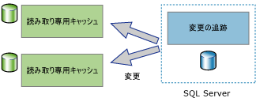
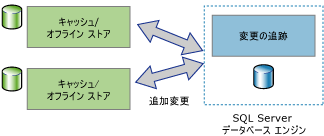

# 変更の追跡について (SQL Server)
[!INCLUDE[tsql-appliesto-ss2008-asdb-xxxx-xxx-md](../../includes/tsql-appliesto-ss2008-asdb-xxxx-xxx-md.md)]

  変更の追跡は、アプリケーションの効率的な変更追跡メカニズムを提供する簡易ソリューションです。 一般に、データベース内のデータに対する変更のクエリをアプリケーションで実行し、その変更に関連する情報にアクセスできるようにするには、アプリケーション開発者がカスタムの変更追跡メカニズムを実装する必要がありました。 通常、このようなメカニズムを作成するには非常に手間がかかり、多くの場合、トリガー、 **timestamp** 列、追跡情報を格納する新しいテーブル、およびカスタム クリーンアップ プロセスを組み合わせて使用する必要があります。  
  
 変更に必要な情報量はアプリケーションの種類ごとに異なります。 アプリケーションでは、変更の追跡を使用して、ユーザー テーブルに加えられた変更に関する次の情報を取得することができます。  
  
-   ユーザー テーブルのどの行が変更されたか  
  
    -   行が変更されたという情報のみが必要で、行が変更された回数やその間に行われた変更の値は不要です。  
  
    -   最新のデータは、追跡されているテーブルから直接取得できます。  
  
-   行が変更されたか  
  
    -   同じトランザクションで変更が行われたときに、行が変更されたという情報とその変更に関する情報を取得でき、それらの情報が記録される必要があります。  
  
> [!NOTE]  
>  行われたすべての変更に関する情報や、変更されたデータの中間値についての情報が必要な場合は、変更の追跡ではなく変更データ キャプチャを使用できます。 詳細については、「[変更データ キャプチャについて &#40;SQL Server&#41;](../../relational-databases/track-changes/about-change-data-capture-sql-server.md)」を参照してください。  
  
## 一方向および双方向の同期アプリケーション  
 [!INCLUDE[ssDEnoversion](../../includes/ssdenoversion-md.md)] のインスタンスとデータを同期する必要があるアプリケーションでは、変更に対するクエリを実行できる必要があります。 変更の追跡は、一方向および双方向の両方の同期アプリケーションの基礎として使用できます。  
  
### 一方向の同期アプリケーション  
 変更の追跡を使用するクライアントや中間層キャッシュ アプリケーションなどの一方向の同期アプリケーションを構築できます。 次の図に示すように、キャッシュ アプリケーションでは、データが [!INCLUDE[ssDE](../../includes/ssde-md.md)] に格納され、他のデータ ストアにキャッシュされる必要があります。 また、データベース テーブルに加えられた変更を含むように、キャッシュを最新の状態に保つ必要があります。 変更は [!INCLUDE[ssDE](../../includes/ssde-md.md)]に返されません。  
  
   
  
### 双方向の同期アプリケーション  
 変更の追跡を使用する双方向の同期アプリケーションも構築できます。 このシナリオでは、 [!INCLUDE[ssDE](../../includes/ssde-md.md)] のインスタンスのデータが 1 つ以上のデータ ストアと同期されます。 これらのデータ ストアのデータは更新でき、変更は [!INCLUDE[ssDE](../../includes/ssde-md.md)]に返され、同期される必要があります。  
  
   
  
 双方向の同期アプリケーションの好例として、常時接続でないアプリケーションが挙げられます。 この種のアプリケーションでは、クライアント アプリケーションによってローカル ストアに対するクエリおよび更新が行われます。 クライアントとサーバーの間で接続が確立されると、アプリケーションとサーバーが同期され、変更されたデータが双方向に送信されます。  
  
 双方向の同期アプリケーションでは、競合を検出できる必要があります。 同期から同期の間に、両方のデータ ストアで同じデータが変更されると、競合が発生します。 競合を検出できると、アプリケーションで変更が失われることがなくなります。  
  
## 変更の追跡のしくみ  
 変更の追跡を構成するには、DDL ステートメントまたは [!INCLUDE[ssManStudioFull](../../includes/ssmanstudiofull-md.md)]を使用します。 詳細については、「 [変更の追跡の有効化と無効化 &#40;SQL Server&#41;](../../relational-databases/track-changes/enable-and-disable-change-tracking-sql-server.md)」を参照してください。 変更を追跡するには、まずデータベースの変更の追跡を有効にして、次にそのデータベース内で追跡するテーブルの変更の追跡を有効にする必要があります。 テーブルの定義を変更する必要はなく、トリガーは作成されません。  
  
 テーブルの変更の追跡を構成すると、そのテーブルの行に影響する DML ステートメントが実行されるたびに、変更された各行の変更追跡情報が記録されます。 変更された行のクエリや、変更に関する情報の取得を行うには、 [変更追跡関数](../../relational-databases/system-functions/change-tracking-functions-transact-sql.md)を使用します。  
  
 変更情報と共に記録される追跡対象テーブルの情報は、主キー列の値だけです。 これらの値により、変更された行が識別されます。 それらの行の最新のデータを取得するには、アプリケーションでこの主キー列の値を使用して、ソース テーブルを追跡対象テーブルに結合します。  
  
 変更の追跡を使用して、各行に加えられた変更に関する情報を取得することもできます。 たとえば、変更を行った DML 操作の種類 (挿入、更新、または削除) や、更新操作の一環として変更された列などの情報を取得できます。 
 
## 変更の追跡のクリーンアップ
(変更追跡で有効な) 全てのテーブルの変更追跡情報は、メモリ内行ストアに格納されます。 変更追跡で有効な各テーブルに関連付けられている変更追跡データは、すべてのチェックポイントでメモリ内行ストアから対応するディスク上の内部テーブルにフラッシュされます。 また、メモリ内行ストアは、チェックポイント中に行がディスク上のテーブルに移動されてから消去されます。

変更追跡で有効な各テーブルにはディスク上の内部テーブルがあり、変更追跡機能ではこのテーブルを使用して、変更バージョンと特定のバージョン以降に変更された行が判別されます。 **自動クリーンアップ** スレッドがウェイクアップされるたびに、SQL Server インスタンスのすべてのユーザー データベースがスキャンされ、変更追跡が有効なデータベースが識別されます。 データベースの保有期間の設定に基づき、各ディスク上の内部テーブルから有効期限切れのレコードが削除されます。

ストアド プロシージャは、内部変更追跡テーブルの手動クリーンアップを実行するために [!INCLUDE[ssSQL14](../../includes/sssql14-md.md)] および [!INCLUDE[ssSQL15](../../includes/sssql15-md.md)] 用 Service Pack に追加されました。 ストアド プロシージャの詳細については、[KB173157](https://support.microsoft.com/help/3173157/adds-a-stored-procedure-for-the-manual-cleanup-of-the-change-tracking-side-table-in-sql-server-2014-sp2-or-2016-sp1) を参照してください。 
  
## 参照  
 [変更の追跡の有効化と無効化 &#40;SQL Server&#41;](../../relational-databases/track-changes/enable-and-disable-change-tracking-sql-server.md)   
 [変更の追跡のしくみ &#40;SQL Server&#41;](../../relational-databases/track-changes/work-with-change-tracking-sql-server.md)   
 [変更の追跡の管理 &#40;SQL Server&#41;](../../relational-databases/track-changes/manage-change-tracking-sql-server.md)   
 [データ変更の追跡 &#40;SQL Server&#41;](../../relational-databases/track-changes/track-data-changes-sql-server.md)  
  
  
