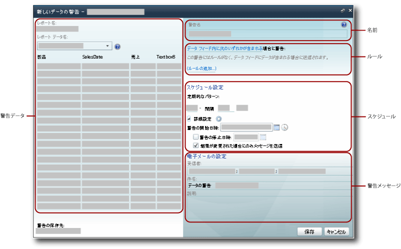

# データ警告デザイナー

[!INCLUDE [ssrs-appliesto](../includes/ssrs-appliesto.md)] [!INCLUDE [ssrs-appliesto-2016](../includes/ssrs-appliesto-2016.md)] [!INCLUDE [ssrs-appliesto-not-2017](../includes/ssrs-appliesto-not-2017.md)] [!INCLUDE[ssrs-appliesto-sharepoint-2013-2016i](../includes/ssrs-appliesto-sharepoint-2013-2016.md)] [!INCLUDE [ssrs-appliesto-not-pbirs](../includes/ssrs-appliesto-not-pbirs.md)]

[!INCLUDE [ssrs-previous-versions](../includes/ssrs-previous-versions.md)]

データ警告の定義は、データ警告デザイナーで作成および編集します。 警告定義は、メタデータのコレクションです (関心のあるレポート データ、データ警告インスタンスの作成とデータ警告メッセージの送信のためにレポート データが満たさなければならないルール、警告メッセージの受信者など)。  

> [!NOTE]
> SharePoint と Reporting Services の統合は、SQL Server 2016 以降では使用できません。

 警告の定義を作成するには、さまざまな関連タスクを実行します。  
  
-   レポートを選択し、使用するデータが含まれているレポート データ フィードを選択します。  
  
-   警告を送信するルールと句を定義します。 ルールは、単純なものにすることができ、複数の句を AND 演算子で結合した、複雑なものにすることもできます。  
  
-   警告メッセージを送信する頻度と、警告を開始および停止する日付および時刻を定義します。 警告メッセージは、結果が変更された場合にのみ送信できます。  
  
-   警告メッセージの受信者の電子メール アドレスを指定します。  
  
-   警告メッセージの **[件名]** 行をカスタマイズします。  
  
-   警告メッセージに含めるための、警告の説明を入力します。  
  
> [!NOTE]  
>  [!INCLUDE[ssRSnoversion](../includes/ssrsnoversion-md.md)] データ警告機能は、 [!INCLUDE[ssRSnoversion](../includes/ssrsnoversion-md.md)] が SharePoint モードでインストールされている場合にのみ使用できるため、警告を作成する対象のレポートは、SharePoint ドキュメント ライブラリに保存、配置、またはアップロードする必要があります。  
>   
>  データ警告は、Windows 統合認証を使用するレポートや、資格情報の入力が求められるレポート上では作成できません。 レポートでは保存されている資格情報を使用する必要があります。 詳細については、「 [レポート データ ソースに関する資格情報と接続情報を指定する](../reporting-services/report-data/specify-credential-and-connection-information-for-report-data-sources.md)」を参照してください。  
  
 データ警告デザイナーを開くには、レポート ツール バーの **[アクション]** メニューの **[新しいデータの警告]** オプションをクリックします。 **[新しいデータの警告]** オプションが表示されない場合は、レポートが保存された資格情報を使用するように構成されていません。 資格情報の種類は、SharePoint ライブラリからレポート データ ソースを更新することで更新できます。  
  
##   データ警告デザイナーのユーザー インターフェイス  
 データ警告デザイナーは、いくつかの領域に分割されています。 レポート データ フィードを選択する領域や、ルールを条件に追加して単純な条件または複雑な条件を作成する領域などがあります。 次の図は、データ警告デザイナー内の領域を示しています。  
  
   
  
  
### 警告データ  
 データ警告デザイナーを開くと、レポートからすべてのデータ フィードが生成されて使用できるようになり、 **[レポート データ名]** ボックスの一覧にフィードの名前が表示されます。 警告の定義を作成している間、データ フィードはメモリにキャッシュされ、複数のデータ フィードを切り替えてレポート データを調査するときに、データ フィード データを表示するテーブルがすばやく設定されます。  
  
 データ警告の定義を作成する最初の手順は、警告の監視対象データが含まれたレポート データ フィードを選択することです。 レポートには 0 個から複数個のデータ フィードを含めることができます。 レポートにデータ フィードがない場合、そのレポートには警告を作成できません。 データ フィードは、あらゆるタイプのグラフ、ゲージ、インジケーターや、テーブル、マトリックス、リストなど、任意のデータ領域により生成できます。  
  
 レポートがパラメーター化されていて、レポート データ フィードに含まれるはずのデータと列が表示されない場合は、適切なパラメーター値を使用してレポートを再実行します。 列と値をデータ フィードに含めるには、それらがレポート内に存在している必要があります。  
  
 レポートのレイアウトによっては、レポート内のデータ フィードの数や各データ フィードに含まれているデータの内容が、直感的にわからない場合があります。 [!INCLUDE[ssRSnoversion](../includes/ssrsnoversion-md.md)]Atom 表示拡張機能により、警告で使用するデータ フィードが生成されます。 Atom 表示拡張機能は、レポート データをフラット化行セット (各列の行数がすべて同じである表形式) として提供します。 これらの行セットがデータ フィードの内容です。 多くの場合、レポートのレイアウトは複雑で、複数のピアまたは入れ子になったデータ領域が含まれているため、すべてのレポート データを使用できるようにするには複数のデータ フィードが必要です。 レポートからのデータ フィード生成の詳細については、「[複数のレポートからのデータ フィードの生成 &#40;レポート ビルダーおよび SSRS&#41;](../reporting-services/report-builder/generating-data-feeds-from-reports-report-builder-and-ssrs.md)」および「[1 つのレポートからのデータ フィードの生成 &#40;レポート ビルダーおよび SSRS&#41;](../reporting-services/report-builder/generate-data-feeds-from-a-report-report-builder-and-ssrs.md)」を参照してください。  
  
 データ フィードを選択すると、データ警告デザイナーの警告データ ペイン内の行と列で構成されたテーブルに、そのフィードのデータが表示されます。 レポートで使用されるデータ ソースのメタデータまたはレポート自体によって、列名が指定されます。データ フィードには、データ条件のルールを定義するために使用するフィールド リストが設定されます。 データ フィードは、値を制限するテーブル列のデータ型や、ルール作成時にフィールドで使用できる比較演算子などのメタデータも提供します。  
  
 レポートの中には数百万行のデータがあるものもあります。 テーブルに表示されるのは、フィード内の最初の 100 行のデータのみです。  
  
### 警告名  
 既定では、警告の定義の名前はレポートと同じです。 この警告名は、わかりやすい名前に変更できます。 これにより、どの警告に更新や削除を行うかを決定するなど、警告の管理が容易になります。  
  
 レポートには、複数の警告を作成できます。 同じ名前で複数の警告を定義できますが、警告名は一意にすることをお勧めします。 そうすることで、警告の定義を区別および管理することがより簡単になります。 データ警告マネージャーでは、作成したすべての警告の一覧を表示できます。 詳細については、「 [警告管理者用のデータ警告マネージャー](../reporting-services/data-alert-manager-for-alerting-administrators.md) 」および「 [データ警告マネージャーでのデータ警告の管理](../reporting-services/manage-my-data-alerts-in-data-alert-manager.md)」を参照してください。  
  
### ルールと句  
 警告をトリガーするデータ変更は、警告ルール内のデータ変更のスコープによって定義されます。 データ変更のスコープは、次のとおりです。  
  
-   **[いずれかのデータに適合]** : データ内の少なくとも 1 つの値が、条件で指定されたルールを満たしている。  
  
-   **[いずれのデータにも適合なし]** : 条件で指定されたルールを満たす値がデータ内にない。  
  
 ルールに含まれる句の数は 0 個、1 個、または複数個の場合があります。 複数のルールは AND 論理演算子で組み合わされます。 列に文字列データ型が含まれている場合は、OR 演算子によって結合された複数の句をルールに含めることができます。 次に示すのは、句を 1 つだけ使用した基本的なルール、AND 演算子を使用して結合された複数のルール、および 1 つ以上の OR 句を使用した複数のルールの例です。  
  
 **単純なルール**  
  
-   純売上高が 100000 **より大きい**  
  
-   販売日が 2010 年 6 月 1 日 **より後**  
  
-   会社名が Contoso **ではない**  
  
 **AND 演算子によって結合されたルール**  
  
-   売上高が 1500.00 **より大きい**  
  
     **かつ** 販売数が 500 **より小さい**  
  
     返品日が 2010 年 1 月 1 日 **より前**  
  
-   売上高が 1500.00 **以上**  
  
     **かつ** 返品日が 2010 年 1 月 1 日 **より後**  
  
     **かつ** 販売数が 500 **より大きい**  
  
-   プロモーション名が Spring を **含む**  
  
     **かつ** 販売数が 500 **より大きい**  
  
     **かつ** 戻り値が 0 **である**  
  
 **OR 句を使用したルール**  
  
-   姓が Blythe **である**  
  
     **または**  Petulescu である  
  
     **または**  Martin である  
  
-   返品日が 2010 年 1 月 1 日 **より後**  
  
     **かつ** Sales Territory が Central **である**  
  
     **または**  South である  
  
     **または**  North である  
  
 フィールドのデータ型に応じて、データ警告デザイナーは異なる比較を提供します。 データ警告デザイナーは、値が比較されるフィールドのデータ型に合った比較を提供します。 各データ型に対して利用できる比較を次に示します。 **Boolean** データ型は、ルールではサポートされません。  
  
-   日付/時刻データ型の比較: **である**、 **ではない**、 **より前**、および **より後**  
  
-   数値データ型の比較: **である**、 **ではない**、 **より小さい**、 **以下**、 **より大きい**、および **以上**  
  
-   文字列データ型の比較: **である**、 **ではない**、および **含む**  
  
 ルールを作成する際には、 **[値入力モード]** または **[フィールドの選択モード]** を選択して、値とフィールドのどちらを比較に使用するかを指定します。 **[値入力モード]** を選択した場合は、比較する値のリストを指定します。 複数の OR 句を含む比較は、 [!INCLUDE[tsql](../includes/tsql-md.md)]の IN 論理比較 (一致項目に対してテストする値のリスト) と非常によく似ています。 詳細については、「[IN &#40;Transact-SQL&#41;](../t-sql/language-elements/in-transact-sql.md)」を参照してください。  
  
 **[フィールドの選択モード]** を選択した場合、比較は 2 つのフィールド間で行ごとに行われます。 2 つのフィールドは互換性のあるデータ型 (2 つの数値フィールドなど) である必要があります。互換性がない場合、比較は無効になります。 **[フィールドの選択モード]** を選択すると、フィールドのリストが自動的に表示されます。  
  
 ルールを伴わないデータ警告も有効です。 このタイプの警告は、非常に有用な場合があります。 たとえば、レポート データ フィードにデータがある場合のみ通知されるというシナリオがあるとします。 データ フィードは出席者の情報を格納しますが、フィードは出席者がキャンセルするまで空です。 このシナリオでは、最初のキャンセルで警告の通知が開始されます。  
  
 個々のルールと句は削除することもできます。  
  
 ルールと句はデータ警告メッセージに含まれます。  
  
### スケジュール設定  
 データ警告のために定義するスケジュールでは、データ警告メッセージの送信の定期的なパターンや、警告メッセージの送信の開始および停止のタイミングが定義されます。 パターンは、1 回のみ、分単位、日単位、または週単位です。 警告ごとにスケジュールは 1 つだけですが、これらの間隔を使用することにより、ほとんどのビジネス ニーズを満たす複雑な定期的なパターンを作成できます。 スケジュールで使用する定期的なパターンの一般的な例を次に示します。  
  
-   **日単位で 10 日ごと**: 10 日ごとに 1 日 1 回、警告を送信します。  
  
-   **週単位で 2 週ごとの月曜日**: 2 週ごとの月曜日のみ警告を送信します。  
  
-   **時間単位で 12 時間ごと**: 12 時間ごとに警告を送信します。  
  
-   **分単位で 30 分ごと**: 30 分ごとに警告を送信します。  
  
 定期的なパターンは、警告をいつ送信するかを指定します。 パターンで指定された期間内にルールが満たされると、警告はその期間の終わりに送信されます。  
  
 レポート データが指定のルールに合致する場合にできるだけ早くデータ警告メッセージを受信したい場合は、警告を頻繁に実行するようにスケジュールすることもできます。 レポート データが変更されない場合は、多くの冗長なメッセージが自分とその他の受信者に送信されることがあります。 ルール適用の結果が変更された場合にのみメッセージを受信したい場合は、 **[結果が変更された場合にのみメッセージを送信]** オプションを選択します。  
  
> [!IMPORTANT]  
>  重要な業務上の理由がない限り、1 日 1 回よりも短い間隔の定期的パターンは使用しないことをお勧めします。 データ警告定義をリアルタイムに処理することは、サポートされているシナリオではありません。 データ警告定義を処理する頻度が多すぎると、レポート サーバーと全体的な [!INCLUDE[ssRSnoversion](../includes/ssrsnoversion-md.md)] 配置のパフォーマンスに影響を与えます。  
  
### 電子メールの設定  
 電子メールでデータ警告メッセージを受信する受信者の電子メール アドレスは、 **[受信者]** オプションで指定します。 Microsoft Office Outlook の電子メール メッセージと同じように、複数の電子メール アドレスはセミコロンで区切ります。 配布グループを受信者として指定することもできます。これにより、受信者の一覧をより簡単かつ効率的に管理できます。 警告定義の作成時に、作成者の電子メール アドレスを SharePoint が取得できた場合は、そのアドレスが受信者リストに自動的に追加されますが、それ以外の場合は自分自身を受信者として明示的に追加する必要があります。  
  
 電子メールの既定の件名は、" **\<警告名> に関するデータの警告**" です。 件名は必要に応じて変更できます。  
  
 **[説明]** オプションで、データ警告メッセージに含める説明を入力することもできます。 説明は、似たようなデータ警告がある場合などに、警告メッセージをすばやく区別したり、内容をすばやく理解するのに役立ちます。 レポート データが指定のルールに合致した場合に送信される警告メッセージに加えて、エラーが発生した際には、すべての受信者に警告メッセージが送信されます。 詳細については、「 [Data Alert Messages](../reporting-services/data-alert-messages.md)」を参照してください。  
  
 電子メールが生成される方法の詳細については、「 [Reporting Services Data Alerts](../reporting-services/reporting-services-data-alerts.md)」を参照してください。  
  
##   データ警告定義の作成  
 SharePoint の "アイテムの表示" および "警告の作成" の権限が与えられている場合は、表示する権限を持つ任意のレポートに対してデータ警告定義を作成できます。ただし、保存された資格情報を使用するか、または資格情報を使用しないレポートに限られます。 レポートは、SharePoint ライブラリから実行します。 データ警告デザイナーで使用できるデータは、レポートからのデータです。 レポートがパラメーター化されている場合は、さまざまなパラメーター値を使用してレポートを実行し、対象データが確実にレポートに表示されるようにします。 レポートを開いた後で、レポート ツール バーの **[アクション]** メニューの **[新しいデータの警告]** をクリックして、データ警告デザイナーを開きます。 次の図は、データ警告デザイナーを開く方法を示しています。  
  
   
  
 詳細については、「 [警告デザイナーでのデータ警告の作成](../reporting-services/create-a-data-alert-in-data-alert-designer.md)」を参照してください。  
  
  
##   データ警告定義の保存  
 データ警告デザイナーは、データ警告定義が保存されるサイトの URL を表示します。 データ警告定義は、常にレポートと同じサイトに保存されます。  
  
> [!NOTE]  
>  レポートの実行用に選択したパラメーター値は、警告定義内に保存され、レポートが返される際に、警告定義の処理中のステップとして使用されます。 異なるパラメーター値を使用するには、新しい警告定義を作成する必要があります。  
  
 警告の定義を保存する前に検証が行われます。 警告の定義を正常に保存するためには、エラーを修正しておく必要があります。 詳細については、「 [警告デザイナーでのデータ警告の作成](../reporting-services/create-a-data-alert-in-data-alert-designer.md)」を参照してください。  
  
  
##   データ警告定義の編集  
 データ警告定義は、保存後に再度開いてデータ警告デザイナーで編集することができます。 ルールや句を追加、変更、または削除したり、スケジュールや電子メール設定を変更することができます。 警告で使用するレポート データ フィードに変更があり、警告ルールで参照するフィールドが提供されなくなった場合、またはデータ型などフィールドのメタデータに変更があった場合は、警告の定義が有効ではなくなるので、再度保存するには定義を修正する必要があります。 異なるデータ フィードを使用する場合は、新しい警告の定義を作成する必要があります。  
  
 データ警告定義を編集するには、データ警告マネージャーで目的の定義を右クリックし、 **[編集]** をクリックします。 次の図は、データ警告マネージャーでの、データ警告のショートカット メニューを示しています。  
  
 ![[編集] をクリックしてデータ警告デザイナーを開く](../reporting-services/media/rs-alertmanageriwopendesigner.gif "[編集] をクリックしてデータ警告デザイナーを開く")  
  
 詳細については、「 [警告デザイナーでのデータ警告の編集](../reporting-services/edit-a-data-alert-in-alert-designer.md)」を参照してください。  
  
  
##   関連タスク  
 このセクションでは、警告を作成および編集する手順について説明します。  
  
-   [警告デザイナーでのデータ警告の編集](../reporting-services/edit-a-data-alert-in-alert-designer.md)  
  
-   [警告デザイナーでのデータ警告の作成](../reporting-services/create-a-data-alert-in-data-alert-designer.md)  

## 参照

[Reporting Services Data Alerts](../reporting-services/reporting-services-data-alerts.md)   
[警告管理者用のデータ警告マネージャー](../reporting-services/data-alert-manager-for-alerting-administrators.md)  

その他の質問 [Reporting Services のフォーラムに質問してみてください](https://go.microsoft.com/fwlink/?LinkId=620231)
