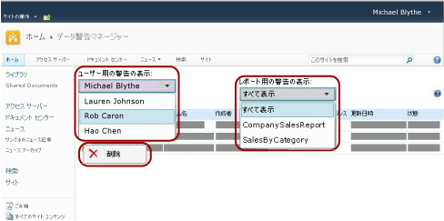

# 警告管理者用のデータ警告マネージャー

[!INCLUDE [ssrs-appliesto](../includes/ssrs-appliesto.md)] [!INCLUDE [ssrs-appliesto-2016](../includes/ssrs-appliesto-2016.md)] [!INCLUDE [ssrs-appliesto-not-2017](../includes/ssrs-appliesto-not-2017.md)] [!INCLUDE[ssrs-appliesto-sharepoint-2013-2016i](../includes/ssrs-appliesto-sharepoint-2013-2016.md)] [!INCLUDE [ssrs-appliesto-not-pbirs](../includes/ssrs-appliesto-not-pbirs.md)]

[!INCLUDE [ssrs-previous-versions](../includes/ssrs-previous-versions.md)]

SQL Server Reporting Services のデータ警告マネージャーを使用し、SharePoint 警告管理者はデータ警告を管理することができます。 警告管理者は、サイトに保存されたすべての警告についての情報を表示することができ、警告を削除することもできます。 次の図に、SharePoint 警告管理者がデータ警告マネージャー内で使用できる機能を示します。

> [!NOTE]
> SharePoint と Reporting Services の統合は、SQL Server 2016 以降では使用できません。

 サイトのデータ警告機能を有効にすると、MyDataAlerts.aspx と SiteDataAlerts.aspx という 2 つの SharePoint ページが作成されて、SharePoint サイトに追加されます。 SiteDataAlerts.aspx は、警告管理者用のデータ警告マネージャーです。 警告管理者は、SharePoint の [サイトの設定] ページからデータ警告マネージャーを開くことができます。 警告管理者がデータ警告マネージャーを開くためには、SharePoint 警告の管理権限が必要です。  
  
 URL を使用して直接データ警告マネージャーを開くこともできます。 URL の構文を次に示します。  
  
 `http: //<site name>/_layouts/ReportServer/ SiteDataAlerts.aspx`  
  
> [!NOTE]  
>  警告管理者は、 [!INCLUDE[ssRSnoversion](../includes/ssrsnoversion-md.md)] のデータ警告機能にアクセスする権限をインフォメーション ワーカーに付与できます。 必要な権限の詳細については、「 [Reporting Services のデータ警告](../reporting-services/reporting-services-data-alerts.md)」を参照してください。  
  
##   データ警告情報の表示  
 SharePoint に Reporting Services をインストールし、構成すると、SharePoint の [サイト設定] ページに **[Reporting Services]** のオプションが追加されます。 警告管理者は、Reporting Services 内の **[データ警告の管理]** オプションをクリックして、データ警告マネージャーを開きます。 次の図は、[サイトの設定] ページのどこからデータ警告マネージャーを開くかを示しています。  
  
 ![[サイトの設定] ページの Reporting Services セクション](../reporting-services/media/rs-sitesettings.gif "[サイトの設定] ページの Reporting Services セクション")  
  
 データ警告マネージャーには、警告名、レポート名、警告の所有者の名前、警告メッセージが送られた数、警告が最後に実行された時刻、警告の定義が最後に変更された時刻、および警告メッセージの状態を一覧にしたテーブルが組み込まれています。 警告の生成や送信ができない場合は、エラーに関する情報が状態列に含まれているので、これを利用して警告のトラブルシューティングを行います。 詳細については、「 [データ警告マネージャーで SharePoint サイトのすべてのデータ警告を管理する](../reporting-services/manage-all-data-alerts-on-a-sharepoint-site-in-data-alert-manager.md)」を参照してください。  
  
 次の表は、データ警告マネージャー内のテーブルから取得されたサンプル データを示しています。 エラーが発生した場合は、エラー メッセージとログ内のエントリの識別子 (GUID) がテーブル内の **[状態]** フィールドに含められます。  
  
|警告名|[レポート名]|[作成者]|送信済みの警告|[最終実行]|更新日時|状態|  
|----------------|-----------------|----------------|-----------------|--------------|-------------------|------------|  
|SalesQTR|SalesByTerritoryAndQTR|Lauren Johnson|4|6/12/2011|6/1/2011|前回の警告が成功し、警告が送信されました。|  
|UnitsSold|ProductsSalesByQTR|Michael Blythe|2|7/1/2011|6/28/2011|前回の警告は成功しましたが、データが変更されなかったため、警告は送信されませんでした。|  
|InventoryCount|StockStatusByQTR|Lauren Johnson|7|7/10/2011|7/2/2011|\<エラー メッセージ> ログ ファイルにはエラーの詳細が含まれています。 識別子: \<GUID> のログ エントリを参照してください。|  
|TopPromotion|PromotionTracking|Cristian Petculescu|0||5/23/2011|警告が作成されました。|  
  
 詳細については、「 [データ警告マネージャーで SharePoint サイトのすべてのデータ警告を管理する](../reporting-services/manage-all-data-alerts-on-a-sharepoint-site-in-data-alert-manager.md)」を参照してください。  
  
 サイト ユーザーが作成したすべての警告を表示することができます。 まず、ユーザーを選択し、次に、そのユーザーの警告をすべて表示するか、特定のレポートに関する警告のみを表示するかを選択します。  
  
  
##   データ警告の削除  
 警告の定義は、データ警告マネージャーから削除します。 データ警告の定義にはそれぞれ所有者 (作成した SharePoint ユーザー) が存在します。 所有者は、自分が作成した警告の定義のみ削除することができます。 詳細については、「 [データ警告マネージャーでのデータ警告の管理](../reporting-services/manage-my-data-alerts-in-data-alert-manager.md)」を参照してください。  
  
 SharePoint 警告管理者は、すべてのサイト ユーザーによって作成された警告の定義を一覧表示または削除できます。 詳細については、「 [データ警告マネージャーで SharePoint サイトのすべてのデータ警告を管理する](../reporting-services/manage-all-data-alerts-on-a-sharepoint-site-in-data-alert-manager.md)」を参照してください。  
  
 警告の定義を削除すると、それ以降、警告は送信されません。 ただし、警告データベースを照会すると、警告の定義がまだ存在している場合があります。 警告サービスではスケジュールに基づいてクリーンアップが実行され、警告の定義は次回のクリーンアップで完全に削除されます。 既定のクリーンアップ間隔は 20 分です。 クリーンアップ間隔は設定可能です。 詳細については、「 [Reporting Services のデータ警告](../reporting-services/reporting-services-data-alerts.md)」を参照してください。  
  
  
##   関連タスク  
 このセクションには、警告の管理方法を説明する手順が示されています。  
  
-   [データ警告マネージャーで SharePoint サイトのすべてのデータ警告を管理する](../reporting-services/manage-all-data-alerts-on-a-sharepoint-site-in-data-alert-manager.md)  

## 参照

[Reporting Services Data Alerts](../reporting-services/reporting-services-data-alerts.md)  

その他の質問 [Reporting Services のフォーラムに質問してみてください](https://go.microsoft.com/fwlink/?LinkId=620231)
