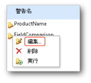

# 警告デザイナーでのデータ警告の編集

[!INCLUDE [ssrs-appliesto](../includes/ssrs-appliesto.md)] [!INCLUDE [ssrs-appliesto-2016](../includes/ssrs-appliesto-2016.md)] [!INCLUDE [ssrs-appliesto-not-2017](../includes/ssrs-appliesto-not-2017.md)] [!INCLUDE[ssrs-appliesto-sharepoint-2013-2016i](../includes/ssrs-appliesto-sharepoint-2013-2016.md)] [!INCLUDE [ssrs-appliesto-not-pbirs](../includes/ssrs-appliesto-not-pbirs.md)]

[!INCLUDE [ssrs-previous-versions](../includes/ssrs-previous-versions.md)]

編集対象のデータ警告定義は、データ警告マネージャーから開きます。 警告の定義は、作成したユーザーのみが編集できます。 詳細については、「 [データ警告マネージャーでのデータ警告の管理](../reporting-services/manage-my-data-alerts-in-data-alert-manager.md)」をご覧ください。

> [!NOTE]
> SQL Server 2016 より後に、SharePoint と reporting Services の統合を使用できなくします。

 次の図は、データ警告マネージャーでの、データ警告のショートカット メニューを示しています。  
  
   
  
 次の手順には、データ警告デザイナーで編集するためにデータ警告マネージャーから警告定義を開く手順が含まれます。  
  
### データ警告デザイナーでデータ警告定義を編集するには
  
  
1.  データ警告マネージャーで、編集するデータ警告定義を右クリックし、 **[編集]**をクリックします。  
  
     データ警告デザイナーに警告定義が表示されます。  
  
2.  ルール、スケジュール設定、および電子メールの設定を更新します。 詳細については、「 [データ警告デザイナー](../reporting-services/data-alert-designer.md) 」および「 [警告デザイナーでのデータ警告の作成](../reporting-services/create-a-data-alert-in-data-alert-designer.md)」をご覧ください。  
  
    > [!NOTE]  
    >  別のデータ フィードを選択することはできません。 異なるデータ フィードを使用するには、新しいデータ警告定義を作成する必要があります。  
  
3.  **[保存]**をクリックします。  
  
    > [!NOTE]  
    >  レポートが変更され、レポートから生成されたデータ フィードが変更されている場合、警告の定義が無効になっている可能性があります。 この状況が生じるのは、警告定義のルールで参照される列がレポートから削除された場合、列のデータ型が変更された場合、またはレポートが削除または移動された場合です。 無効な警告定義は開くことはできますが、基になるレポート データ フィードの現行バージョンに基づいて有効になるまでは再保存できません。 レポートからデータ フィードが生成される方法の詳細については、「[複数のレポートからのデータ フィードの生成 &#40;レポート ビルダーおよび SSRS&#41;](../reporting-services/report-builder/generating-data-feeds-from-reports-report-builder-and-ssrs.md)」をご覧ください。  

## 参照

[警告管理者用のデータ警告マネージャー](../reporting-services/data-alert-manager-for-alerting-administrators.md)   
[Reporting Services のデータ警告](../reporting-services/reporting-services-data-alerts.md)  

他に質問しますか。 [Reporting Services のフォーラムで質問してみてください。](http://go.microsoft.com/fwlink/?LinkId=620231)
