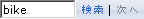

# HTML ビューアーとレポート ツール バー
  [!INCLUDE[ssNoVersion](../includes/ssnoversion-md.md)] [!INCLUDE[ssRSnoversion](../includes/ssrsnoversion-md.md)] には、レポート サーバーからの要求に応じてレポートを表示するために使用される HTML ビューアーが用意されています。 HTML ビューアーには、HTML でレポートを表示するためのフレームワークが提供されます。 これには、レポート ツール バー、パラメーター セクション、資格情報セクション、およびドキュメント マップが含まれます。 HTML ビューアーのレポート ツール バーには、HTML 以外の形式でレポートを表示できるエクスポート オプションなど、レポートに関する作業に使用できる機能が用意されています。 パラメーター セクションとドキュメント マップは、パラメーターまたはドキュメント マップ コントロールを使用するように構成されているレポートを開いた場合のみ表示されます。  
  
 レポート ツール バーを変更することはできませんが、レポート URL でパラメーターを構成して、ツール バーがレポートに表示されないようにすることができます。 レポート ツール バーを非表示にする操作の詳細については、「 [URL アクセス パラメーター リファレンス](../reporting-services/url-access-parameter-reference.md)」を参照してください。  
  
## レポート ツール バー  
 レポート ツール バーでは、HTML 表示拡張機能で表示されたレポートに対して、ページ ナビゲーション、拡大または縮小、更新、検索、エクスポート、印刷、およびデータ フィード機能が提供されます。  
  
 印刷機能はオプションです。 この機能が使用可能なときは、プリンターのアイコンがレポート ツール バーに表示されます。 最初に使用する際、[プリンター] アイコンをクリックすると、インストールする必要のある ActiveX コントロールがダウンロードされます。 コントロールがインストールされた後、[プリンター] アイコンをクリックして表示される [印刷] ダイアログ ボックスで、使用しているコンピューターに構成されているプリンターを選択できます。 印刷が可能かどうかは、サーバーの設定およびブラウザーの設定によって異なります。 詳細については、「[印刷コントロールを使用したブラウザーからのレポートの印刷 (レポート ビルダーおよび SSRS)](../reporting-services/report-builder/print-reports-from-a-browser-with-the-print-control-report-builder-and-ssrs.md)」および「[Reporting Services のクライアント側印刷機能の有効化と無効化](../reporting-services/report-server/enable-and-disable-client-side-printing-for-reporting-services.md)」を参照してください。  
  
 レポート ツール バーは、次の図のように表示されます。 使用可能なレポート機能や表示オプションによっては、図とは異なるレポート ツール バーが表示される場合があります。  
  
   
  
 次の表では、一般的に使用されるレポート ツール バーの機能を説明します。 各機能は、アクセスに使用するコントロールごとに分類されています。  
  
|使用するアイコンまたはコントロール||変換先|  
|------------------------------|-|--------|  
||**ページ ナビゲーション コントロール**|レポートの最初または最後のページを開き、レポートをページごとにスクロールし、レポートの特定のページを開きます。 特定のページを表示するには、ページ番号を入力して Enter キーを押します。|  
||**ページ表示コントロール**|レポート ページのサイズを拡大または縮小します。 パーセンテージ ベースの変更以外に、 **[ページの幅]** を選択してレポート ページの幅をブラウザー ウィンドウに合わせるか、 **[ページ全体]** を選択してレポートの高さをブラウザー ウィンドウに合わせることができます。 **[ズーム]** オプションは、 [!INCLUDE[msCoName](../includes/msconame-md.md)] Internet Explorer 5.5 以降のバージョンでサポートされています。|  
||**検索フィールド**|検索する語または句を入力してレポートの内容を検索します (最大文字数は、256 文字です)。 検索は大文字と小文字を区別せず、現在選択されているページまたはセクションから開始されます。 検索対象は、表示可能な内容だけです。 同じ値で引き続き検索を続ける場合は、 **[次へ]** をクリックします。|  
||**エクスポート形式**|新しいブラウザー ウィンドウを開いて、選択した形式でレポートを表示します。 レポート サーバーにインストールされている表示拡張機能によって、使用可能な形式が決まります。 印刷には、TIFF を使用することをお勧めします。 選択した形式でレポートを表示するには、 **[エクスポート]** をクリックします。|  
||**ドキュメント マップ アイコン**|ドキュメント マップを含んだレポート内のドキュメント マップ ペインの表示と非表示を切り替えます。 ドキュメント マップは、Web サイトのナビゲーション ウィンドウに類似したレポート ナビゲーション コントロールです。 ドキュメント マップ内のアイテムをクリックして、特定のグループ、ページ、またはサブレポートに移動することができます。|  
||**プリンターのアイコン**|[印刷] ダイアログ ボックスが表示され、印刷オプションの指定と、レポートの印刷ができます。 最初に使用する際、このアイコンをクリックすると、印刷コントロールをダウンロードするよう求められます。|  
||**表示および非表示のアイコン**|パラメーターを含んだレポートのパラメーター値を入力するフィールドと **[レポートの表示]** ボタンの表示と非表示を切り替えます。|  
|![[レポート] ツールバーのブラウザー更新ボタン](../reporting-services/media/htmlviewer-refresh.GIF "[レポート] ツールバーのブラウザー更新ボタン")|**レポートの更新アイコン**|レポートを更新します。 アクティブなレポートのデータが更新されます。 キャッシュされたレポートが格納先の場所から再度読み込まれます。|  
||**データ フィード アイコン**|レポートから生成されたデータ フィードです。|  
||**Power BI ダッシュボードにピン留めする**|サポート レポート アイテムを [!INCLUDE[sspowerbi](../includes/sspowerbi-md.md)]にピン留めします。 ボタンが表示されていない場合は、レポート サーバーが [!INCLUDE[sspowerbi](../includes/sspowerbi-md.md)]と統合されていません。  詳細については、「 [Power BI レポート サーバーの統合 (構成マネージャー)](../reporting-services/install-windows/power-bi-report-server-integration-configuration-manager.md)と統合しておく必要があります。|  
  
### エクスポート形式について  
 レポート ツール バーを使用すると、さまざまな形式でレポートを表示できます。 レポート サーバーにインストールされている表示拡張機能によって、使用可能な形式が決まります。 他の形式を選択した場合、選択したエクスポート形式に関連付けられたビューアーを使用して、新しいブラウザー ウィンドウが開き、レポートが表示されます。 選択した形式をビューアーで利用できない場合、他の形式を選択することができます。  
  
 次のエクスポート形式が、レポート サーバーの既定のインストールに含まれています。 利用可能なエクスポート形式は、ここに一覧表示されているものとは異なる場合があります。  
  
|エクスポート形式|[説明]|  
|-------------------|-----------------|  
|XML|XML 構文でレポートを表示します。 XML で表示されたレポートが新しいブラウザー ウィンドウに表示されます。|  
|CSV|コンマ区切り形式でレポートを表示します。 レポートは、CSV ファイル形式に関連付けられているアプリケーションで開きます。|  
|PDF|クライアント側の PDF ビューアーを使用して、レポートを表示します。 この形式を使用するには、サード パーティの PDF ビューアー (たとえば、Adobe Acrobat Reader) が必要です。|  
|MHTML|イメージおよびリンクされたコンテンツをレポートに保持する、MIME エンコード HTML 形式でレポートを表示します。|  
|[エクスポート]|[!INCLUDE[msCoName](../includes/msconame-md.md)] Excel でレポートを表示します (.xlsx ファイル)。|  
|PowerPoint|[!INCLUDE[msCoName](../includes/msconame-md.md)] PowerPoint でレポートを表示します (.pptx ファイル)。|  
|TIFF ファイル|標準の TIFF ビューアーでレポートを表示します。 一部の [!INCLUDE[msCoName](../includes/msconame-md.md)] Windows クライアントでは、これは Windows 画像と FAX ビューアーです。 印刷ページのレイアウトでレポートを表示するには、この形式を選択します。|  
|Word|[!INCLUDE[msCoName](../includes/msconame-md.md)] Word でレポートを表示します (.docx ファイル)。|  
  
## パラメーター  
 パラメーターは、特定のデータの選択に使用される値です (特に、レポートのデータを選択するクエリの完了や結果セットのフィルター処理に使用されます)。 レポートによく使用されるパラメーターには、日付、名前、および ID があります。 パラメーターの値を指定すると、レポートにはその値に適合したデータのみが含まれます。たとえば、従業員 ID パラメーターを基に、レポートに従業員データを含めることができます。 パラメーターは、レポート上のフィールドに対応します。 パラメーターを指定した後、 **[レポートの表示]** をクリックしてデータを取得します。  
  
 レポート作成者は、各レポートに有効なパラメーター値を定義します。 レポート管理者も、パラメーター値を設定することができます。 レポートに有効なパラメーター値を調べるには、レポート設計者またはレポート管理者に問い合わせてください。  
  
## [資格情報]  
 資格情報は、データ ソースにアクセスできるユーザー名とパスワードの値です。 資格情報を指定した後、 **[レポートの表示]** をクリックしてデータを取得します。 ユーザーのログオンが必要なレポートの場合、ユーザーが参照することを許可されたデータは、別のユーザーが参照するデータとは異なる場合があります。 つまり、2 人のユーザーが同じレポートを実行しても、異なる結果が得られる場合があります。 さらに、レポートによっては非表示の内容が含まれている場合があり、その内容はユーザーのログオン資格情報またはレポートで選択された内容に基づいて開示されます。 レポートで非表示になっている領域は検索操作の対象から除外されるため、すべての情報が表示された状態のレポートに検索を行った場合とは異なる検索結果が返されます。  
  
## 参照  
 [レポート データ ソースに関する資格情報と接続情報を指定する](../reporting-services/report-data/specify-credential-and-connection-information-for-report-data-sources.md)   
 [レポートの検索、表示、管理 &#40;レポート ビルダーおよび SSRS&#41;](../reporting-services/report-builder/finding-viewing-and-managing-reports-report-builder-and-ssrs.md)   
 [レポートのエクスポート &#40;レポート ビルダーおよび SSRS&#41;](../reporting-services/report-builder/export-reports-report-builder-and-ssrs.md)  
  
  
