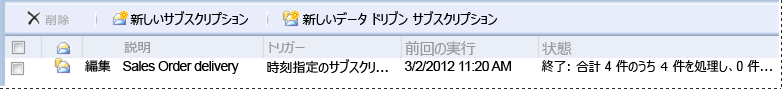

# Lesson 3: Defining a Data-Driven Subscription
この [!INCLUDE[ssRSnoversion_md](../includes/ssrsnoversion-md.md)] チュートリアル レッスンでは、[!INCLUDE[ssRSnoversion](../includes/ssrsnoversion-md.md)] Web ポータルのデータ ドリブン サブスクリプションを使用し、サブスクリプション データ ソースへの接続、サブスクリプション データを取得するクエリの作成、および結果セットとレポート、配信オプションのマッピングを行います。  
  
> [!NOTE]  
> 開始する前に、**[!INCLUDE[ssNoVersion](../includes/ssnoversion-md.md)] エージェント** サービスが実行されていることを確認します。 実行されていない場合は、サブスクリプションを保存できません。  検証の 1 つとしては、[SQL Server 構成マネージャー](../relational-databases/sql-server-configuration-manager.md)を開きます。
このレッスンを行うには、レッスン 1 とレッスン 2 を完了していることと、レポート データ ソースに、保存された資格情報が使用されていることが必要です。  詳細については、「[レッスン 2: レポート データ ソースのプロパティの変更](../reporting-services/lesson-2-modifying-the-report-data-source-properties.md)」を参照してください。  
  
## <a name="bkmk_startwizard"></a>データ ドリブン サブスクリプション ウィザードの開始  
  
1.  [!INCLUDE[ssRSnoversion_md](../includes/ssrsnoversion-md.md)] Web ポータルで **[ホーム]**をクリックして、**Sales Orders** レポートのあるフォルダーに移動します。  
  
2.  レポートのショートカット メニュー  で **[管理]**をクリックし、左側ペインで **[サブスクリプション]** をクリックします。  
  
3.  **[新しいサブスクリプション]** をクリックします。 このボタンが表示されない場合は、コンテンツ マネージャーの権限がありません。 
  
## 説明の定義  
1.  説明に「 **Sales Order delivery** 」と入力します。
## 型
1.  **[データ ドリブン サブスクリプション]** をクリックします。  
## スケジュール
1. スケジュール セクションで、**[レポート固有のスケジュール]** をクリックします。
2. **[スケジュールの編集]**をクリックします。
3.  **[スケジュールの詳細]**で、 **[一度だけ]**をクリックします。  
4.  開始時刻として、現在の時刻から数分後を指定します。  
5.  **[適用]**をクリックします。
## 転送先  
1.  [転送先] セクションで、配信方法に対して **[Windows ファイル共有]** を選択します。  

## データセット
1. **[データセットの編集]** をクリックします。
2. **[カスタム データ ソース]**をクリックします。
3. データ ソースの **[接続]** の種類として、**[Microsoft SQL Server]** をクリックします。
4. [接続文字列] に、次のように入力します。 *[サブスクライバー]* はレッスン 1 で作成したデータベースです。 
  
    ```  
    data source=localhost; initial catalog=Subscribers
    ```
    
 ## [資格情報]
 1. **[次の資格情報を使用する]** を選択します。
 2. **[Windows ユーザー名とパスワード]** を選択します。
 3.  **[ユーザー名]** と **[パスワード]**に、ドメイン ユーザー名とパスワードを入力します。 **[ユーザー名]**には、ドメインとユーザー アカウントの両方を指定します。
     > [!NOTE]  
    > サブスクライバー データ ソースへの接続に使用する資格情報は、 [!INCLUDE[ssManStudio](../includes/ssmanstudio-md.md)]に返されません。 後でサブスクリプションを変更する場合は、データ ソースへの接続に使用するパスワードをこのページで再入力する必要があります。
## Query      
1.  クエリ ボックスに次のクエリを入力します。  
  
    ```  
    Select * from OrderInfo  
    ```  
  
2.  30 秒のタイムアウトを指定します。  
  
3.  **[クエリの検証]**をクリックし、**[適用]**をクリックします。
## 配信オプション
次の値を入力します。

パラメーター  |値のソース  | 値/フィールド  
---------|---------|---------
**ファイル名**     |データセットから値を取得 | 書     
**[パス]**     | 値を入力  | [値] に、書き込み権限のあるパブリック ファイル共有の名前を入力します (例: `\\mycomputer\public\myreports`)。 
**表示形式** | データセットから値を取得 | Format
**[書き込みモード]**| 値を入力| 自動増分    
**ファイル拡張子** |値を入力 |True
**[ユーザー名]** | 値を入力 | ドメイン ユーザー アカウントを入力します。 \<ドメイン>\\\<アカウント> の形式で入力してください。 ユーザー アカウントには、構成したパスに対する権限が必要です。 
**Password** | 値を入力 | パスワードを入力

## レポート パラメーター
 1. **[OrderNumber]** フィールドには、**[データセットから値を取得]** を選択します。 [値] で、 **[注文]**をクリックします。 
 2. **[サブスクリプションの作成]** をクリックします。
   
## 次の手順  
サブスクリプションを実行すると、 *Subscribers* データ ソースの注文ごとに 1 つずつ、4 つのレポート ファイルが、指定したファイル共有に配信されます。 各配信では、データ (注文固有のデータ)、表示形式、ファイル形式がそれぞれ異なっています。 各レポートを共有フォルダーから開き、定義したサブスクリプション オプションに基づいて各バージョンがカスタマイズされているかどうかを確認できます。  
  
  
  
Web ポータルのサブスクリプション ページには、サブスクリプションの **[最終実行]** 日付と **[状態]** が表示されます。 
**注:** サブスクリプションを実行した後、ページを更新して更新後の情報を表示します。  
    
  
  
これで、「データ ドリブン サブスクリプションの定義」のチュートリアルは終了します。   
  
## 参照  
[サブスクリプションと配信 &#40;Reporting Services&#41;](../reporting-services/subscriptions/subscriptions-and-delivery-reporting-services.md)  
[データ ドリブン サブスクリプション](../reporting-services/subscriptions/data-driven-subscriptions.md)  
[データ ドリブン サブスクリプションを作成、変更、および削除する](../reporting-services/subscriptions/create-modify-and-delete-data-driven-subscriptions.md)  
[サブスクライバー データに対して外部データ ソースを使用する &#40;データ ドリブン サブスクリプション&#41;](../reporting-services/subscriptions/use-an-external-data-source-for-subscriber-data-data-driven-subscription.md)  
  
  
  
