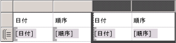
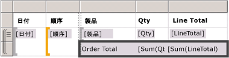
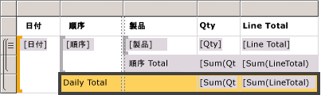
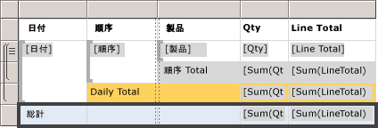
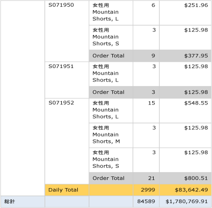

# レッスン 6: グループと合計の追加 (Reporting Services)

この最後のチュートリアルのレッスンでは、[!INCLUDE[ssRSnoversion](../includes/ssrsnoversion-md.md)] レポートにグループ化と合計を追加して、データを整理して要約します。  

## レポート内のデータをグループ化するには

1. **[デザイン]** タブを選択します。
2. **[行グループ]** ウィンドウが表示されていない場合は、デザイン画面を右クリックして、 **[表示]**  > **[グループ化]** の順に選択します。
3. **[レポート データ]** ウィンドウから、`[Date]` フィールドを **[行グループ]** ウィンドウにドラッグします。 **[= (詳細)]** と表示されている行の上に配置します。

    > [!NOTE]
    > グループを示す角かっこが行ハンドルに表示されることに注意してください。 テーブルにも 2 つの `[Date]` 式の列が、縦の点線の両側に 1 つずつ表示されます。
    >
    >
4. **[レポート データ]** ウィンドウから、`[Order]` フィールドを **[行グループ]** ウィンドウにドラッグします。 **[Date]** の下、 **[= (詳細)]** の上に配置します。

    

    > [!NOTE]
    > 2 つのグループを示す 2 個の角かっこ  が行ハンドルに表示されることに注意してください。 テーブルにも 2 つの `[Order]` 式の列が表示されます。

5. 二重線の右側にある元の `[Date]` 式と `[Order]` 式の列を削除します。 2 つの列の列ハンドルを選択し、右クリックして **[列の削除]** を選択します。 レポート デザイナーにより個々の行の式が削除され、グループ式のみが表示されるようになります。

    

6. 新しい `[Date]` 列の書式を設定するには、`[Date]` 式が含まれるデータ領域セルを右クリックし、 **[テキスト ボックスのプロパティ]** を選択します。
7. 左端の列リスト ボックスから **[数値]** を選択し、 **[カテゴリ]** リストボックスから **[日付]** を選択します。
8. **[型]** リスト ボックスで **[2000 年 1 月 31 日]** を選択します。
9. **[OK]** を選択して書式を適用します。
10. レポートを再度プレビューします。 次のようになります。

    

## レポートに合計を追加する

1. **デザイン** ビューに切り替えます。
2. `[LineTotal]` 式が含まれるデータ領域セルを右クリックし、 **[合計の追加]** を選択します。 レポート デザイナーにより各注文の合計金額を示す行が追加されます。
3. `[Qty]` フィールドが含まれるセルを右クリックし、 **[合計の追加]** を選択します。 レポート デザイナーにより各注文の合計数量が合計行に追加されます。
4. `Sum[Qty]` セルの左側にある空のセルに、文字列「注文合計」を入力します。
5. 合計行に背景色を追加できます。 2 つの合計セルとラベル セルを選択します。  
6. **[書式]** メニューから、 **[背景色]**  >  **[淡い灰色]** スクエアの順に選択します。square.
7. **[OK]** を選択して書式を適用します。

   

## レポートに毎日の合計を追加する

1. `[Order]` 式のセルを右クリックし、 **[合計の追加]**  >  **[後]** の順に選択します。 レポート デザイナーにより、`[Qty]` と `[Linetotal]` 値の毎日の合計が含まれる新しい行と、`[Order]` 式の列の一番下に [合計] という文字列が追加されます。
2. 同じセルで [合計] の前に「毎日の」と入力し、[毎日の合計] と表示します。
3. そのセル、右側の 2 つの隣接する合計セル、およびその間にある空白のセルを選択します。
4. **[書式]** メニューから、 **[背景色]**  >  **[オレンジ]** スクエアの順に選択します。
5. **[OK]** を選択して書式を適用します。

   

## レポートに総計を追加する

1. `[Date]` 式のセルを右クリックし、 **[合計の追加]**  >  **[後]** の順に選択します。 レポート デザイナーにより、`[Qty]` と `[LineTotal]` 値のレポート全体の合計が含まれる新しい行と、`[Date]` 式の列の一番下に [合計] という文字列が追加されます。
2. 同じセルで [合計] の代わりに「総計」と入力し、[総計] と表示します。
3. [総計] セル、2 個の `Sum()` 式のセル、およびその間にある空白のセルを選択します。
4. **[書式]** メニューから、 **[背景色]**  >  **[薄い青]** スクエアの順に選択します。
5. **[OK]** を選択して書式を適用します。

    

## レポートをプレビューする

書式の変更をプレビューするには、 **[プレビュー]** タブを選択します。 **[プレビュー]** ツールバーで、 のように表示されている **[最終ページ]** ボタンを選択します。 結果は次のように表示されます。

   

## レポートを*レポート サーバー*にパブリッシュする (オプション)

オプションの手順では、完成したレポートをレポート サーバーにパブリッシュして、Web ポータルでレポートを表示できるようにします。

1. **[プロジェクト]** メニュー > **[Tutorial のプロパティ]** の順に選択します。
2. **TargetServerURL** に、レポート サーバーの名前を入力します。たとえば、次のように入力します。
    - `http:/<servername>/reportserver` または
    - `https://localhost/reportserver` は、レポート サーバーでレポートを設計している場合に動作します。

3. **TargetReportFolder** はプロジェクトの名前から名前が付けられたチュートリアルです。 レポート デザイナーによりレポートがこのフォルダーに配置されます。
4. **[OK]** を選択します。
5. **[ビルド]** メニュー > **[Tutorial の配置]** の順に選択します。

    **[出力]** ウィンドウに次のようなメッセージが表示されていれば、正常に配置されたことを示しています。

    > ------ ビルド開始: プロジェクト: tutorial、構成: デバッグ ------  
    > 'Sales Orders.rdl' をスキップしています。 アイテムは最新の状態です。  
    > ビルドの完了 -- エラー 0 個、警告 0 個  
    > ------ ビルド開始: プロジェクト: tutorial、構成: デバッグ ------  
    > `https://[server name]/reportserver` に配置しています  
    > レポート '/tutorial/Sales Orders' を配置しています。  
    > 配置完了 -- エラー 0 個、警告 0 個  
    > ========== ビルド: 正常終了または最新の状態 1、失敗 0、スキップ 0 ==========  
    > ========== 配置: 1 正常終了、0 失敗、0 スキップ ==========  

    次のようなメッセージが表示されている場合は、レポート サーバーに対する適切な権限があることと、管理者特権を使用して [!INCLUDE[ssBIDevStudio](../includes/ssbidevstudio-md.md)] を開始したことを確認してください。
    >
    > "ユーザー 'XXXXXXXX\\&lt;ユーザー名&gt;' には、この操作を行うのに必要な権限が許可されていません。"

6. 管理者特権を使用してブラウザーを開きます。 たとえば、Internet Explorer アイコンを右クリックして **[管理者として実行]** をクリックします。
7. Web ポータルの URL を参照します。
   - `https://<server name>/reports`
   - `https://localhost/reports` は、レポート サーバーでレポートを設計している場合に動作します。

8. [Tutorial] フォルダーを選択し、"Sales Orders" レポートを選択してレポートを表示します。

      

これで、 **「基本的なテーブル レポートの作成」チュートリアル**を終了します。

## 参照

[データのフィルター、グループ化、および並べ替え &#40;レポート ビルダーおよび SSRS&#41;](report-design/filter-group-and-sort-data-report-builder-and-ssrs.md)
