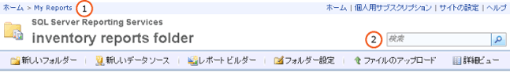

# Web ポータルを使用したレポートの検索と表示 (レポート ビルダーおよび SSRS)
  レポート マネージャーは、レポートの表示機能および管理機能を備えた Web ベースのツールです。 これは、レポート サーバー インストールの一部です。 レポート マネージャーを開くとき、ブラウザー ウィンドウにレポート マネージャーの URL を入力します。 ブラウザーの要件の詳細については、「 [Reporting Services と Power View のブラウザー サポート](../../reporting-services/browser-support-for-reporting-services-and-power-view.md)」を参照してください。 レポート サーバーでのレポート マネージャー URL の構成方法の詳細については、システム管理者に問い合わせてください。 詳細については、「[レポート マネージャーの構成 (ネイティブ モード)](../../reporting-services/report-server/configure-report-manager-native-mode.md)」を参照してください。  
  
 レポート マネージャーを使用するときに表示される内容は、レポート サーバーに対してシステム管理者が設定した権限によって決まります。 権限はロールの割り当てによって与えられます。 レポートを検索および表示するには、ロールの割り当てに "レポートの表示" タスクが含まれている必要があります。 レポート サーバーでレポートを検索するには、名前または説明からレポートを検索するか、レポート サーバーのフォルダーを参照します。 検索または参照できるのは、レポート サーバーにパブリッシュまたはアップロードされたレポートのみです。 レポートの検索方法の詳細については、「 [レポートおよび他のアイテムの検索 &#40;レポート ビルダーおよび SSRS&#41;](../../reporting-services/report-builder/searching-for-reports-and-other-items-report-builder-and-ssrs.md)」を参照してください。  
  
> [!NOTE]  
>  [!INCLUDE[ssRBRDDup](../../includes/ssrbrddup-md.md)]  
  
## レポート マネージャーでのフォルダー階層の移動  
 実行するレポートを参照する場合は、ホーム ページを使用できます。このページは、レポート マネージャーを起動したとき、およびフォルダー階層内で任意のフォルダーを開いたときに自動的に表示されます。 ホーム ページには、表示権限のあるアイテムだけが表示されます。 フォルダー パスは、ホーム ページの上部にリンク行として表示されます。 ルート フォルダー ([ホーム]) を先頭に、フォルダー名が順に一覧表示されます。 各サブフォルダーを開くと、ページの最上部のフォルダー パスにフォルダー名が追加されます。 下のイメージの**(1)** 。 レポートを開くと、レポートの名前もフォルダー パスに追加されます。  
  
   
レポート マネージャーのリボン  
  
 フォルダー階層内を移動するには、次の方法を使用します。  
  
-   フォルダーのコンテンツを表示するには、ホーム ページでフォルダー名をクリックします。 フォルダー ページが開き、フォルダーのコンテンツが表示されます。  
  
-   下位の階層に移動するには、現在のフォルダーのサブフォルダーを開きます。 フォルダーには、レポート、リソース、共有データ ソース アイテム、およびその他のフォルダーが格納されます。 任意のフォルダーのアイコンをクリックするとそのフォルダーが開き、1 階層下位のコンテンツが表示されます。  
  
-   上位の階層に移動するには、ページ最上部のリンク行で、表示したいコンテンツが保存されているフォルダーの名前をクリックします。 上のイメージの**(1)** 。  
  
## レポートを開く  
 レポートが見つかったら、レポート名をクリックしてそのレポートを開きます。 レポートは、レポート マネージャーの [コンテンツ] ページに HTML 形式で表示されます。 レポートは、ブラウザー セッションで常にキャッシュされます。したがって、レポートを開いた場合は、通常、 **[戻る]** ボタンをクリックしてそのレポートに戻ることができます。 これは、レポートの実行にユーザー名とパスワードが必要な場合にも当てはまります。 表示されたレポートは、ブラウザーを閉じるまで完全には閉じられません。  
  
 フォルダー階層で表示されているすべてのレポートにすぐアクセスできるとは限りません。 レポートによっては、ユーザー名とパスワードがユーザーに要求され、そのレポートのデータ ソースへのアクセス権がユーザーにあるかどうか、検証が行われるものもあります。 レポート マネージャーでレポートを開く方法の詳細については、次を参照してください。[を開いたり、閉じたり、レポートと #40 です。レポート マネージャー &#41;](../../reporting-services/reports/open-and-close-a-report-report-manager.md).  
  
 レポート ビルダーからレポート サーバーのレポートを直接参照したり開いたりすることもできます。 詳細については、「 [レポートおよび他のアイテムの検索 &#40;レポート ビルダーおよび SSRS&#41;](../../reporting-services/report-builder/searching-for-reports-and-other-items-report-builder-and-ssrs.md)」を参照してください。  
  
## アイテムを検索するには  
  
-   レポート マネージャーでアイテムを検索するには、ページの先頭にある **[検索]** ボックスに検索文字列を入力します。 上のイメージの**(2)** 。 検索は、フォルダー階層の最上位ノードから開始され、続いて各分岐にわたり実行されます。 特定の分岐へのアクセス権がない場合、その分岐は検索されません。 これには、他のユーザーが所有する [個人用レポート] フォルダー、および通常アクセスできない他のフォルダーが該当します。 検索結果には、表示権限のあるレポートやアイテムのみが表示されます。  
  
-   名前や説明からアイテムを検索するには、検索したいテキストのすべてまたは一部を指定します。 検索文字列の大文字と小文字は区別されません。 検索条件の指定や除外を行う正符号 (+) や負符号 (-) などの検索演算子は使用できません。  
  
-   レポート内の特定のテキストを検索するには、レポートの最上部にあるツール バーを使用します。  
  
## 参照  
 [レポートおよび他のアイテムの検索 &#40;レポート ビルダーおよび SSRS&#41;](../../reporting-services/report-builder/searching-for-reports-and-other-items-report-builder-and-ssrs.md)   
 [検索、表示、およびレポートと &#40;を管理レポート ビルダーおよび SSRS &#41; です。](../../reporting-services/report-builder/finding-viewing-and-managing-reports-report-builder-and-ssrs.md)  
  
  
