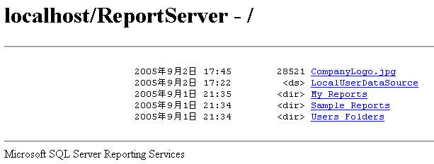

# ブラウザーを使用したレポートの検索と表示 (レポート ビルダーおよび SSRS)
  Web ブラウザーが対応していれば、レポート サーバーに直接接続してレポートを表示できます。 レポートにはそれぞれ、レポート サーバー上の URL アドレスが割り当てられています。 レポートの Web アドレスを入力すると、レポートを Web アプリケーションとは無関係にブラウザー ウィンドウで開くことができます。 レポートは HTML 形式で表示され、レポート内でページ間の移動やデータ値の検索を行うことができるようにレポート ツール バーが含まれています。 URL でパラメーターを設定すると、ツール バーを非表示にしたりレポートの出力形式を選択したりできます。  
  
 Web アドレスを使用してレポートを開くのは、レポートの表示には適していますが、レポートの管理には適していません。 アイテムのプロパティ ページやサブスクリプション定義ページにアクセスすることはできません。 このような作業には、レポート マネージャーまたは SharePoint サイトを使用する必要があります。  
  
 レポートの Web アドレスがわからない場合は、レポート サーバーの Web アドレスを開いてから、レポート サーバーのフォルダー階層を参照して、表示するレポートを選択することができます。 次の図は、ブラウザー ウィンドウに表示されたフォルダー階層を表しています。  
  
   
ブラウザーに表示されたフォルダー  
  
> [!NOTE]  
>  ハンドヘルド デバイスからレポートにアクセスする場合は、ブラウザーを使用してレポートを開く必要があります。 レポート マネージャーは、ハンドヘルド デバイスには対応していません。  
  
 使用できるブラウザーの種類の詳細については、「 [Reporting Services および Power View のブラウザーサポート](../../reporting-services/browser-support-for-reporting-services-and-power-view.md)」を参照してください。  
  
> [!NOTE]  
>  [!INCLUDE[ssRBRDDup](../../includes/ssrbrddup-md.md)]  
  
## Web ブラウザーでのレポート サーバー フォルダー間の移動  
 Web ブラウザーを使用して、レポート サーバー フォルダー間を移動したり、レポートを実行することができます。 レポートおよびアイテムは、フォルダー階層のリンクとして表示されます。 リンクをクリックすることで、レポート、リソース、またはフォルダーを開いたり、共有データ ソースの内容を参照することができます。 フォルダー階層を利用した移動は、レポートの URL が不明な場合に便利です。 レポート サーバーの Web アドレスを指定して、フォルダー階層のルート ノードでブラウザー接続を開き、フォルダー リンクをクリックしてフォルダー階層内を移動できます。  
  
 レポート サーバーの仮想ディレクトリにアクセスした場合、表示されるのは、フォルダー、レポート、およびこれまでにアクセスしたことのあるアップロードされたアイテムのみです。 ユーザー インターフェイスには、フォルダー階層と、作成日時や更新日時、ファイル サイズ、および以下のような各アイテムの種類などの基本情報のみが表示されます。  
  
-   他の識別情報が何も付加されていないリンクは、レポートまたはモデルを表します。  
  
-   \<ds> タグは、共有データ ソースであることを表します。  
  
-   \<dir> タグは、フォルダー アイテムであることを表します。  
  
-   ファイル名拡張子は、リソースを表します。 ファイル名拡張子によって、リソースの MIME の種類が識別されます。 たとえば、.jpg は JPEG 形式の画像であることを表します。  
  
## レポートの URL アドレスの入力  
 [!INCLUDE[ssRSnoversion](../../includes/ssrsnoversion-md.md)] では、レポート サーバー上の特定のアイテムへの URL アクセスをサポートしています。 URL には、レポートの絶対パスと、レポートを表示するためのコマンドを含める必要があります。 レポートにパラメーターが含まれている場合は、レポートを開くのに必要なすべての値も指定する必要があります。 パスに含まれるスペース、パラメーター値、または表示拡張機能が含まれているレポートの URL を入力する場合、予想どおりの結果を得るには、URL エンコードされた文字を URL に組み込む必要があります。 パス名に含まれるスペース、パラメーター、および表示拡張機能のエンコードを含むレポートの URL の例を次に示します。  
  
 `https://<Webservername>/reportserver?/<reportfolder>/employee+sales+summary&ReportYear=2004&ReportMonth=06&EmpID=24&rs:Command=Render&rs:Format=HTML4.0`  
  
 Internet Explorer での URL の最大文字数は 2,083 文字です。 詳細については、「 [[IE] URL に使用可能な文字数は最大 2,083 文字](https://support.microsoft.com/kb/208427)」を参照してください。  
  
 URL を使用してレポートにアクセスする方法の詳細 (URL の構成方法に関する情報を含む) については、[URL アクセス](../../reporting-services/url-access-ssrs.md)に関するページを参照してください。  
  
  
